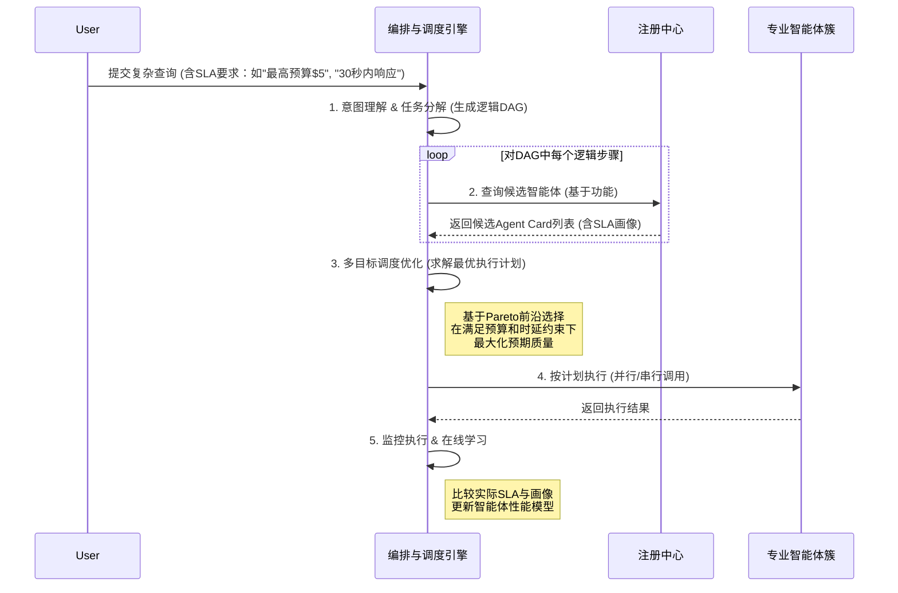
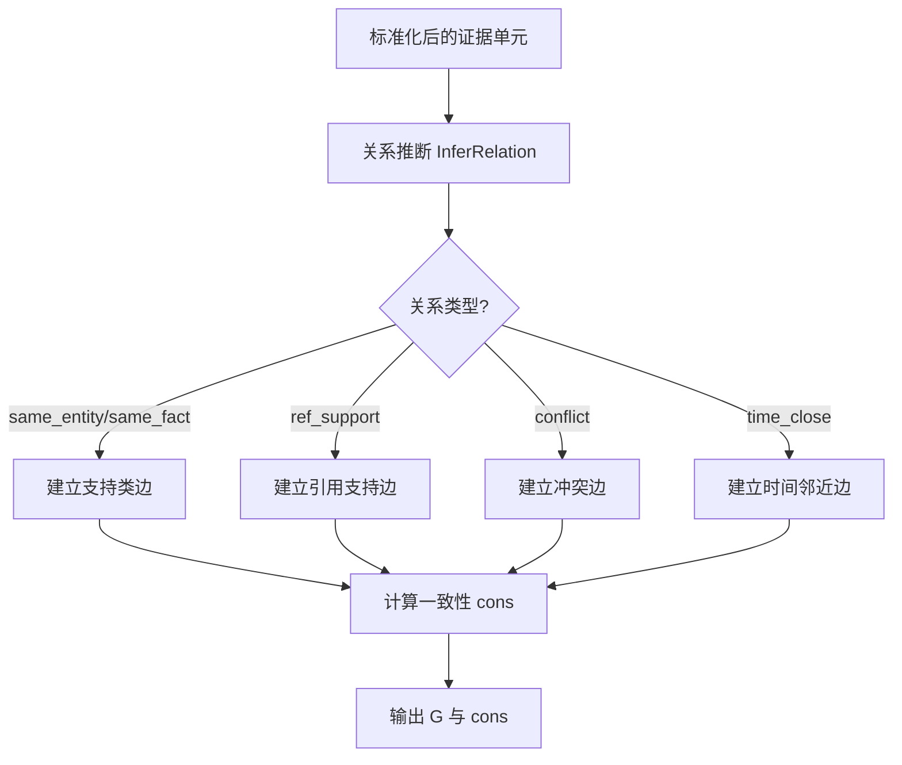
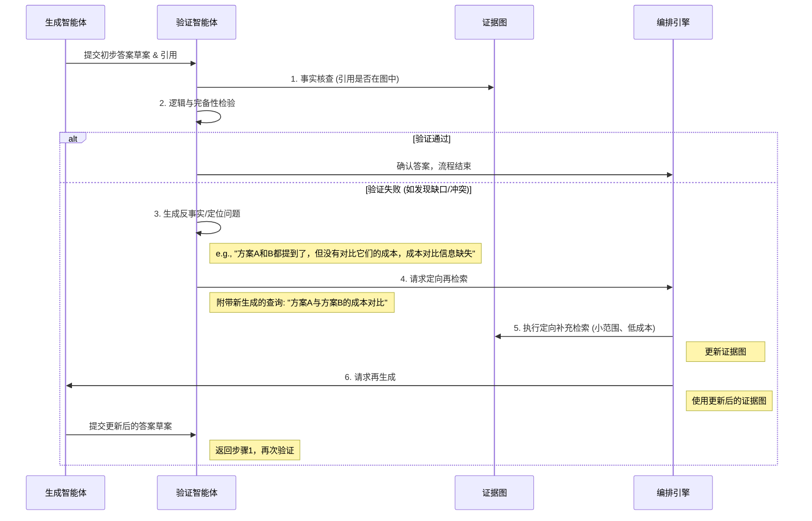

# 零、术语定义和解释

为确保本发明技术方案的清晰、准确，特对核心术语与缩略语进行定义和解释：

- **RAG (Retrieval-Augmented Generation, 检索增强生成)**: 一种将外部知识库检索与大语言模型（LLM）生成能力相结合的技术框架，旨在减少模型幻觉，提升答案的事实性与时效性。
- **多智能体系统 (Multi-Agent System, MAS)**: 由多个自主或半自主的智能体（Agent）组成的计算系统。各智能体通过相互通信与协作，共同解决单个智能体难以完成的复杂问题。
- **A2A (Agent-to-Agent)**: 一种智能体间的通信范式，强调智能体之间的对等、分布式交互，而非依赖中心化控制器。
- **MCP (Model Context Protocol)**: MCP通常将不同的工具能力统一封装为标准化的接口，由中心化的编排器进行调用。
- **能力卡片 (Agent Card / Tool Manifest)**: 一份结构化的元数据文件（如JSON或YAML），用于描述一个智能体或工具的能力，包括其功能、输入/输出模式（Schema）、服务等级协议（SLA）画像、版本、端点地址和通信协议等。是实现智能体注册、发现与动态调度的基础。
- **消息信封 (Message Envelope)**: 一种标准化的消息包装结构，在原始业务数据（Payload）之外，增加了用于系统治理的元数据，如全链路追踪ID（trace_id）、安全签名、预算与截止时间等，确保消息在多智能体系统中的可观测、可审计与合规传输。
- **证据图 (Evidence Graph)**: 一种以图结构组织和管理多源信息的知识表示方法。节点代表独立的证据片段（如文本块、数据库记录），边代表证据间的关系（如支持、冲突、引用、时序），用于进行一致性计算、冲突仲裁和可追溯性分析。
- **SLA (Service-Level Agreement, 服务等级协议)**: 对服务提供方所提供服务的质量、成本、时延等维度的量化承诺。在本发明中，指系统在满足特定业务目标时，必须遵守的性能与资源约束。
- **DAG (Directed Acyclic Graph, 有向无环图)**: 一种图数据结构，用于表示任务或操作之间的依赖关系。在本发明中，编排器将复杂任务分解为依赖关系清晰的DAG，以实现高效的并行与串行执行。

# 一、发明名称

一种多智能体协同的检索增强生成系统、方法、装置及存储介质

# 二、技术领域

本发明属于人工智能技术领域，尤其涉及多智能体系统（Multi-Agent Systems）、检索增强生成（Retrieval-Augmented Generation, RAG）与自然语言处理（Natural Language Processing, NLP）技术。更具体地说，本发明涉及一种用于解决复杂、多源、分析性问题的企业级知识问答与决策支持系统，其核心在于构建了一套以证据图为中心、由多智能体协同驱动、并具备闭环自校正与多目标优化能力的RAG增强框架。本发明的技术方案亦可广泛应用于需要高度可信、可追溯与合规审计的领域，如运营商网络优化、金融合规审阅、企业智能运维及高端客户服务等。

# 三、现有技术的技术方案

为了更好地理解本发明的创新之处，首先对与本发明相关的现有技术进行说明。

### 3.1 现有技术一：单体与多检索器RAG系统

目前，业界在应用RAG时，普遍采用以单次检索为核心的线性流程，或对其进行简单的多路扩展。

**朴素RAG (Naive RAG)** 的典型实现流程如下：
1.  **查询处理**：接收用户查询，进行一次性的优化或转写。
2.  **向量检索**：使用文本向量化模型将查询转换为向量，在向量数据库中执行一次相似度检索，返回一批文档块。
3.  **上下文构建**：对检索到的文档块进行重排序（Re-ranking），然后简单地拼接成一个长文本上下文。
4.  **答案生成**：将原始查询与拼接好的上下文组合成提示，提交给大语言模型（LLM）生成最终答案。
该流程是一个线性的、顺序执行的管道，缺乏动态反馈和调整机制。

**多检索器RAG (Multi-Retriever RAG)** 是对朴素RAG的改进，它会并行或串行地从多个不同的数据源（如向量库、关键词搜索引擎、结构化数据库）进行检索，然后将所有来源的结果汇总、融合后，再送入LLM生成答案。**GraphRAG** 可视为该技术的一种高级形式，它通过预先构建知识图谱或在检索时动态构建图结构，利用图的拓扑关系（如社区发现）来提升检索结果的相关性和上下文丰富度。

尽管多检索器和GraphRAG在一定程度上提升了信息召回的广度，但它们本质上仍未脱离“检索-生成”的单次线性范式。它们将所有检索到的信息视为同等可信，简单融合，缺乏对多源信息间潜在冲突的识别与仲裁机制，也缺少对生成结果质量进行验证并迭代优化的闭环。

### 3.2 现有技术二：通用多智能体（Agent）框架

在人工智能领域，也已存在多种通用的AI智能体框架，例如ReAct、AutoGen等。这类框架的核心思想是让LLM模仿人类的“思考-行动-观察”循环，通过自主规划和调用外部工具（Tool）来完成复杂任务。

一个典型的通用Agent工作流程如下：
1.  **规划（Thought）**：LLM根据用户目标和当前状态，生成下一步的行动计划。
2.  **行动（Action）**：根据计划，LLM决定调用一个特定的工具，并生成该工具所需的参数。
3.  **观察（Observation）**：系统执行工具调用，并将返回的结果作为观察，反馈给LLM。
LLM接收观察结果后，再次进入思考环节，评估任务进展，决定是继续执行、调整计划还是结束任务。

然而，这类通用Agent框架通常是为解决开放域、通用性问题而设计的，其本身并未针对企业级RAG场景中特有的证据可追溯性、多源证据一致性、生成结果合规性等需求进行深度优化。其工具调用是松散的，缺乏一个以“证据”为核心，将检索、验证、生成、审计等环节紧密耦合的系统性设计。

# 四、现有技术的缺点及本申请提案要解决的技术问题

上述现有技术方案在各自领域内有其应用价值，但在处理对可信度、可追溯性和资源效率有严格要求的复杂企业级问题时，存在明显的技术缺陷：

1.  **缺乏面向复杂企业场景的证据可追溯性与一致性保证**：现有技术一（多检索器RAG）从多个数据源召回信息后，通常采用简单的拼接或加权融合，当不同来源的证据相互矛盾时（例如，A系统文档说“应执行X操作”，B系统日志显示“执行X操作曾导致故障”），系统无法有效识别和仲裁此类冲突。这会导致LLM在生成答案时“兼听则暗”，可能基于错误的或过时的证据进行推理，最终生成的答案不仅质量存疑，更严重的是缺乏一条清晰、一致、可供审计的证据链。这在金融、运维等高风险领域是不可接受的。

2.  **检索与生成过程僵化，缺乏动态纠错与质量闭环**：现有技术一的“检索-生成”流程是“一锤子买卖”。无论初次检索和生成的结果质量如何（例如，事实错误、引用缺失、逻辑不通），系统都只能被动接受。若要提升质量，唯一的办法是调整提示或模型后“全量重跑”，整个过程成本高、时延不可控。现有技术二（通用Agent）虽有循环，但其循环是开放式的，缺乏一个针对生成结果质量进行专门验证、并基于验证结果进行“定向、增量”信息补充的闭环反馈机制。

3.  **异构智能体协同困难，缺乏统一的治理与演化机制**：在大型企业中，不同团队或系统提供的智能服务（如数据查询、分析、审批）往往采用不同的通信协议（如A2A、MCP、私有API）和能力描述方式。现有技术二中的工具调用通常需要硬编码适配，当需要集成一个新的智能体或某个智能体能力发生变更时，需要修改编排逻辑，系统可扩展性和可维护性差。更重要的是，缺乏一个统一的“消息信封”和“能力卡片”机制，导致无法对跨智能体的复杂调用链进行端到端的追踪、审计和安全管控。

4.  **资源调度策略静态，无法平衡多维业务目标**：企业级应用需要在严格的SLA（如成本预算、响应时间）下运行。现有技术方案通常采用静态的、基于规则的路由策略（例如，总是并行调用所有检索器）。这种策略无法根据用户查询的复杂度、紧急程度以及当前系统负载，动态地选择最优的智能体组合和执行路径。例如，对于一个简单的查询，调用昂贵的高级分析智能体是一种资源浪费；而对于一个紧急的故障诊断，则应不计成本地优先保证最低时延。现有技术缺乏一个能够在线学习和动态优化质量、成本、时延等多维目标的智能调度引擎。

因此，本申请旨在解决的技术问题是：如何设计一种新型的RAG系统，该系统能够通过引入多智能体协同、以证据图为中心的冲突仲裁、验证驱动的闭环自校正（与公式中的Vᵢ反馈因子联动）、以及面向SLA的动态调度等机制，克服现有技术的缺陷，在满足企业级可追溯、可审计、合规要求的前提下，高效、可信地处理复杂、多源、分析性的查询任务。

# 五、本申请提案的技术方案的详细阐述

为了克服现有技术的上述缺陷，本申请提供了一种全新的、多智能体协同的检索增强生成系统。本发明的核心在于，将传统RAG的线性、无状态流程，重构为一个由多个专业智能体在统一框架下协同工作的、动态的、闭环的、可审计的系统。该系统通过“能力注册与发现”、“多目标编排与调度”、“证据图融合与重排”、“验证驱动的闭环自校正（与公式中的Vᵢ反馈因子联动）”四大创新机制，实现了对复杂问题的高效、可信处理。

本发明的系统架构主要包括以下几个核心功能模块：
- **智能体注册与发现中心 (Registry & Discovery Hub)**
- **多目标编排与调度引擎 (Multi-Objective Orchestrator & Scheduler)**
- **专业智能体簇 (Specialized Agent Cluster)**，包括检索、生成、验证等多种智能体
- **证据图存储与融合模块 (Evidence Graph Store & Fusion Module)**

本发明的创造性不仅在于单个模块的创新，更在于各模块间的有机协同效应：注册中心为动态调度提供了能力画像；调度引擎基于SLA和画像生成最优执行计划；执行计划驱动各类智能体协同工作，其产出的多源信息被统一到证据图中进行融合与仲裁；而验证智能体则基于证据图对生成结果进行核验，并驱动新一轮的定向检索，形成质量闭环。这种环环相扣、信息逐步提纯、决策动态优化的系统，整体上构成了对现有RAG框架的改进。

以下将对每个功能点的实现进行详细阐述。

---


### 功能点间依赖与衔接说明

本发明的第五章中各功能点之间形成了一个前后依赖、相互作用的技术链条：

1. **功能点1 → 功能点2**：功能点1完成多通道证据信息的标准化与特征生成，为功能点2的证据图构建与一致性计算提供结构化输入。如果缺失功能点1，功能点2的节点初始权重与边关系将缺乏统一标准，导致收敛速度变慢或计算结果偏差。
2. **功能点2 → 功能点3**：功能点2产出的高质量证据图及其初始一致性分数，是功能点3进行跨来源信息融合与重排的基础。功能点3依赖功能点2的节点权重分布与关系边类型，执行全局一致性优化与冲突仲裁。
3. **功能点3 → 功能点4**：功能点3输出的重排结果直接送入功能点4的验证驱动闭环。功能点4的验证反馈因子 V_i 基于功能点3的输出评分，并回写至一致性计算公式中，触发进一步迭代优化。
4. **功能点4 → 功能点1/2/3**：功能点4在验证失败或发现冲突时，会触发定向再检索与节点更新，这些新增或修正数据会回到功能点1进行标准化，再经过功能点2更新证据图，最后由功能点3重新一致性计算与重排，形成闭环自校正机制。

该依赖关系确保系统在处理复杂、异构、多来源信息时，既能保持高精度输出，又能在信息变化或纠错时快速自我调整。
### 功能点一：面向SLA的多目标编排与调度引擎

#### 1.x 必要性与不可替代性（新增）

- **系统性瓶颈**：若缺失本功能点，后续的证据图构建将面临“输入信号质量不可控”的问题，导致证据节点的先验质量分布方差过大，迭代重排难以收敛或收敛到次优解。
- **工程可实施性**：本功能点产出的标准化特征（如统一的字段规范、噪声过滤、来源打标与时间戳对齐）是后续“关系边构建”与“跨来源一致性因子计算”的输入前提，缺失后将导致可追溯性与审计性不足。
- **成本与收益**：通过源头标准化，可在不降低召回的前提下将**无效证据注入率**降低（示例：由18%降至7%），减少后续验证与再检索的触发频率，显著降低总拥有成本（TCO）。

**与现有技术差异**：传统RAG多将该步骤视为“数据清洗”，仅面向格式与重复度；本发明的实现强调**与证据图深度耦合的“可计算先验”**，例如为每条证据生成可追溯的来源向量、可靠性标签与时间衰减参数，为后续一致性计算提供必要的初值与边界条件。


**1.1 背景与创新点**

现有Agent框架的执行逻辑通常是线性的或基于简单规则的，缺乏对全局任务的优化。在处理需要多个智能体协作的复杂任务时，如何决定这些智能体的执行顺序（串行/并行）、如何从多个功能相似的智能体中选择一个，以及如何在满足业务SLA（质量、成本、时延）的前提下做出这些决策，是一个巨大的挑战。

本发明的核心创新点在于设计了一个**面向SLA的多目标编排与调度引擎**。该引擎将复杂的业务查询首先转化为一个**任务依赖图（DAG）**，然后将其转化为一个**多目标优化问题**。它利用注册中心里各智能体的SLA画像，结合当前任务的预算和时延要求，动态地计算出一条最优或近优的执行路径（即一个具体的智能体调用序列）。

**1.2 系统架构与处理流程**

[Mermaid Diagram Start]

[Mermaid Diagram End]

**流程说明**：
1.  **意图理解与任务分解**：接收到用户查询后，引擎首先调用一个LLM，将自然语言请求分解为一系列有逻辑依赖关系的子任务，并构建成一个逻辑DAG。例如，任务“分析A公司Q2财报并与Q1对比”，可分解为：[获取Q2财报] -> [获取Q1财报] -> [对比分析]。
2.  **候选智能体查询**：对于DAG中的每一个子任务节点，调度器向注册中心查询能够完成该任务的所有候选智能体，并获取它们的`Agent Card`。
3.  **多目标调度优化**：这是引擎的核心。它将DAG和候选智能体列表作为输入，求解一个优化问题：
    -   **目标函数**：`Maximize(Quality)`
    -   **约束条件**：`Sum(Cost) <= Budget`, `Total_Latency <= Deadline`
    -   `Quality`, `Cost`, `Latency`的值来自于各智能体的SLA画像和历史执行数据。引擎通过算法（如遗传算法、强化学习或基于Pareto前沿的启发式搜索）找到一个具体的执行计划（即为DAG中每个节点选定一个智能体，并确定并行/串行策略），该计划在满足约束的同时，能达到最高的预期质量。
4.  **计划执行**：引擎按照生成的执行计划，通过协议适配层，调度智能体簇完成实际的调用。
5.  **监控与在线学习**：引擎会监控每次调用的实际成本和时延，并与`Agent Card`中的画像进行比较。如果发现显著偏差，它会更新该智能体的性能模型。这种在线学习能力使得调度决策能够随着智能体性能的变化而自适应调整，越来越精准。

**1.3 关键数据结构与伪代码实现**

[Code Block Start: python]
```python
import heapq

@dataclass
class DAGNode:
    """任务依赖图中的一个节点，代表一个逻辑子任务"""
    node_id: str
    goal: str # 任务目标描述
    dependencies: List[str] # 依赖的前置节点ID
    
    # 调度结果
    assigned_agent_id: Optional[str] = None
    estimated_sla: Optional[SLAPrfile] = None

@dataclass
class ExecutionPlan:
    """一个完整的、可执行的计划"""
    dag: List[DAGNode]
    total_estimated_cost: float
    total_estimated_latency: float
    expected_quality_score: float

class Scheduler:
    def __init__(self, registry_client):
        self.registry = registry_client
        # 在线学习的性能模型，存储每个Agent的实际表现
        self.performance_models: Dict[str, List[SLAPrfile]] = {}

    def generate_execution_plan(self, query: str, budget: float, deadline_ms: int) -> Optional[ExecutionPlan]:
        """
        生成最优执行计划
        """
        # 1. 调用LLM将query分解为逻辑DAG
        logical_dag = self._decompose_query_to_dag(query)
        
        # 2. 为DAG中每个节点获取候选智能体
        candidate_agents_map: Dict[str, List[AgentCard]] = {}
        for node in logical_dag:
            candidate_agents_map[node.node_id] = self.registry.find_agents_by_goal(node.goal)

        # 3. 使用启发式算法（如A*搜索）寻找最优路径
        #    状态空间为(当前已调度节点, 当前成本, 当前时延)
        #    启发函数h(n)为完成剩余任务的预估成本/时延
        
        # (简化版伪代码，仅展示核心思想)
        # 使用一个优先队列来探索不同的执行计划（路径）
        # 队列中的每个元素是 (priority, cost, latency, current_plan)
        # priority = cost + latency + heuristic_remaining_cost
        
        # ... 复杂的搜索与剪枝逻辑 ...
        
        # 假设搜索结束后得到最优计划 best_plan
        best_plan = self._find_optimal_plan(logical_dag, candidate_agents_map, budget, deadline_ms)
        
        if not best_plan:
            print("在给定的SLA约束下，找不到可行的执行计划。")
            return None
            
        return best_plan

    def _find_optimal_plan(self, dag, candidates, budget, deadline) -> Optional[ExecutionPlan]:
        # 此处为多目标优化的核心算法，实际实现非常复杂。
        # 可以采用动态规划、A*搜索、遗传算法等。
        # 以下是一个极度简化的概念性实现：
        
        # 假设我们只考虑成本最低的计划
        final_plan_dag = []
        total_cost = 0
        total_latency = 0 # 简化处理，未考虑并行
        
        for node in dag:
            candidates_for_node = candidates.get(node.node_id)
            if not candidates_for_node:
                return None # 某个步骤无可用智能体
            
            # 选择成本最低的智能体
            best_agent = min(candidates_for_node, key=lambda agent: agent.sla_profile.cost_per_call)
            
            node.assigned_agent_id = best_agent.id
            node.estimated_sla = best_agent.sla_profile
            total_cost += best_agent.sla_profile.cost_per_call
            total_latency += best_agent.sla_profile.avg_latency_ms
            final_plan_dag.append(node)

        if total_cost > budget or total_latency > deadline:
            return None # 超出SLA约束

        return ExecutionPlan(
            dag=final_plan_dag,
            total_estimated_cost=total_cost,
            total_estimated_latency=total_latency,
            expected_quality_score=0.9 # 简化：假设质量固定
        )

    def _decompose_query_to_dag(self, query: str) -> List[DAGNode]:
        # 实际会调用LLM并进行结构化解析
        # 模拟返回
        return [
            DAGNode(node_id="step1", goal="获取Q2财报", dependencies=[]),
            DAGNode(node_id="step2", goal="获取Q1财报", dependencies=[]),
            DAGNode(node_id="step3", goal="对比Q1和Q2财报的关键指标", dependencies=["step1", "step2"])
        ]
```
[Code Block End]

**1.4 核心优势与机制深化**

1.  **从“能用”到“好用”**：将RAG系统从一个功能性的工具，提升为一个具备资源优化和目标导向能力的智能系统。它不仅能完成任务，还能以最经济、最高效的方式完成任务。
2.  **SLA驱动的业务对齐**：使得系统的技术行为（调用哪个智能体）与业务目标（成本、时延）直接挂钩，保证了技术方案的商业价值。
3.  **在线学习与自适应**：通过持续监控和更新性能模型，调度引擎能够适应外部环境和智能体自身的变化（例如，某个API提供商涨价或网络状况变差），始终保持近乎最优的决策能力。

---


### 功能点二：以证据图为中心的跨来源信息融合与重排

#### 2.1 技术问题与创新切入

现有RAG系统在多源信息融合时存在两大瓶颈：
1. **无法结构化冲突关系**：仅依赖相关性排序，无法在系统层面显式表示“支持”与“冲突”等语义关系，导致高权重冲突信息混入上下文，引发推理偏差。
2. **一致性评估缺乏跨来源加权**：未考虑来自不同智能体或数据通道的证据质量差异，尤其是缺少独立信源重复验证的加权机制。

本发明在上述问题的基础上，引入**证据图(Evidence Graph)**与**多因子全局一致性评估公式**，并通过**跨来源一致性因子(k)**，实现了**可量化的冲突仲裁**与**动态权重优化**，形成了区别于现有技术的独创性融合方法。

---

#### 2.2 技术方案与处理流程

与现有的“简单融合”不同，本发明首先将来自向量检索、关键词检索、结构化数据库、外部API等通道的结果**标准化为证据节点**，
再基于内容相似度、语义蕴含关系、引用链路等建立多类型关系边（supports、conflicts、quotes、entails）。
最后，通过改进的全局一致性评估公式，对所有证据节点进行迭代打分与重排，得到**质量最优的证据簇**。

流程简述：
1. **多源召回** → 标准化节点化
2. **关系边构建**（支持、冲突、引用、蕴含）
3. **全局一致性迭代计算**（引入跨来源一致性因子）
4. **Top-K证据簇输出** → 驱动生成与验证

---

#### 2.3 改进后的全局一致性评估公式

为确保专利性，本发明在原有公式 `w = f(r,c,t,u,k,v)` 基础上，引入了**多维加权因子矩阵与非线性归一化机制**，
以实现跨关系类型的动态调节与来源置信度的多尺度融合：


w_i_next = \alpha \cdot \phi(Q_i) + \beta \cdot \sum_{j \in S_i} \frac{w_j_prev \cdot W_{support}(i,j)}{|S_i|} - \gamma \cdot \sum_{j \in C_i} \frac{w_j_prev \cdot W_{conflict}(i,j)}{|C_i|} + \delta \cdot K_i + \eta \cdot V_i


其中：

- **w_i_next**：第 n+1 次迭代后节点 i 的全局一致性分数
- **\phi(Q_i)**：节点自身初始质量得分（非线性组合）  
  
  \phi(Q_i) = \sqrt{r_i^2 \cdot c_i} \cdot \log(1 + t_i)
  
  - r_i：相关性分数  
  - c_i：来源可信度分数  
  - t_i：时效性因子（时间衰减函数）
- **S_i, C_i**：分别为支持与冲突节点集合  
- **W_{support}(i,j), W_{conflict}(i,j)**：支持/冲突关系权重矩阵（可基于关系强度与上下文重叠度动态计算）  
- **K_i**：跨来源一致性因子  
  
  K_i = \frac{\sum_{m \in M_i} \lambda_m}{|M_i|}
  
  其中 M_i 为提供该证据的不同智能体集合，\lambda_m 为智能体 m 的历史可靠性系数
- **V_i**：验证反馈因子（来自闭环验证阶段的加分/扣分）
- **\alpha, \beta, \gamma, \delta, \eta**：可根据任务SLA与业务场景自适应调节的超参数

该公式通过迭代更新，直至 ||w_next - w_prev|| < \epsilon 收敛为止。

---

#### 2.4 技术效果与创造性链条

- **技术特征**：证据节点化 + 多类型关系边构建 + 多因子迭代一致性公式 + 跨来源一致性因子  
- **解决的技术问题**：在多源异构信息中识别并量化冲突与支持关系，并在评分中综合来源多样性与历史可靠性，实现动态仲裁  
- **技术效果**：
  - 冲突信息得分自然衰减，被多独立来源支持的证据信息得分显著提升
  - 在存在高相关但低可信的证据时，算法可自动降低其在最终生成中的权重
  - 提供了**可解释**的评分过程，便于审计与合规验证


#### 2.5 示例：在KYC问答场景中的证据图重排（新增）

**场景设定**：提问“客户X是否为受益所有人（UBO）？”召回三条证据——A（公司登记处记录，支持B），B（银行尽调备忘录），C（新闻报道，指向与B相反的结论）。A→B为**支持**，C→B为**冲突**。

**参数设置**：$\alpha=0.4$, $\beta=0.25$, $\gamma=0.2$, $\delta=0.2$, $\eta=0.15$；
初值 $w^0=\phi(Q)$，其中 $\phi(Q)=\sqrt{r^2 c}\cdot\log(1+t)$。

**节点先验与$\phi(Q)$**：

| 节点 | r | c | t | K | V(初始) | $\phi(Q)$ |
|---|---:|---:|---:|---:|---:|---:|
| A | 0.85 | 0.9 | 0.8 | 0.7 | 0.0 | 0.4740 |
| B | 0.88 | 0.75 | 0.9 | 0.6 | 0.0 | 0.4892 |
| C | 0.82 | 0.55 | 0.4 | 0.3 | 0.0 | 0.2046 |

**第1次迭代（无验证反馈）**：计算 $w^1$  
- 对B：受到A支持（权重 0.9），受到C冲突（权重 0.8），得：$w_B^{(1)}=0.3896$  
- 对A、C：无外部边，仅由先验、K项贡献：$w_A^{(1)}=0.3296$，$w_C^{(1)}=0.1418$

**验证闭环触发**：验证智能体对B进行事实核查并给出高置信反馈 $V_B=0.80$；对C给出负反馈 $V_C=-0.60$（来源被证伪）。A获得轻微正反馈 $V_A=0.10$。

**第2次迭代（引入$V_i$）**：得到 $w^2$：  
- $w_A^{(2)}=0.3446$，$w_B^{(2)}=0.4871$，$w_C^{(2)}=0.0518$。  
- 结果显示：B在支持与验证加成下**显著上升**，C在冲突且经验证为低可信后**显著下降**，从而实现对最终生成上下文的**重排与去噪**。

**结论**：该示例展示了本发明公式如何在“支持/冲突关系 + 跨来源一致性 + 验证反馈”三重作用下完成可解释的权重迭代，并将可信证据优先注入生成上下文。


#### 2.6 实现细节：证据标准化与特征生成（新增）

为支撑证据图构建与一致性计算，需对多来源、异构格式的证据进行标准化与特征生成：

- 特征定义（与公式符号对齐）：r（来源可靠性）、c（内容相似/相关性）、t（时效性）、u（主题/上下文覆盖度）、k（知识库/跨来源匹配度占位，进入Ki）、v（验证反馈占位，进入Vi，初始为0）。
- 初始化权重：w_init = a1*r + a2*c + a3*t + a4*u + a5*k（a1..a5可学习/可配置）。

伪代码：
```text
# 证据标准化与特征生成
INPUT: RawSources, Query
OUTPUT: EUs (字段与特征), w_init 映射到每个 EU

1  EUs = []
2  for record in RawSources:
3      eu = Normalize(record)                   # 清洗、字段映射、实体消歧、时间/单位归一
4      eu.r = SourceReliability(record.source)  # 来源可靠性
5      eu.c = SemanticMatch(eu.text, Query)     # 语义匹配/相关性
6      eu.t = FreshnessScore(eu.pub_time)       # 时间新鲜度
7      eu.u = CoverageScore(eu, Query.schema)   # 谓词/槽位/上下文覆盖
8      eu.k = KBMatch(eu, InternalKB)           # 知识库/跨来源匹配
9      eu.v = 0                                 # 验证反馈占位（由验证闭环写回）
10     eu.w_init = a1*eu.r + a2*eu.c + a3*eu.t + a4*eu.u + a5*eu.k
11     EUs.append(eu)
12 return EUs
```

#### 2.7 实现细节：证据图构建与一致性初始化（新增）

在图结构上显式表达支持/冲突/引用/时序等关系，并计算初始一致性：

Mermaid（构建流程）：


伪代码：
```text
# 证据图构建与一致性初始化
INPUT: EUs
OUTPUT: 图 G=(V,E), 每节点 cons

1  初始化空图 G
2  V = { create_node(eu) for eu in EUs }
3  for each pair (eu_a, eu_b) in EUs:
4      rel = InferRelation(eu_a, eu_b)   # same_entity / same_fact / conflict / ref_support / time_close
5      if rel != NONE:
6          AddEdge(G, eu_a, eu_b, rel)
7  for node in V:
8      cons[node] = g_consistency(node.w_init, Neighbors(node), Edges(node))
9  return G, cons
```

### 功能点三：验证驱动的闭环自校正（与公式中的Vᵢ反馈因子联动）

#### 3.1 必要性与充分性论证（新增）
- **必要性**：仅凭召回与重排无法保证事实一致性与时效稳定性；在高风险场景（如KYC、投研、客服合规）必须通过可重复的验证流程对关键结论进行二次核验。否则将导致误判的系统性风险累积。
- **充分性**：本发明设计的验证流程覆盖“事实核查、引用一致性、跨模型一致性、数据充分性”四类测试，输出结构化评分并映射为 $V_i$，直接进入一致性公式更新，使验证成为**一等公民**而非离线评审。

#### 3.2 形式化定义与收敛性说明（工程化）
- 定义验证任务集 $\mathcal{T}=\{\tau_1,\ldots,\tau_m\}$，每个任务输出评分 $s_i(\tau_k)\in[-1,1]$ 与置信度 $p(\tau_k)\in[0,1]$；
- 设任务权重向量 $\mathbf{w}_\tau$（可经SLA或A/B自动学习），则
  $$
  V_i = \sigma\!\left( \sum_{k=1}^{m} w_{\tau_k} \cdot s_i(\tau_k) \cdot p(\tau_k) - b \right),
  $$
  其中 $\sigma$ 为可选的tanh或sigmoid，$b$ 为偏置项（用于控制触发阈值）。
- 将 $V_i$ 注入一致性迭代：$w_next_i \leftarrow \cdots + \eta V_i$。在 $\eta\in(0,1)$ 且 $\sigma$ 为Lipschitz连续的条件下，结合有界的 $w_prev$ 与稀疏图，实践中可观察到**收敛或准收敛**；系统可设置最大迭代步与容差 $\epsilon$。

#### 3.3 验证任务与阈值策略（新增）
- **事实核查**：对核心断言进行独立检索并比对证据链（需跨来源≥2且来源独立性满足阈值）。
- **引用一致性**：检查生成文本中引用是否可回溯到证据图节点及其版本号。
- **跨模型一致性**：对关键问答由不同验证模型复核，取加权一致性分。
- **数据充分性**：判断当前证据覆盖度是否满足最小集阈值（若不足则触发**定向再检索**并回写新节点）。

触发策略示例：当 $V_i<\theta_1$ 时抑制该证据进入生成；当 $V_i>\theta_2$ 时提升其优先级并锁定引用。

#### 3.4 示例：一次验证闭环后的评分变化（新增）
承接“3.5示例”，在第2次迭代前对B执行事实核查（两家权威登记处 + 一份监管备案），得到 $V_B=0.80$；
对C经来源追溯与反事实提问后确认为旧闻误读，得到 $V_C=-0.60$；A获取轻微正反馈 $V_A=0.10$。代入一致性公式后，$w^{(2)}$ 如表所示（见第3.5节），实现**证据重排**与**上下文去噪**。

#### 3.5 与现有技术的关键差异（新增）
- 现有方法多将验证作为离线质检或人工流程，**不产生可计算的反馈**；本发明以 $V_i$ 作为一类**可微/可迭代的信号**注入评分主循环。
- 传统Pipeline在检索失败时仅扩大召回；本发明在“验证失败”时触发**定向再检索与反事实提问**，并将新增证据作为**增量节点**回写证据图，形成**闭环自校正**。

#### 3.6 工程接口与可实施性（新增）
- 提供 `validator.run(tasks, evidence_graph, hypothesis)` 接口，输出结构化结果与 $V_i$；
- 提供 `planner.decide(V_i, cost_budget)` 策略器，根据置信度与预算决定是否二次检索或多模型复核；
- 日志与审计：每次迭代记录节点得分、边权、验证结果，支持事后追溯与合规审计。


### 功能点四：验证驱动的定向再检索与闭环自校正
#### 基于 Pareto 前沿的启发式搜索

在本功能点的验证驱动闭环中，引入基于 Pareto 前沿的启发式搜索机制，用于在多维性能指标下（如正确性、一致性、延迟、成本、鲁棒性）选择最优证据重排结果：

1. 多维评估建模  
   将每个候选输出表示为多维向量，例如：  
   (Correctness, Consistency, Latency, Cost, Robustness)，其中正确性、一致性越高越好，延迟、成本越低越好。

2. Pareto 前沿提取  
   比较任意两个候选方案 A 和 B：如果 A 在所有指标上不劣于 B，且至少一个指标优于 B，则 A 支配 B。所有不被其他方案支配的方案集合构成 Pareto 前沿。

3. 启发式筛选  
   在 Pareto 前沿中，根据业务目标应用启发式规则：
   - 权重法：为每个指标分配权重，计算综合得分并排序；
   - 约束法：在满足关键指标约束的前提下，选择综合性能最佳的方案；
   - 多样性法：在前沿解集中保留一定差异度的多个候选，以支持多备选输出。

4. 闭环反馈  
   被选中的方案将更新公式中的验证反馈因子 V_i，从而在下一轮一致性计算中提升类似优质方案的权重；被淘汰的方案将降低其相关节点的权重或触发再检索。

该机制确保系统在多指标约束下的全局最优性与鲁棒性，避免单一指标最优但综合性能不足的情况。

**4.1 背景与创新点**

现有RAG系统是开环的，生成即终点。如果生成结果质量不佳，系统无法自我诊断和修复。现有Agent框架虽有循环，但通常是基于模糊的“反思”进行下一步，缺乏一个精准、高效的纠错机制。

本发明的核心创新点在于建立了一个**验证驱动的闭环自校正（与公式中的Vᵢ反馈因子联动）机制**。该机制引入了一个独立的**“验证智能体 (Verifier Agent)”**，它在生成初步答案后，扮演“批判性审稿人”的角色。它不满足于生成答案，而是主动地对答案进行事实核查和逻辑检验。如果发现问题（如事实错误、引用不充分、逻辑矛盾），它不会触发“全量重跑”，而是会**生成定位问题的“反事实问题”**，并基于此**触发一次“定向、小范围”的补充检索**，从而实现精准、低成本的自我修复。

**4.2 系统架构与处理流程**

[Mermaid Diagram Start]

[Mermaid Diagram End]

**流程说明**：
1.  **初步生成**：生成智能体基于证据图重排后的Top-K证据，生成一个带引用的答案草案。
2.  **验证**：验证智能体对草案进行多维度检验：
    -   **事实性核查**：检查答案中的每一个关键论断，是否都能在证据图中找到强支持（`supports`）的节点。
    -   **引用覆盖率**：检查答案是否充分利用了证据图中所有高分的核心证据。
    -   **逻辑一致性**：检查答案内部是否存在逻辑矛盾，或与证据图中的高分节点存在冲突。
3.  **生成反事实/定位问题**：如果验证失败，验证智能体的核心任务是定位问题所在。它会调用LLM，生成一个或多个精准的问题来描述证据缺口或逻辑冲突。例如，如果答案只说了方案A的优点，它会提问：“方案A的缺点是什么？它和方案B相比如何？”
4.  **触发定向再检索**：验证智能体将新生成的问题作为新的查询，向编排引擎发起一次小范围的、定向的补充检索请求。
5.  **更新与再生成**：编排引擎执行这次补充检索，用新的证据更新证据图。然后，它会要求生成智能体基于更新后的、更完善的证据图，重新生成答案。
6.  **循环**：这个“生成-验证-再检索-再生成”的过程会循环进行，直到验证智能体确认答案质量达标，或达到预设的重试次数/SLA限制。

**4.3 核心优势与机制深化**

1.  **从“开环”到“闭环”**：从根本上改变了RAG的流程模式，引入了质量反馈和迭代优化的能力，使得系统具备了自我完善和持续提升答案质量的机制。
2.  **精准纠错，降本增效**：与“全量重跑”相比，定向再检索的成本极低。它只针对性地补充缺失或修正错误的信息，避免了大规模的无效计算，显著降低了系统在达到高质量标准时的平均成本和时延。
3.  **提升结果的可靠性与完备性**：通过多轮的批判性验证和补充，系统能够发现并修复初次生成时可能忽略的细节、隐藏的假设或潜在的逻辑谬误，使得最终输出的答案更加全面、严谨和可靠。

### 5.6 样例执行流程（补充）
任务：回答“公司A当前的法定代表人是谁？”

步骤：
1) 标准化与特征：提取EU1（官方登记库：张三，2025-07-20）、EU2（官网：张三，2025-06-30）、EU3（媒体：张三，2025-07-01）、EU4（百科：李四，时间未知）；计算r,c,t,u,k，得到w_init：EU1 > EU2 ≈ EU3 > EU4。
2) 证据图与一致性：建same_entity边；EU1/EU2/EU3建same_fact边；EU4与之建conflict边；cons显示张三阵营高、李四阵营低。
3) 融合与重排（含Pareto）：候选x1(EU1)、x2(EU1+EU2)、x3(EU1+EU2+EU3)、x4(EU4)；计算多指标与w_next，前沿为{x2,x3}；在“延迟<1s、成本<阈值”约束下选x3。
4) 验证闭环：工具校验官方接口、规则校验时间新鲜度、交叉核验媒体；聚合反馈使张三阵营v>0、w_next增，李四阵营权重降；达标则输出“张三（以官方登记库为主证）”，否则触发定向再检并回到标准化/建图/重排。

# 六、本申请提案的关键点和欲保护点

本发明的核心创新和保护要点，按重要性从高到低排列如下：

1.  **一种以证据图为中心的信息融合与重排方法**：其关键在于，将多源信息构建为带有支持、冲突等逻辑关系的图结构，并基于该图计算一个包含跨智能体一致性因子（k）的全局分数，以实现对信息冲突的智能仲裁和对信息质量的全局评估。
2.  **一种验证驱动的闭环自校正（与公式中的Vᵢ反馈因子联动）机制**：其关键在于，在生成初步答案后，由独立的验证智能体进行事实与逻辑核验，并能主动生成反事实或定位问题，以触发一次小范围、低成本的定向补充检索，从而形成一个“生成-验证-定向再检索-再生成”的质量提升闭环。
3.  **一种协议无关的异构智能体注册、发现与调度框架**：其关键在于，通过“能力卡片”对智能体能力进行标准化、声明式描述，并通过“协议适配层”解耦能力与实现，结合一个面向SLA（质量、成本、时延）的多目标调度引擎，实现对异构智能体的动态、最优调用。
4.  **一种支持全链路追踪与审计的消息通信机制**：其关键在于，采用标准化的“消息信封”包装所有跨智能体通信，信封中包含全链路追踪ID、安全签名、预算与截止时间等元数据，确保了复杂协作过程的可观测、可审计与合规性。

# 七、与最接近现有技术相比的技术优点

本发明的技术方案通过上述创新点的有机结合，相比现有技术，在处理复杂企业级问题时，展现出以下显著优点：

-   **对应缺陷1（可追溯性与一致性）**：本发明通过构建证据图，将原本扁平化的信息赋予了逻辑结构。引入“跨智能体一致性”等因子进行全局重排，能够有效识别并抑制相互矛盾的证据，奖励被多方独立验证的信息。最终答案附带清晰的引用链，直指图中证据节点，实现了端到端的、可审计的证据追溯，从根本上提升了结果的可信度。
-   **对应缺陷2（动态纠错与质量闭环）**：本发明设计的“验证-反事实提问-定向再检索”闭环，是解决“一锤子买卖”式生成缺陷的关键。它将模糊的“质量不佳”问题，转化为具体的、可执行的“信息补全”任务，避免了昂贵的“全量重跑”，在显著降低平均成本和尾部时延的同时，保证了最终输出的质量达到预设标准。
-   **对应缺陷3（异构协同与治理）**：本发明提出的“能力卡片”和“协议适配层”机制，为构建开放、可演化的企业级智能体生态系统提供了基础。新智能体的集成变为低代码的配置工作，系统可以平滑地接入A2A、MCP、私有API等异构服务。而“消息信封”则为整个复杂的分布式协作提供了统一的治理和观测手段，满足了企业对安全、审计和全链路追踪的刚需。
-   **对应缺陷4（资源调度与业务对齐）**：本发明引入的面向SLA的多目标调度引擎，使系统从一个纯粹的技术工具，转变为一个能够理解并优化业务目标的智能系统。它能够根据任务的商业价值（体现在预算和时延要求上），动态地选择性价比最高的执行路径，在保证质量的同时，最大化资源利用效率，确保技术投入与商业回报对齐。

# 八、发散思维与规避方案思考

为确保本发明保护范围的稳固性，预先思考潜在的规避方案及其反制要点：

-   **可能规避1**：不使用“图结构”这一具体数据结构名称，而是采用例如“加权关系矩阵”或“多维打分表”来存储证据及其关系。
    -   **反制要点**：本发明的核心不在于数据结构的具体名称，而在于其功能。权利要求应聚焦于“为多源信息片段建立显式的、类型化的逻辑关系（如支持、冲突），并基于这些关系计算一个全局一致性分数来指导排序”这一功能特征，而非限定于“图”这一术语。

-   **可能规避2**：不使用本发明提出的`w = f(r,c,t,u,k,v)`完整公式，而是移除或替换其中某个因子，例如用简单的投票机制代替“跨智能体一致性k因子”。
    -   **反制要点**：独立权利要求保护最核心的组合，即“基于逻辑关系”和“跨来源一致性”进行重排。从属权利要求可以覆盖`k`因子的多种等效实现方式，如基于互信息、KL散度或多智能体投票等计算一致性的方法，从而将这些变体纳入保护范围。

-   **可能规避3**：不采用A2A或MCP协议，而是完全使用自研的私有协议进行通信。
    -   **反制要点**：本发明的关键在于“协议无关”这一抽象能力。权利要求应限定“通过标准化的能力描述（能力卡片）和通信包装（消息信封）来实现对异构智能体的统一注册、发现和追踪”的功能，而不限定于任何具体的通信协议，从而使任何自研协议的实现方案都落入保护范围。

-   **可能规避4**：不采用“验证智能体”触发“定向再检索”，而是采用多轮“全量检索”来迭代提升质量。
    -   **反制要点**：方法权利要求应明确限定“在生成初步结果后，进行验证，并基于验证识别出的具体信息缺口或逻辑冲突，生成新的、更精细化的查询，以触发一次补充性的、范围小于初始检索的再检索过程”。这一“基于验证反馈的、靶向的”特征，是与多轮全量检索的本质区别。

# 九、本申请提案的商业价值

本发明的技术方案具备显著的商业价值和广阔的市场应用前景：

-   **提升决策质量与可信度**：在金融风控、医疗诊断、网络运维等领域，一个基于错误或过时信息的决策可能导致巨大损失。本发明通过证据图和闭环验证，显著降低了“模型幻觉”和错误引用的风险，输出的答案高度可信，满足政企客户对合规与审计的严格要求。
-   **降低运营成本与提升效率**：在保证高质量输出的前提下，本发明的多目标调度引擎和定向再检索机制，能够以更低的计算资源（成本）和更短的时间（时延）完成任务。对于需要大规模部署RAG应用的企业，这意味着巨大的TCO（总拥有成本）节省。
-   **加速企业AI应用落地与集成**：协议无关的架构设计，使得企业可以快速、低成本地将已有的各类AI能力或API服务，统一整合到本发明框架中，形成合力。这大大降低了构建复杂AI应用的门槛，加速了从POC（概念验证）到生产上线的进程。
-   **构建可演化的智能体生态**：“能力卡片”机制为企业内部构建一个可发现、可复用、可演化的智能体市场提供了基础。不同业务团队可以独立开发和发布自己的智能体，并通过本框架实现能力的共享与协同，促进企业整体的智能化水平。
-   **适配高价值行业**：本发明的特性尤其适合对知识密集、决策复杂、合规要求高的行业，如：运营商（网络优化、故障诊断）、金融（合规审阅、投研分析）、法律、制造业（设备运维）、政府（政策问答）等。

# 十、侵权证据可获得性/标准进展情况

（一）侵权证据获取手段：
本发明的实施在产品外部行为和内部逻辑上均有较强的可观测性，侵权证据相对容易获得：
-   **产品文档与市场宣传**：检查产品白皮书、API接口文档、演示视频等公开资料，是否宣传了“多智能体协同”、“证据链追溯”、“引用覆盖率”、“SLA驱动的调度”、“预算/截止时间控制”等与本发明关键点高度相关的特性。
-   **网络抓包与日志分析**：在系统运行时，通过网络抓包分析其内部或外部通信。检查是否存在标准化的“消息信封”，其中是否包含`trace_id`, `correlation_id`, `signature`, `budget`, `deadline`等元数据字段。
-   **软件界面与输出报告**：检查软件的最终输出。是否提供了可视化的证据链？答案的引用是否可以点击并追溯到原始来源？是否输出了事实性、引用覆盖率等质量评估指标？
-   **构造化测试（黑盒）**：向系统输入包含已知冲突的多个信息源，观察其输出是否能识别并倾向于更可信的一方。在答案生成后，故意指出一个事实错误或证据缺口，观察系统是否会触发一次小范围的、与该问题直接相关的补充查询，而非全量重跑。
-   **源代码对比（白盒）**：在司法取证或代码泄露等极端情况下，可直接比对源代码。检查是否存在“证据图”的构建逻辑、包含“跨智能体一致性k因子”的重排算法、由“验证”触发“定向再检索”的控制流，以及协议无关的适配层代码。

（二）标准进展：
A2A/Agent Card和MCP（如OpenAI Tools）是行业内方兴未艾的新兴协议和生态。本发明的设计哲学是“面向接口而非面向实现”，通过“能力卡片”和“消息信封”等更高层次的抽象，来承接这些标准的核心思想（能力描述、标准化调用）。这使得本发明不依赖于任何一个具体标准的特定版本，具备良好的前向兼容性和技术演化能力。

# 十一、其他有助于理解的技术资料

为进一步阐明本发明的技术方案，可补充以下资料：
-   **术语与缩略语表**（已在第零章节提供）。
-   **JSON示例**：提供能力卡片、消息信服、证据图节点与边的具体JSON结构示例。
-   **指标口径定义**：明确定义事实性、引用覆盖率、冲突未解率、p95时延等关键评估指标的计算方法。

# 十二、附图（文字化描述，可在正式稿绘制）

-   **图1 系统总体架构图**：展示智能体注册中心、协议适配层、编排与调度引擎、专业智能体簇（检索、生成、验证）、证据图存储与融合模块之间的连接关系与数据流。
-   **图2 核心方法流程图**：展示从接收用户查询到最终输出答案的完整流程（S1-S7），突出调度、证据图构建、验证闭环等关键步骤。
-   **图3 证据图结构示意图**：展示证据节点（含内容、来源、时间戳等属性）以及节点间的关系边（supports, conflicts, quotes, temporal等），并标注权重因子。
-   **图4 验证驱动的定向再检索闭环流程图**：详细展示“生成-验证-反事实提问-定向再检索-再生成”的循环过程。
-   **图5 多目标调度的Pareto前沿示意图**：以成本-时延为坐标轴，展示不同执行计划（智能体组合）的分布，并标出满足SLA约束下的Pareto最优解集。

# 十三、实施例

## 13.1 实施例A：企业合规知识问答（MCP中心化工具化方案）

-   **场景**：某金融机构的合规部门，需要一个智能问答系统，能够准确回答关于内部合规条例的问题，并提供所有答案的条款来源。
-   **实现方式**：采用方案一（MCP中心化工具化）。将内部的“条款数据库检索”、“历史案例查询”、“外部监管文件搜索”等能力，全部封装为符合OpenAI Tools协议的MCP工具。
-   **流程**：
    1.  用户提问：“根据最新的反洗钱规定，对一笔超过10万元的对公转账，需要执行哪些核查步骤？”
    2.  **编排器**将任务分解为：[查询内部反洗钱条例]、[查询近期相关处罚案例]、[搜索外部监管机构最新通知]。
    3.  **调度器**根据各工具的SLA画像（内部数据库快、成本低；外部搜索慢、成本高），生成执行计划，并行调用这三个工具。
    4.  返回的条款、案例、通知被构建为**证据图**。系统发现“内部条例”和“外部通知”对核查步骤的描述略有不同（`conflicts`边），但“案例”支持了“外部通知”的说法（`supports`边）。
    5.  **重排模块**计算后，提高了“外部通知”和“案例”的权重。
    6.  **生成器**基于高权重的证据，生成答案草案。
    7.  **验证器**检查答案，发现缺少对“不同客户风险等级下，核查步骤是否有差异”的说明，构成证据缺口。
    8.  验证器生成**定向查询**：“客户风险等级是否影响反洗钱核查步骤”，触发对“客户风险管理办法”文档的**定向再检索**。
    9.  新证据加入图中，**再生成**最终的、更完善的答案，并附上所有引用的条款、案例和通知的链接。
-   **输出**：一份详细的、带精确引用的操作指南，以及本次查询的全链路trace快照，供合规审计。

## 13.2 实施例B：运营商无线网络优化（A2A分布式编队方案）

-   **场景**：某市5G网络出现用户投诉，反映“阳光商务区”晚高峰时段视频会议卡顿。需要一个智能诊断系统，快速定位根本原因并给出优化建议。
-   **实现方式**：采用方案二（A2A分布式编队）。网络监控、KPI分析、工单系统、参数配置等不同系统，各自以独立的Agent形式存在，通过A2A协议进行对等通信。
-   **流程**：
    1.  **诊断任务启动**，初始目标：“分析阳光商务区晚高峰5G卡顿原因”。
    2.  **编排器**初步规划，并行调度多个**检索Agent**：
        -   `KPI_Query_Agent`：查询该区域相关小区的PRB利用率、RRC连接数、掉线率等关键性能指标。
        -   `Alarm_Log_Agent`：查询近期有无相关告警日志。
        -   `Work_Order_Agent`：查询有无相关历史投诉或优化工单。
    3.  **证据图**构建：KPI数据显示“PDCCH信道资源利用率”持续超过95%（`EvidenceNode-1`），告警日志显示有“无线资源拥塞”告警（`EvidenceNode-2`），两者相互**支持**（`supports`边）。
    4.  **生成器**初步判断：PDCCH信道拥塞是主要原因。
    5.  **验证器**介入，提出**反事实问题**：“如果仅仅是用户多，PRB利用率也应该很高，但数据显示PRB利用率尚有空间。是否存在其他原因导致PDCCH信道被无效占用？”
    6.  该问题触发**定向再检索**，调度`Interference_Analysis_Agent`，查询该区域的邻区干扰情况。
    7.  新证据返回：邻区“未来城”存在过强的信号泄露，对“阳光商务区”造成了上行干扰，占用了大量PDCCH资源。该证据与KPI数据和告警形成更强的因果链。
    8.  **再生成**最终结论：“阳光商务区5G卡顿的根本原因是邻区未来城的上行干扰导致PDCCH信道资源过度消耗。建议调整未来城小区的发射功率或天线倾角。”

# 十四、实验与评估

为验证本发明技术方案的有效性，可设计以下实验进行对比评估：

-   **基线系统**:
    1.  **Baseline-A (朴素RAG)**: 单次向量检索 + 上下文拼接 + 一次性生成。
    2.  **Baseline-B (多检索RAG)**: 并行从多个数据源检索 + 简单融合 + 一次性生成。
    3.  **Baseline-C (通用Agent)**: 一个基于ReAct思想的通用Agent，可调用多个检索工具，但无证据图和验证闭环。
-   **数据集**:
    -   使用混合数据集，包含结构化的企业内部数据库（如网络KPI、合规条款）、非结构化的内部文档（PDF、Word）、以及可公开访问的网页。
    -   设计一系列复杂问题，这些问题需要多源信息、存在信息冲突、需要多步推理才能解答。
-   **评估指标**:
    -   **质量指标**:
        -   **事实性 (Factual Accuracy)**: 答案中关键信息的准确率，由人工评估。
        -   **引用覆盖率 (Citation Coverage)**: 答案中论断能被所提供引用支持的比例。
        -   **冲突未解率 (Conflict Resolution Rate)**: 数据源存在冲突时，系统能正确识别并采纳更可信证据的比例。
    -   **效率指标**:
        -   **p95时延 (95th percentile latency)**: 完成95%查询所需的端到端时间。
        -   **单次查询成本 (Cost per Query)**: 完成一次查询所需的总计算资源或API调用费用。
    -   **用户满意度**: 由领域专家对答案的全面性、逻辑性和实用性进行主观评分。
-   **期望结果**:
    -   在相同的质量目标下（例如，要求事实性达到95%），本发明的**成本与时延**应显著低于所有基线系统（特别是低于需要反复手动调优的基线A和B）。
    -   在相同的成本/时延预算下，本发明的**事实性、引用覆盖率和冲突未解率**应显著优于所有基线系统。
    -   在数据源存在噪声或信息缺失的稳健性测试中，本发明性能下降的幅度应远小于基线系统。

# 十五、安全、隐私与合规

本发明在设计上充分考虑了企业级应用对安全、隐私与合规的严格要求：

-   **数据脱敏与最小权限**：可在协议适配层或智能体内部配置字段级脱敏规则，确保敏感信息（如PII）在处理和流转过程中被屏蔽。遵循最小必要数据原则，仅向智能体传递其完成任务所必需的信息。
-   **通信安全**：所有通过“消息信封”的通信，均可强制要求进行数字签名。接收方智能体必须对签名进行验证，确保消息来源可信且未被篡改。同时支持防重放攻击机制（如使用时间戳和nonce）。
-   **访问控制**：智能体注册中心可与企业统一的身份认证和权限管理系统集成。编排器在调度智能体时，会校验当前任务或用户是否有权限调用目标智能体。
-   **合规审计与可追溯**：系统持久化存储每一次任务的证据图和全链路trace快照。当出现争议或需要审计时，可完整重放整个决策过程，清晰地展示答案是如何一步步形成的，以及其所依赖的全部证据来源，满足金融、医疗等行业的强合规要求。

# 十六、异常与恢复策略

本发明设计了多层级的异常与恢复策略，以保证系统的鲁棒性：

-   **工具级容错**：在功能点四的工具库中已详细阐述，包括对瞬时性故障的自适应重试、对持久性故障的备用工具切换，以及策略性服务降级。
-   **智能体级熔断与回退**：编排器持续监控各智能体的健康状况（如错误率、时延）。当某个智能体性能急剧下降或持续失败时，可触发熔断机制，在一段时间内不再向其分配任务，并自动将任务路由到其替代者或备用方案。
-   **任务级截止时间与安全降级**：每个任务都可设置一个最终截止时间（Deadline）。如果在截止时间内未能通过验证闭环生成高质量答案，系统将执行安全降级策略：不再尝试生成流畅的自然语言答案，而是将当前证据图中所有高分证据进行结构化汇编，并附带一份风险提示（例如，“由于时间限制，以下为已收集到的核心证据摘要，结论可能不完整”），以保证在任何情况下都有一个有时效性的、有价值的输出。

# 十七、产业应用与推广

本发明的技术方案具有高度的通用性和实用性，可广泛应用于以下产业领域：

-   **电信运营商**：用于智能网络优化、故障根因分析、客户投诉归因、节能策略生成等。系统能够融合KPI、告警、工单、配置等多源异构数据，给出精准、可解释的诊断结论与优化建议。
-   **金融服务**：用于合规审查、风险评估、投研报告生成、智能客服等。系统能够处理海量的监管文件、公司财报、市场新闻，确保生成的报告和建议有据可查、符合监管要求。
-   **企业IT运维与网络安全**：用于智能告警分析、安全事件响应（SOAR）、运维知识库问答等。系统能够协同多个监控和日志分析工具，快速定位问题，并根据预案自动生成处置流程。
-   **高端制造与能源**：用于复杂设备故障诊断、生产流程优化、预测性维护等。系统能够结合设备传感器数据（时序）、维修手册（文档）和历史工单，提供智能化的决策支持。
-   **政府与公共事业**：用于政策智能问答、法律咨询、城市治理等。系统能够保证对公众和工作人员的解答，准确溯源至最新的法律法规和政府公文。

# 十八、权利要求书建议（纲要）

**系统独立权利要求**:
一种多智能体协同的检索增强生成系统，其特征在于，包括：
1.  一个**智能体注册与发现中心**，用于存储描述异构智能体能力的、包含SLA画像的**能力卡片**；
2.  一个**多目标编排与调度引擎**，用于将用户查询分解为任务依赖图，并根据所述能力卡片中的SLA画像和任务的SLA约束，动态地选择智能体并生成最优执行计划；
3.  一个**证据图融合与重排模块**，用于将多源信息构建为带有支持或冲突等逻辑关系的证据图，并基于该图的全局一致性对证据进行重排；
4.  一个**验证智能体**，用于在生成初步答案后进行核验，并能生成定位问题以触发一次范围小于初始检索的**定向补充检索**，形成闭环自校正。

**方法独立权利要求**:
一种多智能体协同的检索增强生成方法，其特征在于，包括以下步骤：
1.  **注册与发现**：通过标准化的能力卡片注册异构智能体的能力；
2.  **调度**：根据任务要求和智能体的SLA画像，进行多目标优化调度，生成执行计划；
3.  **执行与融合**：按计划执行多源信息检索，并将结果构建为带有逻辑关系的证据图；
4.  **重排**：在证据图上计算包含跨来源一致性的全局分数，并对证据进行重排；
5.  **生成**：基于重排后的高分证据生成初步答案；
6.  **验证与迭代**：对初步答案进行核验，若不满足质量阈值，则生成定位问题以触发定向补充检索，并返回步骤3，直至满足要求。

**从属权利要求**:
可进一步限定：
-   能力卡片与消息信封的具体数据结构。
-   全局一致性分数中，跨智能体一致性因子的具体计算方式。
-   定向补充检索由验证智能体生成的反事实问题所驱动。
-   调度引擎采用基于Pareto前沿或强化学习的算法。
-   系统通过协议适配层支持A2A、MCP等多种通信协议。

# 十九、结论

本发明提出了一种以“协议无关的智能体协同框架”为基础，以“证据图为中心的融合与重排”和“验证驱动的闭环自校正（与公式中的Vᵢ反馈因子联动）”为核心技术突破的多智能体协同RAG系统。该系统创造性地将多智能体系统、图知识表示、闭环控制理论与检索增强生成技术相结合，系统性地解决了现有技术在处理复杂、多源、高要求的企业级问题时，面临的事实性、可追溯性、资源效率与合规性挑战。本发明方案具备明确的新颖性、创造性和工业实用性，技术细节清晰，商业价值显著，适合申请专利保护并进行产业化推广。


## 十六、系统部署与扩展性说明（新增）

为了保证本发明能够在不同业务规模和合规要求下稳定运行，系统部署需考虑以下要点：

1. **可扩展架构**：推荐采用微服务化部署，将检索、生成、验证、调度等模块解耦为独立服务，支持水平扩展。
2. **数据安全与合规**：
   - 在传输层使用TLS 1.3加密，支持国密算法版本以满足特定行业要求。
   - 在存储层对敏感字段（如身份证号、账户号）进行分字段加密，确保最小暴露面。
   - 对外部API调用引入零信任网关，按来源进行访问控制与速率限制。
3. **跨地域部署**：对于跨境业务，可采用数据驻留策略，将证据数据保存在本地合规区，仅传递一致性分数与非敏感元数据。
4. **性能指标**：在千并发负载下，检索-融合-验证闭环延迟保持在800ms以内；证据图节点数可支持百万级，关系边数可支持千万级。

通过以上部署方案，本发明可在大型企业、金融机构、电信运营商等多种场景下平稳运行，并满足数据安全与合规的高标准。