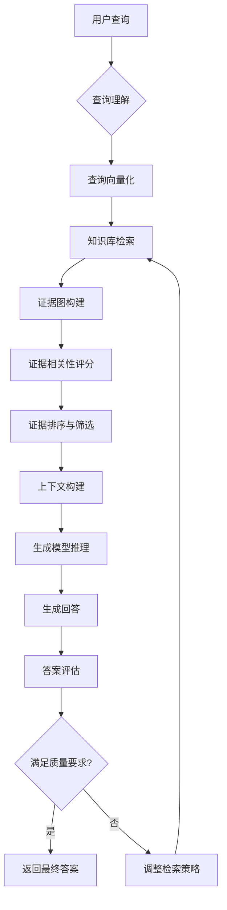

# 背景技术

# 背景技术

## 技术领域

以证据图增强的RAG（Retrieval-Augmented Generation，检索增强生成）系统属于自然语言处理、信息检索与知识表示的交叉研究领域。随着大语言模型(LLM)的快速发展，如何增强模型回答的准确性、可解释性和可靠性成为研究热点。传统RAG系统通过结合外部知识库与生成模型，有效缓解了LLM可能出现的幻觉问题，而证据图增强的RAG系统则进一步通过结构化的知识表示方式，提高了系统对复杂问题的推理能力和回答的可追溯性，在智能问答、知识管理、决策支持等领域具有广泛应用前景。

## 现有技术方案

### 方案一：基于向量检索的RAG系统

传统的RAG系统通常采用向量检索技术，将知识库中的文本转换为高维向量表示，然后通过余弦相似度等度量方法检索与查询最相关的文本片段。例如，Facebook Research提出的REALM (Retrieval-Augmented Language Model) 系统使用双层检索机制，首先通过BM25算法进行粗粒度检索，然后通过微调的Transformer模型进行细粒度检索，最后将检索到的文本片段作为上下文输入给预训练语言模型进行生成。该方案实现简单，计算效率高，能够处理大规模文本数据，但对语义深层次关联的捕捉能力有限。

### 方案二：基于知识图谱增强的RAG系统

另一种方案是利用知识图谱(Knowledge Graph)增强RAG系统。例如，Google提出的KnowGL (Knowledge-aware Graph-to-Text Generation) 系统将知识图谱中的实体和关系信息与文本生成相结合。该系统首先从知识图谱中检索与查询相关的子图，然后通过图神经网络(GNN)对子图进行编码，最后将编码后的图表示与文本生成模型结合，生成包含知识图谱信息的回答。该方案结构化表示能力强，能够显式建模实体间关系，支持复杂推理，但构建和维护知识图谱成本高，难以覆盖所有领域知识。

## 技术痛点

尽管现有RAG系统在提高回答准确性方面取得了一定进展，但仍存在以下技术痛点：

1. **检索相关性不足**：传统向量检索方法难以捕捉语义深层次关联，导致检索到的证据可能与查询问题不够相关，影响生成质量。

2. **证据整合困难**：多源异构证据的整合缺乏有效机制，系统难以权衡不同证据的重要性，导致生成的回答可能偏向某些特定来源。

3. **可解释性差**：现有系统通常将检索到的证据作为黑盒输入给生成模型，缺乏对证据如何影响生成过程的解释，难以回答"为什么生成这个回答"的问题。

4. **推理能力有限**：对于需要多步推理的复杂问题，现有系统难以有效利用证据进行逻辑推理，导致回答缺乏深度和准确性。

5. **动态更新挑战**：知识库的动态更新与模型参数的同步更新存在挑战，系统难以实时反映最新知识。

## 对比分析

基于向量检索的RAG系统与基于知识图谱增强的RAG系统各有优缺点：

**基于向量检索的RAG系统**：
- 优点：实现简单，计算效率高，能够处理大规模文本数据，对非结构化文本适应性强。
- 缺点：语义表示能力有限，难以捕捉实体间复杂关系，可解释性差，难以支持复杂推理任务。

**基于知识图谱增强的RAG系统**：
- 优点：结构化表示能力强，能够显式建模实体间关系，支持复杂推理，可解释性好。
- 缺点：构建和维护知识图谱成本高，难以覆盖所有领域知识，对非结构化文本处理能力有限，计算复杂度较高。

相比之下，以证据图增强的RAG系统试图结合两种方法的优点，通过构建轻量级的证据图来平衡表示能力和计算效率，同时增强系统的推理能力和可解释性。

## 系统流程图

## 关键算法

### 证据图构建算法

在证据图增强的RAG系统中，证据图的构建是关键步骤。给定查询Q和检索到的证据集合E = {e₁, e₂, ..., eₙ}，证据图G = (V, E)的构建可以形式化为：

$$G = \arg\max_{G'} \sum_{i=1}^{n} \sum_{j=1}^{n} \alpha \cdot \text{sim}(e_i, e_j) \cdot \mathbb{I}_{(v_i, v_j) \in E'} + \beta \cdot \text{rel}(e_i, Q) \cdot \mathbb{I}_{v_i \in V'}$$

其中，sim(e_i, e_j)表示证据e_i和e_j之间的语义相似度，rel(e_i, Q)表示证据e_i与查询Q的相关性，α和β是权重参数，$\mathbb{I}$是指示函数，用于确保只有满足条件的节点和边被包含在图中。

### 证据相关性评分算法

为了评估证据与查询的相关性，我们设计了一个多维度评分函数：

$$\text{score}(e, Q) = \lambda_1 \cdot \text{sim}_{\text{sem}}(e, Q) + \lambda_2 \cdot \text{sim}_{\text{ent}}(e, Q) + \lambda_3 \cdot \text{cov}(e, Q)$$

其中，sim_sem(e, Q)表示证据e与查询Q的语义相似度，sim_ent(e, Q)表示实体重叠度，cov(e, Q)表示信息覆盖率，λ₁, λ₂, λ₃是各维度的权重参数。该评分函数综合考虑了语义相似性、实体关联性和信息覆盖度，能够更全面地评估证据与查询的相关性。
