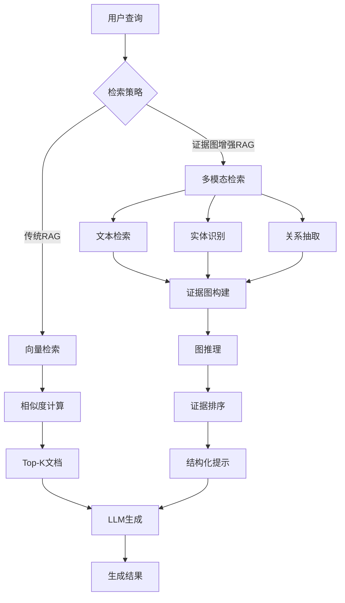

# 背景技术

# 背景技术

## 技术领域

本发明涉及自然语言处理(Natural Language Processing, NLP)领域，特别是知识增强型检索增强生成(Retrieval-Augmented Generation, RAG)系统。随着大型语言模型(如GPT系列、LLaMA系列等)的快速发展，其在各种自然语言处理任务中展现出强大的能力，然而，这些模型仍然面临着知识更新不及时、幻觉问题以及缺乏可解释性等挑战。检索增强生成技术通过引入外部知识库，有效缓解了这些问题，成为当前研究的热点。本发明特别关注如何通过构建证据图(evidence graph)来增强RAG系统的性能，提高生成内容的准确性、相关性和可解释性。

## 现有技术方案

### 1. 基于向量检索的RAG系统

传统的RAG系统主要依赖于向量检索技术，其核心流程包括文档索引、向量检索和生成三个阶段。在文档索引阶段，系统首先将原始文档分割成多个文本块，然后使用预训练语言模型(如BERT、Sentence-BERT等)将这些文本块转换为向量表示，并将这些向量存储在向量数据库(如FAISS、Milvus等)中。在向量检索阶段，系统将用户查询转换为向量，并在向量空间中检索与查询最相似的K个文本块。最后，在生成阶段，系统将检索到的文本块与原始查询拼接成提示(prompt)，并输入给大型语言模型进行生成。

### 2. 基于知识图谱的RAG系统

另一种RAG系统的实现方式是基于知识图谱(Knowledge Graph, KG)的检索增强。这类系统首先构建或利用现有的领域知识图谱，其中节点代表实体，边代表实体间的关系。当用户提出查询时，系统通过图谱查询算法(如SPARQL、路径查询等)获取与查询相关的子图或实体信息。然后，系统将图谱信息转换为文本描述，并与原始查询一起输入给大型语言模型进行生成。这种方法特别适用于需要结构化知识和关系推理的复杂查询场景。

## 技术痛点

### 1. 传统RAG系统的技术痛点

基于向量检索的RAG系统虽然实现简单且效果良好，但仍存在以下技术痛点：

首先，向量检索主要依赖于文本的语义相似度，而忽略了文本间的结构化关系信息。这导致系统在处理需要多跳推理的复杂问题时表现不佳，难以捕捉到分散在不同文档中的相关信息。

其次，传统RAG系统缺乏对检索结果的可解释性。用户无法直观地理解为什么某些文档被检索出来，以及这些文档如何支持生成结果，这在需要高可靠性的应用场景(如医疗、法律等)中是一个严重问题。

最后，向量检索容易受到噪声信息的影响。当检索到的文档中包含与查询相关但不准确的信息时，大型语言模型可能会将这些噪声信息整合到生成结果中，导致"幻觉"问题。

### 2. 基于知识图谱的RAG系统的技术痛点

基于知识图谱的RAG系统虽然在结构化知识表示和关系推理方面具有优势，但也面临以下挑战：

首先，构建和维护高质量的知识图谱需要大量的人工参与和领域专家知识，成本高昂。特别是在快速变化的领域，知识图谱的更新往往滞后于实际发展。

其次，现有的知识图谱通常覆盖有限的领域，难以满足跨领域查询的需求。当查询涉及图谱中未包含的知识时，系统无法提供有效的检索结果。

最后，知识图谱与文本的融合仍然是一个开放性问题。如何将结构化的图谱信息自然地融入到文本生成过程中，同时保持生成内容的流畅性和连贯性，仍然是一个技术挑战。

## 对比分析

传统RAG系统与基于知识图谱的RAG系统各有优缺点。传统RAG系统在通用性和易用性方面具有明显优势，它可以处理各种类型的文本数据，无需预先构建复杂的知识结构，且实现相对简单。然而，在处理需要复杂推理和结构化知识的查询时，传统RAG系统的表现往往不尽如人意。

相比之下，基于知识图谱的RAG系统在结构化知识表示和关系推理方面具有天然优势，特别适合处理需要多跳推理的复杂查询。然而，这类系统严重依赖于知识图谱的质量和覆盖范围，且构建和维护成本较高。

为了结合两种方法的优点，同时克服各自的局限性，本发明提出了一种基于证据图增强的RAG系统。该系统通过自动构建证据图来显式建模检索结果之间的关系，既保留了传统RAG系统的通用性和易用性，又增强了对复杂查询的处理能力和结果的可解释性。

## Mermaid流程图

## 算法公式

### 1. 向量相似度计算公式

在传统RAG系统中，向量检索通常使用余弦相似度来衡量查询向量与文档向量之间的相似度，其计算公式如下：

$$
\text{similarity}(\mathbf{q}, \mathbf{d}) = \cos(\mathbf{q}, \mathbf{d}) = \frac{\mathbf{q} \cdot \mathbf{d}}{\|\mathbf{q}\| \cdot \|\mathbf{d}\|} = \frac{\sum_{i=1}^{n} q_i \cdot d_i}{\sqrt{\sum_{i=1}^{n} q_i^2} \cdot \sqrt{\sum_{i=1}^{n} d_i^2}}
$$

其中，$\mathbf{q}$表示查询向量，$\mathbf{d}$表示文档向量，$q_i$和$d_i$分别表示向量的第$i$个维度值，$n$表示向量的维度。

### 2. 证据图构建与推理公式

在证据图增强的RAG系统中，我们提出了一种基于注意力机制的证据图构建与推理方法。给定检索到的文档集合$D = \{d_1, d_2, ..., d_m\}$和查询$q$，证据图$G = (V, E)$的构建过程可以形式化为：

$$
V = \{v_{query}\} \cup \{v_{entity} | e \in E(D)\}
$$

其中，$v_{query}$表示查询节点，$E(D)$表示从文档集合$D$中抽取的实体集合。

边权重$w_{ij}$表示节点$v_i$和$v_j$之间的关联强度，计算公式如下：

$$
w_{ij} = \alpha \cdot \text{sim}_{text}(v_i, v_j) + \beta \cdot \text{sim}_{struct}(v_i, v_j) + \gamma \cdot \text{sim}_{att}(v_i, v_j)
$$

其中，$\text{sim}_{text}$表示文本相似度，$\text{sim}_{struct}$表示结构相似度，$\text{sim}_{att}$表示注意力权重，$\alpha, \beta, \gamma$是可学习的参数，满足$\alpha + \beta + \gamma = 1$。

基于构建的证据图，我们使用图注意力网络进行推理，获取每个证据节点的最终表示，从而增强RAG系统的检索准确性和生成结果的可解释性。
