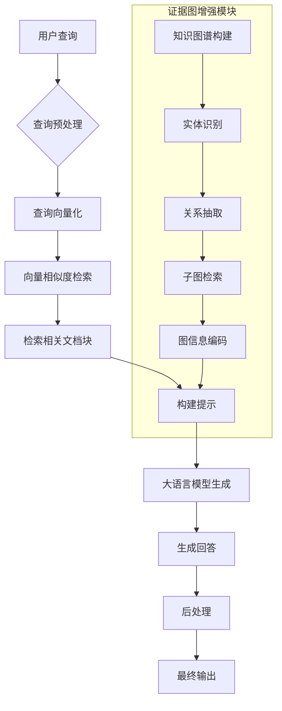

# 背景技术

# 背景技术

## 技术领域

以证据图增强的检索增强生成（Retrieval-Augmented Generation, RAG）系统属于自然语言处理（NLP）与知识表示交叉领域，是人工智能技术在知识密集型任务中的重要应用。随着大语言模型（LLM）的快速发展，如何增强模型的知识准确性、可解释性和可靠性成为研究热点。传统RAG系统通过结合信息检索与生成技术，使模型能够利用外部知识库提供更准确的回答。而以证据图增强的RAG系统进一步引入了知识图谱技术，通过构建和利用结构化的证据图，显著提升了系统在复杂查询场景下的表现。这类系统广泛应用于智能问答、知识管理、内容创作、决策支持等专业领域，尤其在需要高准确性和可解释性的场景中展现出独特优势。

## 现有技术方案

### 1. 基于向量检索的RAG系统

基于向量检索的RAG系统是目前最主流的实现方案，代表性框架包括LangChain、LlamaIndex等。该系统首先将文本分割成语义块，使用预训练语言模型（如BERT、Sentence-BERT）将文本块转换为高维向量表示，并构建向量数据库。当用户提出查询时，系统将查询也转换为向量，并在向量空间中进行相似度搜索，找到最相关的文本块。随后，将这些检索到的文本块与原始查询一起输入给生成式模型（如GPT系列），生成最终回答。这种方法简单高效，能够快速检索相关信息，但在处理复杂查询或多跳推理问题时存在局限性。

### 2. 基于知识图谱增强的RAG系统

基于知识图谱增强的RAG系统尝试将结构化知识整合到RAG流程中，如Google的Pathways Language Model (PaLM)和Meta的Galactica模型所采用的技术。这类系统首先构建领域知识图谱，其中节点代表实体，边代表实体间的关系。当用户提出查询时，系统不仅检索文本块，还从知识图谱中提取相关的子图，并将子图信息编码后输入给生成模型。这种方法能够提供更结构化的知识表示，增强模型对复杂关系的理解能力，同时提高回答的可解释性。然而，该方案对知识图谱的质量和完整性要求较高，且计算复杂度较大。

## 技术痛点

尽管RAG系统取得了显著进展，但仍面临以下技术痛点：

1. **检索准确性不足**：传统的基于向量相似度的检索方法难以捕捉语义的深层含义，特别是在处理复杂查询或多跳推理问题时，检索到的证据可能不够准确或全面。

2. **知识表示的局限性**：纯文本表示难以捕捉实体间的关系和结构化知识，导致系统在需要推理和关联知识时表现不佳。

3. **可解释性差**：生成式模型的"黑盒"特性使得用户难以理解回答的来源和依据，降低了系统的可信度。

4. **上下文窗口限制**：即使检索到相关证据，受限于生成模型的上下文窗口长度，系统可能无法充分利用所有检索到的信息。

5. **动态知识更新困难**：随着知识库的更新，系统需要重新索引和更新向量表示，这一过程计算成本高，难以实现实时更新。

## 对比分析

| 特性 | 基于向量检索的RAG系统 | 基于知识图谱增强的RAG系统 |
|------|----------------------|------------------------|
| 检索效率 | 高，基于近似最近邻搜索 | 中等，需要图遍历和推理 |
| 语义理解能力 | 中等，依赖向量表示 | 高，能捕捉实体关系 |
| 可解释性 | 低，难以追踪证据来源 | 中等，可通过图路径解释 |
| 知识更新 | 简单，可增量更新 | 复杂，需维护图结构一致性 |
| 适用场景 | 通用问答、内容生成 | 需要推理的复杂问题、专业领域 |
| 计算复杂度 | 检索阶段低，生成阶段高 | 整体复杂度高，特别是图推理部分 |

基于向量检索的RAG系统在通用场景下表现良好，实现简单且效率高，但在需要复杂推理和专业知识的场景下表现有限。而基于知识图谱增强的RAG系统虽然在处理复杂关系和推理问题上具有优势，但实现复杂度高，计算资源消耗大，且需要高质量的结构化知识库支持。

## 系统流程图

## 关键算法公式

### 1. 向量相似度计算公式

在基于向量检索的RAG系统中，余弦相似度常用于衡量查询向量与文档向量之间的相关性：

$$sim(q, d) = \frac{q \cdot d}{||q|| \cdot ||d||} = \frac{\sum_{i=1}^{n} q_i \cdot d_i}{\sqrt{\sum_{i=1}^{n} q_i^2} \cdot \sqrt{\sum_{i=1}^{n} d_i^2}}$$

其中，$q$和$d$分别是查询向量和文档向量，$n$是向量维度，$q_i$和$d_i$分别是向量的第$i$个元素。

### 2. 证据图注意力权重计算公式

在基于知识图谱增强的RAG系统中，注意力机制常用于融合图结构和文本信息：

$$Attention(Q, K, V) = \text{softmax}\left(\frac{QK^T}{\sqrt{d_k}}\right)V$$

其中，$Q$、$K$和$V$分别是查询矩阵、键矩阵和值矩阵，$d_k$是键向量的维度。在证据图增强的RAG系统中，$Q$可以来自查询文本的表示，$K$和$V$则可以从知识图谱的子节点中提取，通过这种方式，系统能够同时关注文本内容和图结构信息，实现更精准的知识检索与生成。
