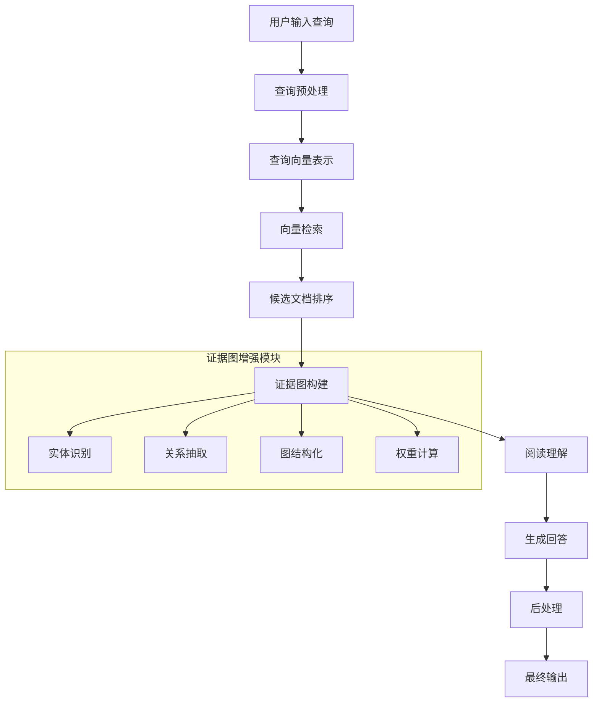

# 背景技术

# 背景技术

## 技术领域

本发明涉及自然语言处理与人工智能领域，具体而言，涉及一种以证据图增强的检索增强生成（Retrieval-Augmented Generation, RAG）系统。随着大语言模型（LLM）的快速发展，如何有效利用外部知识库增强模型能力已成为研究热点。传统RAG系统通过检索外部知识来增强生成内容的事实性和准确性，但在处理复杂查询和多步推理任务时仍面临挑战。证据图增强技术属于知识图谱与语义网络领域，通过结构化表示知识实体及其关系，为RAG系统提供更丰富的语义支持和推理能力。这两个领域的结合代表了当前AI系统知识表示和增强生成的前沿方向，对于构建更可靠、可解释的智能问答系统具有重要意义。

## 现有技术方案

### 1. 基于向量检索的RAG系统

目前最主流的RAG实现方案是基于向量检索的系统，它将文档和查询转换为高维向量表示，通过余弦相似度计算找到最相关的文档片段。典型代表包括OpenAI的Embedding API和开源的Sentence-BERT模型。这类系统通常采用"检索-阅读-生成"的三阶段流程：首先使用向量检索技术从大规模知识库中获取相关文档片段，然后通过阅读理解模型分析这些内容，最后利用生成模型整合信息并产生回答。这种方案计算效率高，能够处理大规模文本库，但对语义理解的深度有限，难以捕捉实体间复杂关系。

### 2. 基于知识图谱增强的RAG系统

另一类技术方案是在传统RAG基础上引入知识图谱，将检索到的信息组织成结构化的知识表示。例如，Google的Pathways Language Model (PaLM) 结合知识图谱来增强事实性。这类系统通过实体链接和关系抽取技术，将文本中的实体与知识图谱中的节点对应，构建局部证据图，用于指导生成过程。知识图谱提供了显式的语义关系表示，增强了系统的推理能力和回答的可解释性。然而，构建和维护知识图谱成本高昂，且难以覆盖所有领域的知识，限制了其在动态知识环境中的应用。

## 技术痛点

尽管RAG系统取得了显著进展，但仍面临以下技术痛点：

1. **检索准确性不足**：传统向量检索方法难以处理语义复杂查询，容易出现检索偏差和噪声。特别是在处理需要多步推理的问题时，检索系统往往难以捕捉到关键信息。

2. **信息整合困难**：检索到的信息往往是碎片化的，缺乏结构化表示，导致模型难以有效整合多源信息。这限制了系统对复杂问题的理解和回答能力。

3. **证据链不完整**：现有系统难以构建完整的证据链来支持生成内容的可信度评估，用户无法验证回答的来源和可靠性。

4. **动态知识更新**：随着知识库的不断更新，系统需要能够动态调整检索策略和知识表示，但大多数现有系统缺乏这种灵活性。

5. **推理能力有限**：RAG系统在需要复杂推理的任务上表现不佳，难以从检索到的信息中提取隐含关系并进行逻辑推理。

## 对比分析

基于向量检索的RAG系统与基于知识图谱增强的RAG系统各有优缺点：

向量检索系统计算效率高，能够处理大规模文本库，但对语义理解的深度有限，难以捕捉实体间复杂关系。此外，向量表示缺乏可解释性，用户难以理解为何某些文档被检索出来。

知识图谱增强系统提供了更好的语义表示和推理能力，能够显式建模实体间关系，增强回答的可解释性。然而，构建和维护知识图谱成本高昂，且难以覆盖所有领域的知识。此外，知识图谱与文本生成模型的融合仍面临挑战，特别是在处理非结构化文本时。

相比之下，以证据图增强的RAG系统试图结合两者的优势，通过构建轻量级的动态证据图，既保留了向量检索的效率，又增强了知识的结构化表示和推理能力。这种系统可以在不依赖完整知识图谱的情况下，为特定查询构建局部证据图，从而提高检索准确性和生成质量。

## 系统流程图

## 关键算法公式

### 1. 检索阶段的相似度计算公式

$$\text{sim}(q, d) = \frac{\vec{q} \cdot \vec{d}}{\|\vec{q}\| \cdot \|\vec{d}\|} = \frac{\sum_{i=1}^{n} q_i \cdot d_i}{\sqrt{\sum_{i=1}^{n} q_i^2} \cdot \sqrt{\sum_{i=1}^{n} d_i^2}}$$

其中，$q$表示查询向量，$d$表示文档向量，$\vec{q} \cdot \vec{d}$表示两个向量的点积，$\|\vec{q}\|$和$\|\vec{d}\|$分别表示向量的L2范数。

### 2. 证据图中的实体重要性权重计算公式

$$w(e_i) = \alpha \cdot \text{tf-idf}(e_i) + \beta \cdot \text{centrality}(e_i) + \gamma \cdot \text{relevance}(e_i, q)$$

其中，$w(e_i)$表示实体$e_i$的权重，$\text{tf-idf}(e_i)$是实体的词频-逆文档频率，$\text{centrality}(e_i)$是实体在证据图中的中心性度量，$\text{relevance}(e_i, q)$是实体与查询的相关性，$\alpha$、$\beta$和$\gamma$是可调节的权重参数。
