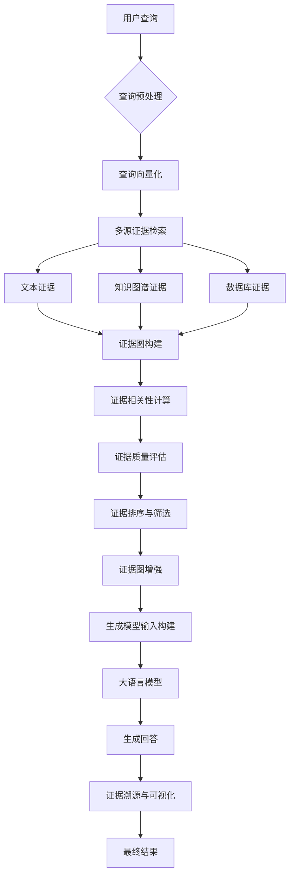

# 背景技术

# 背景技术

## 技术领域

本发明涉及自然语言处理与人工智能技术领域，具体而言，涉及一种基于证据图增强的检索增强生成（Retrieval-Augmented Generation, RAG）系统。随着大语言模型（Large Language Models, LLMs）的快速发展，其在知识密集型任务中展现出强大的能力，但同时也面临着幻觉问题、知识时效性不足以及缺乏可解释性等挑战。RAG技术通过结合外部知识库与生成模型，有效缓解了这些问题，成为当前研究的热点。然而，传统的RAG系统在证据检索、组织与利用方面仍存在诸多不足，特别是在处理复杂推理任务和多源异构证据时表现欠佳。本发明提出的以证据图增强的RAG系统，通过构建结构化的证据图谱，优化证据检索与组织机制，显著提升生成内容的准确性、可靠性和可解释性，为智能问答、知识发现等应用场景提供更高效的技术支持。

## 现有技术方案

### 方案一：基于向量检索的RAG系统

当前主流的RAG系统多采用基于向量检索的技术方案。该系统首先将文本分割为多个文档块，利用预训练语言模型（如BERT、Sentence-BERT等）将每个文档块编码为高维向量，并构建向量索引。当用户提出查询时，系统同样将查询编码为向量，通过近似最近邻搜索（如FAISS、Annoy等）从向量索引中检索与查询最相关的文档块，然后将这些文档块作为上下文输入给生成模型（如GPT系列、LLaMA等），最终生成包含检索证据的回答。这种方案简单高效，能够快速获取与查询相关的文本片段，但在处理复杂查询和多跳推理任务时，往往难以捕捉到深层次的语义关联，且缺乏对证据来源的可靠性评估机制。

### 方案二：基于知识图谱增强的RAG系统

为提升RAG系统的结构化推理能力，部分研究提出了基于知识图谱（Knowledge Graph, KG）增强的RAG系统。该方案首先构建领域知识图谱，其中节点代表实体，边代表实体间的关系。当用户提出查询时，系统通过实体链接和关系路径查询从知识图谱中检索相关证据，然后将结构化的知识三元组转换为文本描述，与原始检索结果一同提供给生成模型。这种方案能够提供更结构化的证据支持，增强生成内容的逻辑性和一致性，但在处理非结构化文本数据时，知识图谱的构建和维护成本较高，且难以充分利用文本中的隐式语义信息。

## 技术痛点

尽管现有RAG系统取得了一定进展，但仍面临以下技术痛点：

1. **证据碎片化与关联性不足**：传统RAG系统检索到的证据往往是孤立的文本片段，缺乏对证据间关联性的显式建模，导致生成模型难以充分利用证据间的互补信息，影响回答的完整性和准确性。

2. **证据质量评估困难**：现有系统缺乏对证据来源可靠性、时效性和权威性的有效评估机制，难以区分高质量证据与低质量证据，导致生成内容可能包含不可靠信息。

3. **复杂推理能力有限**：对于需要多跳推理或跨文档关联的复杂查询，传统RAG系统往往难以有效组织分散的证据，导致生成结果缺乏逻辑连贯性。

4. **可解释性不足**：现有系统难以清晰展示生成内容与证据来源之间的对应关系，用户无法直观判断生成内容的可靠性和依据。

## 对比分析

基于向量检索的RAG系统与基于知识图谱增强的RAG系统各有优劣。前者在处理非结构化文本时效率较高，能够快速捕捉语义相似性，但缺乏结构化表示能力；后者提供了更丰富的结构化知识表示，增强了推理能力，但在处理非结构化文本时灵活性不足，且知识图谱构建成本高。

相比之下，本发明提出的以证据图增强的RAG系统结合了两种方案的优势，通过构建证据图（Evidence Graph）作为中间表示，既保留了文本的语义信息，又提供了结构化的证据关联。证据图中的节点代表证据片段，边代表证据间的语义关联、逻辑关系或可信度关系，从而实现了对证据的统一组织和有效利用。与现有方案相比，证据图增强的RAG系统在证据组织能力、推理准确性和可解释性方面均有显著提升，能够更好地满足复杂知识密集型任务的需求。

## 系统流程图

## 算法公式

### 证据相关性计算

在证据图构建过程中，证据片段之间的相关性计算至关重要。我们采用基于注意力机制的相似度计算方法，对于两个证据片段 $e_i$ 和 $e_j$，其相关性得分 $s_{ij}$ 计算如下：

$$
s_{ij} = \text{Attention}(Q_i, K_j, V_j) = \sum_{j=1}^{n} \frac{\exp(\text{score}(Q_i, K_j))}{\sum_{k=1}^{n} \exp(\text{score}(Q_i, K_k))} \cdot V_j
$$

其中，$Q_i = W_q \cdot e_i$，$K_j = W_k \cdot e_j$，$V_j = W_v \cdot e_j$ 分别为查询向量、键向量和值向量，$W_q$、$W_k$、$W_v$ 为可学习参数矩阵，$\text{score}(Q_i, K_j) = Q_i^T K_j / \sqrt{d_k}$ 为缩放点积注意力函数，$d_k$ 为键向量的维度。

### 证据图传播与增强

为充分利用证据图中的结构化信息，我们设计了一种图注意力网络（Graph Attention Network, GAT）来增强证据表示。对于证据图中的节点 $v_i$，其更新后的表示 $h_i'$ 计算如下：

$$
h_i' = \sigma \left( \sum_{j \in \mathcal{N}_i} \alpha_{ij} W h_j \right)
$$

其中，$\mathcal{N}_i$ 为节点 $v_i$ 的邻居节点集合，$W$ 为线性变换矩阵，$\sigma$ 为非线性激活函数，$\alpha_{ij}$ 为节点 $v_i$ 和 $v_j$ 之间的注意力系数，计算公式为：

$$
\alpha_{ij} = \frac{\exp(\text{LeakyReLU}(a^T [W h_i || W h_j]))}{\sum_{k \in \mathcal{N}_i} \exp(\text{LeakyReLU}(a^T [W h_i || W h_k]))}
$$

其中，$a$ 为可学习向量，$||$ 表示向量拼接操作。通过这种图注意力机制，系统能够自适应地学习不同证据片段之间的关联强度，并生成增强后的证据表示，为后续生成任务提供更丰富的信息支持。
