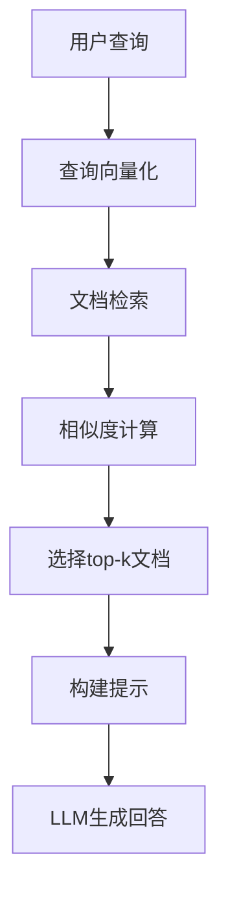

# 背景技术

# 背景技术

## 技术领域

本发明涉及人工智能与自然语言处理技术领域，具体而言，涉及一种基于证据图增强的检索增强生成（Retrieval-Augmented Generation, RAG）系统。随着大语言模型（Large Language Models, LLMs）的快速发展，其在知识问答、内容创作等任务中展现出强大的能力，但同时也面临着知识更新不及时、幻觉问题以及缺乏可解释性等挑战。RAG技术通过将外部知识库与生成模型相结合，有效缓解了这些问题。然而，传统RAG系统在处理复杂查询、构建完整证据链以及提供可追溯的推理过程方面仍存在局限性。本发明提出的证据图增强RAG系统，通过构建结构化的知识图谱和证据关系网络，显著提升了RAG系统的准确性、可解释性和可靠性。

## 现有技术方案

### 方案一：传统RAG系统

传统RAG系统主要由检索模块和生成模块组成。检索模块通常采用向量嵌入（如BERT、Sentence-BERT等）将查询和文档表示为高维向量，通过余弦相似度或其他相似度度量方法计算查询与文档之间的相关性，选择top-k最相关的文档片段作为生成模块的上下文。生成模块则基于检索到的上下文和原始查询，由预训练的大语言模型（如GPT系列、LLaMA等）生成最终回答。这种架构简单有效，能够将外部知识与模型参数知识相结合，减少模型幻觉问题。

传统RAG系统的典型工作流程如下：



### 方案二：基于简单图结构的RAG增强方案

为提升传统RAG系统的性能，部分研究尝试引入图结构来组织知识。这类方法通常构建一个简单的知识图谱，其中节点代表实体或概念，边代表实体间的关系。在检索阶段，系统不仅检索与查询直接相关的文档，还通过图遍历算法获取与查询相关的实体及其邻居节点，将这些信息作为额外上下文提供给生成模块。这种方法在一定程度上增强了上下文的丰富性，但图结构通常较为简单，缺乏对证据链的完整建模和推理能力。

## 技术痛点

尽管现有RAG系统在多个应用场景中表现出色，但仍存在以下技术痛点：

1. **信息检索准确性不足**：传统RAG系统主要依赖文本相似度进行检索，难以捕捉查询与文档之间的深层语义关联，导致检索结果可能包含噪声或不相关信息。

2. **上下文理解有限**：现有方法通常将检索到的文档片段作为独立信息处理，未能有效捕捉文档间的内在联系和上下文依赖关系，限制了模型对复杂问题的理解能力。

3. **证据链不完整**：在需要多步推理或综合多源信息的任务中，传统RAG系统难以构建完整的证据链，导致生成的回答可能缺乏足够的支持证据或逻辑连贯性。

4. **可解释性不足**：传统RAG系统通常难以解释其生成答案的依据和推理过程，用户难以验证答案的准确性和可靠性。

5. **动态更新困难**：随着知识的不断更新，传统RAG系统需要频繁重新索引和更新知识库，维护成本高且效率低下。

## 对比分析

传统RAG系统与证据图增强RAG系统在多个维度上存在显著差异：

1. **知识组织方式**：传统RAG系统采用扁平化的文档存储方式，而证据图增强RAG系统通过结构化的图模型组织知识，能够更好地表达实体间的复杂关系。

2. **检索机制**：传统RAG系统主要基于文本相似度进行检索，而证据图增强RAG系统结合了语义相似度、图路径分析和证据相关性计算等多种机制，显著提升了检索的准确性和全面性。

3. **上下文构建**：传统RAG系统将检索到的文档片段直接拼接作为上下文，而证据图增强RAG系统通过分析证据间的关联性构建结构化的上下文表示，更好地保留了信息的逻辑结构。

4. **推理能力**：传统RAG系统主要依赖大语言模型的隐式推理能力，而证据图增强RAG系统通过显式的证据链构建和路径分析，增强了系统的可解释性和推理可靠性。

在证据图增强RAG系统中，证据相关性计算是一个关键环节，其计算公式如下：

```
ER(e_i, e_j) = α * sim(e_i, e_j) + β * path_sim(e_i, e_j) + γ * (1 - |time_diff(e_i, e_j)| / T_max)
```

其中，e_i和e_j代表两个证据节点，sim(e_i, e_j)表示语义相似度，path_sim(e_i, e_j)表示在证据图中的路径相似度，time_diff(e_i, e_j)表示两个证据的时间差，T_max是最大时间差阈值，α、β、γ是权重系数，用于平衡不同因素的影响。

此外，在证据图构建过程中，证据节点的权重计算也是关键环节，其计算公式如下：

```
Weight(e_i) = log(1 + freq(e_i)) * (1 - decay_factor ^ (current_time - timestamp(e_i)))
```

其中，freq(e_i)表示证据e_i的出现频率，timestamp(e_i)表示证据e_i的时间戳，current_time表示当前时间，decay_factor是衰减因子，用于控制证据随时间推移的权重衰减。

综上所述，传统RAG系统在处理复杂查询和构建完整证据链方面存在明显局限，而证据图增强RAG系统通过引入结构化的知识表示和更丰富的检索机制，能够有效解决现有技术痛点，显著提升系统的性能和可靠性。
