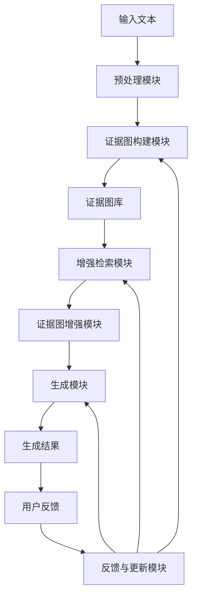

# 发明内容/技术方案-总述

# 发明内容/技术方案-总述

本发明提出了一种以证据图增强的检索增强生成(RAG)系统，旨在解决传统RAG系统在知识检索不全面、证据链断裂以及生成结果缺乏可解释性等方面的技术问题。本系统通过构建动态证据图结构，将非结构化文本转化为结构化的知识表示，并在检索和生成过程中充分利用证据图的拓扑结构和语义关系，显著提升了系统的知识准确性、推理能力和结果可解释性。

本发明的核心创新点在于：首先，设计了多层级证据图构建机制，能够从原始文本中自动抽取实体、关系和证据链，形成层次化的知识图谱；其次，提出了基于图神经网络(GNN)的证据感知检索算法，通过考虑证据图中节点间的语义关联性和路径置信度，优化了传统向量检索的局限性；再次，实现了证据图引导的生成策略，使生成模型能够基于证据链进行逻辑推理，生成更加准确和可靠的回答；最后，构建了闭环反馈机制，能够根据用户交互持续优化证据图结构和模型参数。

系统整体架构如图1所示，主要包括预处理模块、证据图构建模块、增强检索模块、证据图增强模块、生成模块以及反馈与更新模块。预处理模块负责对输入文本进行清洗、分词和实体识别；证据图构建模块利用预训练语言模型和关系抽取算法构建初始证据图；增强检索模块结合传统向量检索和图结构检索，提高相关证据的召回率；证据图增强模块根据查询内容构建证据子图，为生成模块提供结构化的知识支持；生成模块基于证据图和检索结果生成最终回答；反馈与更新模块则根据用户评价不断优化系统性能。



本发明中的证据图构建基于以下数学模型。设文本集合为D = {d₁, d₂, ..., dₙ}，对于每个文档dᵢ，我们首先识别其中的实体集合Eᵢ = {e₁, e₂, ..., eₘ}，然后抽取实体间的关系集合Rᵢ = {r₁, r₂, ..., rₖ}。证据图G = (V, E, R)中，V表示节点集合(对应实体)，E表示边集合(对应关系)，R表示关系类型集合。节点相似度计算采用以下公式：

sim(eᵢ, eⱼ) = α·cos(emb(eᵢ), emb(eⱼ)) + β·path_sim(eᵢ, eⱼ) + γ·context_sim(eᵢ, eⱼ)

其中，emb(e)表示实体e的嵌入向量，path_sim(eᵢ, eⱼ)计算两个实体在证据图中的最短路径相似度，context_sim(eᵢ, eⱼ)计算实体在上下文中的共现相似度，α、β、γ为权重系数。

在证据图增强的检索过程中，我们设计了一种综合考虑局部相关性和全局证据链的评分函数：

Score(dᵢ, q) = λ·sim_vec(dᵢ, q) + (1-λ)·∑_{p∈P} w(p)·Confidence(p)

其中，sim_vec(dᵢ, q)表示文档dᵢ与查询q的向量相似度，P表示连接查询关键实体和文档证据实体的证据路径集合，w(p)表示路径p的权重，Confidence(p)计算路径p的置信度，λ为平衡系数。

以下是本发明系统的主要流程伪代码：

```
function EvidenceGraphEnhancedRAG(query):
    # 1. 预处理查询
    processed_query = preprocess(query)
    query_entities = extract_entities(processed_query)
    
    # 2. 增强检索
    candidate_docs = traditional_search(processed_query)
    evidence_paths = find_evidence_paths(query_entities, candidate_docs)
    
    # 3. 构建证据子图
    evidence_subgraph = build_evidence_subgraph(evidence_paths)
    
    # 4. 证据图增强
    enhanced_evidence = enhance_with_graph_structure(evidence_subgraph)
    
    # 5. 生成回答
    context = format_context(candidate_docs, enhanced_evidence)
    response = generate_answer(processed_query, context)
    
    # 6. 收集反馈
    user_feedback = collect_user_feedback(response)
    
    # 7. 更新系统
    update_evidence_graph(evidence_subgraph, user_feedback)
    update_model_parameters(user_feedback)
    
    return response
```

本发明通过引入证据图增强机制，有效解决了传统RAG系统在知识组织、检索效率和生成质量方面的局限性，显著提升了系统的知识准确性、推理能力和结果可解释性，为构建更加智能、可靠的知识问答系统提供了新的技术路径。
