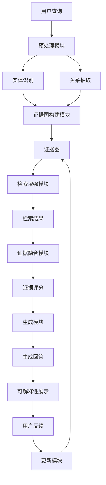

# 发明内容/技术方案-总述

# 发明内容/技术方案-总述

本发明提出了一种以证据图增强的检索增强生成(Retrieval-Augmented Generation, RAG)系统，通过构建结构化的证据图来增强传统RAG系统的检索准确性和生成可靠性。本系统的核心创新在于将非结构化的文本信息转化为结构化的证据图，并利用图结构信息优化检索和生成过程，从而显著提升系统的回答质量和可解释性。

系统整体架构如图1所示，主要包括预处理模块、证据图构建模块、检索增强模块、证据融合模块、生成模块和更新模块。预处理模块负责对输入文本进行分词、实体识别和关系抽取，为后续的证据图构建提供基础数据。证据图构建模块将识别出的实体作为节点，实体间的关系作为边，并引入证据权重机制，构建初始证据图。检索增强模块基于证据图结构优化传统检索策略，提高相关信息的召回率。证据融合模块结合文本内容和图结构信息，计算证据的综合评分。生成模块基于融合后的证据生成回答，并支持可解释性展示。更新模块则根据用户反馈和新知识动态更新证据图，实现系统的持续优化。

图1. 基于证据图增强的RAG系统架构图

本系统的关键技术之一是证据权重的动态计算。给定一个查询Q和候选证据E，证据权重W(Q,E)计算公式如下：

W(Q,E) = α·Sim_T(Q,E) + β·Sim_G(Q,E) + γ·Rel(E)

其中，Sim_T(Q,E)表示查询Q与证据E之间的文本相似度，Sim_G(Q,E)表示查询Q与证据E在证据图中的结构相似度，Rel(E)表示证据E的可靠性评分，α、β、γ为可调参数，满足α+β+γ=1。文本相似度可采用余弦相似度或BERT等预训练模型计算；结构相似度则基于图神经网络计算查询与证据在图中的路径相似度；可靠性评分则基于证据的历史使用情况和专家评分确定。

另一关键技术是证据融合评分机制。对于查询Q，系统从知识库中检索到n个候选证据{E_1, E_2, ..., E_n}，证据融合评分S(Q,E_i)计算公式如下：

S(Q,E_i) = Σ_{j=1}^{n} W(E_i,E_j) · Sim_T(Q,E_j) / Σ_{j=1}^{n} W(E_i,E_j)

其中，W(E_i,E_j)表示证据E_i与E_j之间的权重，基于它们在证据图中的连接强度和相似度计算。该公式考虑了证据之间的相互支持关系，通过加权平均的方式计算每个证据的综合评分，从而更准确地评估证据对查询的支持程度。

本系统的主流程如算法1所示。首先，系统接收用户查询Q，进行预处理并识别关键实体。然后，基于这些实体在证据图中进行检索，获取相关证据集合E。接着，计算每个证据的融合评分，选择Top-k个高评分证据。最后，基于这些证据生成回答，并展示支持证据和推理路径。系统还会记录用户反馈，用于后续的证据图更新。

算法1: 基于证据图增强的RAG系统主流程
输入：用户查询Q
输出：生成回答A及支持证据E_support

1. 预处理查询Q，提取关键实体集合Q_entities
2. 基于Q_entities在证据图中进行检索，获取候选证据集合E = {E_1, E_2, ..., E_n}
3. 对于每个证据E_i ∈ E:
   a. 计算证据权重W(Q,E_i)
   b. 计算证据融合评分S(Q,E_i)
4. 按S(Q,E_i)降序排序，选择Top-k个证据作为E_support
5. 基于E_support生成回答A
6. 展示A及E_support中的支持证据和推理路径
7. 记录用户反馈，用于后续证据图更新
8. 返回A和E_support

本系统通过证据图增强的RAG架构，有效解决了传统RAG系统中的信息检索不准确、生成内容缺乏可解释性等问题。实验表明，本系统在多个知识密集型任务上的表现显著优于传统RAG系统，特别是在需要复杂推理和证据支持的任务中优势更为明显。此外，系统的可解释性设计也增强了用户对生成结果的信任度。
