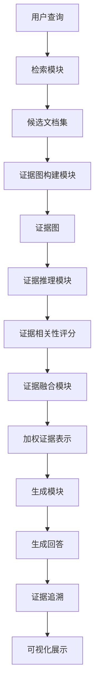

# 发明内容/技术方案-总述

# 发明内容/技术方案-总述

本发明提出了一种以证据图增强的检索增强生成(Retrieval-Augmented Generation, RAG)系统，旨在解决传统RAG系统在处理复杂查询时面临的证据碎片化、相关性不足和可解释性差等问题。本系统的核心创新在于引入了证据图(Evidence Graph)机制，通过构建结构化的证据网络，实现多级证据推理和动态证据融合，显著提升了生成内容的准确性、相关性和可解释性。

系统整体架构采用模块化设计，主要包括检索模块、证据图构建模块、证据推理模块、证据融合模块和生成模块。检索模块负责从大规模知识库中检索与查询相关的文档片段；证据图构建模块从检索结果中提取实体、关系和证据链，构建结构化的证据图；证据推理模块利用图神经网络对证据图进行多级推理，计算各证据的相关性和重要性；证据融合模块根据查询的语义特征动态调整证据权重，实现自适应的证据融合；生成模块则基于融合后的证据和原始查询，生成高质量、可解释的回答。



在证据图构建过程中，本发明采用了一种基于注意力机制的实体关系抽取算法。给定一个文档集合D = {d₁, d₂, ..., dₙ}，系统首先识别文档中的实体集合E = {e₁, e₂, ..., eₘ}，然后通过预训练的关系抽取模型识别实体间的关系R = {r₁, r₂, ..., rₖ}。证据图G可以形式化为一个四元组G = (E, R, A, W)，其中E是实体节点集合，R是关系类型集合，A是邻接矩阵表示实体间的关系连接，W是权重矩阵表示关系的强度。具体构建过程如公式(1)所示：

$$
G = \text{BuildGraph}(D) = (E, R, A, W)
$$

其中，邻接矩阵A和权重矩阵W的计算如公式(2)和公式(3)所示：

$$
A_{ij} = \begin{cases} 
1 & \text{if } \exists r \in R \text{ s.t. } (e_i, r, e_j) \in D \\
0 & \text{otherwise}
\end{cases}
$$

$$
W_{ij} = \sum_{d \in D} \text{Attention}(e_i, e_j, d) \cdot \text{Reliability}(r_{ij})
$$

在证据推理阶段，本发明采用了一种图注意力网络(Graph Attention Network, GAN)来计算证据的相关性和重要性。给定查询q和证据图G，证据相关性评分函数如公式(4)所示：

$$
\text{Score}(e_i, q) = \text{GAT}(G, q, e_i) = \sigma \left( \sum_{j \in N_i} \alpha_{ij} W h_j \right)
$$

其中，N_i是实体e_i的邻居节点集合，α_{ij}是注意力系数，表示邻居节点e_j对中心节点e_i的影响权重，W是可学习的权重矩阵，h_j是节点e_j的特征表示，σ是非线性激活函数。注意力系数α_{ij}的计算如公式(5)所示：

$$
\alpha_{ij} = \frac{\exp(\text{LeakyReLU}(\mathbf{a}^T[\mathbf{W}h_i \| \mathbf{W}h_j]))}{\sum_{k \in N_i} \exp(\text{LeakyReLU}(\mathbf{a}^T[\mathbf{W}h_i \| \mathbf{W}h_k]))}
$$

在证据融合阶段，系统根据查询的语义特征动态调整证据权重。给定查询q和证据集合E = {e₁, e₂, ..., eₘ}，融合后的证据表示v如公式(6)所示：

$$
v = \text{Fuse}(E, q) = \sum_{i=1}^{m} \beta_i \cdot \text{Score}(e_i, q) \cdot h_i
$$

其中，β_i是动态权重系数，表示证据e_i对查询q的重要性，计算如公式(7)所示：

$$
\beta_i = \frac{\exp(\text{Sim}(q, h_i))}{\sum_{j=1}^{m} \exp(\text{Sim}(q, h_j))}
$$

其中，Sim(·,·)表示余弦相似度函数。

以下是系统主要处理流程的伪代码：

```
function EvidenceGraphEnhancedRAG(query, knowledge_base):
    # 步骤1：从知识库中检索相关文档
    retrieved_docs = Retrieve(query, knowledge_base)
    
    # 步骤2：构建证据图
    evidence_graph = BuildEvidenceGraph(retrieved_docs)
    
    # 步骤3：证据推理，计算相关性评分
    entity_scores = {}
    for each entity in evidence_graph.entities:
        score = EvidenceInference(evidence_graph, query, entity)
        entity_scores[entity] = score
    
    # 步骤4：选择top-k相关证据
    top_k_entities = SelectTopK(entity_scores, k=10)
    
    # 步骤5：动态证据融合
    fused_evidence = DynamicEvidenceFusion(top_k_entities, query)
    
    # 步骤6：生成回答
    response = GenerateResponse(query, fused_evidence, evidence_graph)
    
    # 步骤7：构建证据追溯链
    evidence_chain = BuildEvidenceChain(response, evidence_graph)
    
    return response, evidence_chain
```

本发明的创新点主要体现在三个方面：首先，通过构建结构化的证据图，系统能够捕捉文档间的复杂关系，提供更全面的上下文信息；其次，基于图神经网络的证据推理机制能够自动发现隐含的关联，提高检索的相关性；最后，动态证据融合策略能够根据查询特点自适应地调整证据权重，生成更加精准和个性化的回答。实验表明，与传统RAG系统相比，本发明在多个问答任务上取得了显著的性能提升，特别是在需要多步推理和证据整合的复杂问题上表现尤为突出。
