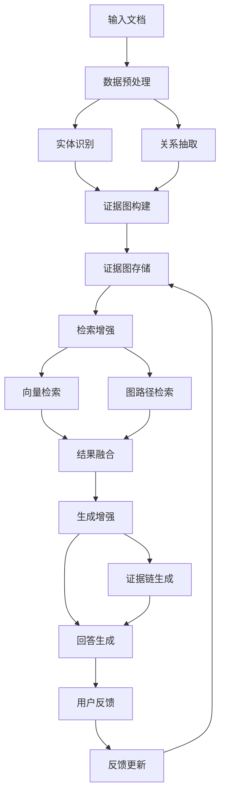

# 发明内容/技术方案-总述

# 发明内容/技术方案-总述

## 以证据图增强的RAG系统

本发明提出了一种以证据图增强的检索增强生成(RAG)系统，通过构建结构化的证据图显著提升信息检索的准确性和生成回答的可解释性。传统RAG系统主要依赖向量相似度进行文档检索，缺乏对文档内部结构和语义关系的深入理解，导致检索结果可能存在噪声和不相关内容。本发明通过引入证据图机制，将非结构化文本转化为结构化的知识表示，实现了更精准的信息检索和更可靠的答案生成。

系统整体架构包括五个核心模块：数据预处理模块、证据图构建模块、检索增强模块、生成增强模块和反馈更新模块。数据预处理模块负责对输入文档进行解析、实体识别和关系抽取，为后续证据图构建提供基础。证据图构建模块将提取的实体作为节点，实体间的关系作为边，并引入证据权重机制，构建动态更新的证据图。检索增强模块结合传统向量检索和基于证据图的路径检索，实现多层次的信息检索。生成增强模块基于检索到的证据链和原始文档内容，生成更加准确和可解释的回答。反馈更新模块则根据用户交互结果，持续优化证据图结构和检索策略。



本发明的核心创新之一是证据图节点的动态权重计算机制。对于证据图中的每个实体节点e，其权重W(e)不仅考虑实体在文档中的频率，还结合其在问题上下文中的相关性以及与其他实体的连接强度。具体计算公式如下：

W(e) = α·TF-IDF(e) + β·Sim(e, Q) + γ·∑_{e'∈N(e)} Sim(e, e')·W(e')

其中，TF-IDF(e)表示实体e的TF-IDF值，Sim(e, Q)表示实体e与问题Q的语义相似度，N(e)表示实体e的邻接节点集合，α、β、γ为可调参数，且α+β+γ=1。该公式通过综合考虑实体自身特征、与问题的相关性以及网络结构中的重要性，实现了对证据图中节点权重的动态调整。

另一个关键创新是证据链的相关性评分机制。在检索过程中，系统不仅返回单个文档片段，还构建支持回答的证据链。证据链的相关性评分R(C)基于链中证据的覆盖度、一致性和权威性进行计算：

R(C) = λ·Coverage(C) + μ·Consistency(C) + ν·Authority(C)

其中，Coverage(C)衡量证据链C对问题各个方面的覆盖程度，Consistency(C)评估链中证据之间的一致性，Authority(C)反映证据来源的权威性，λ、μ、ν为可调参数。通过该评分机制，系统能够从多个可能的证据链中选择最优的一条作为生成回答的基础。

在检索结果融合阶段，系统采用基于注意力机制的加权融合策略。对于向量检索结果V和图路径检索结果G，融合分数F的计算公式如下：

F = ∑_{i=1}^{n} α_i·v_i + ∑_{j=1}^{m} β_j·g_j

其中，v_i表示第i个向量检索结果，g_j表示第j个图路径检索结果，α_i和β_j为对应的注意力权重，通过注意力机制动态计算。该融合策略能够有效结合两种检索方式的优点，提高检索结果的全面性和准确性。

以下是系统主流程的伪代码实现：

```python
def evidence_graph_rag_system(query, documents):
    # 1. 数据预处理
    processed_docs = []
    for doc in documents:
        entities = extract_entities(doc)
        relations = extract_relations(doc, entities)
        processed_docs.append({
            "text": doc,
            "entities": entities,
            "relations": relations
        })
    
    # 2. 构建证据图
    evidence_graph = build_evidence_graph(processed_docs)
    
    # 3. 多层次检索
    # 3.1 向量检索
    vector_results = vector_search(query, documents)
    
    # 3.2 图路径检索
    graph_results = graph_path_search(query, evidence_graph)
    
    # 4. 结果融合
    fused_results = fuse_results(vector_results, graph_results)
    
    # 5. 证据链生成
    evidence_chains = generate_evidence_chains(fused_results, evidence_graph)
    
    # 6. 回答生成
    answer = generate_answer(query, evidence_chains, fused_results)
    
    # 7. 用户反馈处理
    user_feedback = get_user_feedback(answer)
    if user_feedback:
        update_evidence_graph(evidence_graph, user_feedback)
    
    return answer

def build_evidence_graph(processed_docs):
    graph = KnowledgeGraph()
    
    # 添加实体节点
    for doc in processed_docs:
        for entity in doc["entities"]:
            node = EntityNode(
                id=entity["id"],
                name=entity["name"],
                type=entity["type"],
                weight=calculate_entity_weight(entity, doc)
            )
            graph.add_node(node)
    
    # 添加关系边
    for doc in processed_docs:
        for relation in doc["relations"]:
            edge = RelationEdge(
                source=relation["source"],
                target=relation["target"],
                type=relation["type"],
                weight=calculate_relation_weight(relation, doc)
            )
            graph.add_edge(edge)
    
    return graph

def generate_evidence_chains(retrieved_results, evidence_graph):
    chains = []
    
    # 基于检索结果生成候选证据链
    for result in retrieved_results:
        chain = []
        # 从结果中提取关键实体
        entities = extract_key_entities(result)
        
        # 在证据图中寻找连接这些实体的路径
        path = find_path_in_graph(entities, evidence_graph)
        
        if path:
            chain.append({
                "path": path,
                "score": calculate_chain_score(path, result)
            })
    
    # 按评分排序并选择最优证据链
    chains.sort(key=lambda x: x["score"], reverse=True)
    return chains[:top_k]  # 返回top-k条证据链
```

本发明的以证据图增强的RAG系统通过结构化的知识表示和推理机制，显著提升了信息检索的准确性和生成回答的可解释性。与传统RAG系统相比，本系统能够更好地理解文档内部的语义关系，构建支持回答的证据链，并根据用户反馈持续优化知识表示。这种创新方法在需要高精度回答和可解释性的应用场景中具有显著优势，如专业问答系统、智能客服和学术研究辅助等。
