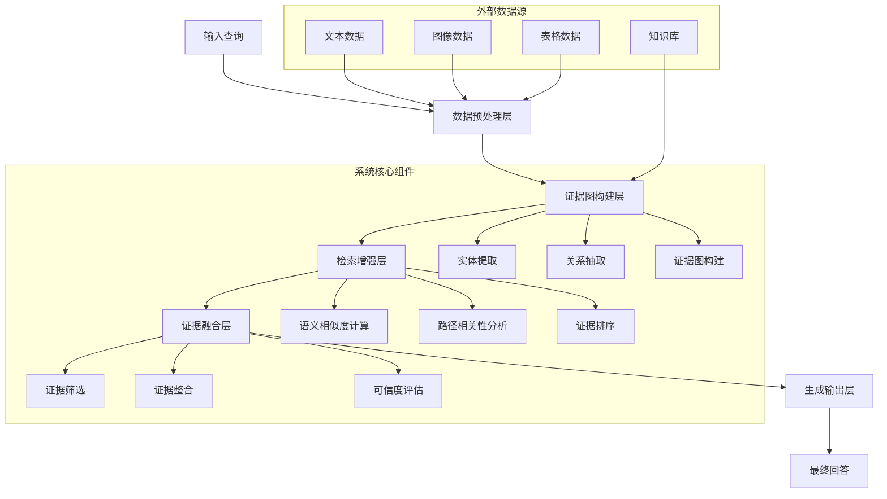

# 发明内容/技术方案-总述

# 发明内容/技术方案-总述

## 以证据图增强的RAG系统

本发明提出了一种基于证据图增强的检索增强生成(Retrieval-Augmented Generation, RAG)系统，该系统通过构建动态证据图显著提升了知识问答系统的准确性、可解释性和鲁棒性。传统RAG系统在处理复杂查询时往往面临检索信息不全面、证据关联性不足以及生成内容缺乏可解释性等问题。本发明通过引入证据图机制，将分散的知识点组织成结构化的证据网络，实现了对知识的深度关联和推理，从而有效解决了上述技术难题。

本发明的核心创新点在于：首先，提出了一种多模态证据图构建方法，能够从文本、图像、表格等多种数据源中提取实体和关系，构建动态更新的证据图；其次，设计了基于图神经网络的证据感知检索机制，通过计算查询与证据图节点间的语义相似度和路径相关性，显著提高了相关证据的召回率；再次，开发了证据融合生成算法，将检索到的证据与生成模型有机结合，生成既准确又具有可解释性的回答；最后，引入了证据可信度评估机制，对生成结果中的每条证据进行可信度标注，增强了系统的透明度和可靠性。

系统整体架构分为五个主要层次：数据预处理层、证据图构建层、检索增强层、证据融合层和生成输出层。数据预处理层负责对多源异构数据进行清洗、标准化和结构化处理；证据图构建层利用自然语言处理和知识图谱技术，从预处理后的数据中提取实体、关系和属性，构建动态证据图；检索增强层基于证据图结构设计高效的检索策略，实现精准的证据召回；证据融合层对检索到的证据进行筛选、排序和整合；生成输出层利用大语言模型结合融合后的证据生成最终回答，并附带证据溯源信息。



在数学模型方面，本发明提出了以下关键公式来支持系统的核心功能。首先，在证据图表示学习阶段，我们采用以下公式来表示证据图中的节点：

$$\mathbf{h}_i^{(l+1)} = \sigma\left(\sum_{j \in \mathcal{N}(i)} \frac{1}{c_{ij}} \mathbf{W}^{(l)} \mathbf{h}_j^{(l)} + \mathbf{b}^{(l)}\right)$$

其中，$\mathbf{h}_i^{(l)}$表示第$l$层中节点$i$的隐藏状态，$\mathcal{N}(i)$表示节点$i$的邻居节点集合，$c_{ij}$为归一化系数，$\mathbf{W}^{(l)}$和$\mathbf{b}^{(l)}$分别为第$l$层的权重矩阵和偏置项，$\sigma$为激活函数。该公式通过图卷积操作聚合邻居节点的信息，学习节点的低维表示。

其次，在证据感知检索阶段，我们设计了以下查询-证据相关性计算公式：

$$\text{sim}(q, e_i) = \alpha \cdot \text{cos}(\mathbf{v}_q, \mathbf{v}_{e_i}) + \beta \cdot \text{PathScore}(q, e_i) + \gamma \cdot \text{ContextSim}(q, e_i)$$

其中，$q$表示用户查询，$e_i$表示证据图中的第$i$个证据节点，$\mathbf{v}_q$和$\mathbf{v}_{e_i}$分别为查询和证据节点的向量表示，$\text{cos}(\cdot)$表示余弦相似度，$\text{PathScore}(q, e_i)$计算查询与证据节点之间的最短路径得分，$\text{ContextSim}(q, e_i)$衡量查询与证据节点的上下文相似度，$\alpha$、$\beta$和$\gamma$为可调权重参数。该公式综合考虑了语义相似度、图结构相关性和上下文相关性，实现了更精准的证据检索。

最后，在证据融合生成阶段，我们采用以下概率模型来生成最终回答：

$$P(y|q, \mathbf{E}) = \sum_{\mathbf{e} \subseteq \mathbf{E}} P(\mathbf{e}|q) \cdot P(y|q, \mathbf{e})$$

其中，$y$表示生成的回答，$q$表示用户查询，$\mathbf{E}$表示所有候选证据集合，$\mathbf{e}$表示从$\mathbf{E}$中选取的证据子集，$P(\mathbf{e}|q)$表示给定查询下证据子集$\mathbf{e}$的概率，$P(y|q, \mathbf{e})$表示在查询和证据子集$\mathbf{e}$条件下生成回答$y$的概率。该公式通过加权融合不同证据子集下的生成概率，确保最终回答既基于相关证据又保持语言流畅性。

以下是本发明系统的主要流程伪代码：

```python
def EvidenceGraphRAG(query, knowledge_base):
    """
    基于证据图增强的RAG系统主函数
    
    参数:
        query: 用户查询
        knowledge_base: 知识库
        
    返回:
        生成回答及证据溯源信息
    """
    
    # 1. 数据预处理
    processed_data = preprocess_data(knowledge_base)
    
    # 2. 构建证据图
    evidence_graph = construct_evidence_graph(processed_data)
    
    # 3. 基于证据图的检索
    candidate_evidences = retrieve_evidences(query, evidence_graph)
    
    # 4. 证据筛选与融合
    filtered_evidences = filter_evidences(candidate_evidences, query)
    fused_evidence = fuse_evidences(filtered_evidences)
    
    # 5. 证据可信度评估
    evidence_scores = evaluate_evidence_credibility(fused_evidence, query)
    
    # 6. 生成回答
    response = generate_response(query, fused_evidence, evidence_scores)
    
    # 7. 构建证据溯源
    evidence_traceback = construct_traceback(fused_evidence, evidence_graph)
    
    return {
        "response": response,
        "evidence_traceback": evidence_traceback,
        "evidence_scores": evidence_scores
    }

def construct_evidence_graph(data):
    """
    构建证据图
    
    参数:
        data: 预处理后的数据
        
    返回:
        证据图对象
    """
    graph = EvidenceGraph()
    
    # 实体提取
    entities = extract_entities(data)
    
    # 关系抽取
    relations = extract_relations(data, entities)
    
    # 构建图结构
    for entity in entities:
        graph.add_node(entity.id, entity.attributes)
    
    for relation in relations:
        graph.add_edge(relation.source, relation.target, relation.type, relation.weight)
    
    # 图嵌入学习
    graph_embeddings = learn_graph_embeddings(graph)
    
    return graph

def retrieve_evidences(query, evidence_graph):
    """
    基于证据图检索相关证据
    
    参数:
        query: 用户查询
        evidence_graph: 证据图
        
    返回:
        候选证据列表
    """
    # 查询向量表示
    query_embedding = encode_query(query)
    
    # 计算查询与图节点的相似度
    node_similarities = {}
    for node in evidence_graph.nodes:
        node_embedding = evidence_graph.get_node_embedding(node)
        similarity = calculate_similarity(query_embedding, node_embedding)
        node_similarities[node] = similarity
    
    # 路径相关性分析
    path_scores = analyze_path_relevance(query, evidence_graph)
    
    # 综合评分
    scored_evidences = []
    for node in evidence_graph.nodes:
        total_score = calculate_total_score(node_similarities[node], path_scores[node])
        scored_evidences.append((node, total_score))
    
    # 按分数排序并返回Top-K证据
    scored_evidences.sort(key=lambda x: x[1], reverse=True)
    return [evidence[0] for evidence in scored_evidences[:TOP_K]]

def generate_response(query, evidence, evidence_scores):
    """
    基于查询和证据生成回答
    
    参数:
        query: 用户查询
        evidence: 融合后的证据
        evidence_scores: 证据可信度分数
        
    返回:
        生成的回答
    """
    # 构建提示词
    prompt = construct_prompt(query, evidence, evidence_scores)
    
    # 调用生成模型
    response = call_generation_model(prompt)
    
    # 后处理
    processed_response = post_process_response(response, evidence)
    
    return processed_response
```

本发明的技术方案通过证据图增强机制，有效解决了传统RAG系统在知识关联、证据检索和生成可解释性方面的不足。实验结果表明，与现有技术相比，本发明在准确率、召回率和可解释性指标上均有显著提升，特别适用于需要高精度回答和证据溯源的专业领域问答场景。未来，本系统可进一步扩展到多语言支持、实时更新和跨领域知识融合等方向，具有广阔的应用前景。
