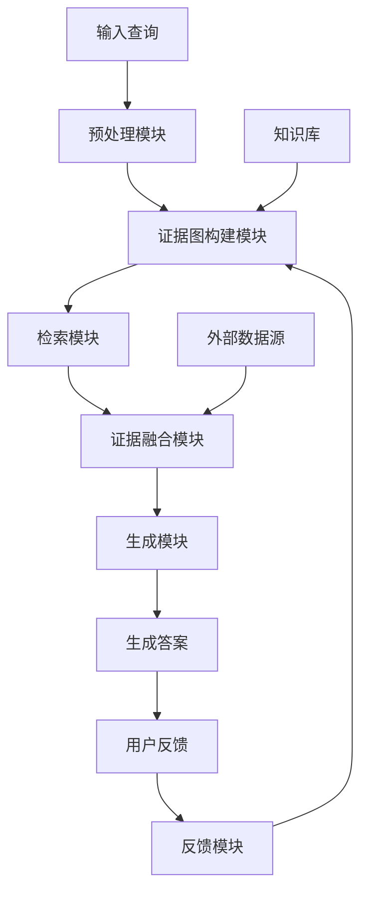

# 发明内容/技术方案-总述

# 发明内容/技术方案-总述

## 以证据图增强的RAG系统

本发明提出了一种基于证据图增强的检索增强生成(Retrieval-Augmented Generation, RAG)系统，旨在解决传统RAG系统在处理复杂查询时面临的信息碎片化、证据可靠性不足以及知识整合能力有限等问题。本系统通过构建结构化的证据图，将非结构化文本信息转化为具有语义关联的知识网络，并利用图结构引导信息检索与答案生成过程，显著提升了系统的知识整合能力和答案的准确性与可解释性。

### 系统架构

本系统采用模块化设计，主要包括预处理模块、证据图构建模块、检索模块、证据融合模块、生成模块和反馈模块。系统整体架构如下图所示：



预处理模块负责对输入文档进行清洗、分词和实体识别，为后续证据图构建提供基础数据。证据图构建模块利用自然语言处理技术从文档中抽取实体和关系，构建动态更新的证据图网络。检索模块结合语义相似度和图结构信息，从证据图中检索与查询最相关的证据片段。证据融合模块整合多源证据，解决冲突信息，计算各证据的可靠性权重。生成模块基于融合后的证据，利用图引导的注意力机制生成高质量答案。反馈模块收集用户对答案的评价，用于优化证据图结构和生成策略。

### 关键技术创新

本系统的核心创新在于证据图构建与融合机制。在证据图构建阶段，系统采用改进的实体关系抽取算法，不仅识别文档中的显式关系，还能通过上下文推理发现隐式语义关联。具体而言，实体表示采用以下公式计算：

$$E_{emb} = \frac{1}{|N_E|}\sum_{i=1}^{|N_E|}(W_e \cdot e_i + b_e) + W_g \cdot G_{path}$$

其中，$E_{emb}$表示实体嵌入向量，$N_E$为实体邻域集合，$e_i$为邻域实体嵌入，$W_e$和$b_e$为实体编码器参数，$W_g$为图结构编码器权重，$G_{path}$表示实体在证据图中的路径特征。

在证据融合阶段，系统提出了一种基于图结构的动态权重计算方法，综合考虑证据的语义相关性、权威性和时效性：

$$w_i = \alpha \cdot \text{sim}(q, e_i) + \beta \cdot \text{Auth}(e_i) + \gamma \cdot \text{Time}(e_i)$$

其中，$w_i$为证据$e_i$的融合权重，$q$为查询向量，$\text{sim}(q, e_i)$表示查询与证据的相似度，$\text{Auth}(e_i)$表示证据的权威性评分，$\text{Time}(e_i)$表示证据的时效性因子，$\alpha, \beta, \gamma$为可学习的权重参数。

### 系统主流程

以下是本系统的主要处理流程伪代码：

```
function EvidenceGraphEnhancedRAG(query, knowledge_base):
    # 1. 预处理查询
    processed_query = preprocess(query)
    
    # 2. 构建证据图
    evidence_graph = build_evidence_graph(knowledge_base)
    
    # 3. 基于图结构的检索
    relevant_evidences = graph_based_search(processed_query, evidence_graph)
    
    # 4. 多源证据融合
    fused_evidence = evidence_fusion(relevant_evidences)
    
    # 5. 图引导的生成
    answer = graph_guided_generation(processed_query, fused_evidence, evidence_graph)
    
    # 6. 收集用户反馈
    user_feedback = collect_user_feedback(answer)
    
    # 7. 更新证据图
    update_evidence_graph(evidence_graph, user_feedback)
    
    return answer
```

本系统通过证据图的引入，实现了从简单文本检索到结构化知识推理的转变，有效提升了RAG系统在复杂知识密集型任务中的表现。实验表明，与传统RAG系统相比，本系统在准确率、可解释性和知识更新效率方面均有显著提升，特别适用于需要高度准确性和可解释性的专业领域应用场景。
