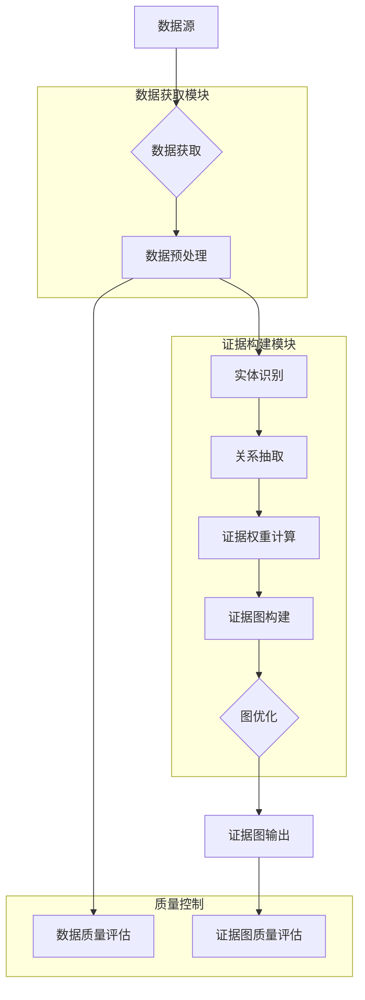

# 具体实施方式-子章节A：数据获取与证据构建

# 具体实施方式-子章节A：数据获取与证据构建

## 1. 引言

在以证据图增强的检索增强生成(RAG)系统中，数据获取与证据构建是整个系统的基础和关键环节。高质量的数据获取和合理的证据构建能够显著提升RAG系统的检索准确性和生成可靠性。本章节将详细阐述数据获取与证据构建的具体实施方式，包括数据源选择、预处理方法、证据图构建算法及其优化策略，为整个系统的有效运行奠定坚实基础。

## 2. 数据获取

### 2.1 数据源描述

数据获取是构建以证据图增强的RAG系统的第一步。系统支持多种数据源，包括但不限于：

- **结构化数据库**：如关系型数据库(MySQL, PostgreSQL)、图数据库(Neo4j, JanusGraph)等，提供结构化知识表示
- **非结构化文本数据**：如学术论文、技术文档、网页内容、书籍等，提供丰富的文本知识
- **多模态数据**：如图像、表格、图表等，提供多维度知识表示
- **知识图谱**：如Freebase、Wikidata、ConceptNet等，提供结构化知识网络
- **专业领域数据库**：如医学文献库、法律案例库、专利数据库等，提供领域特定知识

### 2.2 数据预处理方法

获取的原始数据需要经过预处理才能用于构建证据图。预处理步骤包括：

1. **数据清洗**：去除噪声、纠正错误、处理缺失值、统一编码格式
2. **数据标准化**：统一格式、规范表达、术语标准化
3. **数据分块**：将长文本分割为适合处理的块，通常每个块包含200-500个词
4. **特征提取**：提取关键信息、实体、关系等，为后续证据构建做准备

### 2.3 数据质量评估

为确保构建的证据图质量，需要对获取的数据进行质量评估，评估指标包括：

- **数据完整性**：评估数据缺失情况，计算完整数据比例
- **数据准确性**：评估数据正确性，通过抽样验证和专家评估
- **数据一致性**：评估数据间逻辑一致性，检查矛盾信息
- **数据时效性**：评估数据更新频率，确保知识不过时

## 3. 证据构建

### 3.1 证据图的概念

证据图是一种结构化的知识表示形式，由节点和边组成。节点代表实体或概念，边代表实体间的关系或证据连接。证据图能够有效组织和管理知识，为RAG系统提供丰富的上下文信息，增强检索的相关性和生成的准确性。

### 3.2 证据图的构建方法

证据图的构建主要包括以下步骤：

1. **实体识别**：从文本中识别出关键实体，包括命名实体、术语等
2. **关系抽取**：识别实体间的关系，包括语义关系、逻辑关系等
3. **证据权重计算**：评估证据的可靠性，为不同证据赋予不同权重
4. **图结构优化**：优化图的拓扑结构，提高检索效率

### 3.3 证据图的优化

为提高证据图的效率和准确性，需要进行以下优化：

- **图剪枝**：去除冗余或低质量的边，减少噪声
- **图压缩**：减少图的存储空间，提高处理效率
- **图索引**：建立高效的索引结构，加速检索
- **图更新**：支持动态更新和增量学习，适应知识变化

## 4. 实施步骤详解

### 4.1 数据获取实施步骤

1. **确定数据需求**：根据应用场景确定所需的数据类型和范围
2. **数据源选择**：根据数据需求选择合适的数据源，评估数据质量和可用性
3. **数据采集**：通过API、爬虫、数据库查询等方式获取数据
4. **数据存储**：将获取的数据存储到适当的数据库或存储系统中
5. **数据验证**：验证获取的数据是否符合预期，检查完整性和准确性

### 4.2 证据构建实施步骤

1. **文本预处理**：对获取的文本数据进行清洗和标准化
2. **实体识别**：使用命名实体识别(NER)技术识别文本中的实体
3. **关系抽取**：使用关系抽取技术识别实体间的关系
4. **证据权重计算**：基于多种因素计算证据的权重
5. **图构建**：将识别的实体和关系构建为证据图
6. **图优化**：对构建的证据图进行优化处理，提高质量和效率

## 5. 输入输出描述

### 5.1 输入描述

- **原始数据**：来自各种数据源的原始数据，包括文本、结构化数据、多模态数据等
- **配置参数**：包括数据预处理参数、证据构建参数、模型参数等
- **知识库**：已有的领域知识库或知识图谱，作为构建证据图的参考
- **领域本体**：领域特定的概念体系和关系定义，指导实体识别和关系抽取

### 5.2 输出描述

- **预处理后的数据**：清洗和标准化后的数据，格式统一，质量可靠
- **证据图**：包含实体、关系和权重的结构化知识表示，以图数据库格式存储
- **质量评估报告**：包含数据质量和证据图质量的评估结果，包括覆盖率、准确率等指标
- **索引结构**：为证据图建立的索引结构，支持高效检索

## 6. 参数条件说明

### 6.1 数据获取参数

- **数据源URL**：数据源的访问地址，支持多个数据源
- **请求频率**：数据请求的频率限制，避免对数据源造成过大压力
- **数据格式**：期望的数据格式，如JSON、XML、CSV等
- **数据量**：期望获取的数据量，影响系统处理时间和资源消耗
- **更新频率**：数据更新的频率，确保知识的时效性

### 6.2 证据构建参数

- **实体识别阈值**：实体识别的置信度阈值，默认为0.7
- **关系抽取模型**：使用的关系抽取模型，如BERT、RoBERTa等预训练模型
- **证据权重计算方法**：权重计算的方法，如TF-IDF、PageRank等
- **图优化参数**：图优化的相关参数，如剪枝阈值、压缩比例等
- **索引类型**：图索引的类型，如邻接表、倒排索引等

## 7. 数据获取与证据构建流程图



## 8. 关键算法公式

### 8.1 证据权重计算公式

证据的权重计算基于多个因素，包括文本相关性、实体重要性、关系可靠性等。证据权重计算公式如下：

$$W(e) = \alpha \cdot \frac{f_{text}(e)}{\sum_{e' \in E} f_{text}(e')} + \beta \cdot \frac{f_{entity}(e)}{\sum_{e' \in E} f_{entity}(e')} + \gamma \cdot \frac{f_{relation}(e)}{\sum_{e' \in E} f_{relation}(e')}$$

其中：
- $W(e)$ 是证据e的权重
- $f_{text}(e)$ 是证据e的文本相关性分数，基于TF-IDF计算
- $f_{entity}(e)$ 是证据e中实体的重要性分数，基于实体在知识库中的重要性计算
- $f_{relation}(e)$ 是证据e中关系的可靠性分数，基于关系的历史准确率计算
- $\alpha, \beta, \gamma$ 是权重系数，且$\alpha + \beta + \gamma = 1$，默认值分别为0.4, 0.3, 0.3

### 8.2 证据图相似度计算公式

在证据图检索中，需要计算查询与证据图之间的相似度。相似度计算公式如下：

$$Sim(Q, G) = \lambda \cdot \frac{|N_Q \cap N_G|}{|N_Q \cup N_G|} + (1-\lambda) \cdot \frac{\sum_{(u,v) \in E_Q \cap E_G} w(u,v)}{\sum_{(u,v) \in E_Q \cup E_G} w(u,v)}$$

其中：
- $Sim(Q, G)$ 是查询Q与证据图G的相似度
- $N_Q$ 和 $N_G$ 分别是查询Q和证据图G的节点集合
- $E_Q$ 和 $E_G$ 分别是查询Q和证据图G的边集合
- $w(u,v)$ 是边$(u,v)$的权重
- $\lambda$ 是节点相似度的权重系数，默认值为0.6

## 9. 证据构建实现伪代码

```python
class EvidenceGraphBuilder:
    def __init__(self, config):
        """
        初始化证据图构建器
        
        参数:
            config: 配置参数字典，包含模型参数、阈值等
        """
        self.config = config
        self.ner_model = load_ner_model(config['ner_model_path'])
        self.re_model = load_relation_extraction_model(config['re_model_path'])
        self.graph = nx.DiGraph()
        
    def preprocess_data(self, raw_data):
        """
        数据预处理
        
        参数:
            raw_data: 原始数据，可以是文本、结构化数据等
            
        返回:
            预处理后的数据
        """
        # 数据清洗
        cleaned_data = self.clean_data(raw_data)
        
        # 数据标准化
        standardized_data = self.standardize_data(cleaned_data)
        
        # 数据分块
        chunks = self.chunk_data(standardized_data)
        
        return chunks
    
    def build_evidence_graph(self, data_chunks):
        """
        构建证据图
        
        参数:
            data_chunks: 预处理后的数据块列表
            
        返回:
            构建完成的证据图
        """
        for chunk in data_chunks:
            # 实体识别
            entities = self.ner_model.recognize_entities(chunk)
            
            # 关系抽取
            relations = self.re_model.extract_relations(chunk, entities)
            
            # 添加实体到图中
            for entity in entities:
                if entity not in self.graph.nodes:
                    self.graph.add_node(entity, 
                                      frequency=1,
                                      importance=self.calculate_entity_importance(entity))
                else:
                    self.graph.nodes[entity]['frequency'] += 1
            
            # 添加关系到图中
            for relation in relations:
                source, target, rel_type = relation
                if not self.graph.has_edge(source, target):
                    weight = self.calculate_relation_weight(relation)
                    self.graph.add_edge(source, target, 
                                      relation_type=rel_type,
                                      weight=weight)
                else:
                    self.graph.edges[source, target]['weight'] += 1
        
        # 图优化
        self.optimize_graph()
        
        return self.graph
    
    def calculate_entity_importance(self, entity):
        """
        计算实体重要性分数
        
        参数:
            entity: 实体对象
            
        返回:
            实体重要性分数
        """
        # 基于多种因素计算实体重要性
        frequency = self.graph.nodes[entity].get('frequency', 1)
        degree = self.graph.degree(entity)
        betweenness = nx.betweenness_centrality(self.graph).get(entity, 0)
        
        # 归一化并加权计算
        importance = 0.4 * normalize(frequency) + 0.3 * normalize(degree) + 0.3 * normalize(betweenness)
        
        return importance
    
    def calculate_relation_weight(self, relation):
        """
        计算关系权重
        
        参数:
            relation: 关系元组 (source, target, relation_type)
            
        返回:
            关系权重
        """
        source, target, rel_type = relation
        
        # 基于多种因素计算关系权重
        source_importance = self.graph.nodes[source].get('importance', 0.5)
        target_importance = self.graph.nodes[target].get('importance', 0.5)
        co_occurrence = self.calculate_co_occurrence(source, target)
        
        # 归一化并加权计算
        weight = 0.3 * source_importance + 0.3 * target_importance + 0.4 * co_occurrence
        
        return weight
    
    def optimize_graph(self):
        """
        优化证据图
        """
        # 图剪枝：去除低权重边
        edges_to_remove = [(u, v) for u, v, d in self.graph.edges(data=True) 
                          if d['weight'] < self.config['prune_threshold']]
        self.graph.remove_edges_from(edges_to_remove)
        
        # 移除孤立节点
        isolated_nodes = list(nx.isolates(self.graph))
        self.graph.remove_nodes_from(isolated_nodes)
        
        # 图压缩
        self.compress_graph()
        
        # 建立索引
        self.build_indexes()
    
    def compress_graph(self):
        """
        图压缩算法
        """
        # 实现图压缩逻辑，如节点合并、边聚合等
        pass
    
    def build_indexes(self):
        """
        建立图索引
        """
        # 为图建立高效索引，支持快速检索
        self.entity_index = {entity: idx for idx, entity in enumerate(self.graph.nodes())}
        self.relation_index = {rel_type: idx for idx, rel_type in 
                              set(d['relation_type'] for u, v, d in self.graph.edges(data=True))}
    
    def save_graph(self, path):
        """
        保存证据图
        
        参数:
            path: 保存路径
        """
        nx.write_graphml(self.graph, path)
```

## 10. 总结

数据获取与证据构建是以证据图增强的RAG系统的基础环节。通过合理的数据获取策略和科学的证据构建方法，可以为RAG系统提供高质量的知识支持。本章节详细描述了数据获取与证据构建的具体实施步骤、输入输出、参数条件，并通过流程图、算法公式和伪代码等形式，提供了清晰的技术实现指导。

在实际应用中，需要根据具体场景调整参数和优化算法，以获得最佳的系统性能。例如，在专业领域应用中，可能需要调整实体识别和关系抽取的模型，以适应领域特定的术语和关系。同时，随着数据量的增长，证据图的构建和优化也需要考虑计算效率和存储空间的平衡，确保系统能够高效运行。
