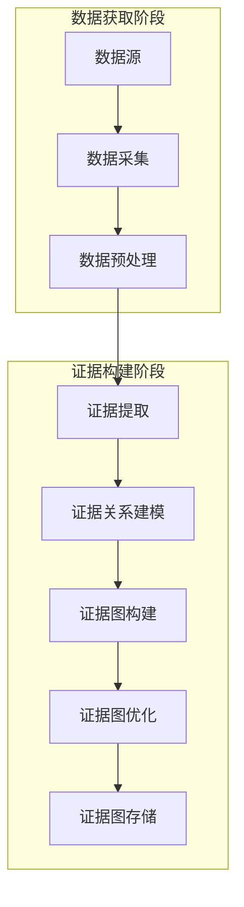

# 具体实施方式-子章节A：数据获取与证据构建

# 具体实施方式-子章节A：数据获取与证据构建

## 引言

在以证据图增强的检索增强生成（RAG）系统中，数据获取与证据构建是整个系统的基础和核心环节。高质量的数据获取和严谨的证据构建直接影响后续检索的准确性和生成结果的可信度。本章节将详细阐述数据获取与证据构建的具体实施方式，包括数据源选择、数据采集、预处理、证据提取、证据关系建模以及证据图构建的全过程。通过系统化的方法，确保获取的数据具有代表性、准确性和时效性，同时构建出的证据图能够有效表达知识间的复杂关系，为后续的检索增强生成提供坚实的知识基础。

## 数据获取

### 数据源描述

本系统支持多种数据源的获取，主要包括：
1. 结构化数据：如数据库、知识图谱等
2. 半结构化数据：如JSON、XML格式的文档
3. 非结构化数据：如文本、图像、音频等

### 数据采集方法

针对不同类型的数据源，系统采用相应的采集方法：
1. 对于结构化数据，通过API接口或数据库连接直接获取
2. 对于半结构化数据，使用解析器提取关键信息
3. 对于非结构化数据，采用自然语言处理技术进行信息提取

### 数据预处理

数据预处理是确保数据质量的关键步骤，包括：
1. 数据清洗：去除噪声、重复数据，处理缺失值
2. 数据标准化：统一数据格式、单位和命名规范
3. 数据增强：通过同义词替换、回译等技术扩充数据集
4. 数据分块：将长文本分割为适合处理的片段

## 证据构建

### 证据提取

证据提取是从预处理后的数据中识别和提取关键信息的过程：
1. 实体识别：识别文本中的命名实体，如人名、地名、机构名等
2. 关系抽取：识别实体之间的语义关系
3. 事件抽取：识别文本中描述的事件及其参与者
4. 观点提取：识别文本中的观点、评价和情感倾向

### 证据关系建模

证据关系建模是构建证据图的核心环节，主要包括：
1. 定义证据类型：如事实型证据、观点型证据、预测型证据等
2. 定义关系类型：如因果关系、包含关系、引用关系等
3. 构建关系强度模型：评估证据间关系的可靠性和重要性
4. 设计证据权重机制：根据证据的权威性、时效性等因素赋予不同权重

### 证据图构建

基于提取的证据和建模的关系，构建证据图：
1. 节点设计：将证据作为图的节点，包含证据类型、内容、来源、时间戳等属性
2. 边设计：将证据间的关系作为图的边，包含关系类型、强度、方向等属性
3. 图结构优化：通过社区发现、关键节点识别等技术优化图结构
4. 图更新机制：设计动态更新策略，确保证据图的时效性和准确性

## 算法与实现

### 流程图

以下是数据获取与证据构建的流程图：



### 算法公式

**公式1：证据权重计算**

证据权重是评估证据重要性的关键指标，综合考虑证据的权威性、时效性和相关性：

$$W(e) = \alpha \cdot \frac{A(e)}{\max A} + \beta \cdot \frac{T(e)}{\max T} + \gamma \cdot \frac{R(e)}{\max R}$$

其中：
- $W(e)$ 表示证据e的权重
- $A(e)$ 表示证据e的权威性评分
- $T(e)$ 表示证据e的时效性评分
- $R(e)$ 表示证据e与查询的相关性评分
- $\alpha, \beta, \gamma$ 分别表示三个因素的权重系数，且$\alpha + \beta + \gamma = 1$

**公式2：证据关系强度计算**

证据关系强度用于量化证据间关系的紧密程度：

$$S(e_i, e_j) = \frac{1}{1 + \exp(-(\theta \cdot \text{Sim}(e_i, e_j) + \phi \cdot \text{Co}(e_i, e_j) + \psi \cdot \text{Freq}(e_i, e_j)))}$$

其中：
- $S(e_i, e_j)$ 表示证据$e_i$和$e_j$之间的关系强度
- $\text{Sim}(e_i, e_j)$ 表示两个证据的语义相似度
- $\text{Co}(e_i, e_j)$ 表示两个证据的共同引用数量
- $\text{Freq}(e_i, e_j)$ 表示两个证据在相同上下文中出现的频率
- $\theta, \phi, \psi$ 分别表示三个因素的权重系数

### 伪代码实现

以下是数据获取与证据构建核心过程的Python风格伪代码：

```python
class EvidenceGraphBuilder:
    def __init__(self, config):
        """
        初始化证据图构建器
        
        参数:
            config: 配置字典，包含数据源、预处理参数、证据提取参数等
        """
        self.data_sources = config['data_sources']
        self.preprocess_params = config['preprocess_params']
        self.evidence_extraction_params = config['evidence_extraction_params']
        self.relation_modeling_params = config['relation_modeling_params']
        self.graph_storage = config['graph_storage']
        
    def acquire_data(self):
        """
        从多个数据源获取数据
        
        返回:
            raw_data: 原始数据列表
        """
        raw_data = []
        for source in self.data_sources:
            if source['type'] == 'structured':
                data = self._acquire_structured_data(source)
            elif source['type'] == 'semi_structured':
                data = self._acquire_semi_structured_data(source)
            else:
                data = self._acquire_unstructured_data(source)
            raw_data.extend(data)
        return raw_data
    
    def preprocess_data(self, raw_data):
        """
        预处理原始数据
        
        参数:
            raw_data: 原始数据列表
            
        返回:
            processed_data: 预处理后的数据列表
        """
        processed_data = []
        for data in raw_data:
            # 数据清洗
            cleaned_data = self._clean_data(data)
            
            # 数据标准化
            standardized_data = self._standardize_data(cleaned_data)
            
            # 数据增强
            augmented_data = self._augment_data(standardized_data)
            
            # 数据分块
            chunks = self._chunk_data(augmented_data)
            
            processed_data.extend(chunks)
        return processed_data
    
    def extract_evidence(self, processed_data):
        """
        从预处理后的数据中提取证据
        
        参数:
            processed_data: 预处理后的数据列表
            
        返回:
            evidence_list: 证据列表
        """
        evidence_list = []
        for data in processed_data:
            # 实体识别
            entities = self._recognize_entities(data)
            
            # 关系抽取
            relations = self._extract_relations(data, entities)
            
            # 事件抽取
            events = self._extract_events(data, entities)
            
            # 观点提取
            opinions = self._extract_opinions(data)
            
            # 构建证据对象
            evidence = {
                'content': data,
                'entities': entities,
                'relations': relations,
                'events': events,
                'opinions': opinions,
                'source': data.get('source', ''),
                'timestamp': data.get('timestamp', '')
            }
            
            evidence_list.append(evidence)
        return evidence_list
    
    def model_evidence_relations(self, evidence_list):
        """
        建模证据间的关系
        
        参数:
            evidence_list: 证据列表
            
        返回:
            relation_matrix: 证据关系矩阵
        """
        n = len(evidence_list)
        relation_matrix = [[0] * n for _ in range(n)]
        
        for i in range(n):
            for j in range(i+1, n):
                # 计算证据间的语义相似度
                sim = self._calculate_similarity(evidence_list[i], evidence_list[j])
                
                # 计算共同引用
                co = self._calculate_co_occurrence(evidence_list[i], evidence_list[j])
                
                # 计算共现频率
                freq = self._calculate_co_occurrence_frequency(evidence_list[i], evidence_list[j])
                
                # 计算关系强度
                strength = self._calculate_relation_strength(sim, co, freq)
                
                relation_matrix[i][j] = strength
                relation_matrix[j][i] = strength
                
        return relation_matrix
    
    def build_evidence_graph(self, evidence_list, relation_matrix):
        """
        构建证据图
        
        参数:
            evidence_list: 证据列表
            relation_matrix: 证据关系矩阵
            
        返回:
            evidence_graph: 证据图对象
        """
        # 创建图对象
        evidence_graph = self._create_graph()
        
        # 添加节点
        for i, evidence in enumerate(evidence_list):
            node_id = self._add_node(evidence_graph, evidence)
            evidence['node_id'] = node_id
        
        # 添加边
        for i in range(len(evidence_list)):
            for j in range(i+1, len(evidence_list)):
                if relation_matrix[i][j] > self.relation_modeling_params['threshold']:
                    self._add_edge(evidence_graph, 
                                 evidence_list[i]['node_id'],
                                 evidence_list[j]['node_id'],
                                 relation_matrix[i][j])
        
        # 图优化
        optimized_graph = self._optimize_graph(evidence_graph)
        
        return optimized_graph
    
    def execute(self):
        """
        执行数据获取与证据构建的全流程
        
        返回:
            evidence_graph: 构建完成的证据图
        """
        # 数据获取
        raw_data = self.acquire_data()
        
        # 数据预处理
        processed_data = self.preprocess_data(raw_data)
        
        # 证据提取
        evidence_list = self.extract_evidence(processed_data)
        
        # 证据关系建模
        relation_matrix = self.model_evidence_relations(evidence_list)
        
        # 构建证据图
        evidence_graph = self.build_evidence_graph(evidence_list, relation_matrix)
        
        # 存储证据图
        self.graph_storage.save(evidence_graph)
        
        return evidence_graph
```

## 实施步骤详解

### 步骤1：数据源配置与连接
1. 确定系统需要的数据源类型和范围
2. 配置各数据源的连接参数，如API密钥、数据库连接信息等
3. 建立数据源连接，确保数据获取的稳定性和可靠性

### 步骤2：数据采集
1. 根据数据源类型选择相应的采集方法
2. 实施数据采集，记录采集时间和数据量
3. 对采集的数据进行初步验证，确保数据完整性

### 步骤3：数据预处理
1. 执行数据清洗，去除噪声和重复数据
2. 进行数据标准化，统一格式和命名规范
3. 实施数据增强，扩充数据集
4. 将数据分割为适合处理的片段

### 步骤4：证据提取
1. 使用预训练模型进行实体识别
2. 应用关系抽取算法识别实体间关系
3. 执行事件抽取，识别关键事件
4. 提取文本中的观点和评价信息

### 步骤5：证据关系建模
1. 定义证据类型和关系类型
2. 设计关系强度计算模型
3. 为不同类型的证据分配权重
4. 构建证据间的关系网络

### 步骤6：证据图构建
1. 设计证据图的节点和边结构
2. 将提取的证据添加为图的节点
3. 根据关系模型添加边，标注关系强度
4. 优化图结构，提高检索效率

### 步骤7：证据图验证与优化
1. 验证证据图的完整性和准确性
2. 识别关键节点和重要路径
3. 优化图结构，提高检索效率
4. 建立证据图的更新机制

## 输入输出与参数条件

### 输入
1. 数据源配置：包括数据源类型、连接参数、访问权限等
2. 预处理参数：包括清洗规则、标准化规范、分块大小等
3. 证据提取参数：包括实体识别模型、关系抽取算法、事件抽取规则等
4. 关系建模参数：包括关系类型定义、权重系数、阈值设置等
5. 图构建参数：包括节点属性定义、边类型定义、优化策略等

### 输出
1. 预处理后的数据集
2. 证据列表：包含实体、关系、事件、观点等信息
3. 证据关系矩阵：量化证据间的关系强度
4. 证据图：包含节点和边的图结构数据
5. 证据图元数据：包括构建时间、数据量、节点数、边数等统计信息

### 参数条件
1. 数据源参数：
   - 结构化数据：需提供数据库连接信息或API访问凭证
   - 半结构化数据：需提供解析规则和映射模板
   - 非结构化数据：需提供文本预处理规则和模型参数

2. 预处理参数：
   - 清洗规则：定义噪声数据识别标准和处理方法
   - 标准化规范：统一数据格式、单位和命名规则
   - 分块大小：根据应用场景确定合适的文本片段长度

3. 证据提取参数：
   - 实体识别模型：选择合适的预训练模型或自定义模型
   - 关系抽取算法：基于规则或机器学习的方法
   - 事件抽取规则：定义事件类型和触发词

4. 关系建模参数：
   - 权重系数：$\alpha, \beta, \gamma$的取值范围[0,1]，且和为1
   - 关系阈值：定义关系强度的最小阈值，过滤弱关系
   - 相似度计算方法：选择合适的语义相似度计算方法

5. 图构建参数：
   - 节点属性：定义证据节点的必要属性
   - 边类型：定义不同类型的关系边
   - 优化策略：选择适合的图优化算法

## 总结

本章节详细阐述了以证据图增强的RAG系统中数据获取与证据构建的具体实施方式。通过系统化的数据采集、预处理、证据提取、关系建模和图构建流程，确保了系统获取的数据质量和证据图的可靠性。实施过程中，需要根据具体应用场景调整参数设置，优化算法性能，并建立有效的更新机制，以适应不断变化的数据环境。高质量的数据获取与证据构建为后续的检索增强生成提供了坚实的基础，是整个系统成功的关键因素。
