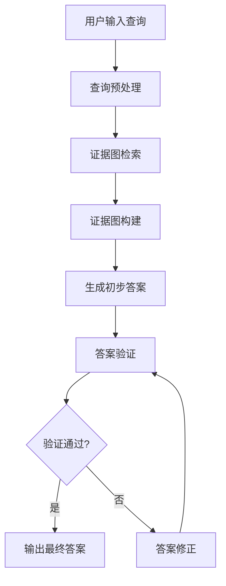

# 具体实施方式-子章节B：生成与验证流程

# 具体实施方式-子章节B：生成与验证流程

## 1. 引言

在以证据图增强的检索增强生成（RAG）系统中，生成与验证流程是确保系统输出高质量、准确且可解释答案的核心环节。本章节将详细描述这一流程的具体实施方式，包括证据图的构建、检索策略、生成机制以及验证方法。通过严谨的生成与验证流程，系统能够在保持生成能力的同时，确保答案的准确性和可靠性，为用户提供更加可信的知识服务。

## 2. 整体流程概述

生成与验证流程可以分为两个主要阶段：生成阶段和验证阶段。生成阶段负责基于用户查询和证据图生成初步答案，而验证阶段则对生成的答案进行评估和修正，确保其准确性和可靠性。



## 3. 生成阶段详细描述

### 3.1 输入和输出

**输入：**
- 用户查询：自然语言形式的用户问题
- 证据图：预先构建或动态生成的知识图谱，包含实体、关系和证据
- 检索参数：包括检索深度、相关性阈值等

**输出：**
- 初步生成的答案：基于证据图和用户查询生成的文本回答

### 3.2 参数条件

- 检索深度（d）：控制证据图检索的范围，通常设置为2-5
- 相关性阈值（θ）：用于过滤低相关度证据，通常设置为0.3-0.7
- 生成温度（T）：控制生成答案的随机性，通常设置为0.5-1.0
- 最大生成长度（L）：限制生成答案的最大长度，通常设置为100-500个token

### 3.3 具体实施步骤

1. **查询预处理**：
   - 对用户查询进行分词、词性标注和命名实体识别
   - 识别查询中的关键实体和关系
   - 构建查询向量表示

2. **证据图检索**：
   - 基于查询向量在证据图中进行相似性搜索
   - 根据检索深度d，获取与查询相关的实体和关系
   - 应用相关性阈值θ过滤低相关度证据

3. **证据图构建**：
   - 将检索到的证据组织成结构化的证据图子图
   - 为每个证据分配权重，基于其与查询的相关性
   - 构建证据图与查询的关联矩阵

4. **生成初步答案**：
   - 将证据图子图和用户查询作为输入，送入预训练的语言模型
   - 使用生成温度T控制生成过程的随机性
   - 应用束搜索（beam search）策略生成多个候选答案
   - 选择得分最高的候选答案作为初步答案

## 4. 验证阶段详细描述

### 4.1 输入和输出

**输入：**
- 初步生成的答案
- 证据图子图
- 用户查询

**输出：**
- 验证后的答案：经过验证和修正的最终答案
- 验证指标：包括准确性、一致性、完整性等评分

### 4.2 参数条件

- 严格性阈值（σ）：控制验证的严格程度，通常设置为0.7-0.9
- 一致性权重（α）：平衡不同验证指标的权重，通常设置为0.3-0.7
- 完整性权重（β）：平衡不同验证指标的权重，通常设置为0.2-0.5

### 4.3 具体实施步骤

1. **答案分解**：
   - 将生成的答案分解为多个事实性断言
   - 为每个断言分配置信度分数

2. **证据匹配**：
   - 将每个断言与证据图子图进行匹配
   - 计算断言与证据之间的支持度
   - 识别无法被证据支持的断言

3. **一致性检查**：
   - 检查答案内部各断言之间的一致性
   - 检查答案与用户查询的一致性
   - 计算一致性得分

4. **完整性评估**：
   - 评估答案是否覆盖了查询的所有关键方面
   - 计算完整性得分

5. **综合验证**：
   - 根据严格性阈值σ判断答案是否通过验证
   - 计算综合验证得分：S = α×一致性得分 + β×完整性得分
   - 如果综合得分低于阈值，则触发答案修正

6. **答案修正**：
   - 对于无法通过验证的断言，重新生成或删除
   - 基于证据图补充缺失的信息
   - 生成修正后的答案

## 5. 算法公式

### 5.1 证据图相关性计算公式

证据图中实体e与查询q的相关性R(e,q)可以通过以下公式计算：

R(e,q) = β·Sim(e,q) + (1-β)·∑_{r∈Rel(e)} [max_{e'∈E} Sim(r(e,e'),q)]

其中：
- Sim(e,q)表示实体e与查询q的语义相似度
- Rel(e)表示与实体e相关的所有关系
- r(e,e')表示实体e与e'之间的关系
- β是平衡实体直接相关性和关系相关性的权重参数，通常设置为0.6-0.8

### 5.2 答案验证综合评分公式

答案A的综合验证得分V(A)可以通过以下公式计算：

V(A) = α·C(A) + β·I(A) + γ·F(A)

其中：
- C(A)表示答案A的一致性得分，范围[0,1]
- I(A)表示答案A的完整性得分，范围[0,1]
- F(A)表示答案A的事实性得分，范围[0,1]
- α、β、γ分别是各得分的权重参数，满足α+β+γ=1，通常设置为α=0.4, β=0.3, γ=0.3

## 6. 伪代码实现

以下是生成与验证流程的Python风格伪代码实现：

```python
class EvidenceGraphRAG:
    def __init__(self, evidence_graph, retrieval_params, generation_params, validation_params):
        """
        初始化证据图增强的RAG系统
        
        参数:
            evidence_graph: 预构建的证据图
            retrieval_params: 检索参数字典
            generation_params: 生成参数字典
            validation_params: 验证参数字典
        """
        self.evidence_graph = evidence_graph
        self.retrieval_params = retrieval_params
        self.generation_params = generation_params
        self.validation_params = validation_params
        self.language_model = self.load_language_model()
    
    def generate_and_validate(self, query):
        """
        执行完整的生成与验证流程
        
        参数:
            query: 用户查询字符串
            
        返回:
            tuple: (最终答案, 验证指标)
        """
        # 生成阶段
        evidence_subgraph = self.retrieve_evidence(query)
        initial_answer = self.generate_answer(query, evidence_subgraph)
        
        # 验证阶段
        validation_result = self.validate_answer(initial_answer, evidence_subgraph, query)
        
        if validation_result['score'] >= self.validation_params['strictness_threshold']:
            return initial_answer, validation_result
        else:
            refined_answer = self.refine_answer(initial_answer, evidence_subgraph, query)
            refined_validation = self.validate_answer(refined_answer, evidence_subgraph, query)
            return refined_answer, refined_validation
    
    def retrieve_evidence(self, query):
        """
        根据查询从证据图中检索相关证据
        
        参数:
            query: 用户查询字符串
            
        返回:
            dict: 包含相关实体、关系和证据的子图
        """
        # 预处理查询
        query_entities = self.extract_entities(query)
        query_embedding = self.get_embedding(query)
        
        # 初始化相关证据
        relevant_evidence = {
            'entities': set(),
            'relations': set(),
            'evidences': []
        }
        
        # 检索相关实体
        for entity in self.evidence_graph['entities']:
            relevance_score = self.calculate_relevance(entity, query_embedding, query_entities)
            if relevance_score >= self.retrieval_params['relevance_threshold']:
                relevant_evidence['entities'].add(entity)
        
        # 检索相关关系
        for relation in self.evidence_graph['relations']:
            if self.is_relation_relevant(relation, relevant_evidence['entities']):
                relevant_evidence['relations'].add(relation)
        
        # 构建证据子图
        for entity in relevant_evidence['entities']:
            for relation in relevant_evidence['relations']:
                if relation['source'] == entity or relation['target'] == entity:
                    evidence = {
                        'entity': entity,
                        'relation': relation,
                        'score': self.calculate_evidence_score(entity, relation, query_embedding)
                    }
                    relevant_evidence['evidences'].append(evidence)
        
        # 按分数排序并截取前N个证据
        relevant_evidence['evidences'].sort(key=lambda x: x['score'], reverse=True)
        top_k = self.retrieval_params['top_k']
        relevant_evidence['evidences'] = relevant_evidence['evidences'][:top_k]
        
        return relevant_evidence
    
    def generate_answer(self, query, evidence_subgraph):
        """
        基于查询和证据子图生成初步答案
        
        参数:
            query: 用户查询字符串
            evidence_subgraph: 相关证据子图
            
        返回:
            str: 生成的初步答案
        """
        # 构建提示
        prompt = self.build_prompt(query, evidence_subgraph)
        
        # 使用语言模型生成答案
        generation_params = {
            'temperature': self.generation_params['temperature'],
            'max_length': self.generation_params['max_length'],
            'num_beams': self.generation_params['num_beams']
        }
        
        initial_answer = self.language_model.generate(prompt, **generation_params)
        
        return initial_answer
    
    def validate_answer(self, answer, evidence_subgraph, query):
        """
        验证生成的答案
        
        参数:
            answer: 待验证的答案
            evidence_subgraph: 相关证据子图
            query: 原始查询
            
        返回:
            dict: 包含各项验证指标和综合得分的验证结果
        """
        # 分解答案为事实性断言
        assertions = self.decompose_answer(answer)
        
        # 计算事实性得分
        factual_score = self.calculate_factual_score(assertions, evidence_subgraph)
        
        # 计算一致性得分
        consistency_score = self.calculate_consistency_score(assertions, query)
        
        # 计算完整性得分
        completeness_score = self.calculate_completeness_score(answer, query, evidence_subgraph)
        
        # 计算综合验证得分
        weights = self.validation_params['weights']
        total_score = (weights['consistency'] * consistency_score + 
                      weights['completeness'] * completeness_score + 
                      weights['factual'] * factual_score)
        
        return {
            'total_score': total_score,
            'factual_score': factual_score,
            'consistency_score': consistency_score,
            'completeness_score': completeness_score,
            'assertions': assertions
        }
    
    def refine_answer(self, answer, evidence_subgraph, query):
        """
        基于验证结果修正答案
        
        参数:
            answer: 待修正的答案
            evidence_subgraph: 相关证据子图
            query: 原始查询
            
        返回:
            str: 修正后的答案
        """
        # 获取验证结果
        validation_result = self.validate_answer(answer, evidence_subgraph, query)
        
        # 识别需要修正的断言
        weak_assertions = [a for a in validation_result['assertions'] if a['support'] < 0.5]
        
        # 构建修正提示
        refine_prompt = self.build_refine_prompt(answer, weak_assertions, evidence_subgraph, query)
        
        # 生成修正后的答案
        refined_answer = self.language_model.generate(refine_prompt, 
                                                     temperature=self.generation_params['temperature'],
                                                     max_length=self.generation_params['max_length'])
        
        return refined_answer
    
    def calculate_relevance(self, entity, query_embedding, query_entities):
        """
        计算实体与查询的相关性
        
        参数:
            entity: 实体对象
            query_embedding: 查询的向量表示
            query_entities: 查询中提取的实体列表
            
        返回:
            float: 相关性得分
        """
        # 直接相似度计算
        entity_embedding = self.get_embedding(entity['name'])
        direct_similarity = self.cosine_similarity(entity_embedding, query_embedding)
        
        # 如果实体在查询中直接出现，提高相关性
        entity_in_query = entity['name'].lower() in [e.lower() for e in query_entities]
        direct_bonus = 0.3 if entity_in_query else 0.0
        
        # 关系相关度计算
        relation_similarity = 0.0
        related_entities = self.get_related_entities(entity)
        
        for related_entity in related_entities:
            related_embedding = self.get_embedding(related_entity['name'])
            relation_similarity = max(relation_similarity, 
                                    self.cosine_similarity(related_embedding, query_embedding))
        
        # 综合计算
        beta = self.retrieval_params['beta']
        relevance = beta * (direct_similarity + direct_bonus) + (1 - beta) * relation_similarity
        
        return relevance
    
    def calculate_factual_score(self, assertions, evidence_subgraph):
        """
        计算答案的事实性得分
        
        参数:
            assertions: 答案分解的事实性断言列表
            evidence_subgraph: 相关证据子图
            
        返回:
            float: 事实性得分，范围[0,1]
        """
        total_support = 0.0
        valid_assertions = 0
        
        for assertion in assertions:
            # 在证据子图中寻找支持该断言的证据
            support = self.find_evidence_support(assertion, evidence_subgraph)
            total_support += support
            if support > 0.5:
                valid_assertions += 1
        
        # 计算事实性得分
        factual_score = total_support / len(assertions) if assertions else 0.0
        
        return factual_score
    
    def calculate_consistency_score(self, assertions, query):
        """
        计算答案的一致性得分
        
        参数:
            assertions: 答案分解的事实性断言列表
            query: 原始查询
            
        返回:
            float: 一致性得分，范围[0,1]
        """
        # 检查断言之间的一致性
        internal_consistency = self.check_internal_consistency(assertions)
        
        # 检查与查询的一致性
        query_consistency = self.check_query_consistency(assertions, query)
        
        # 综合计算
        consistency_score = 0.6 * internal_consistency + 0.4 * query_consistency
        
        return consistency_score
    
    def calculate_completeness_score(self, answer, query, evidence_subgraph):
        """
        计算答案的完整性得分
        
        参数:
            answer: 生成的答案
            query: 原始查询
            evidence_subgraph: 相关证据子图
            
        返回:
            float: 完整性得分，范围[0,1]
        """
        # 识别查询的关键方面
        query_aspects = self.extract_query_aspects(query)
        
        # 计算答案覆盖的查询方面比例
        covered_aspects = 0
        for aspect in query_aspects:
            if self.is_aspect_covered(aspect, answer, evidence_subgraph):
                covered_aspects += 1
        
        completeness_score = covered_aspects / len(query_aspects) if query_aspects else 0.0
        
        return completeness_score
```

## 7. 性能优化与参数调优

在实际应用中，生成与验证流程的性能受到多个参数的影响。以下是一些关键的优化策略：

1. **检索参数优化**：
   - 调整检索深度d以平衡检索范围和效率
   - 优化相关性阈值θ以过滤噪声证据
   - 使用学习型阈值而非固定阈值

2. **生成参数优化**：
   - 根据任务类型调整生成温度T
   - 使用束搜索宽度控制生成多样性
   - 应用长度惩罚避免过长的生成结果

3. **验证参数优化**：
   - 根据应用场景调整严格性阈值σ
   - 使用领域自适应的权重分配
   - 实现多级验证机制，提高验证效率

4. **计算效率优化**：
   - 实现证据图的增量更新
   - 使用缓存机制存储常用查询的结果
   - 采用批处理技术加速大规模验证

## 8. 总结

生成与验证流程是以证据图增强的RAG系统的核心环节，通过严谨的生成机制和全面的验证方法，系统能够生成高质量、准确且可解释的答案。本章节详细描述了这一流程的具体实施方式，包括输入输出、参数条件、实施步骤以及算法实现。通过合理的参数设置和优化策略，系统能够在不同应用场景中发挥最佳性能，为用户提供更加可靠的知识服务。
