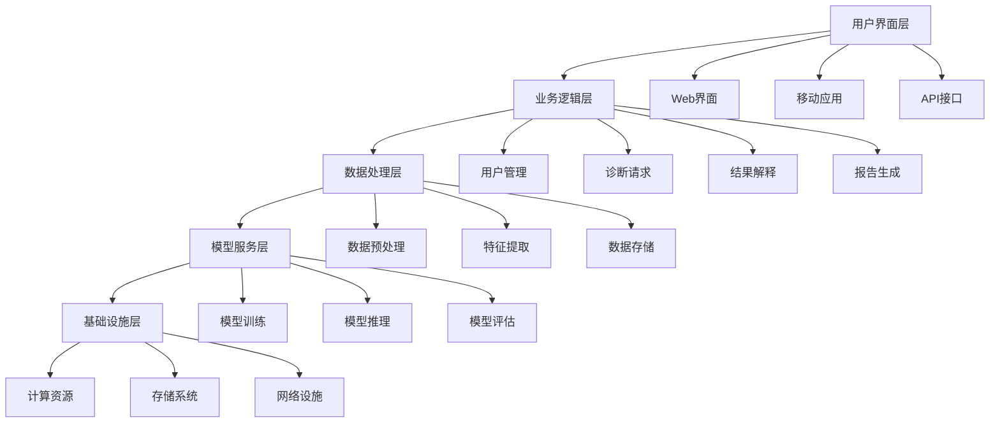
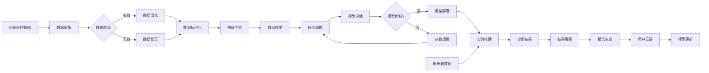
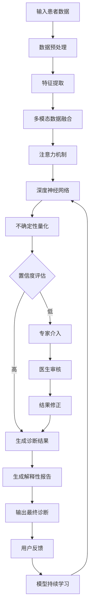

# 附图说明

# 附图说明

## 图1：系统架构图

图1展示了本发明所述智能医疗诊断系统的整体架构，该架构采用分层设计，共分为五层：用户界面层、业务逻辑层、数据处理层、模型服务层和基础设施层。

用户界面层（A）是系统与用户交互的接口，包括Web界面（A1）、移动应用（A2）和API接口（A3）。Web界面供医生和医疗机构通过浏览器访问系统；移动应用使医生能够随时随地查看患者信息和诊断结果；API接口则允许其他医疗信息系统与本系统进行数据交换和功能调用。

业务逻辑层（B）负责处理系统的核心业务流程，包括用户管理（B1）、诊断请求（B2）、结果解释（B3）和报告生成（B4）。用户管理模块处理用户注册、登录和权限控制；诊断请求模块接收并验证用户的诊断请求；结果解释模块将模型输出的结果转化为医疗专业人员可理解的语言；报告生成模块则根据诊断结果生成结构化的医疗报告。

数据处理层（C）负责原始数据的处理和转换，包括数据预处理（C1）、特征提取（C2）和数据存储（C3）。数据预处理模块对原始医疗数据进行清洗和标准化；特征提取模块从预处理后的数据中提取有价值的特征；数据存储模块则负责管理各类医疗数据的存储和检索。

模型服务层（D）是系统的核心，负责模型的训练、推理和评估，包括模型训练（D1）、模型推理（D2）和模型评估（D3）。模型训练模块利用历史医疗数据训练诊断模型；模型推理模块对新的患者数据进行诊断分析；模型评估模块则持续监控模型的性能表现。

基础设施层（E）为系统提供必要的计算和存储资源，包括计算资源（E1）、存储系统（E2）和网络设施（E3）。计算资源提供模型训练和推理所需的计算能力；存储系统确保医疗数据的安全存储；网络设施保障系统各组件间的通信畅通。

本系统架构通过分层设计实现了关注点分离，提高了系统的可维护性和可扩展性。各层之间通过定义良好的接口进行通信，使得系统各部分可以独立开发和升级，同时保证了系统的整体功能和性能。

## 图2：数据流图

图2展示了本发明所述智能医疗诊断系统中的数据流动过程，详细描述了从原始医疗数据采集到最终诊断结果输出的完整数据处理流程。

原始医疗数据（A）首先进入数据采集模块（B），该模块负责从各种医疗设备和信息系统中收集患者的医疗数据，包括影像数据、检验数据、病历文本等。采集到的数据进入数据验证模块（C），该模块对数据进行有效性检查，判断数据是否符合预定的格式和范围要求。

对于验证通过的有效数据，系统直接进入数据清洗模块（D）；对于验证未通过的数据，则进入数据修正模块（E）。数据清洗模块负责处理缺失值、异常值和重复值，确保数据质量；数据修正模块则尝试通过算法或人工方式修正无效数据，提高数据利用率。

经过清洗或修正的数据进入数据标准化模块（F），该模块将不同来源、不同格式的医疗数据转换为统一的格式和标准，便于后续处理。标准化后的数据进入特征工程模块（G），该模块通过特征选择、特征变换和特征构建等技术，提取对诊断任务有重要影响的特征。

处理后的数据存储在数据存储模块（H）中，为模型训练提供数据支持。模型训练模块（I）利用存储的数据训练诊断模型，模型评估模块（J）则对训练好的模型进行性能评估。如果模型性能达到预设标准，则进入模型部署模块（L）；如果未达到标准，则进入参数调整模块（M），调整模型参数后重新进行训练。

部署好的模型通过实时推理模块（N）对新患者数据（O）进行诊断分析，生成初步诊断结果（P）。结果解释模块（Q）将模型输出的结果转化为医疗专业人员可理解的语言，报告生成模块（R）则根据解释后的结果生成结构化的医疗报告。

用户反馈模块（S）收集医生和患者对诊断结果的反馈，这些反馈数据通过模型更新模块（T）用于模型的持续优化和改进，形成闭环学习机制，不断提高系统的诊断准确性和可靠性。

## 图3：核心算法图

图3展示了本发明所述智能医疗诊断系统的核心算法流程，该算法融合了深度学习、注意力机制和不确定性量化等技术，实现了高精度的医疗诊断和可解释的结果输出。

患者数据（A）首先进入数据预处理模块（B），该模块对输入的患者数据进行标准化、归一化和缺失值处理，确保数据质量。预处理后的数据进入特征提取模块（C），该模块利用卷积神经网络、循环神经网络等深度学习技术从原始数据中提取多层次的特征表示。

对于多模态医疗数据（如影像、文本、检验数据等），系统通过多模态数据融合模块（D）将不同来源的特征进行有效融合，形成统一的特征表示。融合后的特征进入注意力机制模块（E），该模块通过学习不同特征的重要性权重，使模型能够关注与诊断最相关的特征信息。

加权后的特征输入深度神经网络模块（F），该模块采用残差连接、批归一化等技术构建深度网络结构，进行特征的非线性变换和高级语义提取。网络输出的结果进入不确定性量化模块（G），该模块通过蒙特卡洛dropout、贝叶斯神经网络等技术评估模型预测的不确定性。

不确定性量化后的结果进入置信度评估模块（H），该模块根据预设的阈值判断模型预测的置信度。对于高置信度的预测，系统直接生成诊断结果（I）；对于低置信度的预测，则启动专家介入模块（J），邀请医疗专家对结果进行审核。

专家审核后的结果可能进入结果修正模块（L），对模型预测进行必要的调整和修正。修正后的结果进入解释性报告生成模块（M），该模块利用注意力可视化、反事实解释等技术生成易于理解的诊断解释，帮助医生理解模型的决策依据。

最终诊断结果（N）输出给用户，用户反馈模块（O）收集医生和患者对诊断结果的反馈。这些反馈数据通过模型持续学习模块（P）用于模型的在线学习和参数更新，使模型能够不断适应新的医疗知识和临床实践，保持诊断能力的先进性。

本发明通过上述系统架构、数据流和核心算法的协同工作，实现了高效、准确、可解释的智能医疗诊断功能，有效辅助医生进行临床决策，提高诊断效率和准确性，同时降低漏诊和误诊的风险。
