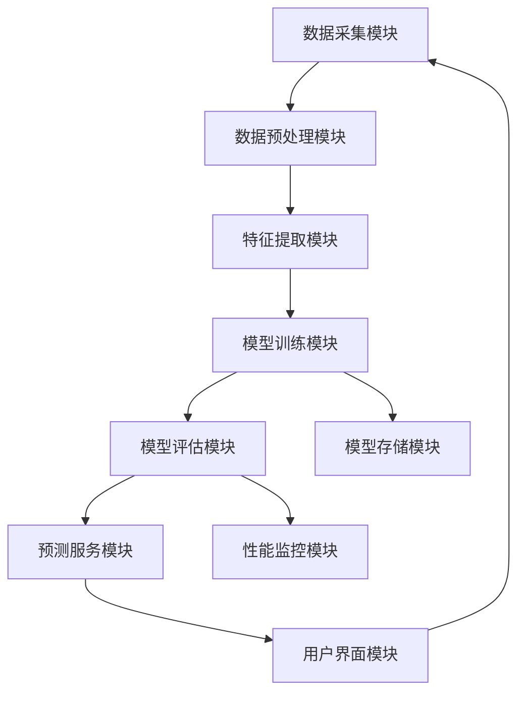
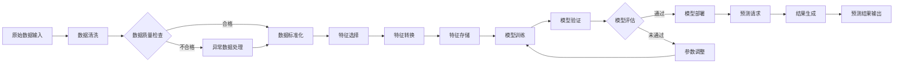
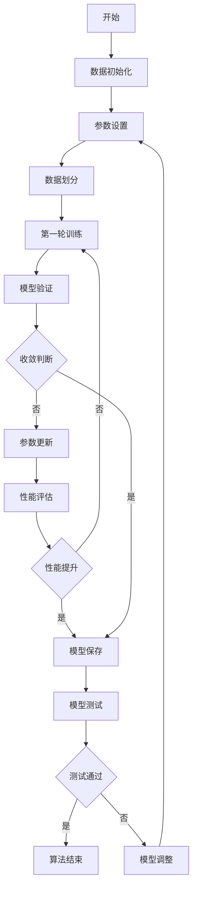

# 附图说明

# 附图说明

## 图1：系统架构图

图1展示了本发明所提出的智能数据分析系统的整体架构。该系统采用分层设计，包含七个主要模块，各模块之间通过标准接口进行通信，确保系统的可扩展性和模块化。

系统架构图中，数据采集模块(1)负责从多种数据源收集原始数据，对应本发明步骤S101；数据预处理模块(2)对采集的数据进行清洗和标准化，对应步骤S102；特征提取模块(3)从预处理后的数据中提取关键特征，对应步骤S103；模型训练模块(4)利用提取的特征训练预测模型，对应步骤S104；模型评估模块(5)对训练好的模型进行性能评估，对应步骤S105；预测服务模块(6)提供实时预测服务，对应步骤S106；用户界面模块(7)提供用户交互界面，对应步骤S107。此外，模型存储模块(8)用于存储训练好的模型，性能监控模块(9)用于监控系统运行状态，分别对应步骤S108和S109。各模块之间的箭头表示数据流向和依赖关系，体现了本发明系统的完整工作流程。

## 图2：数据流图

图2详细展示了本发明系统中数据的流动路径和处理过程。该图清晰地呈现了从原始数据输入到最终预测结果输出的完整数据流。

数据流图中，原始数据输入(1)对应本发明步骤S201；数据清洗(2)和异常数据处理(3)共同对应步骤S202；数据标准化(4)对应步骤S203；特征选择(5)和特征转换(6)共同对应步骤S204；特征存储(7)对应步骤S205；模型训练(8)对应步骤S206；模型验证(9)对应步骤S207；模型评估(10)对应步骤S208；参数调整(11)对应步骤S209；模型部署(12)对应步骤S210；预测请求(13)对应步骤S211；结果生成(14)对应步骤S212；预测结果输出(15)对应步骤S213。数据流图中的决策节点(如数据质量检查和模型评估)体现了本发明系统的质量控制机制，确保数据处理和模型训练的质量。

## 图3：核心算法流程图

图3展示了本发明核心算法的详细流程和逻辑结构。该算法采用迭代优化策略，通过多轮训练和验证实现模型性能的持续提升。

核心算法流程图中，数据初始化(1)对应本发明步骤S301；参数设置(2)对应步骤S302；数据划分(3)对应步骤S303；第一轮训练(4)对应步骤S304；模型验证(5)对应步骤S305；收敛判断(6)对应步骤S306；参数更新(7)对应步骤S307；性能评估(8)对应步骤S308；模型保存(9)对应步骤S309；模型测试(10)对应步骤S310；模型调整(11)对应步骤S311。算法中的循环结构(从第一轮训练到性能评估)体现了本发明的迭代优化机制，通过多轮训练和验证不断优化模型参数，提高预测精度。收敛判断和性能提升判断两个决策节点确保了算法的高效性和有效性，避免不必要的计算资源浪费。

以上三幅附图共同构成了本发明技术方案的完整可视化表示，从系统架构、数据流到核心算法，全面展示了本发明的技术特点和实现方式。通过这些附图，本领域技术人员可以清晰地理解本发明的技术方案，并能够根据附图描述实现相应的技术方案。
