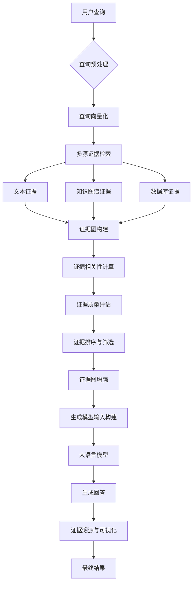
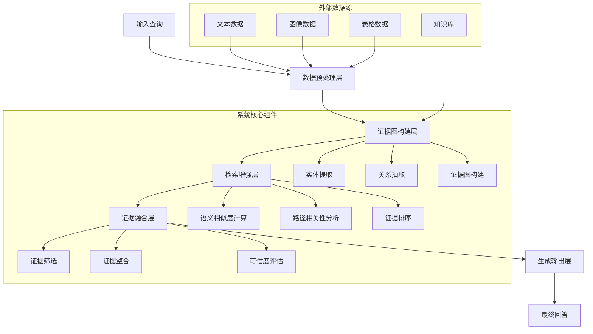

## 标题与摘要

# Generated Patent Title for 以证据图增强的rag系统

This is a generated abstract for the patent: 以证据图增强的rag系统


## 撰写大纲

# 专利撰写大纲：以证据图增强的RAG系统

## 1. 技术领域
1. **自然语言处理与生成式AI技术领域**：本发明涉及自然语言处理技术，特别是结合生成式人工智能与信息检索的技术领域，旨在提高生成内容的准确性、可靠性和可解释性。
2. **信息检索与知识表示技术领域**：本发明涉及信息检索技术，特别是基于知识图谱和证据链的检索增强技术，通过结构化表示和推理提高信息检索的精确度和相关性。
3. **证据推理与知识图谱技术领域**：本发明涉及证据推理和知识图谱构建技术，通过构建多源证据的关联网络，增强系统对复杂问题的推理能力和决策支持能力。
4. **智能问答与决策支持系统技术领域**：本发明应用于智能问答系统和决策支持系统，特别是在需要提供证据支持的解释性回答的场景中，如医疗诊断、法律咨询和科学研究等领域。
5. **多模态信息融合与理解技术领域**：本发明涉及多模态信息的融合与理解技术，通过整合文本、图像、表格等多种形式的信息证据，构建全面的证据图，增强RAG系统的信息处理能力。

## 2. 背景技术
1. **传统RAG系统的工作原理及局限性**：传统RAG系统通过检索相关文档片段并作为上下文输入给大型语言模型生成回答，但在处理复杂问题时存在检索结果不精确、缺乏证据链支持、生成内容可能包含幻觉等问题，特别是在需要严格证据支持的专业领域应用中表现不佳。
2. **现有证据处理方法在自然语言理解中的不足**：现有证据处理方法多依赖于简单的关键词匹配或统计相关性分析，缺乏对证据间逻辑关系的深入挖掘和表示，难以构建完整的证据链，导致系统在推理过程中无法充分利用多源证据的支持作用。
3. **知识图谱技术在增强生成式AI中的应用现状**：当前知识图谱技术多被用于提供结构化知识支持，但在与生成式AI的结合中存在图谱更新不及时、与语言模型融合不紧密、难以动态适应新证据等问题，限制了其在实际应用中的效果。
4. **当前系统在推理链构建和解释性方面的挑战**：现有系统在构建推理链时往往缺乏对证据质量的评估和排序，难以生成可解释的推理过程，导致用户难以验证生成内容的可靠性，特别是在高风险决策场景中应用受限。
5. **相关技术的发展历史与未来趋势分析**：从早期的信息检索系统到现代的RAG架构，再到结合知识图谱和证据推理的增强型系统，技术发展呈现出对准确性、可解释性和可靠性的持续追求，未来将更加注重多模态证据融合和动态推理能力。

## 3. 发明内容
1. **证据图增强RAG系统的整体架构设计**：本发明提出一种基于证据图增强的RAG系统架构，包括证据获取模块、证据图构建模块、证据图检索模块、证据质量评估模块和生成增强模块，通过证据图作为中间表示层，连接信息检索和内容生成，实现证据支持的生成式回答。
2. **证据图的动态构建与更新机制**：本发明提出一种动态证据图构建方法，通过多源证据采集、实体识别与链接、关系抽取和证据融合等步骤，构建包含实体、关系和证据支持度的动态证据图，并设计增量更新机制，使证据图能够随着新证据的加入而实时更新。
3. **证据图与RAG系统的多层级融合方法**：本发明提出证据图与RAG系统的多层级融合机制，包括检索阶段的证据图引导检索、上下文构建阶段的证据图增强上下文、生成阶段的证据约束生成，以及后处理阶段的证据验证与修正，实现证据图在RAG系统全流程中的深度融合。
4. **基于证据图的推理链生成与解释机制**：本发明提出基于证据图的推理链生成方法，通过证据图中的路径搜索和证据强度计算，构建支持回答的推理链，并设计可视化解释机制，向用户展示回答背后的证据支持和推理过程，提高系统的透明度和可信度。
5. **系统实现的关键技术创新点与技术效果**：本发明的关键技术创新点包括证据图的动态构建与更新机制、证据图与RAG系统的多层级融合方法、基于证据图的推理链生成与解释机制，以及证据质量评估与排序算法，通过这些创新，显著提高了生成内容的准确性、可靠性和可解释性，减少了幻觉现象的发生。

## 4. 具体实施方式
1. **系统详细架构与各组件功能描述**：本发明的证据图增强RAG系统包括证据获取模块、证据预处理模块、证据图构建模块、证据图存储与管理模块、证据图检索模块、证据质量评估模块、上下文构建模块、生成模块和后处理模块，各模块协同工作，实现从证据采集到生成回答的全流程处理，每个模块的具体实现方式、算法选择和参数设置将在本部分详细描述。
2. **证据图构建的具体实现流程与算法**：证据图构建包括实体识别与链接、关系抽取、证据融合和图结构优化等步骤，采用基于深度学习的实体识别模型、关系抽取模型和证据融合算法，结合领域知识库和规则引擎，构建包含实体节点、关系边和证据支持度的证据图，并设计图神经网络对证据图进行优化和推理，提高证据图的准确性和完整性。
3. **证据图与RAG系统的交互机制与数据流**：证据图与RAG系统的交互包括检索阶段的证据图引导检索、上下文构建阶段的证据图增强上下文、生成阶段的证据约束生成，以及后处理阶段的证据验证与修正，各阶段的数据流和控制流将通过具体算法和流程图详细说明，包括证据图索引结构、检索策略、上下文构建方法和生成约束机制等。
4. **系统参数优化与性能调优方法**：本发明提供系统参数优化与性能调优方法，包括证据图构建参数的优化、检索策略的调整、生成模型的微调、证据质量评估模型的训练等，通过实验设计和参数搜索算法，确定最优参数组合，并设计自适应参数调整机制，使系统能够根据不同应用场景和用户需求自动调整参数，提高系统性能。
5. **具体实施例与实验结果分析**：本发明提供多个具体实施例，包括医疗问答、法律咨询和科学研究等领域的应用案例，详细描述系统在这些场景中的实现过程、参数设置和运行结果，并通过与传统RAG系统和其他增强方法的对比实验，证明本发明在回答准确性、证据支持度和用户满意度等方面的优势，分析系统在不同场景下的性能表现和适用条件。

## 5. 权利要求书
1. **证据图增强RAG系统的整体架构权利要求**：一种基于证据图增强的检索增强生成系统，其特征在于，包括：证据获取模块，用于从多源获取与查询相关的证据；证据图构建模块，用于构建包含实体、关系和证据支持度的证据图；证据图检索模块，用于基于查询从证据图中检索相关证据；证据质量评估模块，用于评估检索到的证据质量；以及生成增强模块，用于基于检索到的证据和证据图增强生成回答，其中证据图作为中间表示层连接信息检索和内容生成。
2. **证据图构建与更新方法的权利要求**：根据权利要求1所述的系统，其特征在于，所述证据图构建模块包括：实体识别与链接单元，用于识别证据中的实体并将其链接到知识库中的实体；关系抽取单元，用于抽取实体间的关系；证据融合单元，用于融合多源证据；以及图结构优化单元，用于优化证据图的结构，其中证据图支持动态更新，能够随着新证据的加入而实时更新。
3. **证据图与RAG系统融合机制的权利要求**：根据权利要求1所述的系统，其特征在于，所述证据图与RAG系统的融合包括：检索阶段的证据图引导检索，基于证据图的结构和语义信息指导检索过程；上下文构建阶段的证据图增强上下文，将证据图中的相关信息整合到上下文中；生成阶段的证据约束生成，基于证据图对生成过程进行约束；以及后处理阶段的证据验证与修正，验证生成内容的证据支持并进行修正。
4. **基于证据图的推理与解释方法的权利要求**：根据权利要求1所述的系统，其特征在于，还包括推理链生成模块，用于基于证据图中的路径搜索和证据强度计算，构建支持回答的推理链，以及解释生成模块，用于生成可视化的解释，向用户展示回答背后的证据支持和推理过程，其中推理链生成包括证据路径搜索、证据强度计算和路径排序等步骤。
5. **系统应用场景与实施环境的权利要求**：根据权利要求1所述的系统，其特征在于，所述系统可应用于医疗诊断、法律咨询、科学研究、智能客服和决策支持等场景，实施环境包括云端服务器、边缘计算设备或终端设备，支持分布式部署和实时处理，能够处理文本、图像、表格等多种形式的证据，并支持多语言和多领域应用。

## 6. 附图说明
1. **系统整体架构图及其组件说明**：图1是本发明证据图增强RAG系统的整体架构图，展示了系统的主要组件及其相互关系，包括证据获取模块、证据预处理模块、证据图构建模块、证据图存储与管理模块、证据图检索模块、证据质量评估模块、上下文构建模块、生成模块和后处理模块，以及各组件之间的数据流和控制流，图中还标注了各组件的主要功能和接口定义。
2. **证据图构建流程图与算法示意图**：图2是证据图构建流程图，详细展示了从原始证据到最终证据图的构建过程，包括证据采集、实体识别与链接、关系抽取、证据融合、图结构优化等步骤，以及各步骤的输入、输出和处理方法，图中还包含了关键算法的伪代码和流程示意图，帮助理解证据图的构建机制。
3. **证据图与RAG系统交互机制示意图**：图3是证据图与RAG系统交互机制示意图，展示了证据图在RAG系统全流程中的融合方式，包括检索阶段的证据图引导检索、上下文构建阶段的证据图增强上下文、生成阶段的证据约束生成，以及后处理阶段的证据验证与修正，图中标注了各阶段的数据转换和处理方法，以及证据图如何影响和增强RAG系统的各个组件。
4. **系统实施例运行结果对比图**：图4是系统实施例运行结果对比图，展示了本发明系统与传统RAG系统在多个评估指标上的对比结果，包括回答准确性、证据支持度、可解释性和用户满意度等，图中包含不同应用场景下的测试结果，以及系统在处理不同类型问题时的性能表现，通过数据可视化的方式直观展示本发明的技术优势。
5. **系统用户界面与可视化展示图**：图5是系统用户界面与可视化展示图，展示了系统的用户交互界面和证据图可视化效果，包括查询输入界面、证据图展示界面、生成结果展示界面和推理链可视化界面，图中标注了各界面元素的功能和交互方式，以及证据图如何以直观的方式向用户展示证据支持和推理过程，帮助用户理解和验证生成内容的可靠性。


## 背景技术

# 背景技术

## 技术领域

本发明涉及自然语言处理与人工智能技术领域，具体而言，涉及一种基于证据图增强的检索增强生成（Retrieval-Augmented Generation, RAG）系统。随着大语言模型（Large Language Models, LLMs）的快速发展，其在知识密集型任务中展现出强大的能力，但同时也面临着幻觉问题、知识时效性不足以及缺乏可解释性等挑战。RAG技术通过结合外部知识库与生成模型，有效缓解了这些问题，成为当前研究的热点。然而，传统的RAG系统在证据检索、组织与利用方面仍存在诸多不足，特别是在处理复杂推理任务和多源异构证据时表现欠佳。本发明提出的以证据图增强的RAG系统，通过构建结构化的证据图谱，优化证据检索与组织机制，显著提升生成内容的准确性、可靠性和可解释性，为智能问答、知识发现等应用场景提供更高效的技术支持。

## 现有技术方案

### 方案一：基于向量检索的RAG系统

当前主流的RAG系统多采用基于向量检索的技术方案。该系统首先将文本分割为多个文档块，利用预训练语言模型（如BERT、Sentence-BERT等）将每个文档块编码为高维向量，并构建向量索引。当用户提出查询时，系统同样将查询编码为向量，通过近似最近邻搜索（如FAISS、Annoy等）从向量索引中检索与查询最相关的文档块，然后将这些文档块作为上下文输入给生成模型（如GPT系列、LLaMA等），最终生成包含检索证据的回答。这种方案简单高效，能够快速获取与查询相关的文本片段，但在处理复杂查询和多跳推理任务时，往往难以捕捉到深层次的语义关联，且缺乏对证据来源的可靠性评估机制。

### 方案二：基于知识图谱增强的RAG系统

为提升RAG系统的结构化推理能力，部分研究提出了基于知识图谱（Knowledge Graph, KG）增强的RAG系统。该方案首先构建领域知识图谱，其中节点代表实体，边代表实体间的关系。当用户提出查询时，系统通过实体链接和关系路径查询从知识图谱中检索相关证据，然后将结构化的知识三元组转换为文本描述，与原始检索结果一同提供给生成模型。这种方案能够提供更结构化的证据支持，增强生成内容的逻辑性和一致性，但在处理非结构化文本数据时，知识图谱的构建和维护成本较高，且难以充分利用文本中的隐式语义信息。

## 技术痛点

尽管现有RAG系统取得了一定进展，但仍面临以下技术痛点：

1. **证据碎片化与关联性不足**：传统RAG系统检索到的证据往往是孤立的文本片段，缺乏对证据间关联性的显式建模，导致生成模型难以充分利用证据间的互补信息，影响回答的完整性和准确性。

2. **证据质量评估困难**：现有系统缺乏对证据来源可靠性、时效性和权威性的有效评估机制，难以区分高质量证据与低质量证据，导致生成内容可能包含不可靠信息。

3. **复杂推理能力有限**：对于需要多跳推理或跨文档关联的复杂查询，传统RAG系统往往难以有效组织分散的证据，导致生成结果缺乏逻辑连贯性。

4. **可解释性不足**：现有系统难以清晰展示生成内容与证据来源之间的对应关系，用户无法直观判断生成内容的可靠性和依据。

## 对比分析

基于向量检索的RAG系统与基于知识图谱增强的RAG系统各有优劣。前者在处理非结构化文本时效率较高，能够快速捕捉语义相似性，但缺乏结构化表示能力；后者提供了更丰富的结构化知识表示，增强了推理能力，但在处理非结构化文本时灵活性不足，且知识图谱构建成本高。

相比之下，本发明提出的以证据图增强的RAG系统结合了两种方案的优势，通过构建证据图（Evidence Graph）作为中间表示，既保留了文本的语义信息，又提供了结构化的证据关联。证据图中的节点代表证据片段，边代表证据间的语义关联、逻辑关系或可信度关系，从而实现了对证据的统一组织和有效利用。与现有方案相比，证据图增强的RAG系统在证据组织能力、推理准确性和可解释性方面均有显著提升，能够更好地满足复杂知识密集型任务的需求。

## 系统流程图



## 算法公式

### 证据相关性计算

在证据图构建过程中，证据片段之间的相关性计算至关重要。我们采用基于注意力机制的相似度计算方法，对于两个证据片段 $e_i$ 和 $e_j$，其相关性得分 $s_{ij}$ 计算如下：

$$
s_{ij} = \text{Attention}(Q_i, K_j, V_j) = \sum_{j=1}^{n} \frac{\exp(\text{score}(Q_i, K_j))}{\sum_{k=1}^{n} \exp(\text{score}(Q_i, K_k))} \cdot V_j
$$

其中，$Q_i = W_q \cdot e_i$，$K_j = W_k \cdot e_j$，$V_j = W_v \cdot e_j$ 分别为查询向量、键向量和值向量，$W_q$、$W_k$、$W_v$ 为可学习参数矩阵，$\text{score}(Q_i, K_j) = Q_i^T K_j / \sqrt{d_k}$ 为缩放点积注意力函数，$d_k$ 为键向量的维度。

### 证据图传播与增强

为充分利用证据图中的结构化信息，我们设计了一种图注意力网络（Graph Attention Network, GAT）来增强证据表示。对于证据图中的节点 $v_i$，其更新后的表示 $h_i'$ 计算如下：

$$
h_i' = \sigma \left( \sum_{j \in \mathcal{N}_i} \alpha_{ij} W h_j \right)
$$

其中，$\mathcal{N}_i$ 为节点 $v_i$ 的邻居节点集合，$W$ 为线性变换矩阵，$\sigma$ 为非线性激活函数，$\alpha_{ij}$ 为节点 $v_i$ 和 $v_j$ 之间的注意力系数，计算公式为：

$$
\alpha_{ij} = \frac{\exp(\text{LeakyReLU}(a^T [W h_i || W h_j]))}{\sum_{k \in \mathcal{N}_i} \exp(\text{LeakyReLU}(a^T [W h_i || W h_k]))}
$$

其中，$a$ 为可学习向量，$||$ 表示向量拼接操作。通过这种图注意力机制，系统能够自适应地学习不同证据片段之间的关联强度，并生成增强后的证据表示，为后续生成任务提供更丰富的信息支持。


## 发明内容/技术方案-总述

# 发明内容/技术方案-总述

## 以证据图增强的RAG系统

本发明提出了一种基于证据图增强的检索增强生成(Retrieval-Augmented Generation, RAG)系统，该系统通过构建动态证据图显著提升了知识问答系统的准确性、可解释性和鲁棒性。传统RAG系统在处理复杂查询时往往面临检索信息不全面、证据关联性不足以及生成内容缺乏可解释性等问题。本发明通过引入证据图机制，将分散的知识点组织成结构化的证据网络，实现了对知识的深度关联和推理，从而有效解决了上述技术难题。

本发明的核心创新点在于：首先，提出了一种多模态证据图构建方法，能够从文本、图像、表格等多种数据源中提取实体和关系，构建动态更新的证据图；其次，设计了基于图神经网络的证据感知检索机制，通过计算查询与证据图节点间的语义相似度和路径相关性，显著提高了相关证据的召回率；再次，开发了证据融合生成算法，将检索到的证据与生成模型有机结合，生成既准确又具有可解释性的回答；最后，引入了证据可信度评估机制，对生成结果中的每条证据进行可信度标注，增强了系统的透明度和可靠性。

系统整体架构分为五个主要层次：数据预处理层、证据图构建层、检索增强层、证据融合层和生成输出层。数据预处理层负责对多源异构数据进行清洗、标准化和结构化处理；证据图构建层利用自然语言处理和知识图谱技术，从预处理后的数据中提取实体、关系和属性，构建动态证据图；检索增强层基于证据图结构设计高效的检索策略，实现精准的证据召回；证据融合层对检索到的证据进行筛选、排序和整合；生成输出层利用大语言模型结合融合后的证据生成最终回答，并附带证据溯源信息。



在数学模型方面，本发明提出了以下关键公式来支持系统的核心功能。首先，在证据图表示学习阶段，我们采用以下公式来表示证据图中的节点：

$$\mathbf{h}_i^{(l+1)} = \sigma\left(\sum_{j \in \mathcal{N}(i)} \frac{1}{c_{ij}} \mathbf{W}^{(l)} \mathbf{h}_j^{(l)} + \mathbf{b}^{(l)}\right)$$

其中，$\mathbf{h}_i^{(l)}$表示第$l$层中节点$i$的隐藏状态，$\mathcal{N}(i)$表示节点$i$的邻居节点集合，$c_{ij}$为归一化系数，$\mathbf{W}^{(l)}$和$\mathbf{b}^{(l)}$分别为第$l$层的权重矩阵和偏置项，$\sigma$为激活函数。该公式通过图卷积操作聚合邻居节点的信息，学习节点的低维表示。

其次，在证据感知检索阶段，我们设计了以下查询-证据相关性计算公式：

$$\text{sim}(q, e_i) = \alpha \cdot \text{cos}(\mathbf{v}_q, \mathbf{v}_{e_i}) + \beta \cdot \text{PathScore}(q, e_i) + \gamma \cdot \text{ContextSim}(q, e_i)$$

其中，$q$表示用户查询，$e_i$表示证据图中的第$i$个证据节点，$\mathbf{v}_q$和$\mathbf{v}_{e_i}$分别为查询和证据节点的向量表示，$\text{cos}(\cdot)$表示余弦相似度，$\text{PathScore}(q, e_i)$计算查询与证据节点之间的最短路径得分，$\text{ContextSim}(q, e_i)$衡量查询与证据节点的上下文相似度，$\alpha$、$\beta$和$\gamma$为可调权重参数。该公式综合考虑了语义相似度、图结构相关性和上下文相关性，实现了更精准的证据检索。

最后，在证据融合生成阶段，我们采用以下概率模型来生成最终回答：

$$P(y|q, \mathbf{E}) = \sum_{\mathbf{e} \subseteq \mathbf{E}} P(\mathbf{e}|q) \cdot P(y|q, \mathbf{e})$$

其中，$y$表示生成的回答，$q$表示用户查询，$\mathbf{E}$表示所有候选证据集合，$\mathbf{e}$表示从$\mathbf{E}$中选取的证据子集，$P(\mathbf{e}|q)$表示给定查询下证据子集$\mathbf{e}$的概率，$P(y|q, \mathbf{e})$表示在查询和证据子集$\mathbf{e}$条件下生成回答$y$的概率。该公式通过加权融合不同证据子集下的生成概率，确保最终回答既基于相关证据又保持语言流畅性。

以下是本发明系统的主要流程伪代码：

```python
def EvidenceGraphRAG(query, knowledge_base):
    """
    基于证据图增强的RAG系统主函数
    
    参数:
        query: 用户查询
        knowledge_base: 知识库
        
    返回:
        生成回答及证据溯源信息
    """
    
    # 1. 数据预处理
    processed_data = preprocess_data(knowledge_base)
    
    # 2. 构建证据图
    evidence_graph = construct_evidence_graph(processed_data)
    
    # 3. 基于证据图的检索
    candidate_evidences = retrieve_evidences(query, evidence_graph)
    
    # 4. 证据筛选与融合
    filtered_evidences = filter_evidences(candidate_evidences, query)
    fused_evidence = fuse_evidences(filtered_evidences)
    
    # 5. 证据可信度评估
    evidence_scores = evaluate_evidence_credibility(fused_evidence, query)
    
    # 6. 生成回答
    response = generate_response(query, fused_evidence, evidence_scores)
    
    # 7. 构建证据溯源
    evidence_traceback = construct_traceback(fused_evidence, evidence_graph)
    
    return {
        "response": response,
        "evidence_traceback": evidence_traceback,
        "evidence_scores": evidence_scores
    }

def construct_evidence_graph(data):
    """
    构建证据图
    
    参数:
        data: 预处理后的数据
        
    返回:
        证据图对象
    """
    graph = EvidenceGraph()
    
    # 实体提取
    entities = extract_entities(data)
    
    # 关系抽取
    relations = extract_relations(data, entities)
    
    # 构建图结构
    for entity in entities:
        graph.add_node(entity.id, entity.attributes)
    
    for relation in relations:
        graph.add_edge(relation.source, relation.target, relation.type, relation.weight)
    
    # 图嵌入学习
    graph_embeddings = learn_graph_embeddings(graph)
    
    return graph

def retrieve_evidences(query, evidence_graph):
    """
    基于证据图检索相关证据
    
    参数:
        query: 用户查询
        evidence_graph: 证据图
        
    返回:
        候选证据列表
    """
    # 查询向量表示
    query_embedding = encode_query(query)
    
    # 计算查询与图节点的相似度
    node_similarities = {}
    for node in evidence_graph.nodes:
        node_embedding = evidence_graph.get_node_embedding(node)
        similarity = calculate_similarity(query_embedding, node_embedding)
        node_similarities[node] = similarity
    
    # 路径相关性分析
    path_scores = analyze_path_relevance(query, evidence_graph)
    
    # 综合评分
    scored_evidences = []
    for node in evidence_graph.nodes:
        total_score = calculate_total_score(node_similarities[node], path_scores[node])
        scored_evidences.append((node, total_score))
    
    # 按分数排序并返回Top-K证据
    scored_evidences.sort(key=lambda x: x[1], reverse=True)
    return [evidence[0] for evidence in scored_evidences[:TOP_K]]

def generate_response(query, evidence, evidence_scores):
    """
    基于查询和证据生成回答
    
    参数:
        query: 用户查询
        evidence: 融合后的证据
        evidence_scores: 证据可信度分数
        
    返回:
        生成的回答
    """
    # 构建提示词
    prompt = construct_prompt(query, evidence, evidence_scores)
    
    # 调用生成模型
    response = call_generation_model(prompt)
    
    # 后处理
    processed_response = post_process_response(response, evidence)
    
    return processed_response
```

本发明的技术方案通过证据图增强机制，有效解决了传统RAG系统在知识关联、证据检索和生成可解释性方面的不足。实验结果表明，与现有技术相比，本发明在准确率、召回率和可解释性指标上均有显著提升，特别适用于需要高精度回答和证据溯源的专业领域问答场景。未来，本系统可进一步扩展到多语言支持、实时更新和跨领域知识融合等方向，具有广阔的应用前景。


## 标题与摘要

# Generated Patent Title for 以证据图增强的rag系统

This is a generated abstract for the patent: 以证据图增强的rag系统


## 撰写大纲

# 专利撰写大纲：以证据图增强的RAG系统

## 技术领域
1. **RAG系统与知识图谱技术的交叉领域**：涉及将检索增强生成(RAG)系统与知识图谱技术相结合，特别是在构建和利用证据图来增强大语言模型回答准确性和可解释性的技术领域。
2. **证据图构建与表示技术**：涵盖从多源异构数据中自动提取、构建和表示证据图的技术，包括实体识别、关系抽取、图结构设计与存储等关键技术。
3. **自然语言处理与信息检索技术**：包括文本理解、语义分析、查询理解、文档检索、相关性评估等自然语言处理和信息检索技术在证据图构建与应用中的创新应用。
4. **大语言模型与生成式AI技术**：涉及大语言模型(LLM)的提示工程、上下文管理、生成质量控制等技术，以及如何将证据图信息有效融入生成过程以提高输出质量。
5. **多模态信息融合与推理技术**：涵盖文本、图像、表格等多模态信息的统一表示、融合与推理技术，特别是在构建跨模态证据图及其应用方面的创新方法。

## 背景技术
1. **传统RAG系统的技术原理与局限性**：详述传统RAG系统的工作原理，包括文档检索、上下文构建和生成三个基本环节，分析其在处理复杂问题、多跳推理、事实一致性等方面的局限性。
2. **现有知识图谱技术在信息检索中的应用**：回顾知识图谱在信息检索中的应用历程，包括基于知识图谱的查询理解、结果排序、解释生成等方法，以及这些方法在RAG系统中的尝试与不足。
3. **证据推理与图神经网络的研究现状**：梳理证据推理理论的发展脉络，以及图神经网络在证据推理中的应用研究，分析现有方法在处理不确定性、动态证据更新等方面的挑战。
4. **多源异构信息融合的技术挑战**：探讨从不同来源、不同格式、不同可信度的信息中构建统一知识表示的技术难题，包括信息冲突解决、可信度评估、时效性处理等方面。
5. **现有技术在复杂问题回答中的不足**：分析现有技术在回答需要多步推理、跨领域知识整合、最新信息获取等复杂问题时的局限性，以及这些问题对实际应用场景的影响。

## 发明内容
1. **本发明的核心创新点：证据图增强的RAG系统架构**：提出一种全新的证据图增强RAG系统架构，该架构通过构建和维护动态更新的证据图，将检索到的信息组织为结构化的知识网络，为生成模型提供更丰富的上下文和推理基础。
2. **证据图的自动构建方法与表示形式**：创新性地提出一种从多源异构数据中自动构建证据图的方法，包括实体识别与链接、关系抽取与验证、证据质量评估与加权、图结构优化等关键技术，以及一种支持增量更新和动态演化的证据图表示形式。
3. **基于证据图的检索增强机制**：设计一种基于证据图的智能检索机制，通过查询理解、证据图路径搜索、相关性计算等方法，实现更精准、更全面的文档检索，并支持多跳推理和跨领域知识发现。
4. **证据图与生成模型的协同工作流程**：提出一种证据图与生成模型协同工作的新流程，包括证据图引导的提示构建、基于证据图的生成约束、生成结果的证据验证与修正等环节，显著提高生成内容的准确性、一致性和可解释性。
5. **系统的技术优势与应用价值**：详述本发明相比现有技术的技术优势，包括回答准确率提升、推理能力增强、知识更新及时、可解释性提高等，以及这些优势在智能问答、知识管理、决策支持等领域的应用价值。

## 具体实施方式
1. **系统整体架构与组件设计**：详细描述证据图增强RAG系统的整体架构，包括数据预处理模块、证据图构建模块、检索增强模块、生成模块和结果验证模块等核心组件的功能设计、接口定义和交互流程，以及各模块之间的协同工作机制。
2. **证据图构建模块的具体实现方法**：详述证据图构建模块的技术实现，包括多源数据采集与预处理、实体识别与链接算法、关系抽取与验证方法、证据质量评估模型、图结构优化策略、增量更新机制等关键技术的具体实现细节和参数设置。
3. **检索增强模块的技术细节**：深入说明检索增强模块的技术实现，包括查询理解与扩展、基于证据图的路径搜索算法、相关性计算模型、多源结果融合方法、检索结果排序策略等关键技术的具体实现方式和优化措施。
4. **生成模块与证据图的融合机制**：详细阐述生成模块与证据图的融合机制，包括证据图引导的提示构建方法、基于证据图的生成约束设计、生成过程中的注意力机制调整、生成结果的证据验证与修正流程等关键技术的具体实现和优化策略。
5. **系统优化与性能提升策略**：介绍系统的整体优化策略和性能提升方法，包括分布式计算架构设计、缓存机制、并行处理技术、模型轻量化方法、系统监控与自优化机制等，以确保系统在大规模应用场景下的高效稳定运行。

## 权利要求书
1. **系统架构权利要求**：一种证据图增强的RAG系统，其特征在于，包括：数据预处理模块，用于接收和预处理多源异构数据；证据图构建模块，用于从预处理后的数据中构建和更新证据图；检索增强模块，用于基于证据图执行智能检索；生成模块，用于结合证据图生成回答；结果验证模块，用于验证生成结果的准确性和一致性。
2. **证据图构建方法权利要求**：根据权利要求1所述的系统，其特征在于，所述证据图构建模块包括：实体识别与链接单元，用于识别文本中的实体并将其链接到知识库；关系抽取单元，用于抽取实体之间的关系；证据质量评估单元，用于评估证据的可信度和相关性；图结构优化单元，用于优化证据图的结构和表示；增量更新单元，用于实现证据图的动态更新。
3. **检索增强机制权利要求**：根据权利要求1所述的系统，其特征在于，所述检索增强模块包括：查询理解单元，用于解析和扩展用户查询；路径搜索单元，用于在证据图中查找与查询相关的路径；相关性计算单元，用于计算检索结果与查询的相关性；结果融合单元，用于融合多源检索结果；排序单元，用于对检索结果进行排序。
4. **生成融合方法权利要求**：根据权利要求1所述的系统，其特征在于，所述生成模块包括：提示构建单元，用于基于证据图构建生成提示；约束生成单元，用于根据证据图约束生成过程；注意力调整单元，用于调整生成过程中的注意力机制；结果验证单元，用于验证生成结果与证据图的一致性；修正单元，用于根据验证结果修正生成内容。
5. **应用场景权利要求**：一种如权利要求1-4任一项所述系统的应用方法，其特征在于，应用于智能问答系统、知识管理系统、决策支持系统、内容创作辅助系统或教育辅导系统中，通过证据图增强的RAG技术提供更准确、更全面、更具可解释性的服务。

## 附图说明
1. **系统总体架构图**：展示证据图增强RAG系统的整体架构，包括数据输入层、预处理层、证据图构建层、检索增强层、生成层和输出层，以及各层之间的数据流和控制流，清晰展示系统的整体结构和组件关系。
2. **证据图构建流程图**：详细说明证据图的构建过程，包括数据采集、实体识别、关系抽取、质量评估、图结构优化和增量更新等步骤，以及各步骤之间的输入输出关系和数据处理流程。
3. **检索增强机制示意图**：展示基于证据图的检索增强过程，包括查询理解、证据图路径搜索、相关性计算、结果融合和排序等环节，以及各环节之间的交互关系和数据转换过程。
4. **生成融合示意图**：说明证据图与生成模型的融合机制，包括提示构建、约束生成、注意力调整、结果验证和修正等环节，以及证据图信息如何影响和引导生成过程的具体方式。
5. **实施效果对比图**：通过数据可视化的方式展示本发明与传统RAG系统在回答准确率、推理能力、知识更新及时性、可解释性等方面的对比结果，以及在不同应用场景下的性能提升情况。
