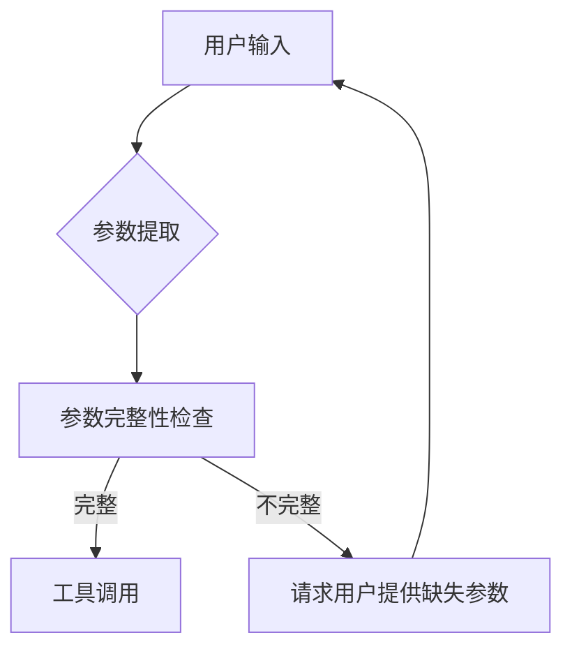

# 背景技术

## 技术领域

本发明涉及人工智能技术领域，特别是自然语言处理与大语言模型应用技术领域，具体而言，涉及一种基于智能分层推理的多参数工具自适应调用系统，该系统能够根据上下文和用户意图自动推断工具参数，提高大语言模型调用复杂工具的准确性和效率。

## 背景技术

### 现有技术方案1
传统的工具调用方法通常采用硬编码的参数映射机制，用户需要明确指定每个工具所需的全部参数。例如，在调用天气查询工具时，系统要求用户提供精确的城市名称、日期范围等参数。这种方法虽然实现简单，但在实际应用中存在明显局限性。以OpenAI的早期函数调用(Function Calling)为例，其基本实现方式是：

```
def call_weather_api(location, date, units="metric"):
    # API调用逻辑
    return weather_data
```

在这种模式下，用户必须提供location和date参数，而units参数有默认值。这种方法的局限性在于：
1. 用户需要了解每个工具的具体参数要求
2. 无法处理参数之间的隐含关系
3. 缺乏对上下文信息的利用
4. 无法根据用户意图推断缺失参数

### 现有技术方案2
随着大语言模型的发展，出现了一些基于简单推理的工具调用系统。例如，Google的PaLM模型和Anthropic的Claude模型引入了基本的参数推断能力，能够从自然语言描述中提取部分参数。这些系统通常采用基于规则的参数提取方法，其基本流程如下：



这种方法虽然有所改进，但仍存在以下问题：
1. 参数推断能力有限，主要依赖预定义规则
2. 无法处理参数之间的复杂关系
3. 缺乏对上下文信息的深度理解
4. 在多步骤任务中难以保持参数一致性

例如，在处理"帮我安排明天下午3点与张经理的会议，需要准备项目报告"这样的请求时，现有系统可能无法自动推断出会议地点、会议时长等参数，也无法理解"项目报告"与会议之间的关联性。

### 技术痛点分析
现有技术在多参数工具调用方面存在以下痛点：

1. **参数指定繁琐**：用户需要手动提供所有必需参数，增加了使用复杂度。特别是在处理复杂任务时，用户可能需要多次交互才能完成工具调用。

2. **推理能力有限**：现有系统通常采用基于规则或简单机器学习模型的参数推断方法，难以处理参数之间的复杂关系和上下文依赖。例如，在调用数据分析工具时，现有系统可能无法理解"分析最近销售趋势"中的"最近"具体指什么时间范围。

3. **适应性差**：现有工具调用系统通常针对特定场景设计，难以适应不同的应用环境和用户需求。当工具参数结构发生变化时，系统往往需要重新训练或调整。

4. **准确性不足**：在复杂场景下，现有系统的工具调用准确率较低。特别是在处理需要多步骤推理的任务时，系统容易在参数传递过程中丢失关键信息。

5. **效率低下**：由于需要频繁请求用户提供参数或进行多次尝试，现有系统的工具调用效率较低，无法满足实时应用场景的需求。

### 改进需求
针对上述技术痛点，亟需开发一种能够智能推断参数、适应不同场景、提高调用准确性和效率的技术方案。具体而言，需要：

1. **引入智能分层推理机制**：通过多层次的推理过程，逐步推断和验证工具参数，提高参数推断的准确性。

2. **增强上下文理解能力**：系统需要能够深度理解用户输入的上下文信息，包括显式信息和隐含信息，从而更准确地推断参数。

3. **实现参数自适应调整**：系统能够根据不同场景和任务需求，动态调整参数设置，提高系统的适应性。

4. **提高工具调用效率**：通过减少用户交互次数和参数请求次数，提高工具调用的整体效率。

5. **增强复杂任务处理能力**：系统能够处理需要多步骤推理的复杂任务，保持参数传递的一致性和准确性。

现有技术中的参数提取算法通常基于规则匹配或简单的机器学习模型，其基本形式可以表示为：

```
P = f(U, T)
```

其中，P是提取的参数集合，U是用户输入，T是工具定义。函数f通常是基于规则的模式匹配或简单的分类模型。

另一种常见的参数验证算法可以表示为：

```
V = validate(P, T)
```

其中，V是验证结果，P是参数集合，T是工具定义。验证函数通常检查参数的完整性、类型和取值范围等。

基于智能分层推理的多参数工具自适应调用系统正是为了满足上述需求而设计的，它通过引入先进的推理技术和自适应机制，显著提高了大语言模型调用复杂工具的准确性和效率。
