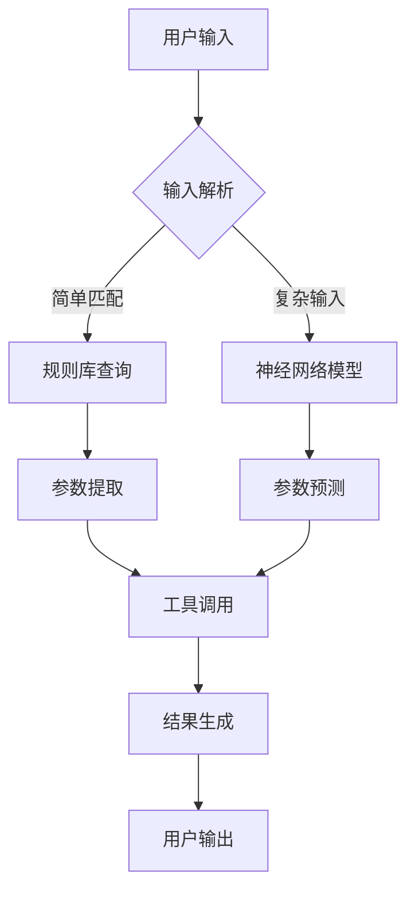

# 背景技术

## 技术领域

本发明属于人工智能技术领域，具体涉及自然语言处理、机器学习推理系统与工具调用技术的交叉领域。更具体地说，本发明涉及一种基于智能分层推理的多参数工具自适应调用系统，该系统能够根据上下文和用户意图自动推断工具参数，提高大语言模型调用复杂工具的准确性和效率。

## 背景技术

### 现有技术方案1

传统的工具调用系统通常采用基于规则或模板匹配的方法实现参数提取。这类系统预先定义好用户输入与工具参数之间的映射规则，当用户输入与预定义规则匹配时，系统提取相应参数并调用对应工具。例如，在早期的智能客服系统中，用户需要按照特定格式输入查询，系统通过关键词匹配和正则表达式提取参数，然后调用相应的API或工具函数。这种方法的局限性在于灵活性差，无法处理复杂多变的用户表达方式，且需要人工维护大量规则，维护成本高，扩展性差。当工具参数数量增加或用户表达方式变化时，系统性能会显著下降。

### 现有技术方案2

随着深度学习技术的发展，一些先进的工具调用系统开始采用基于神经网络的参数预测方法。这些系统通常使用序列到序列(Seq2Seq)模型或Transformer架构，将用户输入转换为工具调用所需的参数表示。例如，Google的PaLM模型和OpenAI的GPT系列模型都具备一定的工具调用能力，能够根据用户输入生成函数调用代码。这类系统通过大规模预训练和微调，能够处理更复杂的用户表达，并在一定程度上理解上下文。然而，这些系统在处理多参数、多步骤的复杂工具调用任务时，仍然存在参数准确性不足、上下文理解有限、参数间关联性考虑不足等问题。特别是在需要精确数值参数或复杂对象参数的场景下，现有系统的表现往往不尽如人意。

### 技术痛点分析

当前工具调用系统面临的主要技术痛点包括：

1. **参数推断准确性不足**：现有系统难以准确理解用户意图，特别是在用户表达模糊或上下文复杂的情况下，容易导致参数推断错误。这主要是因为现有系统缺乏深层次的语义理解和推理能力。

2. **多参数协同处理能力弱**：复杂工具通常需要多个参数协同工作，现有系统往往独立处理每个参数，忽略了参数间的关联性和约束关系，导致生成的参数组合可能不符合实际需求。

3. **上下文理解有限**：工具调用往往需要考虑对话历史和当前上下文，现有系统在长对话和多轮交互中的上下文保持能力有限，难以有效利用历史信息指导当前参数推断。

4. **工具调用效率低下**：对于需要多次推理或迭代的复杂任务，现有系统缺乏有效的推理路径规划，导致调用效率低下，响应时间长。

5. **适应性差**：面对不同领域、不同类型的工具，现有系统往往需要针对特定场景进行大量定制化训练，通用性和适应性不足。

### 改进需求

针对上述技术痛点，亟需开发一种能够实现智能分层推理的多参数工具自适应调用系统，该系统应具备以下特点：

1. **增强的上下文理解能力**：系统需要能够深度理解对话上下文，捕捉用户真实意图，即使在表达模糊的情况下也能准确推断参数。

2. **多参数协同推理机制**：系统应建立参数间的关联模型，实现多参数的协同推理，确保参数组合的合理性和一致性。

3. **分层推理架构**：系统应采用分层推理策略，将复杂任务分解为多个子任务，逐步推理和优化工具调用参数。

4. **自适应学习能力**：系统应具备领域自适应能力，能够快速适应不同类型的工具调用场景，减少对大量标注数据的依赖。

5. **高效推理路径规划**：系统应能够规划最优的推理路径，减少不必要的工具调用，提高整体效率。

对于基于神经网络的工具调用参数预测，常用的算法可以表示为：

给定用户输入序列 $X = \{x_1, x_2, ..., x_n\}$，工具参数集合 $P = \{p_1, p_2, ..., p_m\}$，参数预测模型可以表示为：

$$P = f(X; \theta) = \text{Transformer}(\text{Embedding}(X); \theta)$$

其中，$\theta$ 表示模型参数，Embedding() 表示输入嵌入函数，Transformer() 表示基于注意力机制的转换器模型。

对于多参数协同推理，现有技术通常采用条件独立假设，即每个参数的预测条件仅依赖于用户输入，而与其他参数无关：

$$p(p_i | X, \{p_j\}_{j \neq i}) \approx p(p_i | X)$$

这种假设忽略了参数间的依赖关系，导致参数组合可能不符合实际约束，也是现有技术需要改进的关键点之一。
