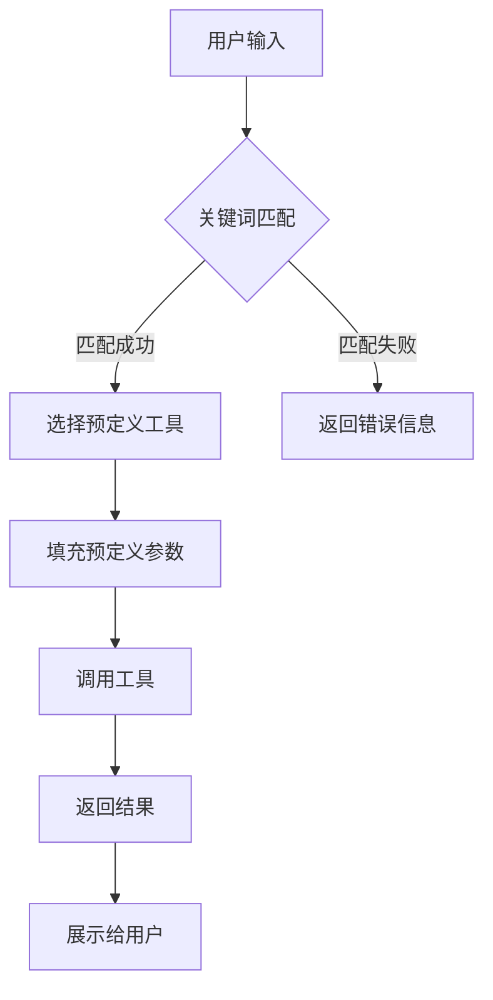

# 背景技术

## 技术领域

本发明涉及人工智能技术领域，特别是自然语言处理和大语言模型应用技术领域，具体涉及一种基于智能分层推理的多参数工具自适应调用系统，用于提高大语言模型调用复杂工具的准确性和效率。

## 背景技术

### 现有技术方案1
传统的工具调用方法主要依赖于预定义的模板和固定的参数配置。在这种方法中，开发者需要为每个工具创建详细的调用模板，包括参数名称、类型、格式等。当大语言模型需要调用工具时，它会严格按照预定义的模板生成调用请求，无法根据上下文动态调整参数。这种方法的主要局限性在于灵活性差，无法适应复杂多变的用户需求，且需要大量的人工干预来维护和更新模板库。例如，在处理用户查询"查找北京明天天气"时，系统需要预定义天气查询工具的完整模板，包括城市名称、日期等参数，无法根据用户的自然语言表达灵活调整。

### 现有技术方案2
基于规则的工具调用方法通过建立一系列规则和条件判断来实现工具调用。这种方法通常使用关键词匹配、正则表达式或简单的条件逻辑来确定需要调用的工具及其参数。例如，系统可以设置规则：当检测到"天气"、"查询"等关键词时，调用天气查询工具；当检测到"计算"、"数学"等关键词时，调用计算工具。这种方法虽然比模板方法更灵活一些，但仍然存在明显的局限性：首先，规则库难以覆盖所有可能的用户表达方式；其次，规则之间的冲突和优先级难以管理；最后，对于需要多参数组合的复杂工具调用，规则方法往往难以准确推断所有参数。例如，在处理"计算从北京到上海的距离，并比较乘坐高铁和飞机的时间"这样的复合查询时，基于规则的方法可能无法准确识别需要调用的多个工具及其参数。

### 技术痛点分析
现有技术方案存在以下主要痛点：

1. **参数配置复杂**：传统工具调用方法需要为每个工具预定义完整的参数配置，包括参数名称、类型、约束条件等。这不仅增加了开发工作量，也限制了系统的灵活性。

2. **上下文理解不足**：现有方法往往缺乏对上下文的深入理解，无法根据对话历史和用户意图动态调整工具调用策略。例如，在连续对话中，用户可能省略某些参数，期望系统能够从上下文中推断。

3. **工具选择效率低下**：当系统拥有大量可用工具时，现有方法难以高效地选择最合适的工具。通常需要遍历所有工具或依赖简单的关键词匹配，导致效率低下。

4. **参数推断能力弱**：对于需要多参数组合的复杂工具调用，现有方法往往难以准确推断所有参数。特别是当参数之间存在复杂关系或依赖时，现有方法更是无能为力。

5. **适应性差**：现有方法难以适应不同用户的不同表达方式和需求变化。一旦用户表达方式超出预定义的范围，系统就无法正确处理。

### 改进需求
针对上述技术痛点，亟需一种能够智能推断工具参数、自适应选择工具、并能够根据上下文动态调整调用策略的技术方案。具体需求包括：

1. **智能参数推断**：系统能够根据用户输入和上下文智能推断工具参数，减少预定义配置的需求。

2. **分层推理机制**：通过分层推理，系统可以逐步细化工具选择和参数推断过程，提高准确性和效率。

3. **上下文感知能力**：系统需要具备强大的上下文理解能力，能够从对话历史中提取有用信息，辅助工具调用决策。

4. **工具自适应选择**：系统能够根据用户需求和上下文自动选择最合适的工具，而不是依赖固定的规则或模板。

5. **动态参数调整**：系统能够根据用户反馈和调用结果动态调整参数，不断优化工具调用策略。

下面是一个mermaid流程图，展示现有技术的工作流程：



下面是现有技术中基于规则的工具调用算法的伪代码表示：

```
// 基于规则的工具调用算法
function ruleBasedToolCalling(userInput, toolLibrary):
    // 1. 关键词提取
    keywords = extractKeywords(userInput)
    
    // 2. 工具匹配
    matchedTools = []
    for tool in toolLibrary:
        if matchKeywords(keywords, tool.keywords):
            matchedTools.append(tool)
    
    // 3. 参数提取
    parameters = {}
    for tool in matchedTools:
        for param in tool.parameters:
            value = extractParameterValue(userInput, param.name)
            if value is not None:
                parameters[param.name] = value
    
    // 4. 工具调用
    if matchedTools is not empty:
        selectedTool = selectTool(matchedTools, parameters)
        result = callTool(selectedTool, parameters)
        return result
    else:
        return "无法理解您的请求，请重新表述"
```

此外，现有技术中常用的工具选择评分算法可以表示为：

$$
Score(T_i) = \sum_{j=1}^{n} w_j \times f_j(T_i, U)
$$

其中，$T_i$表示第i个工具，$U$表示用户输入，$w_j$是第j个特征的权重，$f_j(T_i, U)$是工具$T_i$相对于用户输入$U$的第j个特征的得分值，$n$是特征的数量。常见的特征包括关键词匹配度、参数完整性、工具相关性等。

综上所述，现有技术方案在工具调用的灵活性、准确性和效率方面存在明显不足，亟需一种基于智能分层推理的多参数工具自适应调用系统来解决这些问题。
