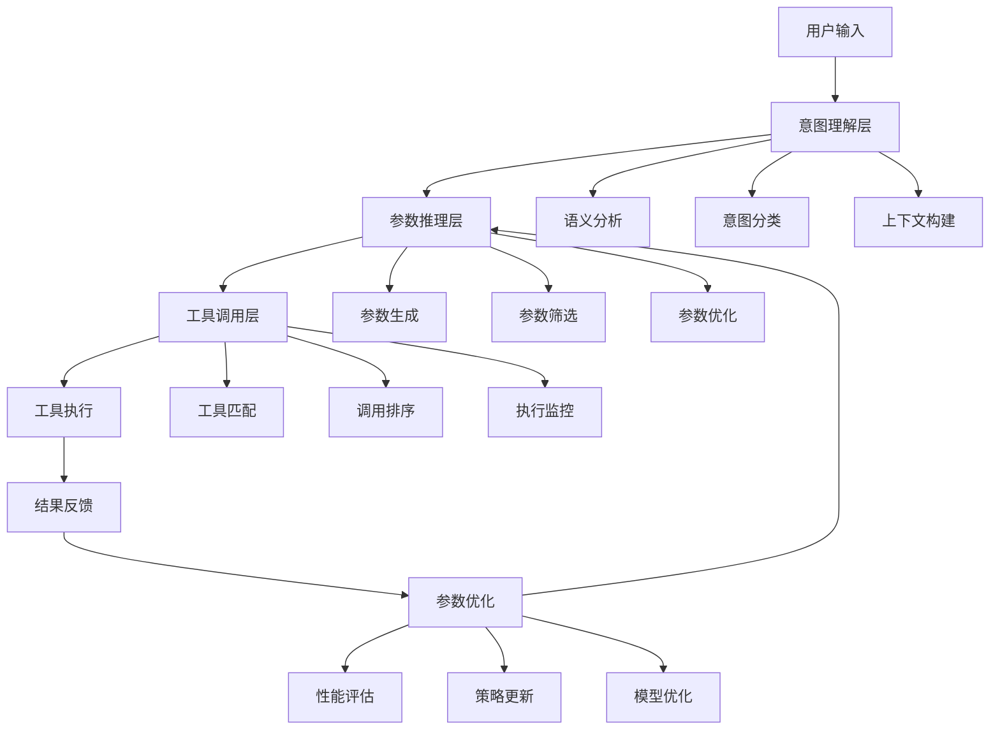

# 发明内容/技术方案-总述

## 发明内容

### 技术方案概述
基于智能分层推理的多参数工具自适应调用系统是一种创新的技术系统，通过构建多层次的推理框架，实现对复杂工具参数的智能推断和自适应调整。该系统结合上下文理解、意图识别和参数优化三大核心技术，能够在大语言模型调用外部工具时，自动分析用户输入的语义信息，推断出最优的工具参数组合，从而显著提高工具调用的准确性和效率。系统采用分层架构设计，包括意图理解层、参数推理层和工具调用层，形成完整的工具自适应调用闭环。

### 核心创新点
本技术方案的核心创新点主要体现在以下几个方面：

1. **智能分层推理机制**：提出了一种多层次推理框架，将复杂的参数推断过程分解为意图理解、参数生成和优化调整三个层次，每个层次专注于特定任务，形成递进式的推理链路，有效降低了参数推断的复杂度。

2. **上下文感知的参数推断技术**：开发了基于上下文感知的参数推断算法，能够综合考虑对话历史、用户偏好和工具特性，动态生成最适合当前场景的工具参数，解决了传统方法中参数设置僵化的问题。

3. **自适应参数优化机制**：引入了基于强化学习的参数优化方法，通过反馈循环不断调整参数推断策略，使系统能够从历史调用中学习，持续提升参数推断的准确性。

4. **工具调用效率优化**：设计了工具调用优先级排序和缓存机制，根据工具特性和调用频率动态调整调用策略，显著提高了系统响应速度和资源利用效率。

### 技术优势
相比现有技术，本发明具有以下显著优势：

1. **提高工具调用准确性**：通过智能分层推理和上下文感知技术，系统能够更准确地理解用户意图，生成更符合需求的工具参数，显著降低了工具调用失败率。

2. **增强系统适应性**：系统具备自学习和自适应能力，能够根据不同场景和用户需求动态调整参数策略，适应性强，适用范围广。

3. **降低人工干预需求**：自动化参数推断减少了人工配置参数的工作量，降低了使用门槛，提高了工具的易用性。

4. **提升资源利用效率**：通过参数优化和调用策略调整，系统能够更高效地利用计算资源，减少不必要的工具调用，降低系统运行成本。

5. **增强系统可扩展性**：模块化的设计使系统易于扩展和维护，能够方便地集成新的工具和功能，支持系统持续迭代升级。

### 系统架构
本系统采用分层架构设计，主要包括以下核心组件：



系统架构从上至下分为三个主要层次：意图理解层、参数推理层和工具调用层，形成完整的处理流程。同时，系统还包含一个参数优化模块，通过反馈循环不断改进参数推断策略。

### 关键技术
本系统的关键技术实现包括以下几个方面：

1. **意图理解技术**：采用基于注意力机制的深度学习模型，实现对用户输入的语义理解和意图识别。具体实现如下：

   $I = f_{attn}(X; W_{attn}, b_{attn})$
   
   其中，$I$表示意图向量，$X$表示输入序列，$f_{attn}$表示注意力函数，$W_{attn}$和$b_{attn}$分别是注意力机制的权重和偏置参数。

2. **参数推断技术**：基于上下文感知的参数推断算法，综合考虑多种因素生成最优参数：

   $P = g_{context}(I, H, T; W_g, b_g)$
   
   其中，$P$表示参数向量，$I$表示意图向量，$H$表示历史上下文，$T$表示工具特性，$g_{context}$表示上下文感知函数，$W_g$和$b_g$分别是模型权重和偏置。

3. **参数优化技术**：采用强化学习方法对参数进行持续优化：

   $Q(s,a) = Q(s,a) + \alpha[r + \gamma \max_{a'} Q(s',a') - Q(s,a)]$
   
   其中，$Q(s,a)$表示状态-动作值函数，$s$表示系统状态，$a$表示动作（参数选择），$r$表示奖励，$\gamma$是折扣因子，$\alpha$是学习率。

### 主流程
系统的主要工作流程如下：

1. 接收用户输入，进行预处理和语义分析
2. 通过意图理解层分析用户意图，构建上下文表示
3. 在参数推理层生成候选参数组合，并进行筛选和优化
4. 工具调用层根据参数选择合适的工具，并确定调用顺序
5. 执行工具调用，获取结果并反馈给用户
6. 根据调用结果评估性能，更新参数推断策略

```python
def main_process():
    # 1. 接收用户输入
    user_input = receive_user_input()
    
    # 2. 意图理解层处理
    intent_context = intent_understanding(user_input)
    
    # 3. 参数推理层处理
    candidate_params = parameter_inference(intent_context)
    optimized_params = parameter_optimization(candidate_params)
    
    # 4. 工具调用层处理
    selected_tools = tool_matching(optimized_params)
    ordered_tools = call_ordering(selected_tools)
    
    # 5. 工具执行
    results = []
    for tool in ordered_tools:
        result = execute_tool(tool, optimized_params)
        results.append(result)
    
    # 6. 结果处理与反馈
    final_result = process_results(results)
    provide_feedback(final_result)
    
    # 7. 参数优化更新
    performance_metrics = evaluate_performance(final_result)
    update_parameter_strategy(performance_metrics)
    
    return final_result
```
