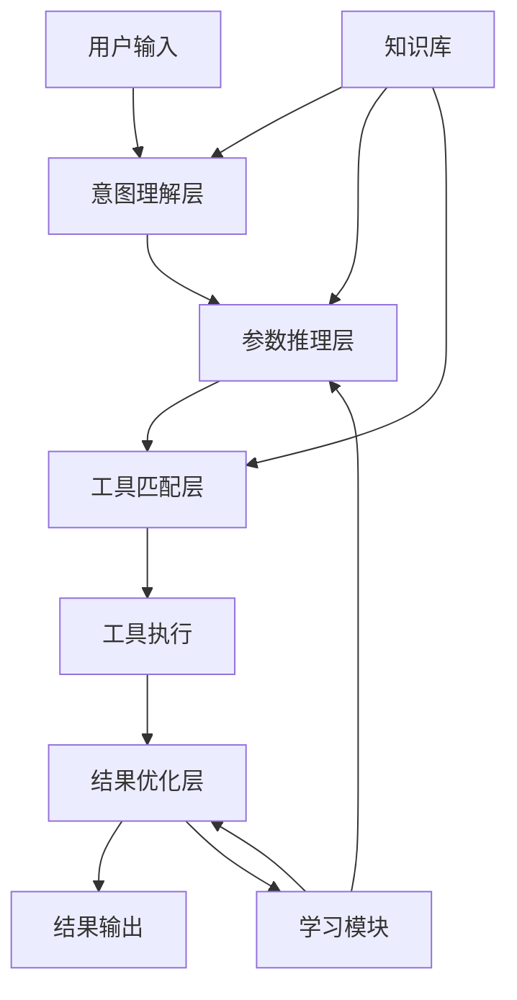

# 发明内容/技术方案-总述

## 发明内容

### 技术方案概述
基于智能分层推理的多参数工具自适应调用系统是一种通过智能分层推理技术实现多参数工具自适应调用的技术系统，能够根据上下文和用户意图自动推断工具参数，提高大语言模型调用复杂工具的准确性和效率。该系统通过构建多层次的推理框架，实现了对工具参数的智能解析、动态生成和自适应调整，解决了现有技术中工具调用参数配置复杂、准确性低、适应性差等问题。系统主要包括意图理解层、参数推理层、工具匹配层和结果优化层，形成了一个完整的工具自适应调用闭环。

### 核心创新点
本发明的核心创新点在于：

1. **智能分层推理机制**：构建了多层次推理框架，包括意图理解层、参数推理层、工具匹配层和结果优化层，每一层都有明确的推理目标和处理逻辑，形成递进式的参数推断过程。

2. **上下文感知的参数推断**：系统不仅考虑用户输入的显式信息，还通过上下文分析、历史对话记录和领域知识库，实现对工具参数的智能推断和补充。

3. **动态参数生成与调整**：基于强化学习和反馈机制，系统能够根据工具调用结果动态调整参数生成策略，实现参数的自适应优化。

4. **工具调用链的智能规划**：对于复杂任务，系统能够自动规划工具调用链，确定工具调用顺序和参数传递关系，提高多工具协同工作的效率。

5. **参数冲突检测与解决**：系统内置参数冲突检测机制，能够识别参数间的逻辑冲突，并提供多种冲突解决策略，确保工具调用的正确性。

### 技术优势
相比现有技术，本发明具有以下显著优势：

1. **提高工具调用准确性**：通过智能分层推理和上下文感知，系统能够更准确地推断工具参数，减少参数错误导致的工具调用失败。

2. **降低使用门槛**：用户无需了解工具的具体参数要求，系统自动完成参数推断，大大降低了复杂工具的使用门槛。

3. **增强适应性**：系统能够适应不同场景和用户需求，动态调整参数生成策略，提高了系统的通用性和适应性。

4. **提升效率**：通过工具调用链的智能规划和参数预推断，减少了工具调用的迭代次数，提高了整体处理效率。

5. **可扩展性强**：系统采用模块化设计，易于集成新的工具和参数类型，具有良好的可扩展性。

### 系统架构
本系统采用分层架构设计，主要包括以下组件：

1. **意图理解层**：负责解析用户输入，提取关键信息和用户意图，为后续参数推理提供基础。

2. **参数推理层**：基于意图理解结果，通过多级推理机制生成工具参数，包括参数类型推断、参数值生成和参数验证。

3. **工具匹配层**：根据参数推理结果，匹配最合适的工具，并确定工具调用顺序和参数传递关系。

4. **结果优化层**：对工具调用结果进行分析和优化，提供反馈信息用于改进参数推理策略。

5. **知识库**：存储领域知识、工具描述、参数约束和历史调用记录，为各层提供支持。

6. **学习模块**：基于强化学习机制，持续优化参数推理策略，提高系统性能。



### 关键技术
本系统的关键技术包括：

1. **意图理解技术**：基于自然语言处理和语义分析技术，系统采用以下公式计算用户意图的置信度：

$$P(I|U) = \frac{P(U|I) \cdot P(I)}{P(U)} = \frac{P(U|I) \cdot P(I)}{\sum_{i} P(U|I_i) \cdot P(I_i)}$$

其中，$P(I|U)$表示给定用户输入$U$下意图$I$的后验概率，$P(U|I)$是给定意图$I$下用户输入$U$的条件概率，$P(I)$是意图$I$的先验概率。

2. **参数推理技术**：系统采用贝叶斯网络进行参数推理，参数值的计算公式如下：

$$P(V|I,C) = \alpha \cdot P(V|I) \cdot P(V|C) \cdot \sum_{k} w_k \cdot P(V|K_k)$$

其中，$P(V|I,C)$表示给定意图$I$和上下文$C$下参数值$V$的概率，$\alpha$是归一化因子，$P(V|I)$是意图相关的参数先验概率，$P(V|C)$是上下文相关的参数概率，$P(V|K_k)$是知识库中第$k$条知识对参数值的贡献，$w_k$是对应的权重。

3. **工具匹配技术**：系统采用基于相似度的工具匹配算法，匹配度计算公式如下：

$$S(T,Q) = \beta_1 \cdot S_{name}(T,Q) + \beta_2 \cdot S_{param}(T,Q) + \beta_3 \cdot S_{func}(T,Q)$$

其中，$S(T,Q)$表示工具$T$与查询$Q$的匹配度，$S_{name}$、$S_{param}$和$S_{func}$分别是名称相似度、参数相似度和功能相似度，$\beta_1$、$\beta_2$和$\beta_3$是对应的权重系数。

### 主流程
本系统的主要工作流程如下：

1. **输入接收与预处理**：接收用户输入，进行文本清洗和标准化处理。

2. **意图理解**：解析用户输入，提取关键信息，识别用户意图。

3. **参数推理**：基于意图理解结果和上下文信息，通过多级推理机制生成工具参数。

4. **工具匹配**：根据参数推理结果，匹配最合适的工具，并确定工具调用顺序。

5. **工具调用执行**：按照匹配结果调用工具，执行相应的功能。

6. **结果分析与优化**：分析工具调用结果，提取有用信息，并优化参数推理策略。

7. **结果输出**：将处理结果返回给用户，并根据需要提供解释和建议。

```python
# 伪代码展示主流程
def main_process(user_input):
    # 1. 输入预处理
    processed_input = preprocess_input(user_input)
    
    # 2. 意图理解
    intent = understand_intent(processed_input)
    
    # 3. 上下文分析
    context = analyze_context()
    
    # 4. 参数推理
    parameters = infer_parameters(intent, context)
    
    # 5. 工具匹配
    tools = match_tools(parameters)
    
    # 6. 工具调用链规划
    call_chain = plan_tool_chain(tools, parameters)
    
    # 7. 执行工具调用
    results = execute_tool_chain(call_chain)
    
    # 8. 结果优化
    optimized_results = optimize_results(results)
    
    # 9. 反馈学习
    update_model(intent, parameters, tools, results)
    
    # 10. 输出结果
    return generate_output(optimized_results)
```
