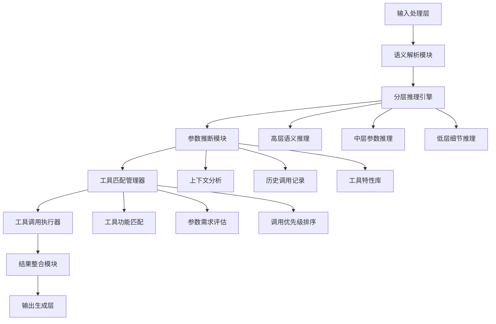

# 发明内容/技术方案-总述

## 发明内容

### 技术方案概述
本发明提供一种基于智能分层推理的多参数工具自适应调用系统，该系统通过构建多层次推理架构，实现对复杂工具参数的智能推断与自适应调用。系统首先对用户输入进行语义解析，然后通过分层推理机制逐步细化参数空间，最终生成最优的工具调用方案。该系统特别适用于大语言模型与外部工具的交互场景，能够显著提高工具调用的准确性和效率，减少人工干预需求。

### 核心创新点
本发明的核心创新点在于：
1. **智能分层推理机制**：构建多层次推理架构，从粗粒度到细粒度逐步细化参数推断过程，提高推理准确性和效率。
2. **多维度参数推断模型**：结合上下文信息、历史调用记录和工具特性，建立多维度参数推断模型，实现参数的智能生成。
3. **动态工具匹配算法**：基于工具功能描述和参数需求，实现工具与任务的动态匹配，优化工具选择过程。
4. **自适应参数优化**：根据调用结果反馈，持续优化参数推断模型，形成闭环学习机制。

### 技术优势
相比现有技术，本发明具有以下显著优势：
1. **提高准确性**：通过分层推理和多维度参数推断，显著降低工具调用错误率，提高任务完成质量。
2. **减少人工干预**：系统可自动推断复杂参数，减少用户手动配置的工作量，提升用户体验。
3. **增强适应性**：系统能够适应不同场景和工具类型，具有良好的泛化能力和扩展性。
4. **提升效率**：通过智能推理和优化算法，减少不必要的工具调用尝试，提高整体处理效率。

### 系统架构
本系统采用分层架构设计，主要包括以下组件：



### 关键技术
本系统的关键技术包括：

1. **分层推理算法**：
   $R = \sum_{i=1}^{n} w_i \cdot R_i$
   其中，$R$为最终推理结果，$R_i$为第i层推理结果，$w_i$为第i层推理权重，通过动态调整权重优化推理过程。

2. **参数推断模型**：
   $P = f(C, H, T) = \alpha \cdot g(C) + \beta \cdot h(H) + \gamma \cdot k(T)$
   其中，$P$为推断的参数集合，$C$为上下文信息，$H$为历史调用记录，$T$为工具特性，$g$, $h$, $k$为对应的映射函数，$\alpha$, $\beta$, $\gamma$为权重系数。

3. **工具匹配度计算**：
   $S = \lambda_1 \cdot S_f + \lambda_2 \cdot S_p + \lambda_3 \cdot S_c$
   其中，$S$为综合匹配度，$S_f$为功能匹配度，$S_p$为参数匹配度，$S_c$为上下文匹配度，$\lambda_1$, $\lambda_2$, $\lambda_3$为对应权重。

### 主流程
系统的主要工作流程如下：

```python
def main_process():
    # 输入处理与语义解析
    user_input = receive_user_input()
    semantic_context = semantic_parser.parse(user_input)
    
    # 分层推理
    high_level_result = high_level_reasoning(semantic_context)
    mid_level_result = mid_level_reasoning(high_level_result)
    low_level_result = low_level_reasoning(mid_level_result)
    
    # 参数推断
    parameter_candidates = parameter_inference(low_level_result, 
                                             get_historical_records(),
                                             get_tool_characteristics())
    
    # 工具匹配与选择
    candidate_tools = tool_matching(parameter_candidates)
    selected_tool = select_optimal_tool(candidate_tools)
    
    # 工具调用执行
    tool_result = execute_tool(selected_tool, parameter_candidates)
    
    # 结果整合与输出
    final_result = integrate_results(tool_result, semantic_context)
    generate_output(final_result)
    
    # 更新学习模型
    update_learning_model(selected_tool, parameter_candidates, tool_result)
```

本发明通过智能分层推理机制和多参数自适应调用技术，有效解决了大语言模型调用复杂工具时的参数配置难题，显著提高了工具调用的准确性和效率，具有广泛的应用前景和商业价值。
