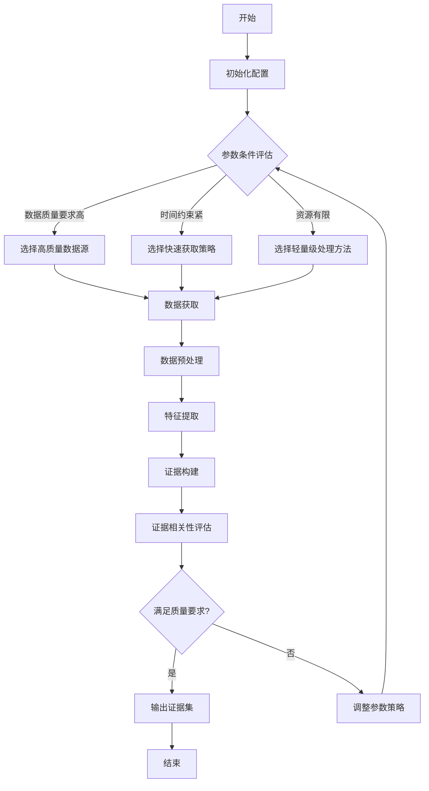

# 具体实施方式-子章节A：数据获取与证据构建

# 具体实施方式-子章节A：数据获取与证据构建

## 引言

在基于智能分层推理的多参数工具自适应调用系统中，数据获取与证据构建是整个系统的基础环节。高质量的数据获取和严谨的证据构建直接影响后续推理的准确性和工具调用的有效性。本章节将详细阐述数据获取与证据构建模块的设计原理、实现方法和优化策略，为系统的智能分层推理提供坚实的数据基础和可靠的证据支持。

## 数据获取模块

数据获取模块负责从多种来源收集系统所需的原始数据，并进行初步处理。该模块设计为可扩展的架构，支持多种数据源和获取方式。

### 数据源类型
系统支持以下几类数据源：
1. 结构化数据源：关系型数据库、NoSQL数据库等
2. 半结构化数据源：XML、JSON、CSV等文件
3. 非结构化数据源：文本、图像、音频等
4. 实时数据流：传感器数据、日志流等
5. 外部API数据：第三方服务提供的接口数据

### 数据获取方式
根据数据特性和系统需求，数据获取模块采用以下几种获取方式：
1. 批量获取：适用于大规模历史数据的获取
2. 实时获取：适用于需要即时响应的场景
3. 增量获取：仅获取自上次获取以来的新增或变更数据
4. 主动获取：系统根据预设策略主动请求所需数据
5. 被动获取：等待数据源推送更新数据

### 数据预处理
获取的原始数据需要经过预处理才能用于后续的证据构建：
1. 数据清洗：去除重复、错误和不完整的数据
2. 数据标准化：统一数据格式和单位
3. 数据转换：将数据转换为适合处理的格式
4. 数据集成：合并来自不同数据源的相关数据
5. 数据归约：减少数据量但保持数据完整性

## 证据构建模块

证据构建模块负责从预处理后的数据中提取特征，构建可用于推理的证据模型，并评估证据的可靠性和相关性。

### 特征提取
特征提取是从数据中识别和提取有用信息的过程：
1. 统计特征：均值、方差、分布等统计量
2. 时序特征：趋势、周期性、异常点等
3. 关联特征：变量间的相关性和依赖关系
4. 语义特征：文本、图像等非结构化数据的高级语义
5. 上下文特征：数据产生的环境和背景信息

### 证据模型构建
基于提取的特征，构建多层次的证据模型：
1. 基础证据层：直接从数据中提取的原始证据
2. 复合证据层：通过组合基础证据形成的复杂证据
3. 上下文证据层：考虑应用场景和用户需求的情境化证据
4. 置信度评估层：对每条证据的可靠性进行量化评估

### 证据相关性评估
评估证据与当前推理任务的相关性：
1. 语义相关性：证据内容与任务主题的匹配程度
2. 时效性相关性：证据的时效性与任务需求的匹配程度
3. 权威性相关性：证据来源的权威性与任务要求的匹配程度
4. 多样性相关性：证据覆盖不同角度和维度的程度

## 参数条件与自适应机制

系统根据不同的参数条件动态调整数据获取和证据构建策略：

### 参数条件类型
1. 数据质量参数：包括数据完整性、准确性、一致性等要求
2. 时间约束参数：包括数据获取时间限制、处理时间限制等
3. 资源约束参数：包括计算资源、存储资源、网络带宽等限制
4. 任务复杂度参数：包括推理任务的复杂度和难度级别
5. 用户偏好参数：包括用户对数据类型、来源、格式的偏好

### 自适应机制
系统通过以下机制实现自适应调整：
1. 参数感知：实时监测和感知参数条件的变化
2. 策略选择：根据参数条件从预设策略库中选择合适的策略
3. 动态调整：在执行过程中根据实际情况动态调整策略
4. 学习优化：通过历史执行结果不断优化策略选择

## 实施步骤

数据获取与证据构建模块的实施包括以下步骤：

1. **初始化配置**
   - 设置数据源连接参数
   - 配置数据获取策略
   - 初始化证据构建模型
   - 设置参数条件阈值

2. **数据获取**
   - 根据参数条件选择数据源
   - 确定获取方式和频率
   - 执行数据获取操作
   - 记录获取日志和元数据

3. **数据预处理**
   - 执行数据清洗操作
   - 进行数据标准化和转换
   - 实施数据集成和归约
   - 验证预处理结果质量

4. **特征提取**
   - 应用特征提取算法
   - 识别和量化关键特征
   - 构建特征向量
   - 评估特征质量

5. **证据构建**
   - 构建基础证据层
   - 形成复合证据层
   - 添加上下文证据
   - 评估证据置信度

6. **相关性评估**
   - 计算证据与任务的相关性分数
   - 过滤低相关性证据
   - 对高相关性证据进行排序
   - 生成证据集

7. **结果输出与反馈**
   - 输出证据集和元数据
   - 记录执行过程和结果
   - 收集用户反馈
   - 用于后续优化

## 算法与伪代码

### 数据获取算法

```python
function intelligentDataAcquisition(requiredDataTypes, qualityRequirements, timeConstraints):
    # 初始化
    selectedSources = []
    acquisitionStrategies = []
    estimatedTime = 0
    estimatedQuality = 0
    
    # 根据数据类型和数据源特征匹配最佳数据源
    for source in dataSourceCatalog:
        relevanceScore = calculateRelevance(source, requiredDataTypes)
        if relevanceScore > THRESHOLD:
            selectedSources.append(source)
    
    # 为每个选中的数据源选择最佳获取策略
    for source in selectedSources:
        bestStrategy = None
        bestScore = -1
        
        for strategy in acquisitionStrategies:
            # 评估策略在给定条件下的适用性
            timeScore = evaluateTimeConstraint(strategy, timeConstraints)
            qualityScore = evaluateQualityConstraint(strategy, qualityRequirements)
            resourceScore = evaluateResourceConstraint(strategy, availableResources)
            
            totalScore = w1*timeScore + w2*qualityScore + w3*resourceScore
            
            if totalScore > bestScore:
                bestScore = totalScore
                bestStrategy = strategy
        
        acquisitionStrategies.append(bestStrategy)
        estimatedTime += estimateExecutionTime(bestStrategy)
        estimatedQuality += estimateOutputQuality(bestStrategy)
    
    # 检查是否满足所有约束条件
    if estimatedTime > timeConstraints.maxTime or estimatedQuality < qualityRequirements.minQuality:
        return handleAcquisitionFailure()
    
    # 执行数据获取
    acquiredData = []
    for i, source in enumerate(selectedSources):
        data = executeAcquisition(source, acquisitionStrategies[i])
        acquiredData.append(data)
    
    # 整合获取的数据
    integratedData = integrateDataSources(acquiredData)
    
    return integratedData
```

### 证据构建算法

```python
function evidenceConstruction(preprocessedData, contextInfo, confidenceThreshold):
    # 初始化证据集
    evidenceSet = EvidenceSet()
    
    # 1. 构建基础证据层
    for dataItem in preprocessedData:
        # 提取基础特征
        features = extractBasicFeatures(dataItem)
        
        # 构建基础证据
        basicEvidence = BasicEvidence(
            id=generateEvidenceId(),
            features=features,
            source=dataItem.source,
            timestamp=dataItem.timestamp,
            confidence=calculateBasicConfidence(features)
        )
        
        # 过滤低置信度证据
        if basicEvidence.confidence >= confidenceThreshold:
            evidenceSet.addBasicEvidence(basicEvidence)
    
    # 2. 构建复合证据层
    for evidencePair in combinations(evidenceSet.basicEvidences, 2):
        # 计算证据间的相关性
        correlation = calculateEvidenceCorrelation(evidencePair[0], evidencePair[1])
        
        if correlation > CORRELATION_THRESHOLD:
            # 构建复合证据
            compositeEvidence = CompositeEvidence(
                id=generateEvidenceId(),
                constituentEvidences=[evidencePair[0].id, evidencePair[1].id],
                relationshipType=determineRelationshipType(evidencePair),
                confidence=calculateCompositeConfidence(evidencePair, correlation),
                context=contextInfo
            )
            
            evidenceSet.addCompositeEvidence(compositeEvidence)
    
    # 3. 构建上下文证据层
    for evidence in evidenceSet.getAllEvidences():
        contextualEvidence = ContextualEvidence(
            id=generateEvidenceId(),
            baseEvidenceId=evidence.id,
            contextFactors=extractContextFactors(contextInfo),
            confidence=adjustConfidenceWithContext(evidence.confidence, contextInfo)
        )
        
        evidenceSet.addContextualEvidence(contextualEvidence)
    
    # 4. 证据相关性评估和排序
    for evidence in evidenceSet.getAllEvidences():
        relevanceScore = calculateRelevance(evidence, currentTask)
        evidence.relevanceScore = relevanceScore
    
    # 按相关性和置信度排序
    sortedEvidences = sortEvidences(evidenceSet.getAllEvidences(), 
                                  by=['relevanceScore', 'confidence'], 
                                  descending=[True, True])
    
    return sortedEvidences
```

### 算法公式

#### 数据源选择算法

数据源选择算法基于数据源与需求的相关性、数据质量、获取成本等因素进行综合评分：

$$S_{source} = \alpha \cdot \frac{R_{source}}{R_{max}} + \beta \cdot \frac{Q_{source}}{Q_{max}} + \gamma \cdot \frac{C_{max}}{C_{source}}$$

其中：
- $S_{source}$ 是数据源的综合评分
- $R_{source}$ 是数据源与需求的相关性得分
- $Q_{source}$ 是数据源的质量得分
- $C_{source}$ 是获取该数据源的成本
- $R_{max}$ 和 $Q_{max}$ 分别是相关性和质量的最大可能得分
- $\alpha$, $\beta$, $\gamma$ 是权重系数，满足 $\alpha + \beta + \gamma = 1$

#### 证据置信度计算算法

证据置信度计算基于多个因素，包括数据质量、来源可靠性、时效性等：

$$C_{evidence} = \sqrt[3]{C_{data} \cdot C_{source} \cdot C_{time}} \cdot f_{context}$$

其中：
- $C_{evidence}$ 是证据的综合置信度
- $C_{data}$ 是数据质量因子，取值范围[0,1]
- $C_{source}$ 是来源可靠性因子，取值范围[0,1]
- $C_{time}$ 是时效性因子，取值范围[0,1]
- $f_{context}$ 是上下文调整因子，根据应用场景调整置信度

### 工作流程图



## 总结

数据获取与证据构建模块是整个基于智能分层推理的多参数工具自适应调用系统的基础环节。通过智能化的数据获取策略和多层次的证据构建方法，该模块能够为系统提供高质量、高相关性的证据支持，为后续的智能推理和工具调用奠定坚实基础。模块的自适应机制使其能够根据不同的参数条件动态调整策略，确保在各种场景下都能提供最佳的数据和证据支持。

通过本章节的详细描述，我们了解了数据获取与证据构建模块的设计原理、实现方法和优化策略，为系统的整体实现提供了清晰的指导。在实际应用中，还需要根据具体场景和需求进行进一步的定制和优化。
