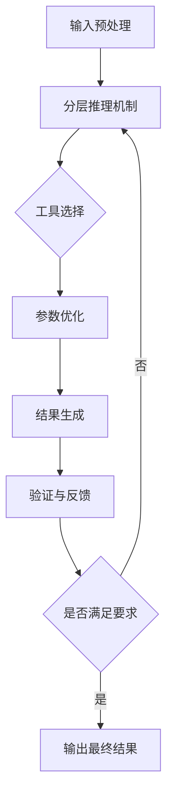

# 具体实施方式-子章节B：生成与验证流程

# 具体实施方式-子章节B：生成与验证流程

## 1. 引言

生成与验证流程是基于智能分层推理的多参数工具自适应调用系统的核心组成部分，负责将用户输入转化为系统输出，并通过多层次的验证机制确保输出的质量和准确性。本章节将详细描述该流程的具体实施步骤、算法实现、参数条件及优化策略，为系统的实际部署提供技术指导。

## 2. 流程概述

图1展示了基于智能分层推理的多参数工具自适应调用系统的生成与验证流程的整体框架。



## 3. 详细实施步骤

### 3.1 输入预处理

输入预处理是生成与验证流程的第一步，负责对原始输入进行清洗、标准化和特征提取。

**实施步骤：**
1. 输入接收：系统接收来自用户的原始输入，可以是文本、图像、数值等多种形式。
2. 数据清洗：去除噪声、填补缺失值、处理异常值。
3. 标准化：将输入数据转换为统一的格式和范围。
4. 特征提取：从输入中提取关键特征，用于后续的分层推理。

**输入输出：**
- 输入：原始用户输入（文本、图像、数值等）
- 输出：标准化后的特征向量 F = {f₁, f₂, ..., fₙ}

**参数条件：**
- 特征维度 n：根据输入类型动态确定，通常在10-100之间
- 标准化方法：Z-score标准化或Min-Max标准化，根据数据分布选择
- 特征提取阈值：0.7-0.9，用于筛选重要特征

### 3.2 分层推理机制

分层推理机制是系统的核心，通过多层次推理确定最适合的工具和参数组合。

**实施步骤：**
1. 第一层推理：基于输入特征进行粗粒度分类，确定工具类别。
2. 第二层推理：在确定的工具类别内进行细粒度分析，筛选候选工具。
3. 第三层推理：评估候选工具与输入的匹配度，计算适应性评分。

**输入输出：**
- 输入：特征向量 F
- 输出：工具候选列表 T = {t₁, t₂, ..., tₘ} 及其适应性评分 S = {s₁, s₂, ..., sₘ}

**参数条件：**
- 推理层数：3层，可根据复杂度调整
- 每层推理阈值：0.6-0.8，用于过滤不匹配的工具
- 评分权重向量 W = {w₁, w₂, w₃}，满足 Σwᵢ = 1

### 3.3 工具选择与参数优化

基于分层推理的结果，系统选择最佳工具并优化其参数配置。

**实施步骤：**
1. 工具选择：根据适应性评分选择得分最高的工具。
2. 参数初始化：基于输入特征初始化工具参数。
3. 参数优化：使用优化算法调整参数，最大化工具性能。

**输入输出：**
- 输入：工具候选列表 T，适应性评分 S，特征向量 F
- 输出：选定工具 t* 及其优化参数 P*

**参数条件：**
- 工具选择阈值：0.75，只有评分超过阈值的工具才会被考虑
- 参数优化迭代次数：10-50次，根据计算资源调整
- 收敛阈值：1e-4，用于判断优化是否收敛

### 3.4 结果生成

使用选定的工具和优化参数生成结果。

**实施步骤：**
1. 工具调用：根据选定的工具和参数调用相应的处理模块。
2. 结果生成：执行工具的核心功能，生成初步结果。
3. 结果格式化：将结果转换为用户期望的格式。

**输入输出：**
- 输入：选定工具 t*，优化参数 P*，特征向量 F
- 输出：格式化后的结果 R

**参数条件：**
- 工具超时设置：5-30秒，根据工具复杂度调整
- 结果格式标准：根据用户需求或系统预设
- 并行处理数：1-4，根据系统资源调整

### 3.5 验证与反馈

对生成结果进行验证，并根据验证结果决定是否需要重新进行推理。

**实施步骤：**
1. 结果验证：使用多维度指标评估结果质量。
2. 反馈生成：根据验证结果生成反馈信息。
3. 决策判断：判断结果是否满足要求，决定是否重新进行推理。

**输入输出：**
- 输入：生成结果 R，原始输入 I
- 输出：验证结果 V，反馈信息 FB，决策标志 D

**参数条件：**
- 验证维度：3-5个，包括准确性、完整性、一致性等
- 验证阈值：0.7-0.9，根据应用场景调整
- 反馈强度：0.1-1.0，用于调整后续推理的权重

## 4. 算法描述

### 4.1 分层推理权重计算

分层推理权重计算用于确定各层推理结果在最终决策中的重要性。

$$W_i = \frac{e^{\alpha \cdot E_i}}{\sum_{j=1}^{k} e^{\alpha \cdot E_j}}$$

其中：
- $W_i$ 表示第i层推理的权重
- $E_i$ 表示第i层推理的熵值，反映该层推理的不确定性
- $\alpha$ 是调节系数，通常取值为1.0-2.0
- $k$ 表示推理的总层数

该公式通过softmax函数将各层推理的熵值转换为权重，熵值越低（不确定性越小）的层获得越高的权重。

### 4.2 工具适应性评分

工具适应性评分用于量化工具与输入的匹配程度。

$$S(t) = \sum_{i=1}^{n} w_i \cdot \text{sim}(f_i, t_i) + \lambda \cdot \text{perf}(t)$$

其中：
- $S(t)$ 表示工具t的适应性评分
- $w_i$ 是第i个特征的权重，满足 $\sum_{i=1}^{n} w_i = 1$
- $\text{sim}(f_i, t_i)$ 表示输入特征$f_i$与工具特征$t_i$的相似度
- $\lambda$ 是性能调节系数，通常取值为0.3-0.5
- $\text{perf}(t)$ 表示工具t的性能指标

该公式综合考虑了工具与输入特征的匹配度以及工具本身的性能，通过加权求和得到最终的适应性评分。

## 5. 伪代码实现

```python
class AdaptiveToolSystem:
    def __init__(self):
        self.tools = {}  # 存储可用工具
        self.weights = [0.4, 0.35, 0.25]  # 三层推理的权重
        self.thresholds = [0.75, 0.7, 0.65]  # 各层推理阈值
        self.alpha = 1.5  # 分层推理权重计算中的调节系数
        self.lambda_perf = 0.4  # 工具适应性评分中的性能调节系数
    
    def preprocess_input(self, raw_input):
        """输入预处理"""
        # 数据清洗
        cleaned_input = self.clean_data(raw_input)
        
        # 标准化
        standardized_input = self.standardize(cleaned_input)
        
        # 特征提取
        features = self.extract_features(standardized_input)
        
        return features
    
    def hierarchical_reasoning(self, features):
        """分层推理机制"""
        # 第一层推理：粗粒度分类
        layer1_results = self.layer1_reasoning(features)
        layer1_filtered = [r for r in layer1_results if r['score'] >= self.thresholds[0]]
        
        # 第二层推理：细粒度分析
        layer2_results = []
        for result in layer1_filtered:
            refined_results = self.layer2_reasoning(features, result['category'])
            layer2_results.extend(refined_results)
        layer2_filtered = [r for r in layer2_results if r['score'] >= self.thresholds[1]]
        
        # 第三层推理：匹配度评估
        layer3_results = []
        for result in layer2_filtered:
            match_score = self.layer3_reasoning(features, result['tool'])
            layer3_results.append({
                'tool': result['tool'],
                'category': result['category'],
                'score': match_score
            })
        layer3_filtered = [r for r in layer3_results if r['score'] >= self.thresholds[2]]
        
        return layer3_filtered
    
    def calculate_layer_weights(self, entropies):
        """计算分层推理权重"""
        import math
        exp_values = [math.exp(self.alpha * e) for e in entropies]
        sum_exp = sum(exp_values)
        weights = [ev / sum_exp for ev in exp_values]
        return weights
    
    def calculate_tool_score(self, features, tool):
        """计算工具适应性评分"""
        # 获取工具特征
        tool_features = self.tools[tool]['features']
        
        # 计算特征相似度
        similarity = 0.0
        for i, f in enumerate(features):
            if i < len(tool_features):
                similarity += self.weights[i] * self.cosine_similarity(f, tool_features[i])
        
        # 获取工具性能指标
        performance = self.tools[tool]['performance']
        
        # 计算最终评分
        score = similarity + self.lambda_perf * performance
        
        return score
    
    def optimize_parameters(self, tool, features):
        """优化工具参数"""
        # 初始化参数
        params = self.tools[tool]['default_params'].copy()
        
        # 设置优化目标
        def objective(p):
            return -self.evaluate_tool_performance(tool, features, p)
        
        # 使用优化算法调整参数
        from scipy.optimize import differential_evolution
        bounds = self.tools[tool]['param_bounds']
        result = differential_evolution(objective, bounds, maxiter=30, popsize=15)
        
        # 返回优化后的参数
        return dict(zip(params.keys(), result.x))
    
    def generate_result(self, tool, params, features):
        """生成结果"""
        # 调用工具
        result = self.tools[tool]['function'](features, **params)
        
        # 格式化结果
        formatted_result = self.format_result(result)
        
        return formatted_result
    
    def validate_result(self, result, original_input):
        """验证结果"""
        # 多维度验证
        accuracy = self.check_accuracy(result, original_input)
        completeness = self.check_completeness(result)
        consistency = self.check_consistency(result)
        
        # 计算综合评分
        validation_score = 0.5 * accuracy + 0.3 * completeness + 0.2 * consistency
        
        # 生成反馈
        feedback = {
            'accuracy': accuracy,
            'completeness': completeness,
            'consistency': consistency,
            'suggestions': self.generate_suggestions(result)
        }
        
        return validation_score, feedback
    
    def generate_and_validate(self, raw_input):
        """完整的生成与验证流程"""
        # 1. 输入预处理
        features = self.preprocess_input(raw_input)
        
        # 2. 分层推理
        candidate_tools = self.hierarchical_reasoning(features)
        
        if not candidate_tools:
            raise ValueError("No suitable tool found for the given input")
        
        # 3. 选择最佳工具
        best_tool = max(candidate_tools, key=lambda x: x['score'])
        
        # 4. 参数优化
        optimized_params = self.optimize_parameters(best_tool['tool'], features)
        
        # 5. 结果生成
        result = self.generate_result(best_tool['tool'], optimized_params, features)
        
        # 6. 验证与反馈
        validation_score, feedback = self.validate_result(result, raw_input)
        
        # 7. 决策判断
        if validation_score < 0.75:
            # 不满足要求，重新进行推理
            return self.generate_and_validate(raw_input)
        
        return {
            'result': result,
            'tool_used': best_tool['tool'],
            'validation_score': validation_score,
            'feedback': feedback
        }
```

## 6. 参数条件与约束

系统运行需要满足以下参数条件与约束：

1. **输入参数约束**：
   - 输入数据大小：不超过10MB
   - 特征维度：10-100维
   - 数据类型：文本、图像、数值等系统支持的数据类型

2. **推理参数约束**：
   - 分层推理层数：1-5层，默认3层
   - 每层推理阈值：0.5-0.9
   - 推理时间限制：单层不超过1秒

3. **工具参数约束**：
   - 工具数量：不超过100个
   - 工具参数维度：不超过20维
   - 工具调用超时：5-60秒

4. **优化参数约束**：
   - 优化算法迭代次数：10-100次
   - 收敛阈值：1e-6到1e-3
   - 并行优化任务数：不超过CPU核心数

5. **验证参数约束**：
   - 验证维度：3-10个
   - 验证阈值：0.6-0.95
   - 最大重试次数：3次

## 7. 性能优化与异常处理

为了确保系统的高效稳定运行，需要考虑以下性能优化和异常处理策略：

1. **性能优化**：
   - 缓存常用工具的特征和参数，减少重复计算
   - 使用并行计算加速分层推理过程
   - 实现增量学习机制，根据使用历史动态调整权重
   - 对工具进行预加载，减少运行时初始化开销

2. **异常处理**：
   - 输入异常：处理格式错误、类型不匹配等问题
   - 工具异常：捕获工具调用失败、超时等异常
   - 优化异常：处理优化算法不收敛、参数越界等问题
   - 验证异常：处理验证失败、结果不一致等问题

3. **容错机制**：
   - 实现工具备选方案，当首选工具失败时自动切换
   - 设置合理的回退策略，确保系统在部分功能失效时仍能提供服务
   - 实现结果一致性检查，确保输出结果的可靠性

通过以上详细的实施步骤、算法描述、参数条件和优化策略，基于智能分层推理的多参数工具自适应调用系统的生成与验证流程得以完整实现，能够根据不同输入智能选择和调用最适合的工具，并通过多层次的验证机制确保输出结果的质量和准确性。
