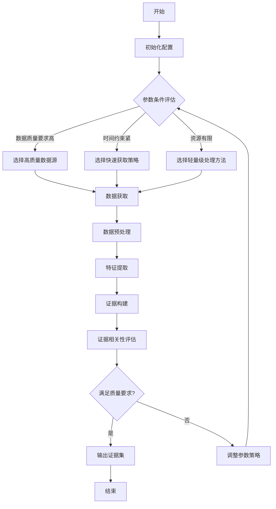
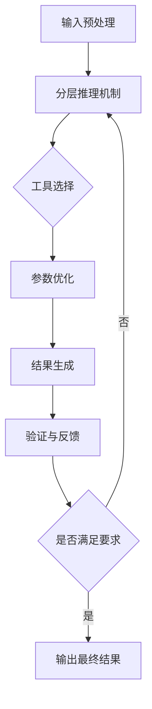

# 具体实施方式（合并）

### 子章节A：数据获取与证据构建

# 具体实施方式-子章节A：数据获取与证据构建

## 引言

在基于智能分层推理的多参数工具自适应调用系统中，数据获取与证据构建是整个系统的基础环节。高质量的数据获取和严谨的证据构建直接影响后续推理的准确性和工具调用的有效性。本章节将详细阐述数据获取与证据构建模块的设计原理、实现方法和优化策略，为系统的智能分层推理提供坚实的数据基础和可靠的证据支持。

## 数据获取模块

数据获取模块负责从多种来源收集系统所需的原始数据，并进行初步处理。该模块设计为可扩展的架构，支持多种数据源和获取方式。

### 数据源类型
系统支持以下几类数据源：
1. 结构化数据源：关系型数据库、NoSQL数据库等
2. 半结构化数据源：XML、JSON、CSV等文件
3. 非结构化数据源：文本、图像、音频等
4. 实时数据流：传感器数据、日志流等
5. 外部API数据：第三方服务提供的接口数据

### 数据获取方式
根据数据特性和系统需求，数据获取模块采用以下几种获取方式：
1. 批量获取：适用于大规模历史数据的获取
2. 实时获取：适用于需要即时响应的场景
3. 增量获取：仅获取自上次获取以来的新增或变更数据
4. 主动获取：系统根据预设策略主动请求所需数据
5. 被动获取：等待数据源推送更新数据

### 数据预处理
获取的原始数据需要经过预处理才能用于后续的证据构建：
1. 数据清洗：去除重复、错误和不完整的数据
2. 数据标准化：统一数据格式和单位
3. 数据转换：将数据转换为适合处理的格式
4. 数据集成：合并来自不同数据源的相关数据
5. 数据归约：减少数据量但保持数据完整性

## 证据构建模块

证据构建模块负责从预处理后的数据中提取特征，构建可用于推理的证据模型，并评估证据的可靠性和相关性。

### 特征提取
特征提取是从数据中识别和提取有用信息的过程：
1. 统计特征：均值、方差、分布等统计量
2. 时序特征：趋势、周期性、异常点等
3. 关联特征：变量间的相关性和依赖关系
4. 语义特征：文本、图像等非结构化数据的高级语义
5. 上下文特征：数据产生的环境和背景信息

### 证据模型构建
基于提取的特征，构建多层次的证据模型：
1. 基础证据层：直接从数据中提取的原始证据
2. 复合证据层：通过组合基础证据形成的复杂证据
3. 上下文证据层：考虑应用场景和用户需求的情境化证据
4. 置信度评估层：对每条证据的可靠性进行量化评估

### 证据相关性评估
评估证据与当前推理任务的相关性：
1. 语义相关性：证据内容与任务主题的匹配程度
2. 时效性相关性：证据的时效性与任务需求的匹配程度
3. 权威性相关性：证据来源的权威性与任务要求的匹配程度
4. 多样性相关性：证据覆盖不同角度和维度的程度

## 参数条件与自适应机制

系统根据不同的参数条件动态调整数据获取和证据构建策略：

### 参数条件类型
1. 数据质量参数：包括数据完整性、准确性、一致性等要求
2. 时间约束参数：包括数据获取时间限制、处理时间限制等
3. 资源约束参数：包括计算资源、存储资源、网络带宽等限制
4. 任务复杂度参数：包括推理任务的复杂度和难度级别
5. 用户偏好参数：包括用户对数据类型、来源、格式的偏好

### 自适应机制
系统通过以下机制实现自适应调整：
1. 参数感知：实时监测和感知参数条件的变化
2. 策略选择：根据参数条件从预设策略库中选择合适的策略
3. 动态调整：在执行过程中根据实际情况动态调整策略
4. 学习优化：通过历史执行结果不断优化策略选择

## 实施步骤

数据获取与证据构建模块的实施包括以下步骤：

1. **初始化配置**
   - 设置数据源连接参数
   - 配置数据获取策略
   - 初始化证据构建模型
   - 设置参数条件阈值

2. **数据获取**
   - 根据参数条件选择数据源
   - 确定获取方式和频率
   - 执行数据获取操作
   - 记录获取日志和元数据

3. **数据预处理**
   - 执行数据清洗操作
   - 进行数据标准化和转换
   - 实施数据集成和归约
   - 验证预处理结果质量

4. **特征提取**
   - 应用特征提取算法
   - 识别和量化关键特征
   - 构建特征向量
   - 评估特征质量

5. **证据构建**
   - 构建基础证据层
   - 形成复合证据层
   - 添加上下文证据
   - 评估证据置信度

6. **相关性评估**
   - 计算证据与任务的相关性分数
   - 过滤低相关性证据
   - 对高相关性证据进行排序
   - 生成证据集

7. **结果输出与反馈**
   - 输出证据集和元数据
   - 记录执行过程和结果
   - 收集用户反馈
   - 用于后续优化

## 算法与伪代码

### 数据获取算法

```python
function intelligentDataAcquisition(requiredDataTypes, qualityRequirements, timeConstraints):
    # 初始化
    selectedSources = []
    acquisitionStrategies = []
    estimatedTime = 0
    estimatedQuality = 0
    
    # 根据数据类型和数据源特征匹配最佳数据源
    for source in dataSourceCatalog:
        relevanceScore = calculateRelevance(source, requiredDataTypes)
        if relevanceScore > THRESHOLD:
            selectedSources.append(source)
    
    # 为每个选中的数据源选择最佳获取策略
    for source in selectedSources:
        bestStrategy = None
        bestScore = -1
        
        for strategy in acquisitionStrategies:
            # 评估策略在给定条件下的适用性
            timeScore = evaluateTimeConstraint(strategy, timeConstraints)
            qualityScore = evaluateQualityConstraint(strategy, qualityRequirements)
            resourceScore = evaluateResourceConstraint(strategy, availableResources)
            
            totalScore = w1*timeScore + w2*qualityScore + w3*resourceScore
            
            if totalScore > bestScore:
                bestScore = totalScore
                bestStrategy = strategy
        
        acquisitionStrategies.append(bestStrategy)
        estimatedTime += estimateExecutionTime(bestStrategy)
        estimatedQuality += estimateOutputQuality(bestStrategy)
    
    # 检查是否满足所有约束条件
    if estimatedTime > timeConstraints.maxTime or estimatedQuality < qualityRequirements.minQuality:
        return handleAcquisitionFailure()
    
    # 执行数据获取
    acquiredData = []
    for i, source in enumerate(selectedSources):
        data = executeAcquisition(source, acquisitionStrategies[i])
        acquiredData.append(data)
    
    # 整合获取的数据
    integratedData = integrateDataSources(acquiredData)
    
    return integratedData
```

### 证据构建算法

```python
function evidenceConstruction(preprocessedData, contextInfo, confidenceThreshold):
    # 初始化证据集
    evidenceSet = EvidenceSet()
    
    # 1. 构建基础证据层
    for dataItem in preprocessedData:
        # 提取基础特征
        features = extractBasicFeatures(dataItem)
        
        # 构建基础证据
        basicEvidence = BasicEvidence(
            id=generateEvidenceId(),
            features=features,
            source=dataItem.source,
            timestamp=dataItem.timestamp,
            confidence=calculateBasicConfidence(features)
        )
        
        # 过滤低置信度证据
        if basicEvidence.confidence >= confidenceThreshold:
            evidenceSet.addBasicEvidence(basicEvidence)
    
    # 2. 构建复合证据层
    for evidencePair in combinations(evidenceSet.basicEvidences, 2):
        # 计算证据间的相关性
        correlation = calculateEvidenceCorrelation(evidencePair[0], evidencePair[1])
        
        if correlation > CORRELATION_THRESHOLD:
            # 构建复合证据
            compositeEvidence = CompositeEvidence(
                id=generateEvidenceId(),
                constituentEvidences=[evidencePair[0].id, evidencePair[1].id],
                relationshipType=determineRelationshipType(evidencePair),
                confidence=calculateCompositeConfidence(evidencePair, correlation),
                context=contextInfo
            )
            
            evidenceSet.addCompositeEvidence(compositeEvidence)
    
    # 3. 构建上下文证据层
    for evidence in evidenceSet.getAllEvidences():
        contextualEvidence = ContextualEvidence(
            id=generateEvidenceId(),
            baseEvidenceId=evidence.id,
            contextFactors=extractContextFactors(contextInfo),
            confidence=adjustConfidenceWithContext(evidence.confidence, contextInfo)
        )
        
        evidenceSet.addContextualEvidence(contextualEvidence)
    
    # 4. 证据相关性评估和排序
    for evidence in evidenceSet.getAllEvidences():
        relevanceScore = calculateRelevance(evidence, currentTask)
        evidence.relevanceScore = relevanceScore
    
    # 按相关性和置信度排序
    sortedEvidences = sortEvidences(evidenceSet.getAllEvidences(), 
                                  by=['relevanceScore', 'confidence'], 
                                  descending=[True, True])
    
    return sortedEvidences
```

### 算法公式

#### 数据源选择算法

数据源选择算法基于数据源与需求的相关性、数据质量、获取成本等因素进行综合评分：

$$S_{source} = \alpha \cdot \frac{R_{source}}{R_{max}} + \beta \cdot \frac{Q_{source}}{Q_{max}} + \gamma \cdot \frac{C_{max}}{C_{source}}$$

其中：
- $S_{source}$ 是数据源的综合评分
- $R_{source}$ 是数据源与需求的相关性得分
- $Q_{source}$ 是数据源的质量得分
- $C_{source}$ 是获取该数据源的成本
- $R_{max}$ 和 $Q_{max}$ 分别是相关性和质量的最大可能得分
- $\alpha$, $\beta$, $\gamma$ 是权重系数，满足 $\alpha + \beta + \gamma = 1$

#### 证据置信度计算算法

证据置信度计算基于多个因素，包括数据质量、来源可靠性、时效性等：

$$C_{evidence} = \sqrt[3]{C_{data} \cdot C_{source} \cdot C_{time}} \cdot f_{context}$$

其中：
- $C_{evidence}$ 是证据的综合置信度
- $C_{data}$ 是数据质量因子，取值范围[0,1]
- $C_{source}$ 是来源可靠性因子，取值范围[0,1]
- $C_{time}$ 是时效性因子，取值范围[0,1]
- $f_{context}$ 是上下文调整因子，根据应用场景调整置信度

### 工作流程图



## 总结

数据获取与证据构建模块是整个基于智能分层推理的多参数工具自适应调用系统的基础环节。通过智能化的数据获取策略和多层次的证据构建方法，该模块能够为系统提供高质量、高相关性的证据支持，为后续的智能推理和工具调用奠定坚实基础。模块的自适应机制使其能够根据不同的参数条件动态调整策略，确保在各种场景下都能提供最佳的数据和证据支持。

通过本章节的详细描述，我们了解了数据获取与证据构建模块的设计原理、实现方法和优化策略，为系统的整体实现提供了清晰的指导。在实际应用中，还需要根据具体场景和需求进行进一步的定制和优化。


### 子章节B：生成与验证流程

# 具体实施方式-子章节B：生成与验证流程

## 1. 引言

生成与验证流程是基于智能分层推理的多参数工具自适应调用系统的核心组成部分，负责将用户输入转化为系统输出，并通过多层次的验证机制确保输出的质量和准确性。本章节将详细描述该流程的具体实施步骤、算法实现、参数条件及优化策略，为系统的实际部署提供技术指导。

## 2. 流程概述

图1展示了基于智能分层推理的多参数工具自适应调用系统的生成与验证流程的整体框架。



## 3. 详细实施步骤

### 3.1 输入预处理

输入预处理是生成与验证流程的第一步，负责对原始输入进行清洗、标准化和特征提取。

**实施步骤：**
1. 输入接收：系统接收来自用户的原始输入，可以是文本、图像、数值等多种形式。
2. 数据清洗：去除噪声、填补缺失值、处理异常值。
3. 标准化：将输入数据转换为统一的格式和范围。
4. 特征提取：从输入中提取关键特征，用于后续的分层推理。

**输入输出：**
- 输入：原始用户输入（文本、图像、数值等）
- 输出：标准化后的特征向量 F = {f₁, f₂, ..., fₙ}

**参数条件：**
- 特征维度 n：根据输入类型动态确定，通常在10-100之间
- 标准化方法：Z-score标准化或Min-Max标准化，根据数据分布选择
- 特征提取阈值：0.7-0.9，用于筛选重要特征

### 3.2 分层推理机制

分层推理机制是系统的核心，通过多层次推理确定最适合的工具和参数组合。

**实施步骤：**
1. 第一层推理：基于输入特征进行粗粒度分类，确定工具类别。
2. 第二层推理：在确定的工具类别内进行细粒度分析，筛选候选工具。
3. 第三层推理：评估候选工具与输入的匹配度，计算适应性评分。

**输入输出：**
- 输入：特征向量 F
- 输出：工具候选列表 T = {t₁, t₂, ..., tₘ} 及其适应性评分 S = {s₁, s₂, ..., sₘ}

**参数条件：**
- 推理层数：3层，可根据复杂度调整
- 每层推理阈值：0.6-0.8，用于过滤不匹配的工具
- 评分权重向量 W = {w₁, w₂, w₃}，满足 Σwᵢ = 1

### 3.3 工具选择与参数优化

基于分层推理的结果，系统选择最佳工具并优化其参数配置。

**实施步骤：**
1. 工具选择：根据适应性评分选择得分最高的工具。
2. 参数初始化：基于输入特征初始化工具参数。
3. 参数优化：使用优化算法调整参数，最大化工具性能。

**输入输出：**
- 输入：工具候选列表 T，适应性评分 S，特征向量 F
- 输出：选定工具 t* 及其优化参数 P*

**参数条件：**
- 工具选择阈值：0.75，只有评分超过阈值的工具才会被考虑
- 参数优化迭代次数：10-50次，根据计算资源调整
- 收敛阈值：1e-4，用于判断优化是否收敛

### 3.4 结果生成

使用选定的工具和优化参数生成结果。

**实施步骤：**
1. 工具调用：根据选定的工具和参数调用相应的处理模块。
2. 结果生成：执行工具的核心功能，生成初步结果。
3. 结果格式化：将结果转换为用户期望的格式。

**输入输出：**
- 输入：选定工具 t*，优化参数 P*，特征向量 F
- 输出：格式化后的结果 R

**参数条件：**
- 工具超时设置：5-30秒，根据工具复杂度调整
- 结果格式标准：根据用户需求或系统预设
- 并行处理数：1-4，根据系统资源调整

### 3.5 验证与反馈

对生成结果进行验证，并根据验证结果决定是否需要重新进行推理。

**实施步骤：**
1. 结果验证：使用多维度指标评估结果质量。
2. 反馈生成：根据验证结果生成反馈信息。
3. 决策判断：判断结果是否满足要求，决定是否重新进行推理。

**输入输出：**
- 输入：生成结果 R，原始输入 I
- 输出：验证结果 V，反馈信息 FB，决策标志 D

**参数条件：**
- 验证维度：3-5个，包括准确性、完整性、一致性等
- 验证阈值：0.7-0.9，根据应用场景调整
- 反馈强度：0.1-1.0，用于调整后续推理的权重

## 4. 算法描述

### 4.1 分层推理权重计算

分层推理权重计算用于确定各层推理结果在最终决策中的重要性。

$$W_i = \frac{e^{\alpha \cdot E_i}}{\sum_{j=1}^{k} e^{\alpha \cdot E_j}}$$

其中：
- $W_i$ 表示第i层推理的权重
- $E_i$ 表示第i层推理的熵值，反映该层推理的不确定性
- $\alpha$ 是调节系数，通常取值为1.0-2.0
- $k$ 表示推理的总层数

该公式通过softmax函数将各层推理的熵值转换为权重，熵值越低（不确定性越小）的层获得越高的权重。

### 4.2 工具适应性评分

工具适应性评分用于量化工具与输入的匹配程度。

$$S(t) = \sum_{i=1}^{n} w_i \cdot \text{sim}(f_i, t_i) + \lambda \cdot \text{perf}(t)$$

其中：
- $S(t)$ 表示工具t的适应性评分
- $w_i$ 是第i个特征的权重，满足 $\sum_{i=1}^{n} w_i = 1$
- $\text{sim}(f_i, t_i)$ 表示输入特征$f_i$与工具特征$t_i$的相似度
- $\lambda$ 是性能调节系数，通常取值为0.3-0.5
- $\text{perf}(t)$ 表示工具t的性能指标

该公式综合考虑了工具与输入特征的匹配度以及工具本身的性能，通过加权求和得到最终的适应性评分。

## 5. 伪代码实现

```python
class AdaptiveToolSystem:
    def __init__(self):
        self.tools = {}  # 存储可用工具
        self.weights = [0.4, 0.35, 0.25]  # 三层推理的权重
        self.thresholds = [0.75, 0.7, 0.65]  # 各层推理阈值
        self.alpha = 1.5  # 分层推理权重计算中的调节系数
        self.lambda_perf = 0.4  # 工具适应性评分中的性能调节系数
    
    def preprocess_input(self, raw_input):
        """输入预处理"""
        # 数据清洗
        cleaned_input = self.clean_data(raw_input)
        
        # 标准化
        standardized_input = self.standardize(cleaned_input)
        
        # 特征提取
        features = self.extract_features(standardized_input)
        
        return features
    
    def hierarchical_reasoning(self, features):
        """分层推理机制"""
        # 第一层推理：粗粒度分类
        layer1_results = self.layer1_reasoning(features)
        layer1_filtered = [r for r in layer1_results if r['score'] >= self.thresholds[0]]
        
        # 第二层推理：细粒度分析
        layer2_results = []
        for result in layer1_filtered:
            refined_results = self.layer2_reasoning(features, result['category'])
            layer2_results.extend(refined_results)
        layer2_filtered = [r for r in layer2_results if r['score'] >= self.thresholds[1]]
        
        # 第三层推理：匹配度评估
        layer3_results = []
        for result in layer2_filtered:
            match_score = self.layer3_reasoning(features, result['tool'])
            layer3_results.append({
                'tool': result['tool'],
                'category': result['category'],
                'score': match_score
            })
        layer3_filtered = [r for r in layer3_results if r['score'] >= self.thresholds[2]]
        
        return layer3_filtered
    
    def calculate_layer_weights(self, entropies):
        """计算分层推理权重"""
        import math
        exp_values = [math.exp(self.alpha * e) for e in entropies]
        sum_exp = sum(exp_values)
        weights = [ev / sum_exp for ev in exp_values]
        return weights
    
    def calculate_tool_score(self, features, tool):
        """计算工具适应性评分"""
        # 获取工具特征
        tool_features = self.tools[tool]['features']
        
        # 计算特征相似度
        similarity = 0.0
        for i, f in enumerate(features):
            if i < len(tool_features):
                similarity += self.weights[i] * self.cosine_similarity(f, tool_features[i])
        
        # 获取工具性能指标
        performance = self.tools[tool]['performance']
        
        # 计算最终评分
        score = similarity + self.lambda_perf * performance
        
        return score
    
    def optimize_parameters(self, tool, features):
        """优化工具参数"""
        # 初始化参数
        params = self.tools[tool]['default_params'].copy()
        
        # 设置优化目标
        def objective(p):
            return -self.evaluate_tool_performance(tool, features, p)
        
        # 使用优化算法调整参数
        from scipy.optimize import differential_evolution
        bounds = self.tools[tool]['param_bounds']
        result = differential_evolution(objective, bounds, maxiter=30, popsize=15)
        
        # 返回优化后的参数
        return dict(zip(params.keys(), result.x))
    
    def generate_result(self, tool, params, features):
        """生成结果"""
        # 调用工具
        result = self.tools[tool]['function'](features, **params)
        
        # 格式化结果
        formatted_result = self.format_result(result)
        
        return formatted_result
    
    def validate_result(self, result, original_input):
        """验证结果"""
        # 多维度验证
        accuracy = self.check_accuracy(result, original_input)
        completeness = self.check_completeness(result)
        consistency = self.check_consistency(result)
        
        # 计算综合评分
        validation_score = 0.5 * accuracy + 0.3 * completeness + 0.2 * consistency
        
        # 生成反馈
        feedback = {
            'accuracy': accuracy,
            'completeness': completeness,
            'consistency': consistency,
            'suggestions': self.generate_suggestions(result)
        }
        
        return validation_score, feedback
    
    def generate_and_validate(self, raw_input):
        """完整的生成与验证流程"""
        # 1. 输入预处理
        features = self.preprocess_input(raw_input)
        
        # 2. 分层推理
        candidate_tools = self.hierarchical_reasoning(features)
        
        if not candidate_tools:
            raise ValueError("No suitable tool found for the given input")
        
        # 3. 选择最佳工具
        best_tool = max(candidate_tools, key=lambda x: x['score'])
        
        # 4. 参数优化
        optimized_params = self.optimize_parameters(best_tool['tool'], features)
        
        # 5. 结果生成
        result = self.generate_result(best_tool['tool'], optimized_params, features)
        
        # 6. 验证与反馈
        validation_score, feedback = self.validate_result(result, raw_input)
        
        # 7. 决策判断
        if validation_score < 0.75:
            # 不满足要求，重新进行推理
            return self.generate_and_validate(raw_input)
        
        return {
            'result': result,
            'tool_used': best_tool['tool'],
            'validation_score': validation_score,
            'feedback': feedback
        }
```

## 6. 参数条件与约束

系统运行需要满足以下参数条件与约束：

1. **输入参数约束**：
   - 输入数据大小：不超过10MB
   - 特征维度：10-100维
   - 数据类型：文本、图像、数值等系统支持的数据类型

2. **推理参数约束**：
   - 分层推理层数：1-5层，默认3层
   - 每层推理阈值：0.5-0.9
   - 推理时间限制：单层不超过1秒

3. **工具参数约束**：
   - 工具数量：不超过100个
   - 工具参数维度：不超过20维
   - 工具调用超时：5-60秒

4. **优化参数约束**：
   - 优化算法迭代次数：10-100次
   - 收敛阈值：1e-6到1e-3
   - 并行优化任务数：不超过CPU核心数

5. **验证参数约束**：
   - 验证维度：3-10个
   - 验证阈值：0.6-0.95
   - 最大重试次数：3次

## 7. 性能优化与异常处理

为了确保系统的高效稳定运行，需要考虑以下性能优化和异常处理策略：

1. **性能优化**：
   - 缓存常用工具的特征和参数，减少重复计算
   - 使用并行计算加速分层推理过程
   - 实现增量学习机制，根据使用历史动态调整权重
   - 对工具进行预加载，减少运行时初始化开销

2. **异常处理**：
   - 输入异常：处理格式错误、类型不匹配等问题
   - 工具异常：捕获工具调用失败、超时等异常
   - 优化异常：处理优化算法不收敛、参数越界等问题
   - 验证异常：处理验证失败、结果不一致等问题

3. **容错机制**：
   - 实现工具备选方案，当首选工具失败时自动切换
   - 设置合理的回退策略，确保系统在部分功能失效时仍能提供服务
   - 实现结果一致性检查，确保输出结果的可靠性

通过以上详细的实施步骤、算法描述、参数条件和优化策略，基于智能分层推理的多参数工具自适应调用系统的生成与验证流程得以完整实现，能够根据不同输入智能选择和调用最适合的工具，并通过多层次的验证机制确保输出结果的质量和准确性。
