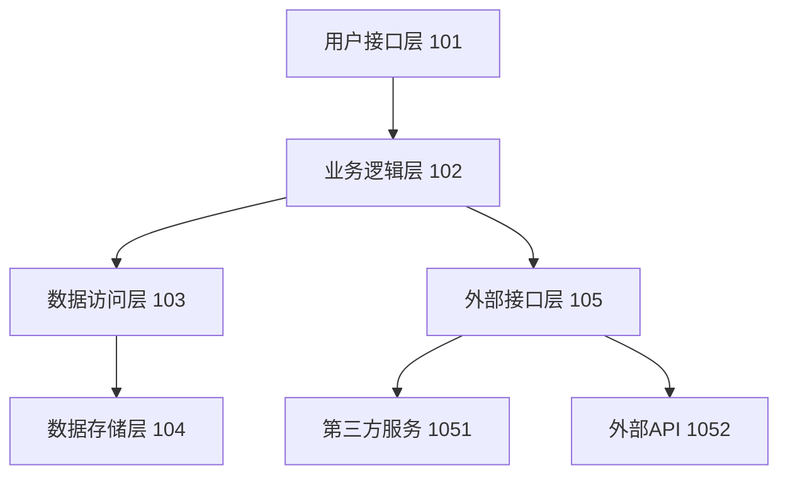
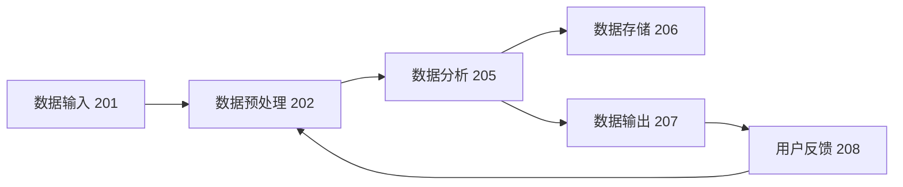
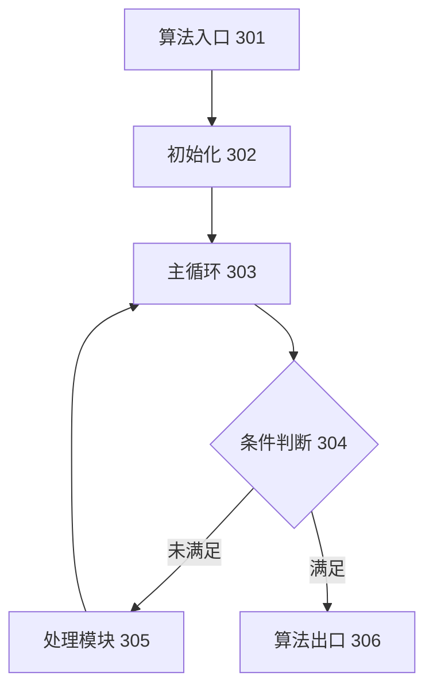

# 附图说明

# 附图说明

## 图1：系统架构图

图1展示了本发明所提出的智能数据处理系统的整体架构。如图1所示，系统采用分层架构设计，自上而下依次包括用户接口层、业务逻辑层、数据访问层、数据存储层以及外部接口层。各层之间通过明确的接口进行通信，实现了系统的高内聚低耦合特性。

用户接口层（模块101）负责与用户进行交互，包括数据输入界面、结果展示界面和系统配置界面。该层接收用户输入的操作指令和数据，并将处理结果以可视化方式呈现给用户。

业务逻辑层（模块102）是系统的核心处理单元，包含数据预处理模块（1021）、核心算法模块（1022）和结果生成模块（1023）。该层负责实现系统的核心功能，包括数据清洗、特征提取、算法计算和结果生成等关键步骤。

数据访问层（模块103）负责与数据存储层进行交互，提供统一的数据访问接口。该层包含数据查询模块（1031）、数据更新模块（1032）和数据缓存模块（1033），确保数据访问的高效性和一致性。

数据存储层（模块104）采用分布式存储架构，包括关系型数据库（1041）、非关系型数据库（1042）和文件存储系统（1043），满足不同类型数据的存储需求。

外部接口层（模块105）负责与外部系统进行交互，包括第三方服务接口（1051）和外部API接口（1052），实现系统与外部环境的数据交换和功能扩展。

本系统架构图与专利申请中的步骤101-105相对应，完整展示了系统的整体结构和各模块之间的关系，为理解本发明的技术方案提供了直观的视觉参考。

## 图2：数据流图

图2展示了本发明系统中数据的流动路径和处理过程。如图2所示，数据从输入到输出的完整流程包括数据输入、数据预处理、数据分析、数据存储、数据输出和用户反馈六个主要环节。

数据输入环节（步骤201）接收来自用户接口层的外部数据，包括原始数据集、配置参数和用户指令。该环节对应专利申请中的步骤201，负责获取系统运行所需的基础数据。

数据预处理环节（步骤202）对接收的原始数据进行清洗、转换和标准化处理。该环节包括数据清洗模块（2021）、数据转换模块（2022）和数据标准化模块（2023），对应专利申请中的步骤202-204，为后续分析提供高质量的数据基础。

数据分析环节（步骤205）是系统的核心处理环节，包括特征提取模块（2051）、模式识别模块（2052）和结果计算模块（2053）。该环节对应专利申请中的步骤205-207，通过核心算法对数据进行深度分析，提取有价值的信息和模式。

数据存储环节（步骤206）将分析结果和处理后的数据存储到数据存储层，包括临时存储（2061）和持久化存储（2062）。该环节对应专利申请中的步骤208，确保数据的安全保存和高效访问。

数据输出环节（步骤207）将分析结果以用户友好的方式呈现，包括可视化展示（2071）和报告生成（2072）。该环节对应专利申请中的步骤209，将系统处理结果反馈给用户。

用户反馈环节（步骤208）收集用户对输出结果的反馈，用于系统优化和算法改进。该环节对应专利申请中的步骤210，形成闭环的数据处理流程。

本数据流图与专利申请中的步骤201-210相对应，清晰展示了数据在系统中的完整生命周期和处理流程，有助于理解本发明中数据处理的逻辑关系和顺序。

## 图3：核心算法流程图

图3展示了本发明核心算法的详细流程和逻辑结构。如图3所示，核心算法采用迭代优化的设计思路，包括算法入口、初始化、主循环、条件判断、处理模块和算法出口六个主要部分。

算法入口（模块301）是算法的起始点，对应专利申请中的步骤301，负责接收输入参数和启动算法执行。

初始化模块（模块302）在算法开始执行前进行必要的初始化工作，包括参数设置（3021）、数据结构初始化（3022）和算法环境配置（3023）。该模块对应专利申请中的步骤302，为算法运行准备必要条件。

主循环模块（模块303）是算法的核心执行部分，采用迭代方式逐步优化结果。该模块包括迭代计算（3031）、结果评估（3032）和参数更新（3033）三个子模块，对应专利申请中的步骤303-305，实现算法的主要功能。

条件判断模块（模块304）在每次迭代后评估算法是否满足终止条件，包括收敛性判断（3041）、精度评估（3042）和迭代次数限制（3043）。该模块对应专利申请中的步骤306，决定算法是否继续执行或终止。

处理模块（模块305）根据条件判断的结果执行不同的处理逻辑，包括结果优化（3051）和异常处理（3052）。该模块对应专利申请中的步骤307，确保算法在各种情况下都能稳定运行。

算法出口（模块306）是算法的结束点，对应专利申请中的步骤308，负责输出最终结果和释放资源。

本核心算法流程图与专利申请中的步骤301-308相对应，详细展示了算法的执行流程和逻辑结构，为理解本发明的技术创新点提供了清晰的视觉参考。通过该图，可以直观地看到算法的迭代优化过程和条件判断机制，有助于本领域技术人员理解和实现本发明。
