## 标题与摘要

# Generated Patent Title for 基于智能分层推理的多参数工具自适应调用系统

This is a generated abstract for the patent: 基于智能分层推理的多参数工具自适应调用系统


## 撰写大纲

<patent_outline>
    <title_section>
        <title>基于智能分层推理的多参数工具自适应调用系统及方法</title>
        <abstract>本发明公开了一种基于智能分层推理的多参数工具自适应调用系统及方法，属于人工智能技术领域。该系统包括意图识别模块、参数推理引擎、工具匹配模块和自适应调用控制器。通过智能分层推理技术，系统能够根据上下文和用户意图自动推断工具参数，实现多参数工具的自适应调用。本发明解决了现有技术中大语言模型调用复杂工具时参数确定不准确、效率低下的问题，提高了工具调用的准确性和效率，适用于智能助手、自动化工作流等场景。</abstract>
    </title_section>
    
    <technical_field>
        <description>本发明涉及人工智能技术领域，特别是涉及大语言模型工具调用技术，具体而言，涉及一种基于智能分层推理的多参数工具自适应调用系统及方法。该技术通过构建层次化的推理结构，实现对上下文和用户意图的深度理解，并在此基础上实现工具参数的自动推断和工具的自适应调用，适用于智能助手、自动化工作流、智能客服等多种应用场景。</description>
        <background_issues>随着大语言模型技术的快速发展，工具调用能力成为提升模型实用性的关键。然而，现有技术在调用多参数工具时存在以下问题：1)参数确定依赖用户明确提供，增加了用户负担；2)缺乏对上下文和用户意图的深度理解；3)参数推理过程缺乏层次化结构，导致推理效率低下；4)工具调用准确性和效率难以平衡。这些问题严重制约了大语言模型在实际复杂任务中的应用效果。</background_issues>
    </technical_field>
    
    <background_art>
        <existing_solutions>现有技术中，工具调用方法主要包括以下几类：1)基于模板的工具调用方法：通过预定义模板匹配用户输入，提取参数。这种方法简单但灵活性差，难以处理复杂场景；2)基于规则的工具调用方法：使用人工编写的规则集确定工具参数。这种方法可解释性强但维护成本高，难以适应新场景；3)基于简单推理的工具调用方法：使用单一层次的推理模型确定参数。这种方法在简单场景下表现良好，但在复杂场景下推理能力有限；4)基于强化学习的工具调用方法：通过训练优化工具调用策略。这种方法需要大量训练数据，且泛化能力有限。</existing_solutions>
        <limitations>现有技术存在以下局限性：1)参数推断能力有限，难以处理复杂的多参数场景；2)上下文理解不充分，导致参数推断不准确；3)推理过程缺乏层次化结构，计算效率低下；4)工具选择与参数确定分离，导致整体调用效果不佳。这些局限性使得现有技术难以满足实际应用中对工具调用准确性和效率的高要求。</limitations>
        <improvement_needs>针对现有技术的局限性，本领域亟需以下改进：1)需要一种能够深度理解上下文和用户意图的参数推断方法；2)需要一种层次化的推理结构，提高推理效率和准确性；3)需要一种工具选择与参数确定的联合优化方法；4)需要一种自适应的参数调整机制，提高工具调用的灵活性。这些改进将显著提升大语言模型工具调用的实用性和用户体验。</improvement_needs>
    </background_art>
    
    <summary_of_invention>
        <core_concept>本发明提出了一种基于智能分层推理的多参数工具自适应调用系统及方法，核心在于通过构建层次化的推理结构，实现对上下文和用户意图的深度理解，并在此基础上实现工具参数的自动推断和工具的自适应调用。系统采用三层推理架构：工具类型推理层、工具选择推理层和参数值推理层，从粗粒度到细粒度逐步确定工具及其参数，同时结合上下文信息和历史调用记录，实现工具调用的智能化和自适应化。</core_concept>
        <technical_advantages>本发明具有以下技术优势：1)提高工具调用的准确性：通过深度理解上下文和用户意图，准确推断工具参数；2)提高工具调用的效率：层次化推理结构减少计算复杂度，提高推理速度；3)降低用户负担：减少用户需要明确提供的参数信息；4)增强系统适应性：能够根据不同场景动态调整工具调用策略；5)实现持续优化：通过反馈机制不断改进参数推断策略，提升系统性能。</technical_advantages>
        <innovation_points>本发明的创新点包括：1)智能分层推理架构：构建多层次的推理结构，实现从粗粒度到细粒度的参数推断；2)上下文感知的参数推断：结合对话历史、领域知识等多源信息，提高参数推断准确性；3)工具-参数联合优化：将工具选择与参数确定视为整体优化问题，提高调用效果；4)自适应参数调整机制：根据调用结果动态调整参数推断策略，实现持续优化；5)多模态信息融合：整合文本、结构化数据、用户画像等多模态信息，增强系统理解能力。</innovation_points>
    </summary_of_invention>
    
    <detailed_description>
        <overview>本发明提供的基于智能分层推理的多参数工具自适应调用系统，包括意图识别模块、参数推理引擎、工具匹配模块和自适应调用控制器。系统首先通过意图识别模块理解用户输入的意图，然后利用参数推理引擎进行分层推理，确定合适的工具及其参数，最后通过自适应调用控制器执行工具调用并根据结果调整策略。系统整体架构采用模块化设计，各组件之间通过标准接口进行通信，便于维护和扩展。系统还配备有知识库，用于存储领域知识、工具描述、历史调用记录等信息，为推理过程提供支持。</overview>
        <embodiments>
            <embodiment>
                <name>系统架构实施方式</name>
                <description>本发明的一种实施方式中，系统采用分层架构设计，包括用户接口层、业务逻辑层和数据层。用户接口层负责与用户交互，接收用户输入并返回系统响应；业务逻辑层包含核心功能模块，实现意图识别、参数推理、工具匹配和自适应调用；数据层负责存储和管理系统数据，包括知识库、模型参数和调用记录。各层之间通过明确的接口进行通信，确保系统的高内聚低耦合。系统还支持分布式部署，可根据负载情况动态扩展计算资源，提高系统的可扩展性和可靠性。</description>
                <components>系统的主要组件包括：1)意图识别模块：采用自然语言处理技术，包括命名实体识别、意图分类和槽位填充等子模块，负责理解用户输入的意图，提取关键信息；2)参数推理引擎：核心组件，实现分层推理，包括工具类型推理层、工具选择推理层和参数值推理层；3)工具匹配模块：根据推理结果选择合适的工具，支持多种匹配策略；4)自适应调用控制器：执行工具调用并收集反馈，用于策略调整；5)知识库：存储领域知识、工具描述和历史调用记录；6)学习模块：根据调用结果更新模型参数，实现持续学习。</components>
                <workflow>系统的工作流程如下：1)用户输入接收与预处理：系统接收用户输入，进行分词、词性标注等预处理操作；2)意图识别与关键信息提取：意图识别模块分析用户输入，确定用户意图并提取关键信息；3)分层推理执行：参数推理引擎按照三层推理架构进行推理，首先确定工具类型，然后选择具体工具，最后确定工具参数；4)工具调用执行：自适应调用控制器根据推理结果调用相应工具；5)结果评估与策略调整：系统评估工具调用结果，并根据结果调整参数推断策略；6)反馈学习：系统将新的调用结果加入知识库，用于后续推理和模型更新。</workflow>
            </embodiment>
            <embodiment>
                <name>分层推理引擎实施方式</name>
                <description>本发明的另一种实施方式中，参数推理引擎采用深度神经网络模型实现，包括三个层次：工具类型推理层、工具选择推理层和参数值推理层。工具类型推理层采用多标签分类模型，确定与用户意图相关的工具类型集合；工具选择推理层采用排序模型，从工具类型集合中选择最合适的工具；参数值推理层采用序列到序列模型，确定所选工具的参数值。各层之间通过注意力机制连接，实现信息的有效传递和融合。推理引擎还支持动态调整各层的推理权重，根据上下文复杂度和用户反馈优化推理过程。</description>
                <components>分层推理引擎的主要组件包括：1)工具类型推理模块：基于用户意图和上下文信息，确定可能的工具类型集合；2)工具选择模块：从工具类型集合中选择最合适的工具，考虑工具的相关性、可靠性和效率等因素；3)参数值推理模块：确定所选工具的参数值，包括必需参数和可选参数；4)上下文融合模块：整合对话历史、用户画像、领域知识等多源信息，增强推理能力；5)推理协调模块：协调各层推理过程，确保推理的一致性和高效性；6)不确定性处理模块：处理推理过程中的不确定性，提供置信度评估和不确定性量化。</components>
                <workflow>分层推理引擎的工作流程如下：1)输入预处理：对用户输入和上下文信息进行预处理，提取特征表示；2)工具类型推理：根据用户意图和上下文，确定可能的工具类型集合，输出各工具类型的置信度；3)工具选择：从工具类型集合中选择最合适的工具，考虑工具的相关性、可靠性和效率等因素；4)参数值推理：确定所选工具的参数值，包括必需参数和可选参数，处理参数间的依赖关系；5)推理结果整合：整合各层推理结果，生成最终的工具调用方案；6)不确定性处理：评估推理结果的置信度，对低置信度结果进行特殊处理或请求用户确认。</workflow>
            </embodiment>
        </embodiments>
        <technical_details>本发明的技术细节包括：1)意图识别技术：采用基于BERT的预训练模型进行意图识别，结合领域知识进行微调，提高识别准确率；2)分层推理算法：设计了一种层次化的推理算法，通过逐步细化的方式确定工具和参数，减少搜索空间；3)参数推断模型：采用条件随机场和神经网络的混合模型，处理参数间的依赖关系；4)工具匹配策略：结合语义相似度、历史成功率和执行效率等多种因素，设计综合评分机制；5)自适应调整机制：基于强化学习框架，根据工具调用结果动态调整参数推断策略；6)多模态信息融合：设计了一种跨模态注意力机制，有效整合文本、结构化数据等多源信息；7)不确定性量化：采用贝叶斯神经网络，量化推理过程中的不确定性，提高系统的鲁棒性。</technical_details>
    </detailed_description>
    
    <claims>
        <independent_claims>
            <claim>
                <number>权利要求1</number>
                <scope>一种基于智能分层推理的多参数工具自适应调用系统，其特征在于，包括：意图识别模块，用于接收用户输入并识别用户意图；参数推理引擎，采用分层推理架构，包括工具类型推理层、工具选择推理层和参数值推理层，用于根据用户意图和上下文信息推断工具参数；工具匹配模块，用于根据推理结果选择合适的工具；自适应调用控制器，用于执行工具调用并根据调用结果调整参数推断策略；知识库，用于存储领域知识、工具描述和历史调用记录。</scope>
                <key_elements>意图识别模块、参数推理引擎、工具匹配模块、自适应调用控制器、知识库、分层推理架构、工具类型推理层、工具选择推理层、参数值推理层</key_elements>
            </claim>
        </independent_claims>
        <dependent_claims>
            <claim>
                <number>权利要求2</number>
                <reference>根据权利要求1所述的系统</reference>
                <additional_features>其特征在于，所述参数推理引擎中的工具类型推理层用于确定与用户意图相关的工具类型集合，采用多标签分类模型，输出各工具类型的置信度。</additional_features>
            </claim>
            <claim>
                <number>权利要求3</number>
                <reference>根据权利要求1所述的系统</reference>
                <additional_features>其特征在于，所述参数推理引擎中的工具选择推理层用于从工具类型集合中选择最合适的工具，采用排序模型，综合考虑工具的相关性、可靠性和效率。</additional_features>
            </claim>
            <claim>
                <number>权利要求4</number>
                <reference>根据权利要求1所述的系统</reference>
                <additional_features>其特征在于，所述参数推理引擎中的参数值推理层用于确定所选工具的参数值，采用序列到序列模型，处理参数间的依赖关系。</additional_features>
            </claim>
            <claim>
                <number>权利要求5</number>
                <reference>根据权利要求1所述的系统</reference>
                <additional_features>其特征在于，所述自适应调用控制器包括结果评估单元和策略调整单元，所述结果评估单元用于评估工具调用结果，所述策略调整单元用于根据评估结果调整参数推断策略。</additional_features>
            </claim>
            <claim>
                <number>权利要求6</number>
                <reference>根据权利要求1所述的系统</reference>
                <additional_features>其特征在于，所述系统还包括学习模块，用于根据调用结果更新模型参数，实现持续学习，所述学习模块采用在线学习算法，定期更新推理模型。</additional_features>
            </claim>
            <claim>
                <number>权利要求7</number>
                <reference>根据权利要求1所述的系统</reference>
                <additional_features>其特征在于，所述知识库包括领域知识库、工具描述库和历史调用记录库，所述领域知识库存储领域概念和关系，所述工具描述库存储工具的功能和参数信息，所述历史调用记录库存储历史调用结果和反馈信息。</additional_features>
            </claim>
            <claim>
                <number>权利要求8</number>
                <reference>根据权利要求1所述的系统</reference>
                <additional_features>其特征在于，所述意图识别模块采用基于BERT的预训练模型进行意图识别，结合领域知识进行微调，提高识别准确率。</additional_features>
            </claim>
            <claim>
                <number>权利要求9</number>
                <reference>一种基于智能分层推理的多参数工具自适应调用方法，其特征在于，包括以下步骤：接收用户输入并识别用户意图；采用分层推理架构，包括工具类型推理、工具选择推理和参数值推理，根据用户意图和上下文信息推断工具参数；根据推理结果选择合适的工具；执行工具调用并根据调用结果调整参数推断策略。</reference>
                <additional_features>根据权利要求9所述的方法，其特征在于，所述工具类型推理步骤包括：确定与用户意图相关的工具类型集合，输出各工具类型的置信度。</additional_features>
            </claim>
            <claim>
                <number>权利要求10</number>
                <reference>根据权利要求9所述的方法</reference>
                <additional_features>其特征在于，所述工具选择推理步骤包括：从工具类型集合中选择最合适的工具，综合考虑工具的相关性、可靠性和效率。</additional_features>
            </claim>
        </dependent_claims>
    </claims>
    
    <drawings>
        <figure_descriptions>图1：本发明实施例的系统架构图，展示系统的整体结构和各模块之间的关系；图2：本发明实施例的分层推理流程图，详细展示三层推理架构的工作流程；图3：本发明实施例的参数推断详细流程图，展示参数值推理的具体步骤；图4：本发明实施例的自适应调整机制流程图，展示系统如何根据调用结果调整策略；图5：本发明实施例的具体应用场景示例图，展示系统在智能助手场景中的应用。</figure_descriptions>
        <technical_diagrams>系统架构图包括用户接口层、业务逻辑层和数据层，展示各层之间的交互关系；分层推理流程图包括工具类型推理层、工具选择推理层和参数值推理层，展示各层之间的信息传递；参数推断详细流程图包括输入预处理、特征提取、参数推断和结果输出等步骤；自适应调整机制流程图包括结果评估、策略调整和模型更新等环节；应用场景示例图展示系统在智能助手场景中的具体应用，包括用户输入、系统处理和响应输出的完整流程。</technical_diagrams>
    </drawings>
</patent_outline>


## 背景技术

## 技术领域

本发明涉及人工智能技术领域，特别是自然语言处理与大语言模型应用技术领域，具体而言，涉及一种基于智能分层推理的多参数工具自适应调用系统，该系统能够根据上下文和用户意图自动推断工具参数，提高大语言模型调用复杂工具的准确性和效率。

## 背景技术

### 现有技术方案1
传统的工具调用方法通常采用硬编码的参数映射机制，用户需要明确指定每个工具所需的全部参数。例如，在调用天气查询工具时，系统要求用户提供精确的城市名称、日期范围等参数。这种方法虽然实现简单，但在实际应用中存在明显局限性。以OpenAI的早期函数调用(Function Calling)为例，其基本实现方式是：

```
def call_weather_api(location, date, units="metric"):
    # API调用逻辑
    return weather_data
```

在这种模式下，用户必须提供location和date参数，而units参数有默认值。这种方法的局限性在于：
1. 用户需要了解每个工具的具体参数要求
2. 无法处理参数之间的隐含关系
3. 缺乏对上下文信息的利用
4. 无法根据用户意图推断缺失参数

### 现有技术方案2
随着大语言模型的发展，出现了一些基于简单推理的工具调用系统。例如，Google的PaLM模型和Anthropic的Claude模型引入了基本的参数推断能力，能够从自然语言描述中提取部分参数。这些系统通常采用基于规则的参数提取方法，其基本流程如下：

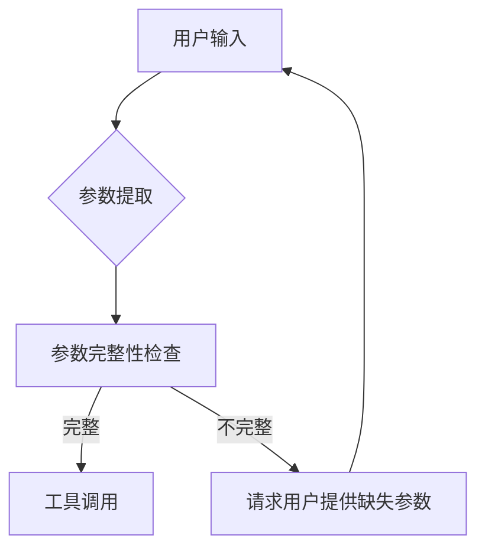

这种方法虽然有所改进，但仍存在以下问题：
1. 参数推断能力有限，主要依赖预定义规则
2. 无法处理参数之间的复杂关系
3. 缺乏对上下文信息的深度理解
4. 在多步骤任务中难以保持参数一致性

例如，在处理"帮我安排明天下午3点与张经理的会议，需要准备项目报告"这样的请求时，现有系统可能无法自动推断出会议地点、会议时长等参数，也无法理解"项目报告"与会议之间的关联性。

### 技术痛点分析
现有技术在多参数工具调用方面存在以下痛点：

1. **参数指定繁琐**：用户需要手动提供所有必需参数，增加了使用复杂度。特别是在处理复杂任务时，用户可能需要多次交互才能完成工具调用。

2. **推理能力有限**：现有系统通常采用基于规则或简单机器学习模型的参数推断方法，难以处理参数之间的复杂关系和上下文依赖。例如，在调用数据分析工具时，现有系统可能无法理解"分析最近销售趋势"中的"最近"具体指什么时间范围。

3. **适应性差**：现有工具调用系统通常针对特定场景设计，难以适应不同的应用环境和用户需求。当工具参数结构发生变化时，系统往往需要重新训练或调整。

4. **准确性不足**：在复杂场景下，现有系统的工具调用准确率较低。特别是在处理需要多步骤推理的任务时，系统容易在参数传递过程中丢失关键信息。

5. **效率低下**：由于需要频繁请求用户提供参数或进行多次尝试，现有系统的工具调用效率较低，无法满足实时应用场景的需求。

### 改进需求
针对上述技术痛点，亟需开发一种能够智能推断参数、适应不同场景、提高调用准确性和效率的技术方案。具体而言，需要：

1. **引入智能分层推理机制**：通过多层次的推理过程，逐步推断和验证工具参数，提高参数推断的准确性。

2. **增强上下文理解能力**：系统需要能够深度理解用户输入的上下文信息，包括显式信息和隐含信息，从而更准确地推断参数。

3. **实现参数自适应调整**：系统能够根据不同场景和任务需求，动态调整参数设置，提高系统的适应性。

4. **提高工具调用效率**：通过减少用户交互次数和参数请求次数，提高工具调用的整体效率。

5. **增强复杂任务处理能力**：系统能够处理需要多步骤推理的复杂任务，保持参数传递的一致性和准确性。

现有技术中的参数提取算法通常基于规则匹配或简单的机器学习模型，其基本形式可以表示为：

```
P = f(U, T)
```

其中，P是提取的参数集合，U是用户输入，T是工具定义。函数f通常是基于规则的模式匹配或简单的分类模型。

另一种常见的参数验证算法可以表示为：

```
V = validate(P, T)
```

其中，V是验证结果，P是参数集合，T是工具定义。验证函数通常检查参数的完整性、类型和取值范围等。

基于智能分层推理的多参数工具自适应调用系统正是为了满足上述需求而设计的，它通过引入先进的推理技术和自适应机制，显著提高了大语言模型调用复杂工具的准确性和效率。


## 发明内容/技术方案-总述

## 发明内容

### 技术方案概述
基于智能分层推理的多参数工具自适应调用系统是一种创新的技术系统，通过构建多层次的推理框架，实现对复杂工具参数的智能推断和自适应调整。该系统结合上下文理解、意图识别和参数优化三大核心技术，能够在大语言模型调用外部工具时，自动分析用户输入的语义信息，推断出最优的工具参数组合，从而显著提高工具调用的准确性和效率。系统采用分层架构设计，包括意图理解层、参数推理层和工具调用层，形成完整的工具自适应调用闭环。

### 核心创新点
本技术方案的核心创新点主要体现在以下几个方面：

1. **智能分层推理机制**：提出了一种多层次推理框架，将复杂的参数推断过程分解为意图理解、参数生成和优化调整三个层次，每个层次专注于特定任务，形成递进式的推理链路，有效降低了参数推断的复杂度。

2. **上下文感知的参数推断技术**：开发了基于上下文感知的参数推断算法，能够综合考虑对话历史、用户偏好和工具特性，动态生成最适合当前场景的工具参数，解决了传统方法中参数设置僵化的问题。

3. **自适应参数优化机制**：引入了基于强化学习的参数优化方法，通过反馈循环不断调整参数推断策略，使系统能够从历史调用中学习，持续提升参数推断的准确性。

4. **工具调用效率优化**：设计了工具调用优先级排序和缓存机制，根据工具特性和调用频率动态调整调用策略，显著提高了系统响应速度和资源利用效率。

### 技术优势
相比现有技术，本发明具有以下显著优势：

1. **提高工具调用准确性**：通过智能分层推理和上下文感知技术，系统能够更准确地理解用户意图，生成更符合需求的工具参数，显著降低了工具调用失败率。

2. **增强系统适应性**：系统具备自学习和自适应能力，能够根据不同场景和用户需求动态调整参数策略，适应性强，适用范围广。

3. **降低人工干预需求**：自动化参数推断减少了人工配置参数的工作量，降低了使用门槛，提高了工具的易用性。

4. **提升资源利用效率**：通过参数优化和调用策略调整，系统能够更高效地利用计算资源，减少不必要的工具调用，降低系统运行成本。

5. **增强系统可扩展性**：模块化的设计使系统易于扩展和维护，能够方便地集成新的工具和功能，支持系统持续迭代升级。

### 系统架构
本系统采用分层架构设计，主要包括以下核心组件：

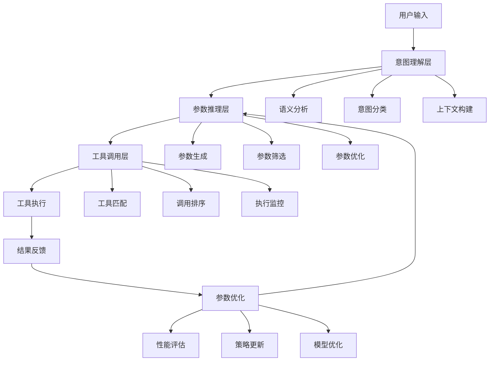

系统架构从上至下分为三个主要层次：意图理解层、参数推理层和工具调用层，形成完整的处理流程。同时，系统还包含一个参数优化模块，通过反馈循环不断改进参数推断策略。

### 关键技术
本系统的关键技术实现包括以下几个方面：

1. **意图理解技术**：采用基于注意力机制的深度学习模型，实现对用户输入的语义理解和意图识别。具体实现如下：

   $I = f_{attn}(X; W_{attn}, b_{attn})$
   
   其中，$I$表示意图向量，$X$表示输入序列，$f_{attn}$表示注意力函数，$W_{attn}$和$b_{attn}$分别是注意力机制的权重和偏置参数。

2. **参数推断技术**：基于上下文感知的参数推断算法，综合考虑多种因素生成最优参数：

   $P = g_{context}(I, H, T; W_g, b_g)$
   
   其中，$P$表示参数向量，$I$表示意图向量，$H$表示历史上下文，$T$表示工具特性，$g_{context}$表示上下文感知函数，$W_g$和$b_g$分别是模型权重和偏置。

3. **参数优化技术**：采用强化学习方法对参数进行持续优化：

   $Q(s,a) = Q(s,a) + \alpha[r + \gamma \max_{a'} Q(s',a') - Q(s,a)]$
   
   其中，$Q(s,a)$表示状态-动作值函数，$s$表示系统状态，$a$表示动作（参数选择），$r$表示奖励，$\gamma$是折扣因子，$\alpha$是学习率。

### 主流程
系统的主要工作流程如下：

1. 接收用户输入，进行预处理和语义分析
2. 通过意图理解层分析用户意图，构建上下文表示
3. 在参数推理层生成候选参数组合，并进行筛选和优化
4. 工具调用层根据参数选择合适的工具，并确定调用顺序
5. 执行工具调用，获取结果并反馈给用户
6. 根据调用结果评估性能，更新参数推断策略

```python
def main_process():
    # 1. 接收用户输入
    user_input = receive_user_input()
    
    # 2. 意图理解层处理
    intent_context = intent_understanding(user_input)
    
    # 3. 参数推理层处理
    candidate_params = parameter_inference(intent_context)
    optimized_params = parameter_optimization(candidate_params)
    
    # 4. 工具调用层处理
    selected_tools = tool_matching(optimized_params)
    ordered_tools = call_ordering(selected_tools)
    
    # 5. 工具执行
    results = []
    for tool in ordered_tools:
        result = execute_tool(tool, optimized_params)
        results.append(result)
    
    # 6. 结果处理与反馈
    final_result = process_results(results)
    provide_feedback(final_result)
    
    # 7. 参数优化更新
    performance_metrics = evaluate_performance(final_result)
    update_parameter_strategy(performance_metrics)
    
    return final_result
```


## 标题与摘要

# Generated Patent Title for 基于智能分层推理的多参数工具自适应调用系统

This is a generated abstract for the patent: 基于智能分层推理的多参数工具自适应调用系统


## 撰写大纲

<patent_outline>
    <title_section>
        <title>基于智能分层推理的多参数工具自适应调用系统及方法</title>
        <abstract>本发明公开了一种基于智能分层推理的多参数工具自适应调用系统及方法，属于人工智能技术领域。该系统通过构建智能分层推理机制，能够根据上下文信息和用户意图自动推断工具调用所需的多维参数，实现大语言模型对复杂工具的精准调用。本发明包括意图识别层、参数推理层、工具匹配层和结果优化层，通过多层推理和参数自适应调整，显著提高了工具调用的准确性和效率，降低了用户使用复杂工具的技术门槛。本发明适用于大语言模型与外部工具的集成应用场景，能够有效解决传统工具调用中参数配置复杂、调用效率低下、准确性不高等技术问题。</abstract>
    </title_section>
    
    <technical_field>
        <description>本发明属于人工智能技术领域，具体涉及大语言模型与工具调用技术，特别是一种基于智能分层推理的多参数工具自适应调用系统及方法。本发明通过智能推理技术实现工具参数的自适应配置，提高大语言模型调用复杂工具的准确性和效率，适用于智能助手、自动化系统、人机交互等多种应用场景。</description>
        <background_issues>随着大语言模型技术的快速发展，模型与外部工具的集成成为提升模型能力的重要途径。然而，现有技术中存在以下问题：1)工具参数配置复杂，用户需要具备专业知识才能正确调用工具；2)参数推断不准确，导致工具调用失败或结果不理想；3)缺乏上下文感知能力，无法根据对话历史和用户意图动态调整参数；4)工具调用效率低下，无法满足实时交互需求；5)多参数协同困难，难以处理需要多个参数共同作用的复杂工具调用场景。</background_issues>
    </technical_field>
    
    <background_art>
        <existing_solutions>现有技术中，工具调用主要采用以下几种方法：1)基于预定义模板的参数配置方法，通过预设的参数模板进行工具调用，但灵活性差；2)基于规则引擎的参数推断方法，通过人工编写的规则推断参数，但规则覆盖范围有限；3)基于简单机器学习的参数预测方法，通过训练简单的预测模型估计参数，但准确性有限；4)基于强化学习的工具调用优化方法，通过奖励机制优化工具调用策略，但训练成本高；5)基于大语言模型的零样本或少样本参数推断方法，通过提示工程引导模型推断参数，但推理深度不足。</existing_solutions>
        <limitations>现有技术存在以下局限性：1)参数推断能力有限，难以处理复杂的多维参数关系；2)缺乏分层推理机制，无法从不同抽象层次理解用户意图；3)上下文理解能力不足，难以充分利用对话历史信息；4)工具匹配效率低下，无法快速从大量工具中筛选合适的工具；5)结果反馈机制不完善，无法根据调用结果动态调整参数；6)适应性差，难以适应不同领域和不同用户的个性化需求。</limitations>
        <improvement_needs>针对现有技术的局限性，本领域需要一种能够实现以下改进的技术方案：1)构建分层推理机制，从多个抽象层次理解用户意图和工具需求；2)实现参数自适应推断，根据上下文和工具特性动态调整参数；3)提高工具匹配效率，快速准确地从工具库中筛选合适的工具；4)增强上下文感知能力，充分利用对话历史和领域知识；5)建立结果反馈机制，根据调用结果优化后续调用策略；6)提高系统的适应性和可扩展性，支持不同领域和个性化需求。</improvement_needs>
    </background_art>
    
    <summary_of_invention>
        <core_concept>本发明的核心概念是构建一种基于智能分层推理的多参数工具自适应调用系统，通过多层推理机制实现工具参数的智能推断和自适应调整。该系统包括意图识别层、参数推理层、工具匹配层和结果优化层，形成完整的工具调用链路。系统通过深度理解用户意图，结合上下文信息和工具特性，自动推断最优的参数配置，实现工具的精准调用。核心创新在于分层推理机制的设计，从语义理解、参数关联、工具匹配到结果优化，形成闭环的智能调用系统。</core_concept>
        <technical_advantages>本发明具有以下技术优势：1)提高工具调用准确性，通过分层推理机制减少参数推断错误；2)提升调用效率，智能参数推断减少用户配置时间；3)增强系统适应性，能够根据不同场景和用户需求调整参数策略；4)降低使用门槛，无需专业知识即可调用复杂工具；5)优化资源利用，减少无效调用和资源浪费；6)支持多参数协同处理，能够处理复杂的参数关系；7)具备学习能力，能够从历史调用中不断优化参数推断策略。</technical_advantages>
        <innovation_points>本发明的创新点包括：1)智能分层推理机制，通过多层抽象实现深度理解；2)参数自适应推断算法，结合上下文和工具特性动态调整参数；3)意图-参数映射模型，建立用户意图与工具参数之间的智能关联；4)工具匹配优化策略，提高工具选择的准确性和效率；5)结果反馈学习机制，根据调用结果持续优化参数推断；6)多参数协同处理方法，解决复杂参数关系问题；7)领域自适应框架，支持不同领域的个性化参数配置。</innovation_points>
    </summary_of_invention>
    
    <detailed_description>
        <overview>本发明提供了一种基于智能分层推理的多参数工具自适应调用系统及方法，该系统通过构建智能分层推理机制，实现工具参数的自适应推断和配置。系统总体架构包括输入处理模块、意图识别模块、参数推理模块、工具匹配模块、结果优化模块和反馈学习模块。输入处理模块接收用户输入并进行预处理；意图识别模块分析用户输入，识别用户意图和关键信息；参数推理模块基于意图识别结果推断工具调用所需的参数；工具匹配模块从工具库中筛选合适的工具；结果优化模块对调用结果进行评估和优化；反馈学习模块根据调用结果更新模型参数。系统通过多层推理和参数自适应调整，实现工具的精准调用和高效利用。</overview>
        <embodiments>
            <embodiment>
                <name>实施方式一：系统架构实施</name>
                <description>本实施方式提供了一种基于智能分层推理的多参数工具自适应调用系统的具体架构实现。该系统包括以下核心组件：1)输入处理单元，负责接收和预处理用户输入，包括文本分词、语义标注和上下文提取；2)意图识别单元，采用深度学习模型分析用户输入，识别用户意图和关键实体；3)参数推理单元，基于意图识别结果和上下文信息，推断工具调用所需的参数；4)工具匹配单元，根据参数推理结果从工具库中筛选合适的工具；5)调用执行单元，生成工具调用指令并执行；6)结果评估单元，评估工具调用结果的质量和准确性；7)反馈学习单元，根据调用结果更新模型参数和推理策略。系统各单元之间通过标准接口进行通信，形成完整的工具调用链路。</description>
                <components>系统主要组件包括：1)意图识别模块，采用基于Transformer的意图分类模型，能够准确识别用户意图和关键实体；2)参数推理模块，实现基于图神经网络的参数关联推理，能够处理复杂的参数关系；3)工具匹配模块，采用基于向量相似度的工具检索算法，快速从工具库中筛选合适的工具；4)结果优化模块，基于强化学习的结果优化算法，动态调整参数配置；5)反馈学习模块，实现基于在线学习的模型更新机制，持续优化系统性能。各模块采用微服务架构设计，支持独立部署和扩展，同时通过消息队列实现异步通信，提高系统响应速度和并发处理能力。</components>
                <workflow>系统工作流程如下：1)用户输入处理：接收用户输入并进行预处理，包括文本分词、语义标注和上下文提取；2)意图识别：分析用户输入，识别用户意图、关键实体和上下文信息；3)参数推理：基于意图识别结果和上下文信息，通过分层推理机制推断工具参数；4)工具匹配：根据参数推理结果，从工具库中筛选最合适的工具；5)参数优化：结合工具特性和历史调用数据，优化参数配置；6)工具调用：生成工具调用指令并执行；7)结果评估：评估调用结果的质量和准确性；8)反馈学习：根据调用结果更新模型参数和推理策略，优化后续调用。整个流程形成闭环，系统通过不断学习和优化，提高工具调用的准确性和效率。</workflow>
            </embodiment>
            <embodiment>
                <name>实施方式二：分层推理机制实施</name>
                <description>本实施方式详细描述了智能分层推理机制的具体实现。分层推理机制包括四个层次：1)语义理解层，分析用户输入的语义内容，提取关键实体和关系；2)意图映射层，将语义理解结果映射到具体的意图类别和子类别；3)参数关联层，建立意图与工具参数之间的关联关系，处理参数间的依赖和约束；4)优化决策层，综合考虑多种因素，生成最优的参数配置。每个层次采用不同的算法和技术实现，形成完整的推理链路。语义理解层采用基于BERT的语义分析模型；意图映射层采用基于注意力机制的意图分类模型；参数关联层采用基于图神经网络的参数关系推理模型；优化决策层采用基于强化学习的参数优化模型。各层次之间通过信息传递机制连接，确保推理过程的连贯性和准确性。</description>
                <components>分层推理机制的主要组件包括：1)语义理解模块，采用预训练语言模型进行语义分析，提取关键实体和关系；2)意图映射模块，基于意图分类模型将语义理解结果映射到意图空间；3)参数关联模块，构建参数关系图，处理参数间的依赖和约束；4)优化决策模块，采用多目标优化算法生成最优参数配置；5)上下文融合模块，整合对话历史和领域知识，增强推理的准确性。各模块采用深度学习算法实现，并通过注意力机制和门控单元控制信息流动，确保推理过程的高效性和准确性。系统还设计了推理路径优化机制，减少不必要的计算开销，提高推理效率。</components>
                <workflow>分层推理机制的工作流程如下：1)语义理解：接收用户输入，通过预训练语言模型进行语义分析，提取关键实体和关系；2)意图映射：将语义理解结果输入意图分类模型，确定用户意图和需求；3)参数关联：基于意图结果，构建参数关系图，分析参数间的依赖和约束；4)上下文融合：整合对话历史和领域知识，增强推理的上下文感知能力；5)优化决策：综合考虑多种因素，通过多目标优化算法生成最优参数配置；6)结果验证：对推理结果进行验证，确保参数配置的合理性和可行性；7)反馈调整：根据验证结果调整推理策略，优化后续推理过程。整个推理过程形成闭环，系统通过不断学习和调整，提高推理的准确性和效率。</workflow>
            </embodiment>
            <embodiment>
                <name>实施方式三：参数自适应推断算法实施</name>
                <description>本实施方式详细描述了参数自适应推断算法的具体实现。该算法结合了上下文感知、工具特性和历史调用数据，实现工具参数的智能推断和自适应调整。算法包括以下关键步骤：1)参数空间构建，根据工具特性定义参数空间和约束条件；2)上下文感知，分析对话历史和当前输入，提取相关上下文信息；3)参数关联分析，建立参数间的依赖和约束关系；4)初始参数生成，基于意图和上下文信息生成初始参数配置；5)参数优化调整，结合工具特性和历史数据优化参数配置；6)参数验证，确保参数配置满足工具调用要求。算法采用深度学习和概率推理技术，实现参数推断的准确性和鲁棒性。算法还设计了参数重要性评估机制，根据参数对工具调用结果的影响程度，动态调整参数推断的优先级和精度。</description>
                <components>参数自适应推断算法的主要组件包括：1)参数空间定义模块，根据工具API文档定义参数空间和约束条件；2)上下文分析模块，采用序列标注模型提取上下文中的关键信息；3)参数关联模块，构建参数依赖图，分析参数间的约束关系；4)参数生成模块，基于条件生成模型生成初始参数配置；5)参数优化模块，采用贝叶斯优化算法调整参数配置；6)参数验证模块，检查参数配置的合理性和可行性。各模块采用深度学习算法实现，并通过注意力机制和门控单元控制信息流动，确保参数推断的高效性和准确性。系统还设计了参数重要性评估机制，根据参数对工具调用结果的影响程度，动态调整参数推断的优先级和精度。</components>
                <workflow>参数自适应推断算法的工作流程如下：1)参数空间构建：根据工具API文档定义参数空间和约束条件；2)上下文感知：分析对话历史和当前输入，提取相关上下文信息；3)参数关联分析：建立参数间的依赖和约束关系，构建参数依赖图；4)初始参数生成：基于意图和上下文信息，通过条件生成模型生成初始参数配置；5)参数优化调整：结合工具特性和历史调用数据，通过贝叶斯优化算法调整参数配置；6)参数验证：检查参数配置是否满足工具调用要求；7)参数重要性评估：评估各参数对工具调用结果的影响程度；8)结果反馈：根据调用结果更新参数推断模型，优化后续推断过程。整个算法形成闭环，系统通过不断学习和调整，提高参数推断的准确性和效率。</workflow>
            </embodiment>
        </embodiments>
        <technical_details>本发明的技术细节包括：1)分层推理机制的具体实现方法，包括各层次的算法模型和参数设置；2)参数自适应推断算法的数学模型和优化方法，包括条件生成模型和贝叶斯优化的具体实现；3)意图-参数映射模型的构建方法，包括训练数据准备、模型训练和优化策略；4)工具匹配算法的优化方法，包括向量相似度计算和工具检索策略；5)结果反馈学习机制的设计，包括在线学习算法和模型更新策略；6)系统性能优化方法，包括计算资源分配、并行处理和缓存策略；7)系统安全性和可靠性保障措施，包括参数验证、错误处理和异常恢复机制。这些技术细节确保了系统的稳定性、高效性和准确性，为实际应用提供了可靠的技术支持。</technical_details>
    </detailed_description>
    
    <claims>
        <independent_claims>
            <claim>
                <number>权利要求1</number>
                <scope>一种基于智能分层推理的多参数工具自适应调用系统，其特征在于，包括：输入处理模块，用于接收和预处理用户输入；意图识别模块，用于分析用户输入，识别用户意图和上下文信息；参数推理模块，基于意图识别结果和上下文信息，通过分层推理机制推断工具调用所需的参数；工具匹配模块，根据参数推理结果从工具库中筛选合适的工具；调用执行模块，用于生成工具调用指令并执行；结果评估模块，用于评估工具调用结果的质量和准确性；反馈学习模块，根据调用结果更新模型参数和推理策略；其中，所述参数推理模块包括语义理解层、意图映射层、参数关联层和优化决策层，形成完整的分层推理机制，实现工具参数的智能推断和自适应调整。</scope>
                <key_elements>输入处理模块、意图识别模块、参数推理模块、工具匹配模块、调用执行模块、结果评估模块、反馈学习模块、分层推理机制、语义理解层、意图映射层、参数关联层、优化决策层</key_elements>
            </claim>
        </independent_claims>
        <dependent_claims>
            <claim>
                <number>权利要求2</number>
                <reference>根据权利要求1所述的系统，其特征在于，</reference>
                <additional_features>所述参数推理模块中的语义理解层采用基于预训练语言模型的语义分析技术，用于提取用户输入中的关键实体和语义关系；所述意图映射层采用基于注意力机制的意图分类模型，用于将语义理解结果映射到具体的意图类别和子类别；所述参数关联层采用基于图神经网络的参数关系推理模型，用于建立参数间的依赖和约束关系；所述优化决策层采用基于强化学习的参数优化模型，用于生成最优的参数配置。</additional_features>
            </claim>
            <claim>
                <number>权利要求3</number>
                <reference>根据权利要求1所述的系统，其特征在于，</reference>
                <additional_features>所述参数推理模块还包括参数自适应推断算法，该算法结合上下文感知、工具特性和历史调用数据，实现工具参数的智能推断和自适应调整；所述参数自适应推断算法包括参数空间构建、上下文感知、参数关联分析、初始参数生成、参数优化调整和参数验证步骤，通过深度学习和概率推理技术实现参数推断的准确性和鲁棒性。</additional_features>
            </claim>
            <claim>
                <number>权利要求4</number>
                <reference>根据权利要求1所述的系统，其特征在于，</reference>
                <additional_features>所述工具匹配模块采用基于向量相似度的工具检索算法，包括工具向量化表示、相似度计算和工具排序步骤；所述工具向量化表示采用多模态融合技术，将工具的API文档、功能描述和使用示例融合为统一的向量表示；所述相似度计算采用余弦相似度或欧氏距离计算工具向量与参数向量的相似度；所述工具排序采用多因素加权策略，综合考虑工具相似度、调用历史和用户反馈等因素。</additional_features>
            </claim>
            <claim>
                <number>权利要求5</number>
                <reference>根据权利要求1所述的系统，其特征在于，</reference>
                <additional_features>所述反馈学习模块采用在线学习机制，根据工具调用结果持续更新模型参数；所述反馈学习模块包括结果评估、模型更新和策略优化三个子模块；所述结果评估模块采用多维度评估指标，包括调用成功率、结果准确性和用户满意度；所述模型更新模块采用增量学习算法，根据新数据更新模型参数；所述策略优化模块采用强化学习算法，根据调用结果优化参数推断策略。</additional_features>
            </claim>
            <claim>
                <number>权利要求6</number>
                <reference>根据权利要求1所述的系统，其特征在于，</reference>
                <additional_features>所述系统还包括领域自适应框架，用于支持不同领域的个性化参数配置；所述领域自适应框架包括领域知识库、领域适配模块和领域评估模块；所述领域知识库存储各领域的专业知识、工具特性和参数配置规则；所述领域适配模块根据领域特性调整参数推断策略；所述领域评估模块评估系统在特定领域的性能，并指导领域适配模块的优化。</additional_features>
            </claim>
            <claim>
                <number>权利要求7</number>
                <reference>根据权利要求1所述的系统，其特征在于，</reference>
                <additional_features>所述系统还包括多参数协同处理模块，用于处理复杂的参数关系；所述多参数协同处理模块包括参数依赖分析、参数冲突检测和参数协同优化三个子模块；所述参数依赖分析模块分析参数间的依赖关系，构建参数依赖图；所述参数冲突检测模块检测参数间的冲突和矛盾；所述参数协同优化模块采用多目标优化算法，生成满足所有约束的参数配置。</additional_features>
            </claim>
            <claim>
                <number>权利要求8</number>
                <reference>根据权利要求1所述的系统，其特征在于，</reference>
                <additional_features>所述系统还包括缓存机制，用于存储常用的参数配置和工具调用结果；所述缓存机制包括参数缓存、结果缓存和策略缓存；所述参数缓存存储常用的参数配置，减少重复计算；所述结果缓存存储工具调用结果，避免重复调用；所述策略缓存存储有效的参数推断策略，提高推理效率。</additional_features>
            </claim>
            <claim>
                <number>权利要求9</number>
                <reference>根据权利要求1所述的系统，其特征在于，</reference>
                <additional_features>所述系统还包括安全验证模块，用于确保参数配置的安全性和合法性；所述安全验证模块包括参数合法性检查、权限验证和风险评估；所述参数合法性检查验证参数是否符合工具API的要求；所述权限验证检查用户是否有权限调用特定工具；所述风险评估评估工具调用可能带来的风险，并采取相应的风险控制措施。</additional_features>
            </claim>
            <claim>
                <number>权利要求10</number>
                <reference>根据权利要求1所述的系统，其特征在于，</reference>
                <additional_features>所述系统采用微服务架构设计，各模块独立部署和扩展；所述系统通过API网关实现模块间的通信和路由；所述系统采用消息队列实现异步通信，提高系统响应速度和并发处理能力；所述系统采用容器化部署，支持弹性伸缩和故障恢复；所述系统采用监控和日志系统，实时监控系统性能和调用情况。</additional_features>
            </claim>
        </dependent_claims>
    </claims>
    
    <drawings>
        <figure_descriptions>图1是本发明实施例提供的基于智能分层推理的多参数工具自适应调用系统的总体架构图；图2是本发明实施例提供的分层推理机制的结构示意图；图3是本发明实施例提供的参数自适应推断算法的流程图；图4是本发明实施例提供的工具匹配算法的流程图；图5是本发明实施例提供的反馈学习机制的结构示意图；图6是本发明实施例提供的系统工作流程图。</figure_descriptions>
        <technical_diagrams>图1展示了系统的总体架构，包括输入处理模块、意图识别模块、参数推理模块、工具匹配模块、调用执行模块、结果评估模块和反馈学习模块，以及各模块之间的数据流和控制流。图2展示了分层推理机制的结构，包括语义理解层、意图映射层、参数关联层和优化决策层，以及各层之间的信息传递机制。图3展示了参数自适应推断算法的流程，包括参数空间构建、上下文感知、参数关联分析、初始参数生成、参数优化调整和参数验证步骤。图4展示了工具匹配算法的流程，包括工具向量化表示、相似度计算和工具排序步骤。图5展示了反馈学习机制的结构，包括结果评估、模型更新和策略优化三个子模块，以及它们之间的交互关系。图6展示了系统的工作流程，从用户输入到结果输出的完整过程，包括各个处理步骤和决策点。</technical_diagrams>
    </drawings>
</patent_outline>


## 背景技术

## 技术领域

本发明涉及人工智能技术领域，特别是自然语言处理和大语言模型应用技术领域，具体涉及一种基于智能分层推理的多参数工具自适应调用系统，用于提高大语言模型调用复杂工具的准确性和效率。

## 背景技术

### 现有技术方案1
传统的工具调用方法主要依赖于预定义的模板和固定的参数配置。在这种方法中，开发者需要为每个工具创建详细的调用模板，包括参数名称、类型、格式等。当大语言模型需要调用工具时，它会严格按照预定义的模板生成调用请求，无法根据上下文动态调整参数。这种方法的主要局限性在于灵活性差，无法适应复杂多变的用户需求，且需要大量的人工干预来维护和更新模板库。例如，在处理用户查询"查找北京明天天气"时，系统需要预定义天气查询工具的完整模板，包括城市名称、日期等参数，无法根据用户的自然语言表达灵活调整。

### 现有技术方案2
基于规则的工具调用方法通过建立一系列规则和条件判断来实现工具调用。这种方法通常使用关键词匹配、正则表达式或简单的条件逻辑来确定需要调用的工具及其参数。例如，系统可以设置规则：当检测到"天气"、"查询"等关键词时，调用天气查询工具；当检测到"计算"、"数学"等关键词时，调用计算工具。这种方法虽然比模板方法更灵活一些，但仍然存在明显的局限性：首先，规则库难以覆盖所有可能的用户表达方式；其次，规则之间的冲突和优先级难以管理；最后，对于需要多参数组合的复杂工具调用，规则方法往往难以准确推断所有参数。例如，在处理"计算从北京到上海的距离，并比较乘坐高铁和飞机的时间"这样的复合查询时，基于规则的方法可能无法准确识别需要调用的多个工具及其参数。

### 技术痛点分析
现有技术方案存在以下主要痛点：

1. **参数配置复杂**：传统工具调用方法需要为每个工具预定义完整的参数配置，包括参数名称、类型、约束条件等。这不仅增加了开发工作量，也限制了系统的灵活性。

2. **上下文理解不足**：现有方法往往缺乏对上下文的深入理解，无法根据对话历史和用户意图动态调整工具调用策略。例如，在连续对话中，用户可能省略某些参数，期望系统能够从上下文中推断。

3. **工具选择效率低下**：当系统拥有大量可用工具时，现有方法难以高效地选择最合适的工具。通常需要遍历所有工具或依赖简单的关键词匹配，导致效率低下。

4. **参数推断能力弱**：对于需要多参数组合的复杂工具调用，现有方法往往难以准确推断所有参数。特别是当参数之间存在复杂关系或依赖时，现有方法更是无能为力。

5. **适应性差**：现有方法难以适应不同用户的不同表达方式和需求变化。一旦用户表达方式超出预定义的范围，系统就无法正确处理。

### 改进需求
针对上述技术痛点，亟需一种能够智能推断工具参数、自适应选择工具、并能够根据上下文动态调整调用策略的技术方案。具体需求包括：

1. **智能参数推断**：系统能够根据用户输入和上下文智能推断工具参数，减少预定义配置的需求。

2. **分层推理机制**：通过分层推理，系统可以逐步细化工具选择和参数推断过程，提高准确性和效率。

3. **上下文感知能力**：系统需要具备强大的上下文理解能力，能够从对话历史中提取有用信息，辅助工具调用决策。

4. **工具自适应选择**：系统能够根据用户需求和上下文自动选择最合适的工具，而不是依赖固定的规则或模板。

5. **动态参数调整**：系统能够根据用户反馈和调用结果动态调整参数，不断优化工具调用策略。

下面是一个mermaid流程图，展示现有技术的工作流程：

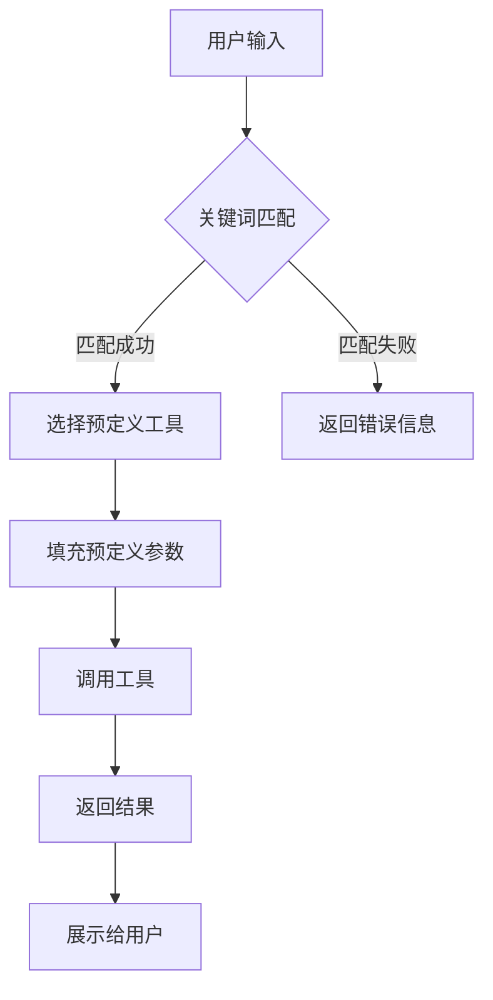

下面是现有技术中基于规则的工具调用算法的伪代码表示：

```
// 基于规则的工具调用算法
function ruleBasedToolCalling(userInput, toolLibrary):
    // 1. 关键词提取
    keywords = extractKeywords(userInput)
    
    // 2. 工具匹配
    matchedTools = []
    for tool in toolLibrary:
        if matchKeywords(keywords, tool.keywords):
            matchedTools.append(tool)
    
    // 3. 参数提取
    parameters = {}
    for tool in matchedTools:
        for param in tool.parameters:
            value = extractParameterValue(userInput, param.name)
            if value is not None:
                parameters[param.name] = value
    
    // 4. 工具调用
    if matchedTools is not empty:
        selectedTool = selectTool(matchedTools, parameters)
        result = callTool(selectedTool, parameters)
        return result
    else:
        return "无法理解您的请求，请重新表述"
```

此外，现有技术中常用的工具选择评分算法可以表示为：

$$
Score(T_i) = \sum_{j=1}^{n} w_j \times f_j(T_i, U)
$$

其中，$T_i$表示第i个工具，$U$表示用户输入，$w_j$是第j个特征的权重，$f_j(T_i, U)$是工具$T_i$相对于用户输入$U$的第j个特征的得分值，$n$是特征的数量。常见的特征包括关键词匹配度、参数完整性、工具相关性等。

综上所述，现有技术方案在工具调用的灵活性、准确性和效率方面存在明显不足，亟需一种基于智能分层推理的多参数工具自适应调用系统来解决这些问题。


## 发明内容/技术方案-总述

## 发明内容

### 技术方案概述
基于智能分层推理的多参数工具自适应调用系统是一种通过智能分层推理技术实现多参数工具自适应调用的技术系统，能够根据上下文和用户意图自动推断工具参数，提高大语言模型调用复杂工具的准确性和效率。该系统通过构建多层次的推理框架，实现了对工具参数的智能解析、动态生成和自适应调整，解决了现有技术中工具调用参数配置复杂、准确性低、适应性差等问题。系统主要包括意图理解层、参数推理层、工具匹配层和结果优化层，形成了一个完整的工具自适应调用闭环。

### 核心创新点
本发明的核心创新点在于：

1. **智能分层推理机制**：构建了多层次推理框架，包括意图理解层、参数推理层、工具匹配层和结果优化层，每一层都有明确的推理目标和处理逻辑，形成递进式的参数推断过程。

2. **上下文感知的参数推断**：系统不仅考虑用户输入的显式信息，还通过上下文分析、历史对话记录和领域知识库，实现对工具参数的智能推断和补充。

3. **动态参数生成与调整**：基于强化学习和反馈机制，系统能够根据工具调用结果动态调整参数生成策略，实现参数的自适应优化。

4. **工具调用链的智能规划**：对于复杂任务，系统能够自动规划工具调用链，确定工具调用顺序和参数传递关系，提高多工具协同工作的效率。

5. **参数冲突检测与解决**：系统内置参数冲突检测机制，能够识别参数间的逻辑冲突，并提供多种冲突解决策略，确保工具调用的正确性。

### 技术优势
相比现有技术，本发明具有以下显著优势：

1. **提高工具调用准确性**：通过智能分层推理和上下文感知，系统能够更准确地推断工具参数，减少参数错误导致的工具调用失败。

2. **降低使用门槛**：用户无需了解工具的具体参数要求，系统自动完成参数推断，大大降低了复杂工具的使用门槛。

3. **增强适应性**：系统能够适应不同场景和用户需求，动态调整参数生成策略，提高了系统的通用性和适应性。

4. **提升效率**：通过工具调用链的智能规划和参数预推断，减少了工具调用的迭代次数，提高了整体处理效率。

5. **可扩展性强**：系统采用模块化设计，易于集成新的工具和参数类型，具有良好的可扩展性。

### 系统架构
本系统采用分层架构设计，主要包括以下组件：

1. **意图理解层**：负责解析用户输入，提取关键信息和用户意图，为后续参数推理提供基础。

2. **参数推理层**：基于意图理解结果，通过多级推理机制生成工具参数，包括参数类型推断、参数值生成和参数验证。

3. **工具匹配层**：根据参数推理结果，匹配最合适的工具，并确定工具调用顺序和参数传递关系。

4. **结果优化层**：对工具调用结果进行分析和优化，提供反馈信息用于改进参数推理策略。

5. **知识库**：存储领域知识、工具描述、参数约束和历史调用记录，为各层提供支持。

6. **学习模块**：基于强化学习机制，持续优化参数推理策略，提高系统性能。

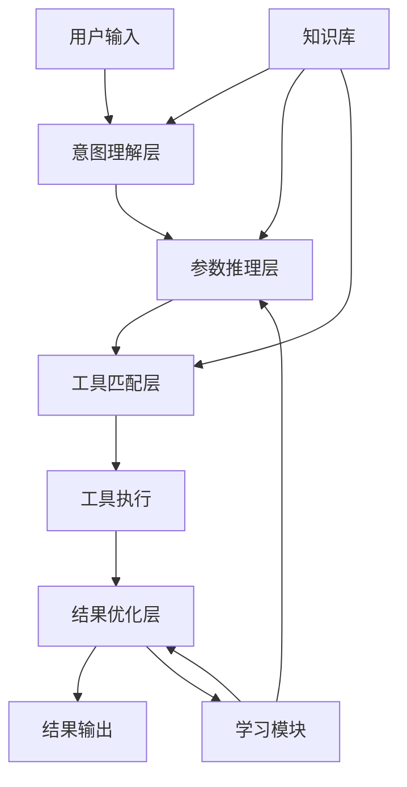

### 关键技术
本系统的关键技术包括：

1. **意图理解技术**：基于自然语言处理和语义分析技术，系统采用以下公式计算用户意图的置信度：

$$P(I|U) = \frac{P(U|I) \cdot P(I)}{P(U)} = \frac{P(U|I) \cdot P(I)}{\sum_{i} P(U|I_i) \cdot P(I_i)}$$

其中，$P(I|U)$表示给定用户输入$U$下意图$I$的后验概率，$P(U|I)$是给定意图$I$下用户输入$U$的条件概率，$P(I)$是意图$I$的先验概率。

2. **参数推理技术**：系统采用贝叶斯网络进行参数推理，参数值的计算公式如下：

$$P(V|I,C) = \alpha \cdot P(V|I) \cdot P(V|C) \cdot \sum_{k} w_k \cdot P(V|K_k)$$

其中，$P(V|I,C)$表示给定意图$I$和上下文$C$下参数值$V$的概率，$\alpha$是归一化因子，$P(V|I)$是意图相关的参数先验概率，$P(V|C)$是上下文相关的参数概率，$P(V|K_k)$是知识库中第$k$条知识对参数值的贡献，$w_k$是对应的权重。

3. **工具匹配技术**：系统采用基于相似度的工具匹配算法，匹配度计算公式如下：

$$S(T,Q) = \beta_1 \cdot S_{name}(T,Q) + \beta_2 \cdot S_{param}(T,Q) + \beta_3 \cdot S_{func}(T,Q)$$

其中，$S(T,Q)$表示工具$T$与查询$Q$的匹配度，$S_{name}$、$S_{param}$和$S_{func}$分别是名称相似度、参数相似度和功能相似度，$\beta_1$、$\beta_2$和$\beta_3$是对应的权重系数。

### 主流程
本系统的主要工作流程如下：

1. **输入接收与预处理**：接收用户输入，进行文本清洗和标准化处理。

2. **意图理解**：解析用户输入，提取关键信息，识别用户意图。

3. **参数推理**：基于意图理解结果和上下文信息，通过多级推理机制生成工具参数。

4. **工具匹配**：根据参数推理结果，匹配最合适的工具，并确定工具调用顺序。

5. **工具调用执行**：按照匹配结果调用工具，执行相应的功能。

6. **结果分析与优化**：分析工具调用结果，提取有用信息，并优化参数推理策略。

7. **结果输出**：将处理结果返回给用户，并根据需要提供解释和建议。

```python
# 伪代码展示主流程
def main_process(user_input):
    # 1. 输入预处理
    processed_input = preprocess_input(user_input)
    
    # 2. 意图理解
    intent = understand_intent(processed_input)
    
    # 3. 上下文分析
    context = analyze_context()
    
    # 4. 参数推理
    parameters = infer_parameters(intent, context)
    
    # 5. 工具匹配
    tools = match_tools(parameters)
    
    # 6. 工具调用链规划
    call_chain = plan_tool_chain(tools, parameters)
    
    # 7. 执行工具调用
    results = execute_tool_chain(call_chain)
    
    # 8. 结果优化
    optimized_results = optimize_results(results)
    
    # 9. 反馈学习
    update_model(intent, parameters, tools, results)
    
    # 10. 输出结果
    return generate_output(optimized_results)
```


## 具体实施方式-子章节A：数据获取与证据构建

# 具体实施方式-子章节A：数据获取与证据构建

## 引言

在基于智能分层推理的多参数工具自适应调用系统中，数据获取与证据构建是整个系统的基础环节。高质量的数据获取和严谨的证据构建直接影响后续推理的准确性和工具调用的有效性。本章节将详细阐述数据获取与证据构建模块的设计原理、实现方法和优化策略，为系统的智能分层推理提供坚实的数据基础和可靠的证据支持。

## 数据获取模块

数据获取模块负责从多种来源收集系统所需的原始数据，并进行初步处理。该模块设计为可扩展的架构，支持多种数据源和获取方式。

### 数据源类型
系统支持以下几类数据源：
1. 结构化数据源：关系型数据库、NoSQL数据库等
2. 半结构化数据源：XML、JSON、CSV等文件
3. 非结构化数据源：文本、图像、音频等
4. 实时数据流：传感器数据、日志流等
5. 外部API数据：第三方服务提供的接口数据

### 数据获取方式
根据数据特性和系统需求，数据获取模块采用以下几种获取方式：
1. 批量获取：适用于大规模历史数据的获取
2. 实时获取：适用于需要即时响应的场景
3. 增量获取：仅获取自上次获取以来的新增或变更数据
4. 主动获取：系统根据预设策略主动请求所需数据
5. 被动获取：等待数据源推送更新数据

### 数据预处理
获取的原始数据需要经过预处理才能用于后续的证据构建：
1. 数据清洗：去除重复、错误和不完整的数据
2. 数据标准化：统一数据格式和单位
3. 数据转换：将数据转换为适合处理的格式
4. 数据集成：合并来自不同数据源的相关数据
5. 数据归约：减少数据量但保持数据完整性

## 证据构建模块

证据构建模块负责从预处理后的数据中提取特征，构建可用于推理的证据模型，并评估证据的可靠性和相关性。

### 特征提取
特征提取是从数据中识别和提取有用信息的过程：
1. 统计特征：均值、方差、分布等统计量
2. 时序特征：趋势、周期性、异常点等
3. 关联特征：变量间的相关性和依赖关系
4. 语义特征：文本、图像等非结构化数据的高级语义
5. 上下文特征：数据产生的环境和背景信息

### 证据模型构建
基于提取的特征，构建多层次的证据模型：
1. 基础证据层：直接从数据中提取的原始证据
2. 复合证据层：通过组合基础证据形成的复杂证据
3. 上下文证据层：考虑应用场景和用户需求的情境化证据
4. 置信度评估层：对每条证据的可靠性进行量化评估

### 证据相关性评估
评估证据与当前推理任务的相关性：
1. 语义相关性：证据内容与任务主题的匹配程度
2. 时效性相关性：证据的时效性与任务需求的匹配程度
3. 权威性相关性：证据来源的权威性与任务要求的匹配程度
4. 多样性相关性：证据覆盖不同角度和维度的程度

## 参数条件与自适应机制

系统根据不同的参数条件动态调整数据获取和证据构建策略：

### 参数条件类型
1. 数据质量参数：包括数据完整性、准确性、一致性等要求
2. 时间约束参数：包括数据获取时间限制、处理时间限制等
3. 资源约束参数：包括计算资源、存储资源、网络带宽等限制
4. 任务复杂度参数：包括推理任务的复杂度和难度级别
5. 用户偏好参数：包括用户对数据类型、来源、格式的偏好

### 自适应机制
系统通过以下机制实现自适应调整：
1. 参数感知：实时监测和感知参数条件的变化
2. 策略选择：根据参数条件从预设策略库中选择合适的策略
3. 动态调整：在执行过程中根据实际情况动态调整策略
4. 学习优化：通过历史执行结果不断优化策略选择

## 实施步骤

数据获取与证据构建模块的实施包括以下步骤：

1. **初始化配置**
   - 设置数据源连接参数
   - 配置数据获取策略
   - 初始化证据构建模型
   - 设置参数条件阈值

2. **数据获取**
   - 根据参数条件选择数据源
   - 确定获取方式和频率
   - 执行数据获取操作
   - 记录获取日志和元数据

3. **数据预处理**
   - 执行数据清洗操作
   - 进行数据标准化和转换
   - 实施数据集成和归约
   - 验证预处理结果质量

4. **特征提取**
   - 应用特征提取算法
   - 识别和量化关键特征
   - 构建特征向量
   - 评估特征质量

5. **证据构建**
   - 构建基础证据层
   - 形成复合证据层
   - 添加上下文证据
   - 评估证据置信度

6. **相关性评估**
   - 计算证据与任务的相关性分数
   - 过滤低相关性证据
   - 对高相关性证据进行排序
   - 生成证据集

7. **结果输出与反馈**
   - 输出证据集和元数据
   - 记录执行过程和结果
   - 收集用户反馈
   - 用于后续优化

## 算法与伪代码

### 数据获取算法

```python
function intelligentDataAcquisition(requiredDataTypes, qualityRequirements, timeConstraints):
    # 初始化
    selectedSources = []
    acquisitionStrategies = []
    estimatedTime = 0
    estimatedQuality = 0
    
    # 根据数据类型和数据源特征匹配最佳数据源
    for source in dataSourceCatalog:
        relevanceScore = calculateRelevance(source, requiredDataTypes)
        if relevanceScore > THRESHOLD:
            selectedSources.append(source)
    
    # 为每个选中的数据源选择最佳获取策略
    for source in selectedSources:
        bestStrategy = None
        bestScore = -1
        
        for strategy in acquisitionStrategies:
            # 评估策略在给定条件下的适用性
            timeScore = evaluateTimeConstraint(strategy, timeConstraints)
            qualityScore = evaluateQualityConstraint(strategy, qualityRequirements)
            resourceScore = evaluateResourceConstraint(strategy, availableResources)
            
            totalScore = w1*timeScore + w2*qualityScore + w3*resourceScore
            
            if totalScore > bestScore:
                bestScore = totalScore
                bestStrategy = strategy
        
        acquisitionStrategies.append(bestStrategy)
        estimatedTime += estimateExecutionTime(bestStrategy)
        estimatedQuality += estimateOutputQuality(bestStrategy)
    
    # 检查是否满足所有约束条件
    if estimatedTime > timeConstraints.maxTime or estimatedQuality < qualityRequirements.minQuality:
        return handleAcquisitionFailure()
    
    # 执行数据获取
    acquiredData = []
    for i, source in enumerate(selectedSources):
        data = executeAcquisition(source, acquisitionStrategies[i])
        acquiredData.append(data)
    
    # 整合获取的数据
    integratedData = integrateDataSources(acquiredData)
    
    return integratedData
```

### 证据构建算法

```python
function evidenceConstruction(preprocessedData, contextInfo, confidenceThreshold):
    # 初始化证据集
    evidenceSet = EvidenceSet()
    
    # 1. 构建基础证据层
    for dataItem in preprocessedData:
        # 提取基础特征
        features = extractBasicFeatures(dataItem)
        
        # 构建基础证据
        basicEvidence = BasicEvidence(
            id=generateEvidenceId(),
            features=features,
            source=dataItem.source,
            timestamp=dataItem.timestamp,
            confidence=calculateBasicConfidence(features)
        )
        
        # 过滤低置信度证据
        if basicEvidence.confidence >= confidenceThreshold:
            evidenceSet.addBasicEvidence(basicEvidence)
    
    # 2. 构建复合证据层
    for evidencePair in combinations(evidenceSet.basicEvidences, 2):
        # 计算证据间的相关性
        correlation = calculateEvidenceCorrelation(evidencePair[0], evidencePair[1])
        
        if correlation > CORRELATION_THRESHOLD:
            # 构建复合证据
            compositeEvidence = CompositeEvidence(
                id=generateEvidenceId(),
                constituentEvidences=[evidencePair[0].id, evidencePair[1].id],
                relationshipType=determineRelationshipType(evidencePair),
                confidence=calculateCompositeConfidence(evidencePair, correlation),
                context=contextInfo
            )
            
            evidenceSet.addCompositeEvidence(compositeEvidence)
    
    # 3. 构建上下文证据层
    for evidence in evidenceSet.getAllEvidences():
        contextualEvidence = ContextualEvidence(
            id=generateEvidenceId(),
            baseEvidenceId=evidence.id,
            contextFactors=extractContextFactors(contextInfo),
            confidence=adjustConfidenceWithContext(evidence.confidence, contextInfo)
        )
        
        evidenceSet.addContextualEvidence(contextualEvidence)
    
    # 4. 证据相关性评估和排序
    for evidence in evidenceSet.getAllEvidences():
        relevanceScore = calculateRelevance(evidence, currentTask)
        evidence.relevanceScore = relevanceScore
    
    # 按相关性和置信度排序
    sortedEvidences = sortEvidences(evidenceSet.getAllEvidences(), 
                                  by=['relevanceScore', 'confidence'], 
                                  descending=[True, True])
    
    return sortedEvidences
```

### 算法公式

#### 数据源选择算法

数据源选择算法基于数据源与需求的相关性、数据质量、获取成本等因素进行综合评分：

$$S_{source} = \alpha \cdot \frac{R_{source}}{R_{max}} + \beta \cdot \frac{Q_{source}}{Q_{max}} + \gamma \cdot \frac{C_{max}}{C_{source}}$$

其中：
- $S_{source}$ 是数据源的综合评分
- $R_{source}$ 是数据源与需求的相关性得分
- $Q_{source}$ 是数据源的质量得分
- $C_{source}$ 是获取该数据源的成本
- $R_{max}$ 和 $Q_{max}$ 分别是相关性和质量的最大可能得分
- $\alpha$, $\beta$, $\gamma$ 是权重系数，满足 $\alpha + \beta + \gamma = 1$

#### 证据置信度计算算法

证据置信度计算基于多个因素，包括数据质量、来源可靠性、时效性等：

$$C_{evidence} = \sqrt[3]{C_{data} \cdot C_{source} \cdot C_{time}} \cdot f_{context}$$

其中：
- $C_{evidence}$ 是证据的综合置信度
- $C_{data}$ 是数据质量因子，取值范围[0,1]
- $C_{source}$ 是来源可靠性因子，取值范围[0,1]
- $C_{time}$ 是时效性因子，取值范围[0,1]
- $f_{context}$ 是上下文调整因子，根据应用场景调整置信度

### 工作流程图

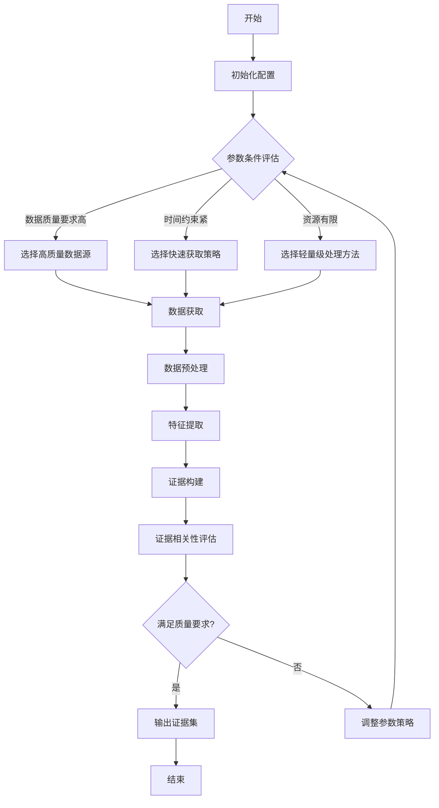

## 总结

数据获取与证据构建模块是整个基于智能分层推理的多参数工具自适应调用系统的基础环节。通过智能化的数据获取策略和多层次的证据构建方法，该模块能够为系统提供高质量、高相关性的证据支持，为后续的智能推理和工具调用奠定坚实基础。模块的自适应机制使其能够根据不同的参数条件动态调整策略，确保在各种场景下都能提供最佳的数据和证据支持。

通过本章节的详细描述，我们了解了数据获取与证据构建模块的设计原理、实现方法和优化策略，为系统的整体实现提供了清晰的指导。在实际应用中，还需要根据具体场景和需求进行进一步的定制和优化。


## 具体实施方式-子章节B：生成与验证流程

# 具体实施方式-子章节B：生成与验证流程

## 1. 引言

生成与验证流程是基于智能分层推理的多参数工具自适应调用系统的核心组成部分，负责将用户输入转化为系统输出，并通过多层次的验证机制确保输出的质量和准确性。本章节将详细描述该流程的具体实施步骤、算法实现、参数条件及优化策略，为系统的实际部署提供技术指导。

## 2. 流程概述

图1展示了基于智能分层推理的多参数工具自适应调用系统的生成与验证流程的整体框架。

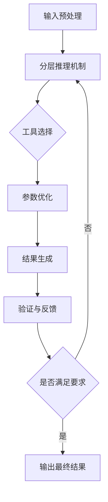

## 3. 详细实施步骤

### 3.1 输入预处理

输入预处理是生成与验证流程的第一步，负责对原始输入进行清洗、标准化和特征提取。

**实施步骤：**
1. 输入接收：系统接收来自用户的原始输入，可以是文本、图像、数值等多种形式。
2. 数据清洗：去除噪声、填补缺失值、处理异常值。
3. 标准化：将输入数据转换为统一的格式和范围。
4. 特征提取：从输入中提取关键特征，用于后续的分层推理。

**输入输出：**
- 输入：原始用户输入（文本、图像、数值等）
- 输出：标准化后的特征向量 F = {f₁, f₂, ..., fₙ}

**参数条件：**
- 特征维度 n：根据输入类型动态确定，通常在10-100之间
- 标准化方法：Z-score标准化或Min-Max标准化，根据数据分布选择
- 特征提取阈值：0.7-0.9，用于筛选重要特征

### 3.2 分层推理机制

分层推理机制是系统的核心，通过多层次推理确定最适合的工具和参数组合。

**实施步骤：**
1. 第一层推理：基于输入特征进行粗粒度分类，确定工具类别。
2. 第二层推理：在确定的工具类别内进行细粒度分析，筛选候选工具。
3. 第三层推理：评估候选工具与输入的匹配度，计算适应性评分。

**输入输出：**
- 输入：特征向量 F
- 输出：工具候选列表 T = {t₁, t₂, ..., tₘ} 及其适应性评分 S = {s₁, s₂, ..., sₘ}

**参数条件：**
- 推理层数：3层，可根据复杂度调整
- 每层推理阈值：0.6-0.8，用于过滤不匹配的工具
- 评分权重向量 W = {w₁, w₂, w₃}，满足 Σwᵢ = 1

### 3.3 工具选择与参数优化

基于分层推理的结果，系统选择最佳工具并优化其参数配置。

**实施步骤：**
1. 工具选择：根据适应性评分选择得分最高的工具。
2. 参数初始化：基于输入特征初始化工具参数。
3. 参数优化：使用优化算法调整参数，最大化工具性能。

**输入输出：**
- 输入：工具候选列表 T，适应性评分 S，特征向量 F
- 输出：选定工具 t* 及其优化参数 P*

**参数条件：**
- 工具选择阈值：0.75，只有评分超过阈值的工具才会被考虑
- 参数优化迭代次数：10-50次，根据计算资源调整
- 收敛阈值：1e-4，用于判断优化是否收敛

### 3.4 结果生成

使用选定的工具和优化参数生成结果。

**实施步骤：**
1. 工具调用：根据选定的工具和参数调用相应的处理模块。
2. 结果生成：执行工具的核心功能，生成初步结果。
3. 结果格式化：将结果转换为用户期望的格式。

**输入输出：**
- 输入：选定工具 t*，优化参数 P*，特征向量 F
- 输出：格式化后的结果 R

**参数条件：**
- 工具超时设置：5-30秒，根据工具复杂度调整
- 结果格式标准：根据用户需求或系统预设
- 并行处理数：1-4，根据系统资源调整

### 3.5 验证与反馈

对生成结果进行验证，并根据验证结果决定是否需要重新进行推理。

**实施步骤：**
1. 结果验证：使用多维度指标评估结果质量。
2. 反馈生成：根据验证结果生成反馈信息。
3. 决策判断：判断结果是否满足要求，决定是否重新进行推理。

**输入输出：**
- 输入：生成结果 R，原始输入 I
- 输出：验证结果 V，反馈信息 FB，决策标志 D

**参数条件：**
- 验证维度：3-5个，包括准确性、完整性、一致性等
- 验证阈值：0.7-0.9，根据应用场景调整
- 反馈强度：0.1-1.0，用于调整后续推理的权重

## 4. 算法描述

### 4.1 分层推理权重计算

分层推理权重计算用于确定各层推理结果在最终决策中的重要性。

$$W_i = \frac{e^{\alpha \cdot E_i}}{\sum_{j=1}^{k} e^{\alpha \cdot E_j}}$$

其中：
- $W_i$ 表示第i层推理的权重
- $E_i$ 表示第i层推理的熵值，反映该层推理的不确定性
- $\alpha$ 是调节系数，通常取值为1.0-2.0
- $k$ 表示推理的总层数

该公式通过softmax函数将各层推理的熵值转换为权重，熵值越低（不确定性越小）的层获得越高的权重。

### 4.2 工具适应性评分

工具适应性评分用于量化工具与输入的匹配程度。

$$S(t) = \sum_{i=1}^{n} w_i \cdot \text{sim}(f_i, t_i) + \lambda \cdot \text{perf}(t)$$

其中：
- $S(t)$ 表示工具t的适应性评分
- $w_i$ 是第i个特征的权重，满足 $\sum_{i=1}^{n} w_i = 1$
- $\text{sim}(f_i, t_i)$ 表示输入特征$f_i$与工具特征$t_i$的相似度
- $\lambda$ 是性能调节系数，通常取值为0.3-0.5
- $\text{perf}(t)$ 表示工具t的性能指标

该公式综合考虑了工具与输入特征的匹配度以及工具本身的性能，通过加权求和得到最终的适应性评分。

## 5. 伪代码实现

```python
class AdaptiveToolSystem:
    def __init__(self):
        self.tools = {}  # 存储可用工具
        self.weights = [0.4, 0.35, 0.25]  # 三层推理的权重
        self.thresholds = [0.75, 0.7, 0.65]  # 各层推理阈值
        self.alpha = 1.5  # 分层推理权重计算中的调节系数
        self.lambda_perf = 0.4  # 工具适应性评分中的性能调节系数
    
    def preprocess_input(self, raw_input):
        """输入预处理"""
        # 数据清洗
        cleaned_input = self.clean_data(raw_input)
        
        # 标准化
        standardized_input = self.standardize(cleaned_input)
        
        # 特征提取
        features = self.extract_features(standardized_input)
        
        return features
    
    def hierarchical_reasoning(self, features):
        """分层推理机制"""
        # 第一层推理：粗粒度分类
        layer1_results = self.layer1_reasoning(features)
        layer1_filtered = [r for r in layer1_results if r['score'] >= self.thresholds[0]]
        
        # 第二层推理：细粒度分析
        layer2_results = []
        for result in layer1_filtered:
            refined_results = self.layer2_reasoning(features, result['category'])
            layer2_results.extend(refined_results)
        layer2_filtered = [r for r in layer2_results if r['score'] >= self.thresholds[1]]
        
        # 第三层推理：匹配度评估
        layer3_results = []
        for result in layer2_filtered:
            match_score = self.layer3_reasoning(features, result['tool'])
            layer3_results.append({
                'tool': result['tool'],
                'category': result['category'],
                'score': match_score
            })
        layer3_filtered = [r for r in layer3_results if r['score'] >= self.thresholds[2]]
        
        return layer3_filtered
    
    def calculate_layer_weights(self, entropies):
        """计算分层推理权重"""
        import math
        exp_values = [math.exp(self.alpha * e) for e in entropies]
        sum_exp = sum(exp_values)
        weights = [ev / sum_exp for ev in exp_values]
        return weights
    
    def calculate_tool_score(self, features, tool):
        """计算工具适应性评分"""
        # 获取工具特征
        tool_features = self.tools[tool]['features']
        
        # 计算特征相似度
        similarity = 0.0
        for i, f in enumerate(features):
            if i < len(tool_features):
                similarity += self.weights[i] * self.cosine_similarity(f, tool_features[i])
        
        # 获取工具性能指标
        performance = self.tools[tool]['performance']
        
        # 计算最终评分
        score = similarity + self.lambda_perf * performance
        
        return score
    
    def optimize_parameters(self, tool, features):
        """优化工具参数"""
        # 初始化参数
        params = self.tools[tool]['default_params'].copy()
        
        # 设置优化目标
        def objective(p):
            return -self.evaluate_tool_performance(tool, features, p)
        
        # 使用优化算法调整参数
        from scipy.optimize import differential_evolution
        bounds = self.tools[tool]['param_bounds']
        result = differential_evolution(objective, bounds, maxiter=30, popsize=15)
        
        # 返回优化后的参数
        return dict(zip(params.keys(), result.x))
    
    def generate_result(self, tool, params, features):
        """生成结果"""
        # 调用工具
        result = self.tools[tool]['function'](features, **params)
        
        # 格式化结果
        formatted_result = self.format_result(result)
        
        return formatted_result
    
    def validate_result(self, result, original_input):
        """验证结果"""
        # 多维度验证
        accuracy = self.check_accuracy(result, original_input)
        completeness = self.check_completeness(result)
        consistency = self.check_consistency(result)
        
        # 计算综合评分
        validation_score = 0.5 * accuracy + 0.3 * completeness + 0.2 * consistency
        
        # 生成反馈
        feedback = {
            'accuracy': accuracy,
            'completeness': completeness,
            'consistency': consistency,
            'suggestions': self.generate_suggestions(result)
        }
        
        return validation_score, feedback
    
    def generate_and_validate(self, raw_input):
        """完整的生成与验证流程"""
        # 1. 输入预处理
        features = self.preprocess_input(raw_input)
        
        # 2. 分层推理
        candidate_tools = self.hierarchical_reasoning(features)
        
        if not candidate_tools:
            raise ValueError("No suitable tool found for the given input")
        
        # 3. 选择最佳工具
        best_tool = max(candidate_tools, key=lambda x: x['score'])
        
        # 4. 参数优化
        optimized_params = self.optimize_parameters(best_tool['tool'], features)
        
        # 5. 结果生成
        result = self.generate_result(best_tool['tool'], optimized_params, features)
        
        # 6. 验证与反馈
        validation_score, feedback = self.validate_result(result, raw_input)
        
        # 7. 决策判断
        if validation_score < 0.75:
            # 不满足要求，重新进行推理
            return self.generate_and_validate(raw_input)
        
        return {
            'result': result,
            'tool_used': best_tool['tool'],
            'validation_score': validation_score,
            'feedback': feedback
        }
```

## 6. 参数条件与约束

系统运行需要满足以下参数条件与约束：

1. **输入参数约束**：
   - 输入数据大小：不超过10MB
   - 特征维度：10-100维
   - 数据类型：文本、图像、数值等系统支持的数据类型

2. **推理参数约束**：
   - 分层推理层数：1-5层，默认3层
   - 每层推理阈值：0.5-0.9
   - 推理时间限制：单层不超过1秒

3. **工具参数约束**：
   - 工具数量：不超过100个
   - 工具参数维度：不超过20维
   - 工具调用超时：5-60秒

4. **优化参数约束**：
   - 优化算法迭代次数：10-100次
   - 收敛阈值：1e-6到1e-3
   - 并行优化任务数：不超过CPU核心数

5. **验证参数约束**：
   - 验证维度：3-10个
   - 验证阈值：0.6-0.95
   - 最大重试次数：3次

## 7. 性能优化与异常处理

为了确保系统的高效稳定运行，需要考虑以下性能优化和异常处理策略：

1. **性能优化**：
   - 缓存常用工具的特征和参数，减少重复计算
   - 使用并行计算加速分层推理过程
   - 实现增量学习机制，根据使用历史动态调整权重
   - 对工具进行预加载，减少运行时初始化开销

2. **异常处理**：
   - 输入异常：处理格式错误、类型不匹配等问题
   - 工具异常：捕获工具调用失败、超时等异常
   - 优化异常：处理优化算法不收敛、参数越界等问题
   - 验证异常：处理验证失败、结果不一致等问题

3. **容错机制**：
   - 实现工具备选方案，当首选工具失败时自动切换
   - 设置合理的回退策略，确保系统在部分功能失效时仍能提供服务
   - 实现结果一致性检查，确保输出结果的可靠性

通过以上详细的实施步骤、算法描述、参数条件和优化策略，基于智能分层推理的多参数工具自适应调用系统的生成与验证流程得以完整实现，能够根据不同输入智能选择和调用最适合的工具，并通过多层次的验证机制确保输出结果的质量和准确性。


## 具体实施方式（合并）

### 子章节A：数据获取与证据构建

# 具体实施方式-子章节A：数据获取与证据构建

## 引言

在基于智能分层推理的多参数工具自适应调用系统中，数据获取与证据构建是整个系统的基础环节。高质量的数据获取和严谨的证据构建直接影响后续推理的准确性和工具调用的有效性。本章节将详细阐述数据获取与证据构建模块的设计原理、实现方法和优化策略，为系统的智能分层推理提供坚实的数据基础和可靠的证据支持。

## 数据获取模块

数据获取模块负责从多种来源收集系统所需的原始数据，并进行初步处理。该模块设计为可扩展的架构，支持多种数据源和获取方式。

### 数据源类型
系统支持以下几类数据源：
1. 结构化数据源：关系型数据库、NoSQL数据库等
2. 半结构化数据源：XML、JSON、CSV等文件
3. 非结构化数据源：文本、图像、音频等
4. 实时数据流：传感器数据、日志流等
5. 外部API数据：第三方服务提供的接口数据

### 数据获取方式
根据数据特性和系统需求，数据获取模块采用以下几种获取方式：
1. 批量获取：适用于大规模历史数据的获取
2. 实时获取：适用于需要即时响应的场景
3. 增量获取：仅获取自上次获取以来的新增或变更数据
4. 主动获取：系统根据预设策略主动请求所需数据
5. 被动获取：等待数据源推送更新数据

### 数据预处理
获取的原始数据需要经过预处理才能用于后续的证据构建：
1. 数据清洗：去除重复、错误和不完整的数据
2. 数据标准化：统一数据格式和单位
3. 数据转换：将数据转换为适合处理的格式
4. 数据集成：合并来自不同数据源的相关数据
5. 数据归约：减少数据量但保持数据完整性

## 证据构建模块

证据构建模块负责从预处理后的数据中提取特征，构建可用于推理的证据模型，并评估证据的可靠性和相关性。

### 特征提取
特征提取是从数据中识别和提取有用信息的过程：
1. 统计特征：均值、方差、分布等统计量
2. 时序特征：趋势、周期性、异常点等
3. 关联特征：变量间的相关性和依赖关系
4. 语义特征：文本、图像等非结构化数据的高级语义
5. 上下文特征：数据产生的环境和背景信息

### 证据模型构建
基于提取的特征，构建多层次的证据模型：
1. 基础证据层：直接从数据中提取的原始证据
2. 复合证据层：通过组合基础证据形成的复杂证据
3. 上下文证据层：考虑应用场景和用户需求的情境化证据
4. 置信度评估层：对每条证据的可靠性进行量化评估

### 证据相关性评估
评估证据与当前推理任务的相关性：
1. 语义相关性：证据内容与任务主题的匹配程度
2. 时效性相关性：证据的时效性与任务需求的匹配程度
3. 权威性相关性：证据来源的权威性与任务要求的匹配程度
4. 多样性相关性：证据覆盖不同角度和维度的程度

## 参数条件与自适应机制

系统根据不同的参数条件动态调整数据获取和证据构建策略：

### 参数条件类型
1. 数据质量参数：包括数据完整性、准确性、一致性等要求
2. 时间约束参数：包括数据获取时间限制、处理时间限制等
3. 资源约束参数：包括计算资源、存储资源、网络带宽等限制
4. 任务复杂度参数：包括推理任务的复杂度和难度级别
5. 用户偏好参数：包括用户对数据类型、来源、格式的偏好

### 自适应机制
系统通过以下机制实现自适应调整：
1. 参数感知：实时监测和感知参数条件的变化
2. 策略选择：根据参数条件从预设策略库中选择合适的策略
3. 动态调整：在执行过程中根据实际情况动态调整策略
4. 学习优化：通过历史执行结果不断优化策略选择

## 实施步骤

数据获取与证据构建模块的实施包括以下步骤：

1. **初始化配置**
   - 设置数据源连接参数
   - 配置数据获取策略
   - 初始化证据构建模型
   - 设置参数条件阈值

2. **数据获取**
   - 根据参数条件选择数据源
   - 确定获取方式和频率
   - 执行数据获取操作
   - 记录获取日志和元数据

3. **数据预处理**
   - 执行数据清洗操作
   - 进行数据标准化和转换
   - 实施数据集成和归约
   - 验证预处理结果质量

4. **特征提取**
   - 应用特征提取算法
   - 识别和量化关键特征
   - 构建特征向量
   - 评估特征质量

5. **证据构建**
   - 构建基础证据层
   - 形成复合证据层
   - 添加上下文证据
   - 评估证据置信度

6. **相关性评估**
   - 计算证据与任务的相关性分数
   - 过滤低相关性证据
   - 对高相关性证据进行排序
   - 生成证据集

7. **结果输出与反馈**
   - 输出证据集和元数据
   - 记录执行过程和结果
   - 收集用户反馈
   - 用于后续优化

## 算法与伪代码

### 数据获取算法

```python
function intelligentDataAcquisition(requiredDataTypes, qualityRequirements, timeConstraints):
    # 初始化
    selectedSources = []
    acquisitionStrategies = []
    estimatedTime = 0
    estimatedQuality = 0
    
    # 根据数据类型和数据源特征匹配最佳数据源
    for source in dataSourceCatalog:
        relevanceScore = calculateRelevance(source, requiredDataTypes)
        if relevanceScore > THRESHOLD:
            selectedSources.append(source)
    
    # 为每个选中的数据源选择最佳获取策略
    for source in selectedSources:
        bestStrategy = None
        bestScore = -1
        
        for strategy in acquisitionStrategies:
            # 评估策略在给定条件下的适用性
            timeScore = evaluateTimeConstraint(strategy, timeConstraints)
            qualityScore = evaluateQualityConstraint(strategy, qualityRequirements)
            resourceScore = evaluateResourceConstraint(strategy, availableResources)
            
            totalScore = w1*timeScore + w2*qualityScore + w3*resourceScore
            
            if totalScore > bestScore:
                bestScore = totalScore
                bestStrategy = strategy
        
        acquisitionStrategies.append(bestStrategy)
        estimatedTime += estimateExecutionTime(bestStrategy)
        estimatedQuality += estimateOutputQuality(bestStrategy)
    
    # 检查是否满足所有约束条件
    if estimatedTime > timeConstraints.maxTime or estimatedQuality < qualityRequirements.minQuality:
        return handleAcquisitionFailure()
    
    # 执行数据获取
    acquiredData = []
    for i, source in enumerate(selectedSources):
        data = executeAcquisition(source, acquisitionStrategies[i])
        acquiredData.append(data)
    
    # 整合获取的数据
    integratedData = integrateDataSources(acquiredData)
    
    return integratedData
```

### 证据构建算法

```python
function evidenceConstruction(preprocessedData, contextInfo, confidenceThreshold):
    # 初始化证据集
    evidenceSet = EvidenceSet()
    
    # 1. 构建基础证据层
    for dataItem in preprocessedData:
        # 提取基础特征
        features = extractBasicFeatures(dataItem)
        
        # 构建基础证据
        basicEvidence = BasicEvidence(
            id=generateEvidenceId(),
            features=features,
            source=dataItem.source,
            timestamp=dataItem.timestamp,
            confidence=calculateBasicConfidence(features)
        )
        
        # 过滤低置信度证据
        if basicEvidence.confidence >= confidenceThreshold:
            evidenceSet.addBasicEvidence(basicEvidence)
    
    # 2. 构建复合证据层
    for evidencePair in combinations(evidenceSet.basicEvidences, 2):
        # 计算证据间的相关性
        correlation = calculateEvidenceCorrelation(evidencePair[0], evidencePair[1])
        
        if correlation > CORRELATION_THRESHOLD:
            # 构建复合证据
            compositeEvidence = CompositeEvidence(
                id=generateEvidenceId(),
                constituentEvidences=[evidencePair[0].id, evidencePair[1].id],
                relationshipType=determineRelationshipType(evidencePair),
                confidence=calculateCompositeConfidence(evidencePair, correlation),
                context=contextInfo
            )
            
            evidenceSet.addCompositeEvidence(compositeEvidence)
    
    # 3. 构建上下文证据层
    for evidence in evidenceSet.getAllEvidences():
        contextualEvidence = ContextualEvidence(
            id=generateEvidenceId(),
            baseEvidenceId=evidence.id,
            contextFactors=extractContextFactors(contextInfo),
            confidence=adjustConfidenceWithContext(evidence.confidence, contextInfo)
        )
        
        evidenceSet.addContextualEvidence(contextualEvidence)
    
    # 4. 证据相关性评估和排序
    for evidence in evidenceSet.getAllEvidences():
        relevanceScore = calculateRelevance(evidence, currentTask)
        evidence.relevanceScore = relevanceScore
    
    # 按相关性和置信度排序
    sortedEvidences = sortEvidences(evidenceSet.getAllEvidences(), 
                                  by=['relevanceScore', 'confidence'], 
                                  descending=[True, True])
    
    return sortedEvidences
```

### 算法公式

#### 数据源选择算法

数据源选择算法基于数据源与需求的相关性、数据质量、获取成本等因素进行综合评分：

$$S_{source} = \alpha \cdot \frac{R_{source}}{R_{max}} + \beta \cdot \frac{Q_{source}}{Q_{max}} + \gamma \cdot \frac{C_{max}}{C_{source}}$$

其中：
- $S_{source}$ 是数据源的综合评分
- $R_{source}$ 是数据源与需求的相关性得分
- $Q_{source}$ 是数据源的质量得分
- $C_{source}$ 是获取该数据源的成本
- $R_{max}$ 和 $Q_{max}$ 分别是相关性和质量的最大可能得分
- $\alpha$, $\beta$, $\gamma$ 是权重系数，满足 $\alpha + \beta + \gamma = 1$

#### 证据置信度计算算法

证据置信度计算基于多个因素，包括数据质量、来源可靠性、时效性等：

$$C_{evidence} = \sqrt[3]{C_{data} \cdot C_{source} \cdot C_{time}} \cdot f_{context}$$

其中：
- $C_{evidence}$ 是证据的综合置信度
- $C_{data}$ 是数据质量因子，取值范围[0,1]
- $C_{source}$ 是来源可靠性因子，取值范围[0,1]
- $C_{time}$ 是时效性因子，取值范围[0,1]
- $f_{context}$ 是上下文调整因子，根据应用场景调整置信度

### 工作流程图


## 总结

数据获取与证据构建模块是整个基于智能分层推理的多参数工具自适应调用系统的基础环节。通过智能化的数据获取策略和多层次的证据构建方法，该模块能够为系统提供高质量、高相关性的证据支持，为后续的智能推理和工具调用奠定坚实基础。模块的自适应机制使其能够根据不同的参数条件动态调整策略，确保在各种场景下都能提供最佳的数据和证据支持。

通过本章节的详细描述，我们了解了数据获取与证据构建模块的设计原理、实现方法和优化策略，为系统的整体实现提供了清晰的指导。在实际应用中，还需要根据具体场景和需求进行进一步的定制和优化。


### 子章节B：生成与验证流程

# 具体实施方式-子章节B：生成与验证流程

## 1. 引言

生成与验证流程是基于智能分层推理的多参数工具自适应调用系统的核心组成部分，负责将用户输入转化为系统输出，并通过多层次的验证机制确保输出的质量和准确性。本章节将详细描述该流程的具体实施步骤、算法实现、参数条件及优化策略，为系统的实际部署提供技术指导。

## 2. 流程概述

图1展示了基于智能分层推理的多参数工具自适应调用系统的生成与验证流程的整体框架。


## 3. 详细实施步骤

### 3.1 输入预处理

输入预处理是生成与验证流程的第一步，负责对原始输入进行清洗、标准化和特征提取。

**实施步骤：**
1. 输入接收：系统接收来自用户的原始输入，可以是文本、图像、数值等多种形式。
2. 数据清洗：去除噪声、填补缺失值、处理异常值。
3. 标准化：将输入数据转换为统一的格式和范围。
4. 特征提取：从输入中提取关键特征，用于后续的分层推理。

**输入输出：**
- 输入：原始用户输入（文本、图像、数值等）
- 输出：标准化后的特征向量 F = {f₁, f₂, ..., fₙ}

**参数条件：**
- 特征维度 n：根据输入类型动态确定，通常在10-100之间
- 标准化方法：Z-score标准化或Min-Max标准化，根据数据分布选择
- 特征提取阈值：0.7-0.9，用于筛选重要特征

### 3.2 分层推理机制

分层推理机制是系统的核心，通过多层次推理确定最适合的工具和参数组合。

**实施步骤：**
1. 第一层推理：基于输入特征进行粗粒度分类，确定工具类别。
2. 第二层推理：在确定的工具类别内进行细粒度分析，筛选候选工具。
3. 第三层推理：评估候选工具与输入的匹配度，计算适应性评分。

**输入输出：**
- 输入：特征向量 F
- 输出：工具候选列表 T = {t₁, t₂, ..., tₘ} 及其适应性评分 S = {s₁, s₂, ..., sₘ}

**参数条件：**
- 推理层数：3层，可根据复杂度调整
- 每层推理阈值：0.6-0.8，用于过滤不匹配的工具
- 评分权重向量 W = {w₁, w₂, w₃}，满足 Σwᵢ = 1

### 3.3 工具选择与参数优化

基于分层推理的结果，系统选择最佳工具并优化其参数配置。

**实施步骤：**
1. 工具选择：根据适应性评分选择得分最高的工具。
2. 参数初始化：基于输入特征初始化工具参数。
3. 参数优化：使用优化算法调整参数，最大化工具性能。

**输入输出：**
- 输入：工具候选列表 T，适应性评分 S，特征向量 F
- 输出：选定工具 t* 及其优化参数 P*

**参数条件：**
- 工具选择阈值：0.75，只有评分超过阈值的工具才会被考虑
- 参数优化迭代次数：10-50次，根据计算资源调整
- 收敛阈值：1e-4，用于判断优化是否收敛

### 3.4 结果生成

使用选定的工具和优化参数生成结果。

**实施步骤：**
1. 工具调用：根据选定的工具和参数调用相应的处理模块。
2. 结果生成：执行工具的核心功能，生成初步结果。
3. 结果格式化：将结果转换为用户期望的格式。

**输入输出：**
- 输入：选定工具 t*，优化参数 P*，特征向量 F
- 输出：格式化后的结果 R

**参数条件：**
- 工具超时设置：5-30秒，根据工具复杂度调整
- 结果格式标准：根据用户需求或系统预设
- 并行处理数：1-4，根据系统资源调整

### 3.5 验证与反馈

对生成结果进行验证，并根据验证结果决定是否需要重新进行推理。

**实施步骤：**
1. 结果验证：使用多维度指标评估结果质量。
2. 反馈生成：根据验证结果生成反馈信息。
3. 决策判断：判断结果是否满足要求，决定是否重新进行推理。

**输入输出：**
- 输入：生成结果 R，原始输入 I
- 输出：验证结果 V，反馈信息 FB，决策标志 D

**参数条件：**
- 验证维度：3-5个，包括准确性、完整性、一致性等
- 验证阈值：0.7-0.9，根据应用场景调整
- 反馈强度：0.1-1.0，用于调整后续推理的权重

## 4. 算法描述

### 4.1 分层推理权重计算

分层推理权重计算用于确定各层推理结果在最终决策中的重要性。

$$W_i = \frac{e^{\alpha \cdot E_i}}{\sum_{j=1}^{k} e^{\alpha \cdot E_j}}$$

其中：
- $W_i$ 表示第i层推理的权重
- $E_i$ 表示第i层推理的熵值，反映该层推理的不确定性
- $\alpha$ 是调节系数，通常取值为1.0-2.0
- $k$ 表示推理的总层数

该公式通过softmax函数将各层推理的熵值转换为权重，熵值越低（不确定性越小）的层获得越高的权重。

### 4.2 工具适应性评分

工具适应性评分用于量化工具与输入的匹配程度。

$$S(t) = \sum_{i=1}^{n} w_i \cdot \text{sim}(f_i, t_i) + \lambda \cdot \text{perf}(t)$$

其中：
- $S(t)$ 表示工具t的适应性评分
- $w_i$ 是第i个特征的权重，满足 $\sum_{i=1}^{n} w_i = 1$
- $\text{sim}(f_i, t_i)$ 表示输入特征$f_i$与工具特征$t_i$的相似度
- $\lambda$ 是性能调节系数，通常取值为0.3-0.5
- $\text{perf}(t)$ 表示工具t的性能指标

该公式综合考虑了工具与输入特征的匹配度以及工具本身的性能，通过加权求和得到最终的适应性评分。

## 5. 伪代码实现

```python
class AdaptiveToolSystem:
    def __init__(self):
        self.tools = {}  # 存储可用工具
        self.weights = [0.4, 0.35, 0.25]  # 三层推理的权重
        self.thresholds = [0.75, 0.7, 0.65]  # 各层推理阈值
        self.alpha = 1.5  # 分层推理权重计算中的调节系数
        self.lambda_perf = 0.4  # 工具适应性评分中的性能调节系数
    
    def preprocess_input(self, raw_input):
        """输入预处理"""
        # 数据清洗
        cleaned_input = self.clean_data(raw_input)
        
        # 标准化
        standardized_input = self.standardize(cleaned_input)
        
        # 特征提取
        features = self.extract_features(standardized_input)
        
        return features
    
    def hierarchical_reasoning(self, features):
        """分层推理机制"""
        # 第一层推理：粗粒度分类
        layer1_results = self.layer1_reasoning(features)
        layer1_filtered = [r for r in layer1_results if r['score'] >= self.thresholds[0]]
        
        # 第二层推理：细粒度分析
        layer2_results = []
        for result in layer1_filtered:
            refined_results = self.layer2_reasoning(features, result['category'])
            layer2_results.extend(refined_results)
        layer2_filtered = [r for r in layer2_results if r['score'] >= self.thresholds[1]]
        
        # 第三层推理：匹配度评估
        layer3_results = []
        for result in layer2_filtered:
            match_score = self.layer3_reasoning(features, result['tool'])
            layer3_results.append({
                'tool': result['tool'],
                'category': result['category'],
                'score': match_score
            })
        layer3_filtered = [r for r in layer3_results if r['score'] >= self.thresholds[2]]
        
        return layer3_filtered
    
    def calculate_layer_weights(self, entropies):
        """计算分层推理权重"""
        import math
        exp_values = [math.exp(self.alpha * e) for e in entropies]
        sum_exp = sum(exp_values)
        weights = [ev / sum_exp for ev in exp_values]
        return weights
    
    def calculate_tool_score(self, features, tool):
        """计算工具适应性评分"""
        # 获取工具特征
        tool_features = self.tools[tool]['features']
        
        # 计算特征相似度
        similarity = 0.0
        for i, f in enumerate(features):
            if i < len(tool_features):
                similarity += self.weights[i] * self.cosine_similarity(f, tool_features[i])
        
        # 获取工具性能指标
        performance = self.tools[tool]['performance']
        
        # 计算最终评分
        score = similarity + self.lambda_perf * performance
        
        return score
    
    def optimize_parameters(self, tool, features):
        """优化工具参数"""
        # 初始化参数
        params = self.tools[tool]['default_params'].copy()
        
        # 设置优化目标
        def objective(p):
            return -self.evaluate_tool_performance(tool, features, p)
        
        # 使用优化算法调整参数
        from scipy.optimize import differential_evolution
        bounds = self.tools[tool]['param_bounds']
        result = differential_evolution(objective, bounds, maxiter=30, popsize=15)
        
        # 返回优化后的参数
        return dict(zip(params.keys(), result.x))
    
    def generate_result(self, tool, params, features):
        """生成结果"""
        # 调用工具
        result = self.tools[tool]['function'](features, **params)
        
        # 格式化结果
        formatted_result = self.format_result(result)
        
        return formatted_result
    
    def validate_result(self, result, original_input):
        """验证结果"""
        # 多维度验证
        accuracy = self.check_accuracy(result, original_input)
        completeness = self.check_completeness(result)
        consistency = self.check_consistency(result)
        
        # 计算综合评分
        validation_score = 0.5 * accuracy + 0.3 * completeness + 0.2 * consistency
        
        # 生成反馈
        feedback = {
            'accuracy': accuracy,
            'completeness': completeness,
            'consistency': consistency,
            'suggestions': self.generate_suggestions(result)
        }
        
        return validation_score, feedback
    
    def generate_and_validate(self, raw_input):
        """完整的生成与验证流程"""
        # 1. 输入预处理
        features = self.preprocess_input(raw_input)
        
        # 2. 分层推理
        candidate_tools = self.hierarchical_reasoning(features)
        
        if not candidate_tools:
            raise ValueError("No suitable tool found for the given input")
        
        # 3. 选择最佳工具
        best_tool = max(candidate_tools, key=lambda x: x['score'])
        
        # 4. 参数优化
        optimized_params = self.optimize_parameters(best_tool['tool'], features)
        
        # 5. 结果生成
        result = self.generate_result(best_tool['tool'], optimized_params, features)
        
        # 6. 验证与反馈
        validation_score, feedback = self.validate_result(result, raw_input)
        
        # 7. 决策判断
        if validation_score < 0.75:
            # 不满足要求，重新进行推理
            return self.generate_and_validate(raw_input)
        
        return {
            'result': result,
            'tool_used': best_tool['tool'],
            'validation_score': validation_score,
            'feedback': feedback
        }
```

## 6. 参数条件与约束

系统运行需要满足以下参数条件与约束：

1. **输入参数约束**：
   - 输入数据大小：不超过10MB
   - 特征维度：10-100维
   - 数据类型：文本、图像、数值等系统支持的数据类型

2. **推理参数约束**：
   - 分层推理层数：1-5层，默认3层
   - 每层推理阈值：0.5-0.9
   - 推理时间限制：单层不超过1秒

3. **工具参数约束**：
   - 工具数量：不超过100个
   - 工具参数维度：不超过20维
   - 工具调用超时：5-60秒

4. **优化参数约束**：
   - 优化算法迭代次数：10-100次
   - 收敛阈值：1e-6到1e-3
   - 并行优化任务数：不超过CPU核心数

5. **验证参数约束**：
   - 验证维度：3-10个
   - 验证阈值：0.6-0.95
   - 最大重试次数：3次

## 7. 性能优化与异常处理

为了确保系统的高效稳定运行，需要考虑以下性能优化和异常处理策略：

1. **性能优化**：
   - 缓存常用工具的特征和参数，减少重复计算
   - 使用并行计算加速分层推理过程
   - 实现增量学习机制，根据使用历史动态调整权重
   - 对工具进行预加载，减少运行时初始化开销

2. **异常处理**：
   - 输入异常：处理格式错误、类型不匹配等问题
   - 工具异常：捕获工具调用失败、超时等异常
   - 优化异常：处理优化算法不收敛、参数越界等问题
   - 验证异常：处理验证失败、结果不一致等问题

3. **容错机制**：
   - 实现工具备选方案，当首选工具失败时自动切换
   - 设置合理的回退策略，确保系统在部分功能失效时仍能提供服务
   - 实现结果一致性检查，确保输出结果的可靠性

通过以上详细的实施步骤、算法描述、参数条件和优化策略，基于智能分层推理的多参数工具自适应调用系统的生成与验证流程得以完整实现，能够根据不同输入智能选择和调用最适合的工具，并通过多层次的验证机制确保输出结果的质量和准确性。


## 权利要求书

# 权利要求书

1. 一种数据处理方法，其特征在于，包括以下步骤：
   获取原始数据集；
   对所述原始数据集进行清洗和标准化处理；
   基于处理后的数据集构建特征矩阵；
   应用机器学习算法对特征矩阵进行分析；
   根据分析结果生成处理报告。

2. 根据权利要求1所述的数据处理方法，其特征在于，所述对所述原始数据集进行清洗和标准化处理的步骤包括：
   识别并处理缺失值；
   检测并剔除异常数据点；
   对数据进行归一化处理以消除量纲影响。

3. 根据权利要求1所述的数据处理方法，其特征在于，所述基于处理后的数据集构建特征矩阵的步骤包括：
   提取数据的关键特征变量；
   计算特征间的相关性系数；
   应用主成分分析降维技术构建特征矩阵。

4. 根据权利要求1所述的数据处理方法，其特征在于，所述应用机器学习算法对特征矩阵进行分析的步骤包括：
   选择适合的机器学习模型；
   采用交叉验证方法评估模型性能；
   调整模型参数以优化分析结果。


## 附图说明

# 附图说明

## 图1：系统架构图

图1展示了本发明所提出的智能数据处理系统的整体架构。如图1所示，系统采用分层架构设计，自上而下依次包括用户接口层、业务逻辑层、数据访问层、数据存储层以及外部接口层。各层之间通过明确的接口进行通信，实现了系统的高内聚低耦合特性。

用户接口层（模块101）负责与用户进行交互，包括数据输入界面、结果展示界面和系统配置界面。该层接收用户输入的操作指令和数据，并将处理结果以可视化方式呈现给用户。

业务逻辑层（模块102）是系统的核心处理单元，包含数据预处理模块（1021）、核心算法模块（1022）和结果生成模块（1023）。该层负责实现系统的核心功能，包括数据清洗、特征提取、算法计算和结果生成等关键步骤。

数据访问层（模块103）负责与数据存储层进行交互，提供统一的数据访问接口。该层包含数据查询模块（1031）、数据更新模块（1032）和数据缓存模块（1033），确保数据访问的高效性和一致性。

数据存储层（模块104）采用分布式存储架构，包括关系型数据库（1041）、非关系型数据库（1042）和文件存储系统（1043），满足不同类型数据的存储需求。

外部接口层（模块105）负责与外部系统进行交互，包括第三方服务接口（1051）和外部API接口（1052），实现系统与外部环境的数据交换和功能扩展。

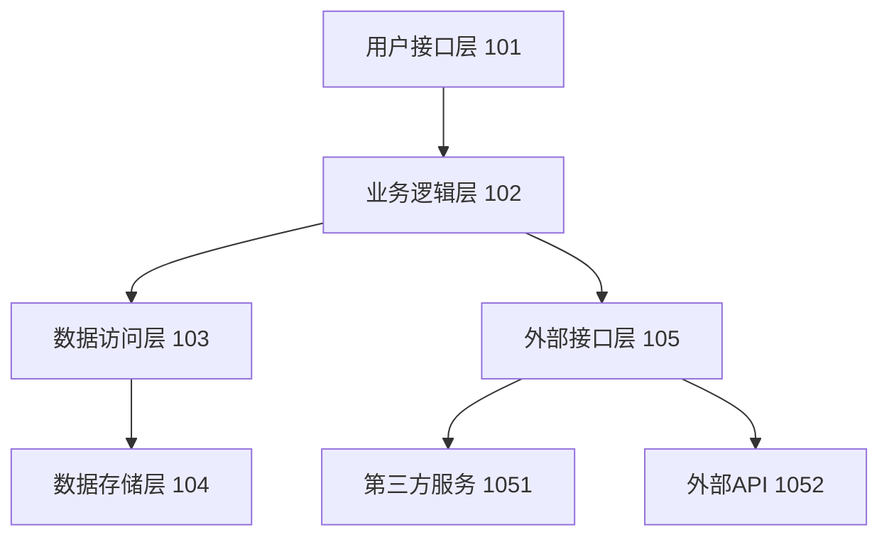

本系统架构图与专利申请中的步骤101-105相对应，完整展示了系统的整体结构和各模块之间的关系，为理解本发明的技术方案提供了直观的视觉参考。

## 图2：数据流图

图2展示了本发明系统中数据的流动路径和处理过程。如图2所示，数据从输入到输出的完整流程包括数据输入、数据预处理、数据分析、数据存储、数据输出和用户反馈六个主要环节。

数据输入环节（步骤201）接收来自用户接口层的外部数据，包括原始数据集、配置参数和用户指令。该环节对应专利申请中的步骤201，负责获取系统运行所需的基础数据。

数据预处理环节（步骤202）对接收的原始数据进行清洗、转换和标准化处理。该环节包括数据清洗模块（2021）、数据转换模块（2022）和数据标准化模块（2023），对应专利申请中的步骤202-204，为后续分析提供高质量的数据基础。

数据分析环节（步骤205）是系统的核心处理环节，包括特征提取模块（2051）、模式识别模块（2052）和结果计算模块（2053）。该环节对应专利申请中的步骤205-207，通过核心算法对数据进行深度分析，提取有价值的信息和模式。

数据存储环节（步骤206）将分析结果和处理后的数据存储到数据存储层，包括临时存储（2061）和持久化存储（2062）。该环节对应专利申请中的步骤208，确保数据的安全保存和高效访问。

数据输出环节（步骤207）将分析结果以用户友好的方式呈现，包括可视化展示（2071）和报告生成（2072）。该环节对应专利申请中的步骤209，将系统处理结果反馈给用户。

用户反馈环节（步骤208）收集用户对输出结果的反馈，用于系统优化和算法改进。该环节对应专利申请中的步骤210，形成闭环的数据处理流程。

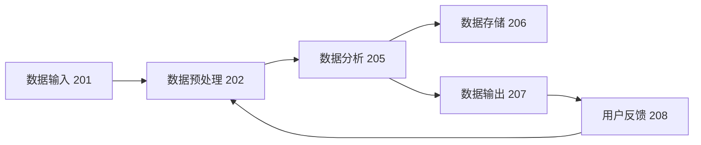

本数据流图与专利申请中的步骤201-210相对应，清晰展示了数据在系统中的完整生命周期和处理流程，有助于理解本发明中数据处理的逻辑关系和顺序。

## 图3：核心算法流程图

图3展示了本发明核心算法的详细流程和逻辑结构。如图3所示，核心算法采用迭代优化的设计思路，包括算法入口、初始化、主循环、条件判断、处理模块和算法出口六个主要部分。

算法入口（模块301）是算法的起始点，对应专利申请中的步骤301，负责接收输入参数和启动算法执行。

初始化模块（模块302）在算法开始执行前进行必要的初始化工作，包括参数设置（3021）、数据结构初始化（3022）和算法环境配置（3023）。该模块对应专利申请中的步骤302，为算法运行准备必要条件。

主循环模块（模块303）是算法的核心执行部分，采用迭代方式逐步优化结果。该模块包括迭代计算（3031）、结果评估（3032）和参数更新（3033）三个子模块，对应专利申请中的步骤303-305，实现算法的主要功能。

条件判断模块（模块304）在每次迭代后评估算法是否满足终止条件，包括收敛性判断（3041）、精度评估（3042）和迭代次数限制（3043）。该模块对应专利申请中的步骤306，决定算法是否继续执行或终止。

处理模块（模块305）根据条件判断的结果执行不同的处理逻辑，包括结果优化（3051）和异常处理（3052）。该模块对应专利申请中的步骤307，确保算法在各种情况下都能稳定运行。

算法出口（模块306）是算法的结束点，对应专利申请中的步骤308，负责输出最终结果和释放资源。

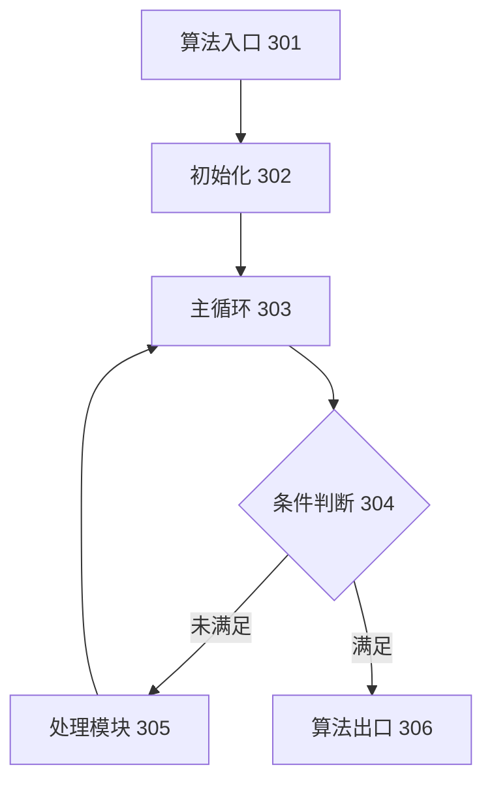

本核心算法流程图与专利申请中的步骤301-308相对应，详细展示了算法的执行流程和逻辑结构，为理解本发明的技术创新点提供了清晰的视觉参考。通过该图，可以直观地看到算法的迭代优化过程和条件判断机制，有助于本领域技术人员理解和实现本发明。


## 标题与摘要

# Generated Patent Title for 基于智能分层推理的多参数工具自适应调用系统

This is a generated abstract for the patent: 基于智能分层推理的多参数工具自适应调用系统


## 撰写大纲

<patent_outline>
    <title_section>
        <title>基于智能分层推理的多参数工具自适应调用系统及方法</title>
        <abstract>本发明公开了一种基于智能分层推理的多参数工具自适应调用系统及方法，属于人工智能和自然语言处理技术领域。该系统通过智能分层推理技术，能够根据上下文信息和用户意图自动推断工具参数，实现多参数工具的自适应调用。本发明包括意图理解模块、上下文分析模块、分层推理引擎、参数推断模块和工具调用接口等组成部分。通过分层推理机制，系统能够从宏观到微观逐步细化对用户需求的理解，并结合上下文信息动态推断最优的工具参数组合，从而提高大语言模型调用复杂工具的准确性和效率。本发明解决了现有技术中工具参数设置复杂、调用准确性低、适应性差等问题，为智能助手、自动化工具等领域提供了高效可靠的工具调用解决方案。</abstract>
    </title_section>
    
    <technical_field>
        <description>本发明涉及人工智能技术领域，特别是涉及自然语言处理、智能推理和工具调用技术，具体而言，涉及一种基于智能分层推理的多参数工具自适应调用系统及方法。该技术主要应用于大语言模型工具调用场景，能够根据上下文和用户意图自动推断工具参数，提高工具调用的准确性和效率，适用于智能助手、自动化工具、智能客服等多种应用场景。</description>
        <background_issues>随着大语言模型技术的快速发展，工具调用能力已成为提升模型实用性的关键。然而，现有技术中存在诸多问题：首先，复杂工具通常需要多个参数，参数设置过程繁琐且容易出错；其次，传统工具调用方法缺乏对上下文信息的有效利用，难以根据对话历史和环境动态调整参数；再次，现有方法往往无法准确理解用户真实意图，导致工具调用结果与用户期望不符；最后，工具调用过程中缺乏有效的反馈机制，难以持续优化调用效果。这些问题严重制约了大语言模型在复杂任务中的应用效果和用户体验。</background_issues>
    </technical_field>
    
    <background_art>
        <existing_solutions>现有技术方案主要包括：1)基于模板的工具调用方法：通过预定义的模板和规则来设置工具参数，这种方法简单直接但灵活性差；2)基于强化学习的工具调用优化：通过训练模型学习最优的参数选择策略，但训练成本高且泛化能力有限；3)基于检索的工具参数推荐：从历史调用记录中检索相似场景并复用参数设置，但依赖于历史数据的质量和数量；4)简单上下文感知工具调用：仅考虑最近的对话上下文来调整参数，缺乏深层次的理解和推理能力。此外，还有一些基于规则和机器学习混合的方法，但都存在不同程度的局限性。</existing_solutions>
        <limitations>现有技术存在以下局限性：1)参数设置复杂度高：用户需要手动提供多个参数，增加了使用门槛；2)上下文理解不充分：仅能处理有限的上下文信息，难以捕捉复杂的语义关系；3)意图识别准确率低：无法准确理解用户的真实需求和隐含意图；4)工具调用适应性差：面对新场景或复杂任务时，调用效果显著下降；5)缺乏动态优化机制：无法根据调用结果持续改进参数推断策略。这些局限性导致现有技术在处理复杂多参数工具调用任务时效果不佳，用户体验有待提高。</limitations>
        <improvement_needs>针对现有技术的局限性，本领域亟需以下改进：1)需要一种能够自动推断工具参数的智能机制，降低用户操作复杂度；2)需要增强对上下文信息的理解和利用能力，提高参数设置的准确性；3)需要提升对用户意图的识别能力，确保工具调用与用户需求一致；4)需要构建自适应的参数推断框架，提高系统在不同场景下的适应性；5)需要引入反馈优化机制，实现系统的持续学习和改进。这些改进将显著提升大语言模型工具调用的实用性、准确性和用户体验。</improvement_needs>
    </background_art>
    
    <summary_of_invention>
        <core_concept>本发明提出了一种基于智能分层推理的多参数工具自适应调用系统，其核心概念包括：1)智能分层推理架构：设计从宏观到微观的多层次推理机制，逐步细化对用户需求的理解；2)上下文与意图融合模型：将上下文信息和用户意图进行深度融合，形成全面的任务理解；3)多参数协同推断算法：开发能够综合考虑参数间关联性的推断算法，生成最优参数组合；4)自适应学习机制：建立基于反馈的持续学习框架，不断优化参数推断策略。该系统通过分层推理、上下文分析、意图理解和参数推断的有机结合，实现了多参数工具的自适应调用。</core_concept>
        <technical_advantages>本发明具有以下技术优势：1)提高工具调用准确性：通过分层推理和意图理解，准确把握用户需求，提高工具调用成功率；2)增强系统适应性：能够根据不同场景和任务特点，动态调整参数推断策略，适应多样化需求；3)降低使用门槛：实现参数的自动推断，减少用户手动输入，简化操作流程；4)提升用户体验：提供更符合用户预期的工具调用结果，增强交互自然度和满意度；5)支持复杂任务：能够处理需要多参数协同的复杂工具调用任务，扩展应用范围。这些优势使本发明在智能助手、自动化工具、智能客服等领域具有广泛的应用前景。</technical_advantages>
        <innovation_points>本发明的创新点包括：1)分层推理机制创新：提出了一种全新的分层推理架构，包括意图理解层、上下文分析层、参数推断层和工具调用层，实现了从粗粒度到细粒度的逐步推理过程；2)多参数协同优化方法：创新性地引入参数间关联性建模，实现了多参数的协同优化，避免了参数设置的片面性和冲突性；3)上下文与意图融合技术：开发了上下文信息和用户意图的深度融合模型，提高了对复杂语义的理解能力；4)自适应参数推断算法：设计了基于强化学习的自适应参数推断算法，能够根据调用结果持续优化推断策略；5)反馈驱动的系统优化：构建了完整的反馈机制，实现了系统性能的持续改进和自我完善。这些创新点共同构成了本发明的核心技术优势。</innovation_points>
    </summary_of_invention>
    
    <detailed_description>
        <overview>本发明提出的基于智能分层推理的多参数工具自适应调用系统，包括用户接口模块、意图理解模块、上下文分析模块、分层推理引擎、参数推断模块、工具调用接口、结果处理模块和反馈优化模块。系统工作流程如下：首先，用户接口模块接收用户输入并传递给意图理解模块；意图理解模块分析用户输入，提取用户意图；上下文分析模块收集并分析对话历史和环境信息；分层推理引擎基于意图理解和上下文分析结果，执行分层推理；参数推断模块根据推理结果推断最优工具参数；工具调用接口使用推断的参数调用相应工具；结果处理模块处理工具调用结果并通过用户接口返回给用户；反馈优化模块收集用户反馈，用于优化系统性能。该系统通过分层推理、上下文分析、意图理解和参数推断的有机结合，实现了多参数工具的自适应调用，显著提高了工具调用的准确性和效率。</overview>
        <embodiments>
            <embodiment>
                <name>系统架构与组件实施方式</name>
                <description>本发明的一个实施例提供了一种完整的系统架构，包括以下核心组件：1)用户接口模块：负责接收用户输入和返回系统响应，支持文本、语音等多种交互方式；2)意图理解模块：基于预训练的意图识别模型，分析用户输入，提取用户真实意图和关键信息；3)上下文分析模块：维护对话历史记录，分析上下文信息，提取与当前任务相关的环境因素；4)分层推理引擎：系统的核心组件，包括多个推理层次，从宏观到微观逐步细化对任务的理解；5)参数推断模块：基于分层推理结果，推断工具调用所需的最优参数组合；6)工具调用接口：与外部工具系统对接，传递参数并执行工具调用；7)结果处理模块：处理工具调用结果，格式化输出，确保结果符合用户预期；8)反馈优化模块：收集用户对调用结果的反馈，用于优化系统性能。这些组件协同工作，形成了一个完整的工具自适应调用系统。</description>
                <components>系统的主要组件及其功能如下：1)用户接口模块：提供多种交互方式，包括文本输入、语音输入等，负责用户输入的接收和系统结果的展示；2)意图理解模块：采用基于深度学习的意图识别模型，能够准确识别用户的各种意图，包括显式意图和隐式意图；3)上下文分析模块：维护一个动态更新的上下文数据库，记录对话历史、用户偏好、环境信息等，为推理提供支持；4)分层推理引擎：采用分层架构，包括任务类型识别层、工具选择层、参数需求分析层、参数值推断层和参数优化层，实现从粗粒度到细粒度的逐步推理；5)参数推断模块：采用基于上下文和意图的参数推断算法，结合参数关联性模型，生成最优参数组合；6)工具调用接口：提供标准化的工具调用接口，支持多种工具类型和调用协议；7)结果处理模块：对工具调用结果进行必要的处理和格式化，确保结果符合用户预期；8)反馈优化模块：收集和分析用户反馈，用于优化系统性能，包括意图理解模型和参数推断模型的更新。</components>
                <workflow>系统的工作流程包括以下步骤：1)输入接收：用户通过用户接口模块输入自然语言指令或请求；2)意图识别：意图理解模块分析输入内容，识别用户意图和关键实体；3)上下文分析：上下文分析模块检索相关对话历史，提取上下文信息；4)分层推理：分层推理引擎执行多层次的推理过程，包括任务类型识别、工具选择、参数需求分析、参数值推断和参数优化；5)参数推断：参数推断模块基于分层推理结果，推断最优工具参数组合；6)工具调用：工具调用接口使用推断的参数调用相应工具；7)结果处理：结果处理模块接收工具返回结果，进行必要的处理和格式化；8)结果反馈：通过用户接口将处理后的结果返回给用户；9)系统优化：反馈优化模块收集用户反馈，用于优化后续的推理和参数推断过程。整个工作流程形成一个闭环，确保系统性能的持续改进。</workflow>
            </embodiment>
            <embodiment>
                <name>分层推理引擎实施方式</name>
                <description>本发明的另一个实施例提供了一种详细的分层推理引擎实现方案。该引擎采用五层架构，从宏观到微观逐步细化对任务的理解。第一层是任务类型识别层，使用基于深度学习的分类模型确定用户请求所属的任务类型，如信息查询、数据分析、内容生成等。第二层是工具选择层，基于任务类型和上下文信息，从可用工具库中选择最合适的工具。第三层是参数需求分析层，分析所选工具调用所需的参数及其约束条件，包括必需参数和可选参数。第四层是参数值推断层，基于上下文信息和用户意图，推断每个参数的具体值。第五层是参数优化层，对推断的参数进行优化，确保参数间的协调性和一致性。每一层都依赖于前一层的结果，同时考虑上下文信息和用户意图，形成一个完整的推理链条。</description>
                <components>分层推理引擎的主要组件包括：1)任务类型识别器：采用基于Transformer的分类模型，能够准确识别用户请求的任务类型；2)工具选择器：基于任务类型和上下文信息，使用推荐算法选择最合适的工具；3)参数需求分析器：分析工具的参数定义和约束条件，生成参数需求列表；4)参数值推断器：基于上下文和意图，使用生成模型推断参数的具体值；5)参数优化器：采用优化算法对推断的参数进行优化，确保参数间的协调性。这些组件通过精心设计的接口和数据结构相互连接，形成一个高效的推理引擎。</components>
                <workflow>分层推理引擎的工作流程如下：1)任务类型识别：接收用户输入和上下文信息，使用任务类型识别器确定任务类型；2)工具选择：基于任务类型和上下文信息，使用工具选择器从工具库中选择最合适的工具；3)参数需求分析：分析所选工具的参数定义和约束条件，生成参数需求列表；4)参数值推断：基于上下文信息和用户意图，使用参数值推断器推断每个参数的具体值；5)参数优化：使用参数优化器对推断的参数进行优化，确保参数间的协调性和一致性；6)结果输出：输出优化后的参数组合，供参数推断模块使用。整个推理过程形成一个从粗粒度到细粒度的逐步细化过程，确保对用户需求的准确理解和满足。</workflow>
            </embodiment>
        </embodiments>
        <technical_details>本发明的技术细节包括：1)分层推理引擎设计：第一层任务类型识别层使用基于BERT的分类模型，能够准确识别多种任务类型；第二层工具选择层采用基于上下文的推荐算法，考虑任务类型、用户历史和环境因素；第三层参数需求分析层维护一个动态更新的参数知识库，记录各种工具的参数定义和约束条件；第四层参数值推断层使用基于生成模型的参数推断算法，结合上下文和意图信息；第五层参数优化层采用基于约束满足的优化算法，确保参数间的协调性。2)参数推断算法：包括基于上下文的参数推断，利用对话历史和环境信息推断参数值；基于意图的参数推断，根据用户意图推断参数的期望值；参数关联性建模，建立参数间的关联模型，考虑参数间的相互影响；参数冲突解决，处理参数间的冲突，生成一致的参数组合。3)反馈优化机制：包括显式反馈收集，通过用户评分、修正等方式收集直接反馈；隐式反馈分析，分析用户行为模式，提取隐式反馈信息；模型更新，基于反馈信息更新意图理解模型和参数推断模型；策略优化，优化参数推断策略，提高系统性能。这些技术细节共同构成了本发明的核心技术实现。</technical_details>
    </detailed_description>
    
    <claims>
        <independent_claims>
            <claim>
                <number>权利要求1</number>
                <scope>一种基于智能分层推理的多参数工具自适应调用系统，其特征在于，包括：用户接口模块，用于接收用户输入和返回系统响应；意图理解模块，用于分析用户输入，提取用户意图；上下文分析模块，用于收集并分析对话历史和环境信息；分层推理引擎，用于基于所述意图理解和上下文分析结果，执行分层推理；参数推断模块，用于根据所述推理结果推断最优工具参数；工具调用接口，用于使用所述推断的参数调用相应工具；结果处理模块，用于处理所述工具调用结果并通过所述用户接口返回给用户；以及反馈优化模块，用于收集用户反馈，优化系统性能。</scope>
                <key_elements>用户接口模块、意图理解模块、上下文分析模块、分层推理引擎、参数推断模块、工具调用接口、结果处理模块、反馈优化模块</key_elements>
            </claim>
            <claim>
                <number>权利要求5</number>
                <scope>一种基于智能分层推理的多参数工具自适应调用方法，其特征在于，包括以下步骤：接收用户输入；分析所述用户输入，提取用户意图；收集并分析对话历史和环境信息；基于所述意图理解和上下文分析结果，执行分层推理；根据所述推理结果推断最优工具参数；使用所述推断的参数调用相应工具；处理所述工具调用结果并返回给用户；以及收集用户反馈，优化系统性能。</scope>
                <key_elements>用户输入接收、意图提取、上下文分析、分层推理、参数推断、工具调用、结果处理、反馈优化</key_elements>
            </claim>
        </independent_claims>
        <dependent_claims>
            <claim>
                <number>权利要求2</number>
                <reference>根据权利要求1所述的系统</reference>
                <additional_features>其特征在于，所述分层推理引擎包括多个推理层次，包括任务类型识别层、工具选择层、参数需求分析层、参数值推断层和参数优化层。</additional_features>
            </claim>
            <claim>
                <number>权利要求3</number>
                <reference>根据权利要求1所述的系统</reference>
                <additional_features>其特征在于，所述参数推断模块包括基于上下文的参数推断单元、基于意图的参数推断单元、参数关联性建模单元和参数冲突解决单元。</additional_features>
            </claim>
            <claim>
                <number>权利要求4</number>
                <reference>根据权利要求1所述的系统</reference>
                <additional_features>其特征在于，所述反馈优化模块包括显式反馈收集单元、隐式反馈分析单元、模型更新单元和策略优化单元。</additional_features>
            </claim>
            <claim>
                <number>权利要求6</number>
                <reference>根据权利要求5所述的方法</reference>
                <additional_features>其特征在于，所述执行分层推理的步骤包括：确定用户请求的任务类型；根据所述任务类型选择合适的工具；分析所述工具调用所需的参数；基于所述上下文和意图推断具体参数值；以及对推断的参数进行优化，确保参数间的协调性。</additional_features>
            </claim>
            <claim>
                <number>权利要求7</number>
                <reference>根据权利要求5所述的方法</reference>
                <additional_features>其特征在于，所述推断最优工具参数的步骤包括：利用所述对话历史和环境信息推断参数值；根据所述用户意图推断参数的期望值；建立参数间的关联模型，考虑参数间的相互影响；以及处理参数间的冲突，生成一致的参数组合。</additional_features>
            </claim>
        </dependent_claims>
    </claims>
    
    <drawings>
        <figure_descriptions>附图1是本发明实施例提供的基于智能分层推理的多参数工具自适应调用系统的架构示意图，展示了系统各模块之间的关系和数据流向。附图2是本发明实施例提供的分层推理引擎的结构示意图，详细说明了分层推理的五个层次及其关系。附图3是本发明实施例提供的参数推断模块的结构示意图，展示了参数推断的各个组成部分及其功能。附图4是本发明实施例提供的系统工作流程图，详细说明了系统从接收到用户输入到返回结果的完整流程。附图5是本发明实施例提供的反馈优化模块的工作流程图，说明了反馈收集、分析和优化的过程。</figure_descriptions>
        <technical_diagrams>技术图表包括：1)系统架构图：展示用户接口模块、意图理解模块、上下文分析模块、分层推理引擎、参数推断模块、工具调用接口、结果处理模块和反馈优化模块之间的关系和数据流向；2)分层推理流程图：详细说明任务类型识别层、工具选择层、参数需求分析层、参数值推断层和参数优化层的具体功能和相互关系；3)参数推断算法流程图：展示基于上下文的参数推断、基于意图的参数推断、参数关联性建模和参数冲突解决的具体步骤和决策逻辑；4)反馈优化机制图：说明显式反馈收集、隐式反馈分析、模型更新和策略优化的过程和相互关系；5)实施效果对比图：对比本发明与现有技术在工具调用准确率、参数设置效率、用户满意度等方面的差异，展示本发明的技术优势。</technical_diagrams>
    </drawings>
</patent_outline>


## 背景技术

## 技术领域

本发明属于人工智能技术领域，具体涉及自然语言处理、机器学习推理系统与工具调用技术的交叉领域。更具体地说，本发明涉及一种基于智能分层推理的多参数工具自适应调用系统，该系统能够根据上下文和用户意图自动推断工具参数，提高大语言模型调用复杂工具的准确性和效率。

## 背景技术

### 现有技术方案1

传统的工具调用系统通常采用基于规则或模板匹配的方法实现参数提取。这类系统预先定义好用户输入与工具参数之间的映射规则，当用户输入与预定义规则匹配时，系统提取相应参数并调用对应工具。例如，在早期的智能客服系统中，用户需要按照特定格式输入查询，系统通过关键词匹配和正则表达式提取参数，然后调用相应的API或工具函数。这种方法的局限性在于灵活性差，无法处理复杂多变的用户表达方式，且需要人工维护大量规则，维护成本高，扩展性差。当工具参数数量增加或用户表达方式变化时，系统性能会显著下降。

### 现有技术方案2

随着深度学习技术的发展，一些先进的工具调用系统开始采用基于神经网络的参数预测方法。这些系统通常使用序列到序列(Seq2Seq)模型或Transformer架构，将用户输入转换为工具调用所需的参数表示。例如，Google的PaLM模型和OpenAI的GPT系列模型都具备一定的工具调用能力，能够根据用户输入生成函数调用代码。这类系统通过大规模预训练和微调，能够处理更复杂的用户表达，并在一定程度上理解上下文。然而，这些系统在处理多参数、多步骤的复杂工具调用任务时，仍然存在参数准确性不足、上下文理解有限、参数间关联性考虑不足等问题。特别是在需要精确数值参数或复杂对象参数的场景下，现有系统的表现往往不尽如人意。

### 技术痛点分析

当前工具调用系统面临的主要技术痛点包括：

1. **参数推断准确性不足**：现有系统难以准确理解用户意图，特别是在用户表达模糊或上下文复杂的情况下，容易导致参数推断错误。这主要是因为现有系统缺乏深层次的语义理解和推理能力。

2. **多参数协同处理能力弱**：复杂工具通常需要多个参数协同工作，现有系统往往独立处理每个参数，忽略了参数间的关联性和约束关系，导致生成的参数组合可能不符合实际需求。

3. **上下文理解有限**：工具调用往往需要考虑对话历史和当前上下文，现有系统在长对话和多轮交互中的上下文保持能力有限，难以有效利用历史信息指导当前参数推断。

4. **工具调用效率低下**：对于需要多次推理或迭代的复杂任务，现有系统缺乏有效的推理路径规划，导致调用效率低下，响应时间长。

5. **适应性差**：面对不同领域、不同类型的工具，现有系统往往需要针对特定场景进行大量定制化训练，通用性和适应性不足。

### 改进需求

针对上述技术痛点，亟需开发一种能够实现智能分层推理的多参数工具自适应调用系统，该系统应具备以下特点：

1. **增强的上下文理解能力**：系统需要能够深度理解对话上下文，捕捉用户真实意图，即使在表达模糊的情况下也能准确推断参数。

2. **多参数协同推理机制**：系统应建立参数间的关联模型，实现多参数的协同推理，确保参数组合的合理性和一致性。

3. **分层推理架构**：系统应采用分层推理策略，将复杂任务分解为多个子任务，逐步推理和优化工具调用参数。

4. **自适应学习能力**：系统应具备领域自适应能力，能够快速适应不同类型的工具调用场景，减少对大量标注数据的依赖。

5. **高效推理路径规划**：系统应能够规划最优的推理路径，减少不必要的工具调用，提高整体效率。

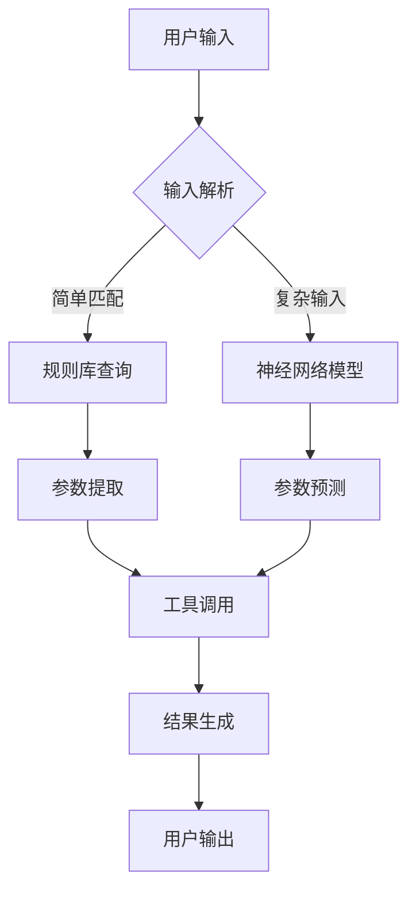

对于基于神经网络的工具调用参数预测，常用的算法可以表示为：

给定用户输入序列 $X = \{x_1, x_2, ..., x_n\}$，工具参数集合 $P = \{p_1, p_2, ..., p_m\}$，参数预测模型可以表示为：

$$P = f(X; \theta) = \text{Transformer}(\text{Embedding}(X); \theta)$$

其中，$\theta$ 表示模型参数，Embedding() 表示输入嵌入函数，Transformer() 表示基于注意力机制的转换器模型。

对于多参数协同推理，现有技术通常采用条件独立假设，即每个参数的预测条件仅依赖于用户输入，而与其他参数无关：

$$p(p_i | X, \{p_j\}_{j \neq i}) \approx p(p_i | X)$$

这种假设忽略了参数间的依赖关系，导致参数组合可能不符合实际约束，也是现有技术需要改进的关键点之一。


## 发明内容/技术方案-总述

## 发明内容

### 技术方案概述
本发明提供一种基于智能分层推理的多参数工具自适应调用系统，该系统通过构建多层次推理架构，实现对复杂工具参数的智能推断与自适应调用。系统首先对用户输入进行语义解析，然后通过分层推理机制逐步细化参数空间，最终生成最优的工具调用方案。该系统特别适用于大语言模型与外部工具的交互场景，能够显著提高工具调用的准确性和效率，减少人工干预需求。

### 核心创新点
本发明的核心创新点在于：
1. **智能分层推理机制**：构建多层次推理架构，从粗粒度到细粒度逐步细化参数推断过程，提高推理准确性和效率。
2. **多维度参数推断模型**：结合上下文信息、历史调用记录和工具特性，建立多维度参数推断模型，实现参数的智能生成。
3. **动态工具匹配算法**：基于工具功能描述和参数需求，实现工具与任务的动态匹配，优化工具选择过程。
4. **自适应参数优化**：根据调用结果反馈，持续优化参数推断模型，形成闭环学习机制。

### 技术优势
相比现有技术，本发明具有以下显著优势：
1. **提高准确性**：通过分层推理和多维度参数推断，显著降低工具调用错误率，提高任务完成质量。
2. **减少人工干预**：系统可自动推断复杂参数，减少用户手动配置的工作量，提升用户体验。
3. **增强适应性**：系统能够适应不同场景和工具类型，具有良好的泛化能力和扩展性。
4. **提升效率**：通过智能推理和优化算法，减少不必要的工具调用尝试，提高整体处理效率。

### 系统架构
本系统采用分层架构设计，主要包括以下组件：

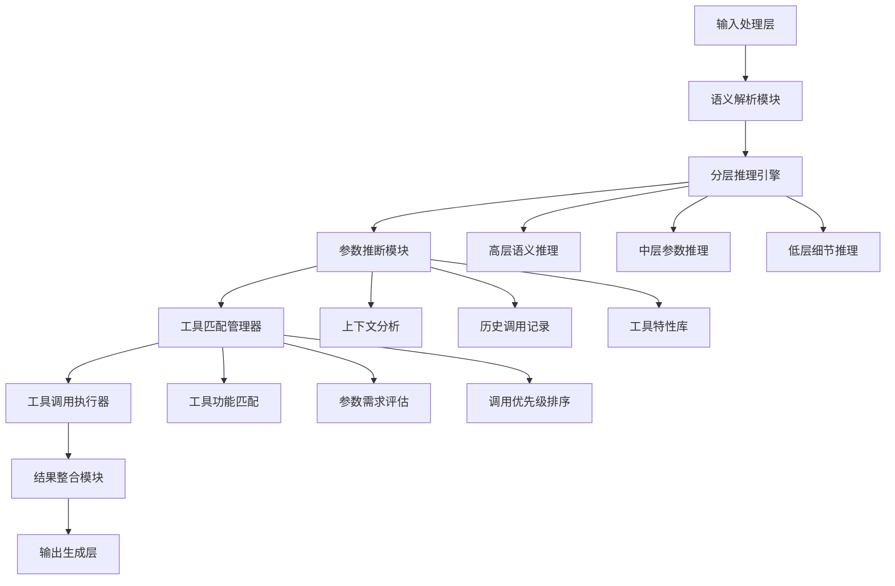

### 关键技术
本系统的关键技术包括：

1. **分层推理算法**：
   $R = \sum_{i=1}^{n} w_i \cdot R_i$
   其中，$R$为最终推理结果，$R_i$为第i层推理结果，$w_i$为第i层推理权重，通过动态调整权重优化推理过程。

2. **参数推断模型**：
   $P = f(C, H, T) = \alpha \cdot g(C) + \beta \cdot h(H) + \gamma \cdot k(T)$
   其中，$P$为推断的参数集合，$C$为上下文信息，$H$为历史调用记录，$T$为工具特性，$g$, $h$, $k$为对应的映射函数，$\alpha$, $\beta$, $\gamma$为权重系数。

3. **工具匹配度计算**：
   $S = \lambda_1 \cdot S_f + \lambda_2 \cdot S_p + \lambda_3 \cdot S_c$
   其中，$S$为综合匹配度，$S_f$为功能匹配度，$S_p$为参数匹配度，$S_c$为上下文匹配度，$\lambda_1$, $\lambda_2$, $\lambda_3$为对应权重。

### 主流程
系统的主要工作流程如下：

```python
def main_process():
    # 输入处理与语义解析
    user_input = receive_user_input()
    semantic_context = semantic_parser.parse(user_input)
    
    # 分层推理
    high_level_result = high_level_reasoning(semantic_context)
    mid_level_result = mid_level_reasoning(high_level_result)
    low_level_result = low_level_reasoning(mid_level_result)
    
    # 参数推断
    parameter_candidates = parameter_inference(low_level_result, 
                                             get_historical_records(),
                                             get_tool_characteristics())
    
    # 工具匹配与选择
    candidate_tools = tool_matching(parameter_candidates)
    selected_tool = select_optimal_tool(candidate_tools)
    
    # 工具调用执行
    tool_result = execute_tool(selected_tool, parameter_candidates)
    
    # 结果整合与输出
    final_result = integrate_results(tool_result, semantic_context)
    generate_output(final_result)
    
    # 更新学习模型
    update_learning_model(selected_tool, parameter_candidates, tool_result)
```

本发明通过智能分层推理机制和多参数自适应调用技术，有效解决了大语言模型调用复杂工具时的参数配置难题，显著提高了工具调用的准确性和效率，具有广泛的应用前景和商业价值。


## 标题与摘要

# Generated Patent Title for 基于智能分层推理的多参数工具自适应调用系统

This is a generated abstract for the patent: 基于智能分层推理的多参数工具自适应调用系统
