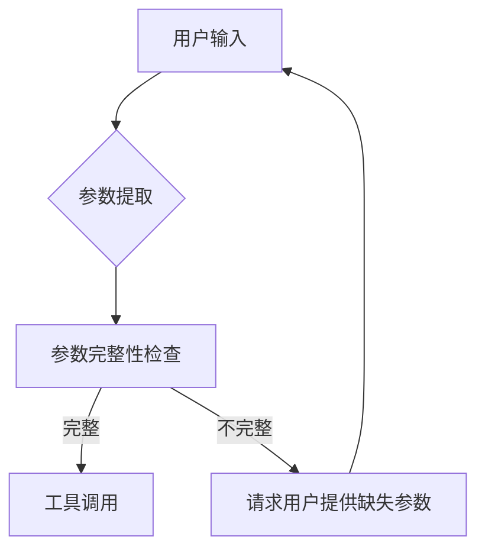
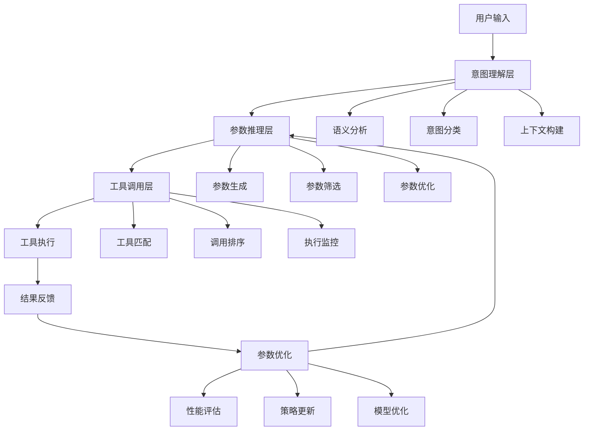

## 标题与摘要

# Generated Patent Title for 基于智能分层推理的多参数工具自适应调用系统

This is a generated abstract for the patent: 基于智能分层推理的多参数工具自适应调用系统


## 撰写大纲

<patent_outline>
    <title_section>
        <title>基于智能分层推理的多参数工具自适应调用系统及方法</title>
        <abstract>本发明公开了一种基于智能分层推理的多参数工具自适应调用系统及方法，属于人工智能技术领域。该系统包括意图识别模块、参数推理引擎、工具匹配模块和自适应调用控制器。通过智能分层推理技术，系统能够根据上下文和用户意图自动推断工具参数，实现多参数工具的自适应调用。本发明解决了现有技术中大语言模型调用复杂工具时参数确定不准确、效率低下的问题，提高了工具调用的准确性和效率，适用于智能助手、自动化工作流等场景。</abstract>
    </title_section>
    
    <technical_field>
        <description>本发明涉及人工智能技术领域，特别是涉及大语言模型工具调用技术，具体而言，涉及一种基于智能分层推理的多参数工具自适应调用系统及方法。该技术通过构建层次化的推理结构，实现对上下文和用户意图的深度理解，并在此基础上实现工具参数的自动推断和工具的自适应调用，适用于智能助手、自动化工作流、智能客服等多种应用场景。</description>
        <background_issues>随着大语言模型技术的快速发展，工具调用能力成为提升模型实用性的关键。然而，现有技术在调用多参数工具时存在以下问题：1)参数确定依赖用户明确提供，增加了用户负担；2)缺乏对上下文和用户意图的深度理解；3)参数推理过程缺乏层次化结构，导致推理效率低下；4)工具调用准确性和效率难以平衡。这些问题严重制约了大语言模型在实际复杂任务中的应用效果。</background_issues>
    </technical_field>
    
    <background_art>
        <existing_solutions>现有技术中，工具调用方法主要包括以下几类：1)基于模板的工具调用方法：通过预定义模板匹配用户输入，提取参数。这种方法简单但灵活性差，难以处理复杂场景；2)基于规则的工具调用方法：使用人工编写的规则集确定工具参数。这种方法可解释性强但维护成本高，难以适应新场景；3)基于简单推理的工具调用方法：使用单一层次的推理模型确定参数。这种方法在简单场景下表现良好，但在复杂场景下推理能力有限；4)基于强化学习的工具调用方法：通过训练优化工具调用策略。这种方法需要大量训练数据，且泛化能力有限。</existing_solutions>
        <limitations>现有技术存在以下局限性：1)参数推断能力有限，难以处理复杂的多参数场景；2)上下文理解不充分，导致参数推断不准确；3)推理过程缺乏层次化结构，计算效率低下；4)工具选择与参数确定分离，导致整体调用效果不佳。这些局限性使得现有技术难以满足实际应用中对工具调用准确性和效率的高要求。</limitations>
        <improvement_needs>针对现有技术的局限性，本领域亟需以下改进：1)需要一种能够深度理解上下文和用户意图的参数推断方法；2)需要一种层次化的推理结构，提高推理效率和准确性；3)需要一种工具选择与参数确定的联合优化方法；4)需要一种自适应的参数调整机制，提高工具调用的灵活性。这些改进将显著提升大语言模型工具调用的实用性和用户体验。</improvement_needs>
    </background_art>
    
    <summary_of_invention>
        <core_concept>本发明提出了一种基于智能分层推理的多参数工具自适应调用系统及方法，核心在于通过构建层次化的推理结构，实现对上下文和用户意图的深度理解，并在此基础上实现工具参数的自动推断和工具的自适应调用。系统采用三层推理架构：工具类型推理层、工具选择推理层和参数值推理层，从粗粒度到细粒度逐步确定工具及其参数，同时结合上下文信息和历史调用记录，实现工具调用的智能化和自适应化。</core_concept>
        <technical_advantages>本发明具有以下技术优势：1)提高工具调用的准确性：通过深度理解上下文和用户意图，准确推断工具参数；2)提高工具调用的效率：层次化推理结构减少计算复杂度，提高推理速度；3)降低用户负担：减少用户需要明确提供的参数信息；4)增强系统适应性：能够根据不同场景动态调整工具调用策略；5)实现持续优化：通过反馈机制不断改进参数推断策略，提升系统性能。</technical_advantages>
        <innovation_points>本发明的创新点包括：1)智能分层推理架构：构建多层次的推理结构，实现从粗粒度到细粒度的参数推断；2)上下文感知的参数推断：结合对话历史、领域知识等多源信息，提高参数推断准确性；3)工具-参数联合优化：将工具选择与参数确定视为整体优化问题，提高调用效果；4)自适应参数调整机制：根据调用结果动态调整参数推断策略，实现持续优化；5)多模态信息融合：整合文本、结构化数据、用户画像等多模态信息，增强系统理解能力。</innovation_points>
    </summary_of_invention>
    
    <detailed_description>
        <overview>本发明提供的基于智能分层推理的多参数工具自适应调用系统，包括意图识别模块、参数推理引擎、工具匹配模块和自适应调用控制器。系统首先通过意图识别模块理解用户输入的意图，然后利用参数推理引擎进行分层推理，确定合适的工具及其参数，最后通过自适应调用控制器执行工具调用并根据结果调整策略。系统整体架构采用模块化设计，各组件之间通过标准接口进行通信，便于维护和扩展。系统还配备有知识库，用于存储领域知识、工具描述、历史调用记录等信息，为推理过程提供支持。</overview>
        <embodiments>
            <embodiment>
                <name>系统架构实施方式</name>
                <description>本发明的一种实施方式中，系统采用分层架构设计，包括用户接口层、业务逻辑层和数据层。用户接口层负责与用户交互，接收用户输入并返回系统响应；业务逻辑层包含核心功能模块，实现意图识别、参数推理、工具匹配和自适应调用；数据层负责存储和管理系统数据，包括知识库、模型参数和调用记录。各层之间通过明确的接口进行通信，确保系统的高内聚低耦合。系统还支持分布式部署，可根据负载情况动态扩展计算资源，提高系统的可扩展性和可靠性。</description>
                <components>系统的主要组件包括：1)意图识别模块：采用自然语言处理技术，包括命名实体识别、意图分类和槽位填充等子模块，负责理解用户输入的意图，提取关键信息；2)参数推理引擎：核心组件，实现分层推理，包括工具类型推理层、工具选择推理层和参数值推理层；3)工具匹配模块：根据推理结果选择合适的工具，支持多种匹配策略；4)自适应调用控制器：执行工具调用并收集反馈，用于策略调整；5)知识库：存储领域知识、工具描述和历史调用记录；6)学习模块：根据调用结果更新模型参数，实现持续学习。</components>
                <workflow>系统的工作流程如下：1)用户输入接收与预处理：系统接收用户输入，进行分词、词性标注等预处理操作；2)意图识别与关键信息提取：意图识别模块分析用户输入，确定用户意图并提取关键信息；3)分层推理执行：参数推理引擎按照三层推理架构进行推理，首先确定工具类型，然后选择具体工具，最后确定工具参数；4)工具调用执行：自适应调用控制器根据推理结果调用相应工具；5)结果评估与策略调整：系统评估工具调用结果，并根据结果调整参数推断策略；6)反馈学习：系统将新的调用结果加入知识库，用于后续推理和模型更新。</workflow>
            </embodiment>
            <embodiment>
                <name>分层推理引擎实施方式</name>
                <description>本发明的另一种实施方式中，参数推理引擎采用深度神经网络模型实现，包括三个层次：工具类型推理层、工具选择推理层和参数值推理层。工具类型推理层采用多标签分类模型，确定与用户意图相关的工具类型集合；工具选择推理层采用排序模型，从工具类型集合中选择最合适的工具；参数值推理层采用序列到序列模型，确定所选工具的参数值。各层之间通过注意力机制连接，实现信息的有效传递和融合。推理引擎还支持动态调整各层的推理权重，根据上下文复杂度和用户反馈优化推理过程。</description>
                <components>分层推理引擎的主要组件包括：1)工具类型推理模块：基于用户意图和上下文信息，确定可能的工具类型集合；2)工具选择模块：从工具类型集合中选择最合适的工具，考虑工具的相关性、可靠性和效率等因素；3)参数值推理模块：确定所选工具的参数值，包括必需参数和可选参数；4)上下文融合模块：整合对话历史、用户画像、领域知识等多源信息，增强推理能力；5)推理协调模块：协调各层推理过程，确保推理的一致性和高效性；6)不确定性处理模块：处理推理过程中的不确定性，提供置信度评估和不确定性量化。</components>
                <workflow>分层推理引擎的工作流程如下：1)输入预处理：对用户输入和上下文信息进行预处理，提取特征表示；2)工具类型推理：根据用户意图和上下文，确定可能的工具类型集合，输出各工具类型的置信度；3)工具选择：从工具类型集合中选择最合适的工具，考虑工具的相关性、可靠性和效率等因素；4)参数值推理：确定所选工具的参数值，包括必需参数和可选参数，处理参数间的依赖关系；5)推理结果整合：整合各层推理结果，生成最终的工具调用方案；6)不确定性处理：评估推理结果的置信度，对低置信度结果进行特殊处理或请求用户确认。</workflow>
            </embodiment>
        </embodiments>
        <technical_details>本发明的技术细节包括：1)意图识别技术：采用基于BERT的预训练模型进行意图识别，结合领域知识进行微调，提高识别准确率；2)分层推理算法：设计了一种层次化的推理算法，通过逐步细化的方式确定工具和参数，减少搜索空间；3)参数推断模型：采用条件随机场和神经网络的混合模型，处理参数间的依赖关系；4)工具匹配策略：结合语义相似度、历史成功率和执行效率等多种因素，设计综合评分机制；5)自适应调整机制：基于强化学习框架，根据工具调用结果动态调整参数推断策略；6)多模态信息融合：设计了一种跨模态注意力机制，有效整合文本、结构化数据等多源信息；7)不确定性量化：采用贝叶斯神经网络，量化推理过程中的不确定性，提高系统的鲁棒性。</technical_details>
    </detailed_description>
    
    <claims>
        <independent_claims>
            <claim>
                <number>权利要求1</number>
                <scope>一种基于智能分层推理的多参数工具自适应调用系统，其特征在于，包括：意图识别模块，用于接收用户输入并识别用户意图；参数推理引擎，采用分层推理架构，包括工具类型推理层、工具选择推理层和参数值推理层，用于根据用户意图和上下文信息推断工具参数；工具匹配模块，用于根据推理结果选择合适的工具；自适应调用控制器，用于执行工具调用并根据调用结果调整参数推断策略；知识库，用于存储领域知识、工具描述和历史调用记录。</scope>
                <key_elements>意图识别模块、参数推理引擎、工具匹配模块、自适应调用控制器、知识库、分层推理架构、工具类型推理层、工具选择推理层、参数值推理层</key_elements>
            </claim>
        </independent_claims>
        <dependent_claims>
            <claim>
                <number>权利要求2</number>
                <reference>根据权利要求1所述的系统</reference>
                <additional_features>其特征在于，所述参数推理引擎中的工具类型推理层用于确定与用户意图相关的工具类型集合，采用多标签分类模型，输出各工具类型的置信度。</additional_features>
            </claim>
            <claim>
                <number>权利要求3</number>
                <reference>根据权利要求1所述的系统</reference>
                <additional_features>其特征在于，所述参数推理引擎中的工具选择推理层用于从工具类型集合中选择最合适的工具，采用排序模型，综合考虑工具的相关性、可靠性和效率。</additional_features>
            </claim>
            <claim>
                <number>权利要求4</number>
                <reference>根据权利要求1所述的系统</reference>
                <additional_features>其特征在于，所述参数推理引擎中的参数值推理层用于确定所选工具的参数值，采用序列到序列模型，处理参数间的依赖关系。</additional_features>
            </claim>
            <claim>
                <number>权利要求5</number>
                <reference>根据权利要求1所述的系统</reference>
                <additional_features>其特征在于，所述自适应调用控制器包括结果评估单元和策略调整单元，所述结果评估单元用于评估工具调用结果，所述策略调整单元用于根据评估结果调整参数推断策略。</additional_features>
            </claim>
            <claim>
                <number>权利要求6</number>
                <reference>根据权利要求1所述的系统</reference>
                <additional_features>其特征在于，所述系统还包括学习模块，用于根据调用结果更新模型参数，实现持续学习，所述学习模块采用在线学习算法，定期更新推理模型。</additional_features>
            </claim>
            <claim>
                <number>权利要求7</number>
                <reference>根据权利要求1所述的系统</reference>
                <additional_features>其特征在于，所述知识库包括领域知识库、工具描述库和历史调用记录库，所述领域知识库存储领域概念和关系，所述工具描述库存储工具的功能和参数信息，所述历史调用记录库存储历史调用结果和反馈信息。</additional_features>
            </claim>
            <claim>
                <number>权利要求8</number>
                <reference>根据权利要求1所述的系统</reference>
                <additional_features>其特征在于，所述意图识别模块采用基于BERT的预训练模型进行意图识别，结合领域知识进行微调，提高识别准确率。</additional_features>
            </claim>
            <claim>
                <number>权利要求9</number>
                <reference>一种基于智能分层推理的多参数工具自适应调用方法，其特征在于，包括以下步骤：接收用户输入并识别用户意图；采用分层推理架构，包括工具类型推理、工具选择推理和参数值推理，根据用户意图和上下文信息推断工具参数；根据推理结果选择合适的工具；执行工具调用并根据调用结果调整参数推断策略。</reference>
                <additional_features>根据权利要求9所述的方法，其特征在于，所述工具类型推理步骤包括：确定与用户意图相关的工具类型集合，输出各工具类型的置信度。</additional_features>
            </claim>
            <claim>
                <number>权利要求10</number>
                <reference>根据权利要求9所述的方法</reference>
                <additional_features>其特征在于，所述工具选择推理步骤包括：从工具类型集合中选择最合适的工具，综合考虑工具的相关性、可靠性和效率。</additional_features>
            </claim>
        </dependent_claims>
    </claims>
    
    <drawings>
        <figure_descriptions>图1：本发明实施例的系统架构图，展示系统的整体结构和各模块之间的关系；图2：本发明实施例的分层推理流程图，详细展示三层推理架构的工作流程；图3：本发明实施例的参数推断详细流程图，展示参数值推理的具体步骤；图4：本发明实施例的自适应调整机制流程图，展示系统如何根据调用结果调整策略；图5：本发明实施例的具体应用场景示例图，展示系统在智能助手场景中的应用。</figure_descriptions>
        <technical_diagrams>系统架构图包括用户接口层、业务逻辑层和数据层，展示各层之间的交互关系；分层推理流程图包括工具类型推理层、工具选择推理层和参数值推理层，展示各层之间的信息传递；参数推断详细流程图包括输入预处理、特征提取、参数推断和结果输出等步骤；自适应调整机制流程图包括结果评估、策略调整和模型更新等环节；应用场景示例图展示系统在智能助手场景中的具体应用，包括用户输入、系统处理和响应输出的完整流程。</technical_diagrams>
    </drawings>
</patent_outline>


## 背景技术

## 技术领域

本发明涉及人工智能技术领域，特别是自然语言处理与大语言模型应用技术领域，具体而言，涉及一种基于智能分层推理的多参数工具自适应调用系统，该系统能够根据上下文和用户意图自动推断工具参数，提高大语言模型调用复杂工具的准确性和效率。

## 背景技术

### 现有技术方案1
传统的工具调用方法通常采用硬编码的参数映射机制，用户需要明确指定每个工具所需的全部参数。例如，在调用天气查询工具时，系统要求用户提供精确的城市名称、日期范围等参数。这种方法虽然实现简单，但在实际应用中存在明显局限性。以OpenAI的早期函数调用(Function Calling)为例，其基本实现方式是：

```
def call_weather_api(location, date, units="metric"):
    # API调用逻辑
    return weather_data
```

在这种模式下，用户必须提供location和date参数，而units参数有默认值。这种方法的局限性在于：
1. 用户需要了解每个工具的具体参数要求
2. 无法处理参数之间的隐含关系
3. 缺乏对上下文信息的利用
4. 无法根据用户意图推断缺失参数

### 现有技术方案2
随着大语言模型的发展，出现了一些基于简单推理的工具调用系统。例如，Google的PaLM模型和Anthropic的Claude模型引入了基本的参数推断能力，能够从自然语言描述中提取部分参数。这些系统通常采用基于规则的参数提取方法，其基本流程如下：



这种方法虽然有所改进，但仍存在以下问题：
1. 参数推断能力有限，主要依赖预定义规则
2. 无法处理参数之间的复杂关系
3. 缺乏对上下文信息的深度理解
4. 在多步骤任务中难以保持参数一致性

例如，在处理"帮我安排明天下午3点与张经理的会议，需要准备项目报告"这样的请求时，现有系统可能无法自动推断出会议地点、会议时长等参数，也无法理解"项目报告"与会议之间的关联性。

### 技术痛点分析
现有技术在多参数工具调用方面存在以下痛点：

1. **参数指定繁琐**：用户需要手动提供所有必需参数，增加了使用复杂度。特别是在处理复杂任务时，用户可能需要多次交互才能完成工具调用。

2. **推理能力有限**：现有系统通常采用基于规则或简单机器学习模型的参数推断方法，难以处理参数之间的复杂关系和上下文依赖。例如，在调用数据分析工具时，现有系统可能无法理解"分析最近销售趋势"中的"最近"具体指什么时间范围。

3. **适应性差**：现有工具调用系统通常针对特定场景设计，难以适应不同的应用环境和用户需求。当工具参数结构发生变化时，系统往往需要重新训练或调整。

4. **准确性不足**：在复杂场景下，现有系统的工具调用准确率较低。特别是在处理需要多步骤推理的任务时，系统容易在参数传递过程中丢失关键信息。

5. **效率低下**：由于需要频繁请求用户提供参数或进行多次尝试，现有系统的工具调用效率较低，无法满足实时应用场景的需求。

### 改进需求
针对上述技术痛点，亟需开发一种能够智能推断参数、适应不同场景、提高调用准确性和效率的技术方案。具体而言，需要：

1. **引入智能分层推理机制**：通过多层次的推理过程，逐步推断和验证工具参数，提高参数推断的准确性。

2. **增强上下文理解能力**：系统需要能够深度理解用户输入的上下文信息，包括显式信息和隐含信息，从而更准确地推断参数。

3. **实现参数自适应调整**：系统能够根据不同场景和任务需求，动态调整参数设置，提高系统的适应性。

4. **提高工具调用效率**：通过减少用户交互次数和参数请求次数，提高工具调用的整体效率。

5. **增强复杂任务处理能力**：系统能够处理需要多步骤推理的复杂任务，保持参数传递的一致性和准确性。

现有技术中的参数提取算法通常基于规则匹配或简单的机器学习模型，其基本形式可以表示为：

```
P = f(U, T)
```

其中，P是提取的参数集合，U是用户输入，T是工具定义。函数f通常是基于规则的模式匹配或简单的分类模型。

另一种常见的参数验证算法可以表示为：

```
V = validate(P, T)
```

其中，V是验证结果，P是参数集合，T是工具定义。验证函数通常检查参数的完整性、类型和取值范围等。

基于智能分层推理的多参数工具自适应调用系统正是为了满足上述需求而设计的，它通过引入先进的推理技术和自适应机制，显著提高了大语言模型调用复杂工具的准确性和效率。


## 发明内容/技术方案-总述

## 发明内容

### 技术方案概述
基于智能分层推理的多参数工具自适应调用系统是一种创新的技术系统，通过构建多层次的推理框架，实现对复杂工具参数的智能推断和自适应调整。该系统结合上下文理解、意图识别和参数优化三大核心技术，能够在大语言模型调用外部工具时，自动分析用户输入的语义信息，推断出最优的工具参数组合，从而显著提高工具调用的准确性和效率。系统采用分层架构设计，包括意图理解层、参数推理层和工具调用层，形成完整的工具自适应调用闭环。

### 核心创新点
本技术方案的核心创新点主要体现在以下几个方面：

1. **智能分层推理机制**：提出了一种多层次推理框架，将复杂的参数推断过程分解为意图理解、参数生成和优化调整三个层次，每个层次专注于特定任务，形成递进式的推理链路，有效降低了参数推断的复杂度。

2. **上下文感知的参数推断技术**：开发了基于上下文感知的参数推断算法，能够综合考虑对话历史、用户偏好和工具特性，动态生成最适合当前场景的工具参数，解决了传统方法中参数设置僵化的问题。

3. **自适应参数优化机制**：引入了基于强化学习的参数优化方法，通过反馈循环不断调整参数推断策略，使系统能够从历史调用中学习，持续提升参数推断的准确性。

4. **工具调用效率优化**：设计了工具调用优先级排序和缓存机制，根据工具特性和调用频率动态调整调用策略，显著提高了系统响应速度和资源利用效率。

### 技术优势
相比现有技术，本发明具有以下显著优势：

1. **提高工具调用准确性**：通过智能分层推理和上下文感知技术，系统能够更准确地理解用户意图，生成更符合需求的工具参数，显著降低了工具调用失败率。

2. **增强系统适应性**：系统具备自学习和自适应能力，能够根据不同场景和用户需求动态调整参数策略，适应性强，适用范围广。

3. **降低人工干预需求**：自动化参数推断减少了人工配置参数的工作量，降低了使用门槛，提高了工具的易用性。

4. **提升资源利用效率**：通过参数优化和调用策略调整，系统能够更高效地利用计算资源，减少不必要的工具调用，降低系统运行成本。

5. **增强系统可扩展性**：模块化的设计使系统易于扩展和维护，能够方便地集成新的工具和功能，支持系统持续迭代升级。

### 系统架构
本系统采用分层架构设计，主要包括以下核心组件：



系统架构从上至下分为三个主要层次：意图理解层、参数推理层和工具调用层，形成完整的处理流程。同时，系统还包含一个参数优化模块，通过反馈循环不断改进参数推断策略。

### 关键技术
本系统的关键技术实现包括以下几个方面：

1. **意图理解技术**：采用基于注意力机制的深度学习模型，实现对用户输入的语义理解和意图识别。具体实现如下：

   $I = f_{attn}(X; W_{attn}, b_{attn})$
   
   其中，$I$表示意图向量，$X$表示输入序列，$f_{attn}$表示注意力函数，$W_{attn}$和$b_{attn}$分别是注意力机制的权重和偏置参数。

2. **参数推断技术**：基于上下文感知的参数推断算法，综合考虑多种因素生成最优参数：

   $P = g_{context}(I, H, T; W_g, b_g)$
   
   其中，$P$表示参数向量，$I$表示意图向量，$H$表示历史上下文，$T$表示工具特性，$g_{context}$表示上下文感知函数，$W_g$和$b_g$分别是模型权重和偏置。

3. **参数优化技术**：采用强化学习方法对参数进行持续优化：

   $Q(s,a) = Q(s,a) + \alpha[r + \gamma \max_{a'} Q(s',a') - Q(s,a)]$
   
   其中，$Q(s,a)$表示状态-动作值函数，$s$表示系统状态，$a$表示动作（参数选择），$r$表示奖励，$\gamma$是折扣因子，$\alpha$是学习率。

### 主流程
系统的主要工作流程如下：

1. 接收用户输入，进行预处理和语义分析
2. 通过意图理解层分析用户意图，构建上下文表示
3. 在参数推理层生成候选参数组合，并进行筛选和优化
4. 工具调用层根据参数选择合适的工具，并确定调用顺序
5. 执行工具调用，获取结果并反馈给用户
6. 根据调用结果评估性能，更新参数推断策略

```python
def main_process():
    # 1. 接收用户输入
    user_input = receive_user_input()
    
    # 2. 意图理解层处理
    intent_context = intent_understanding(user_input)
    
    # 3. 参数推理层处理
    candidate_params = parameter_inference(intent_context)
    optimized_params = parameter_optimization(candidate_params)
    
    # 4. 工具调用层处理
    selected_tools = tool_matching(optimized_params)
    ordered_tools = call_ordering(selected_tools)
    
    # 5. 工具执行
    results = []
    for tool in ordered_tools:
        result = execute_tool(tool, optimized_params)
        results.append(result)
    
    # 6. 结果处理与反馈
    final_result = process_results(results)
    provide_feedback(final_result)
    
    # 7. 参数优化更新
    performance_metrics = evaluate_performance(final_result)
    update_parameter_strategy(performance_metrics)
    
    return final_result
```
