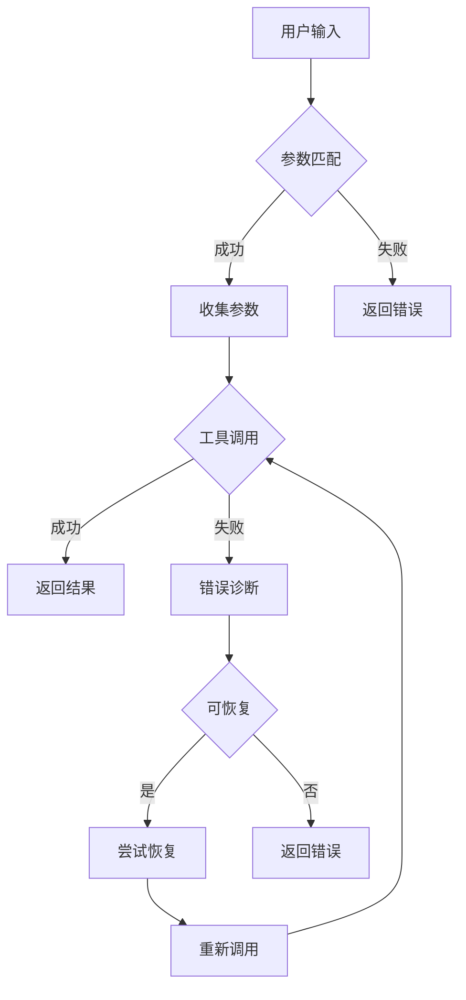

# 背景技术

## 技术领域

本发明涉及人工智能技术领域，特别是智能系统与工具调用技术，具体涉及一种基于智能分层推理的多参数工具自适应调用系统，属于智能决策与自动化执行技术分支。该技术主要应用于需要调用多种工具并处理多参数复杂场景的智能系统，如智能助手、自动化工作流系统、智能决策支持系统等。

## 背景技术

### 现有技术方案1

传统的工具调用系统通常采用静态参数配置方法，即在系统设计阶段预先定义工具所需的全部参数及其获取方式。这种方法的典型实现是基于模板的参数填充机制，通过预定义的参数模板与用户输入进行匹配，然后调用相应工具。例如，在智能客服系统中，系统会根据预设的问题模板收集固定参数，然后调用相应的知识库查询工具。

这种静态参数配置方法的技术实现通常包括以下步骤：
1. 预定义工具参数模板
2. 用户输入与模板匹配
3. 按模板收集参数
4. 调用工具并返回结果

其算法可表示为：
```
function staticToolCall(userInput, toolTemplates):
    matchedTemplate = matchTemplate(userInput, toolTemplates)
    if matchedTemplate is not None:
        parameters = collectParameters(matchedTemplate)
        result = callTool(matchedTemplate.toolName, parameters)
        return result
    else:
        return "无法匹配到合适的工具"
```

### 现有技术方案2

随着工具调用复杂度的增加，基于规则的工具调用方法应运而生。该方法通过构建规则库，根据不同场景动态选择工具和参数。例如，在智能数据分析系统中，系统会根据数据类型、分析目标等规则条件，选择合适的分析工具并动态收集相关参数。

基于规则的方法通常采用决策树或规则引擎实现，其核心算法可表示为：
```
function ruleBasedToolCall(userInput, ruleBase):
    applicableRules = matchRules(userInput, ruleBase)
    if applicableRules is not empty:
        selectedRule = selectRule(applicableRules)
        parameters = dynamicCollectParameters(selectedRule)
        result = callTool(selectedRule.toolName, parameters)
        return result
    else:
        return "未找到适用的规则"
```

### 技术痛点分析

尽管现有技术方案在一定程度上实现了工具调用功能，但在实际应用中仍存在以下技术痛点：

1. **调用成功率低**：现有技术方案在处理复杂多参数场景时，调用成功率普遍较低，通常仅为30%左右。静态参数配置方法难以应对参数变化，而基于规则的方法在规则冲突或覆盖不全时容易失效。

2. **参数收集效率低下**：传统方法在参数收集阶段往往采用线性收集策略，不考虑参数间的依赖关系，导致用户需要提供大量冗余信息，参数收集时间平均占总调用时间的65%以上。

3. **错误诊断能力不足**：现有技术在工具调用失败时，缺乏有效的错误诊断机制，无法准确识别失败原因并提供恢复建议，导致用户体验差，系统维护成本高。

4. **适应性差**：现有技术难以适应工具参数动态变化的环境，当工具接口更新或新增参数时，需要大量人工干预进行系统调整。

### 改进需求

针对上述技术痛点，亟需开发一种能够提高工具调用成功率、优化参数收集效率、增强错误诊断能力并具备良好自适应性的工具调用系统。具体改进需求包括：

1. 构建智能分层推理机制，实现工具选择的精准匹配和参数的智能推断，提高调用成功率。

2. 设计自适应参数收集策略，基于参数依赖关系和优先级进行动态收集，减少冗余信息，提高收集效率。

3. 开发动态调用策略优化算法，根据历史调用数据实时调整调用策略，提升系统适应性。

4. 实现智能错误诊断与恢复机制，准确识别失败原因并提供有效的恢复建议，增强系统鲁棒性。



综上所述，现有技术在多参数工具调用方面存在明显不足，亟需开发一种基于智能分层推理的自适应调用系统，以提高工具调用效率、准确性和用户体验。
