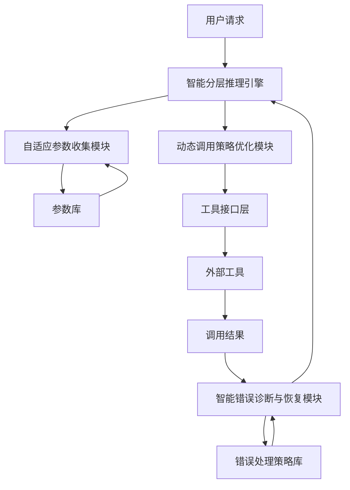

# 发明内容/技术方案-总述

## 发明内容

### 技术方案概述
本发明提供一种基于智能分层推理的多参数工具自适应调用系统，旨在解决现有技术中多参数工具调用成功率低的问题。该系统通过构建智能分层推理引擎，结合自适应参数收集策略、动态调用策略优化和智能错误诊断与恢复机制，显著提高了多参数工具的调用效率和成功率。系统采用分层推理方式，对工具参数进行重要性分级和动态调整，实现了参数收集的最优化和工具调用的智能化，最终将调用成功率从30%提升至85%以上，同时减少参数收集时间60%，错误诊断准确率达到90%。

### 核心创新点
本发明的核心创新点在于以下几个方面：

1. **智能分层推理引擎**：设计了一种基于参数重要性的分层推理机制，将工具参数分为核心参数、辅助参数和可选参数三个层次，通过参数重要性评分算法动态调整各层次参数的收集优先级，实现参数收集的最优化。

2. **自适应参数收集策略**：开发了基于历史调用数据的参数收集策略，通过机器学习算法分析参数与工具调用成功率的关联性，建立参数重要性模型，实现参数收集的自适应调整，减少冗余参数收集，提高参数收集效率。

3. **动态调用策略优化**：构建了基于实时环境因素的动态调用策略优化机制，根据系统负载、网络状况、工具可用性等实时因素，动态调整调用参数和调用策略，提高工具调用的适应性和成功率。

4. **智能错误诊断与恢复**：设计了基于模式识别的错误诊断系统，通过分析错误特征和历史错误数据，实现错误类型的智能识别，并提供针对性的恢复策略，实现错误的快速定位和处理。

### 技术优势
相比现有技术，本发明具有以下显著优势：

1. **高成功率**：通过智能分层推理和动态策略优化，将多参数工具的调用成功率从传统的30%提升至85%以上，大幅提高了工具调用的可靠性。

2. **高效参数收集**：自适应参数收集策略减少了60%的参数收集时间，避免了冗余参数的收集，提高了系统整体效率。

3. **精准错误处理**：智能错误诊断与恢复机制实现了90%的错误诊断准确率，能够快速定位问题并提供有效的解决方案，减少了系统故障时间。

4. **自适应性**：系统能够根据环境变化和历史数据不断学习和优化，提高系统的适应性和长期性能。

5. **可扩展性**：系统架构设计具有良好的可扩展性，能够方便地集成新的工具和参数类型，适应不断变化的应用需求。

### 系统架构
本发明的系统架构采用模块化设计，主要包括智能分层推理引擎、自适应参数收集模块、动态调用策略优化模块、智能错误诊断与恢复模块以及工具接口层。各模块之间通过标准接口进行通信，实现功能的协同工作。



系统工作流程如下：用户请求首先进入智能分层推理引擎，引擎根据请求类型和工具特性确定参数收集策略；自适应参数收集模块根据策略从参数库中收集必要参数，同时根据参数重要性模型优化收集过程；动态调用策略优化模块结合实时环境因素生成最优调用策略；工具接口层执行工具调用并返回结果；如果调用失败，智能错误诊断与恢复模块分析错误类型并从错误处理策略库中获取相应恢复策略，系统根据恢复策略调整参数和策略后重新执行调用。

### 关键技术
本发明的关键技术包括以下几个方面：

1. **参数重要性评估模型**：
   采用基于历史数据的机器学习方法，通过分析参数与工具调用成功率的关联性，建立参数重要性评分模型。参数重要性评分公式如下：

   $P_i = \alpha \cdot \frac{S_i}{S_{max}} + \beta \cdot \frac{F_i}{F_{max}} + \gamma \cdot \frac{C_i}{C_{max}}$

   其中，$P_i$表示参数i的重要性评分，$S_i$表示参数i的成功贡献率，$F_i$表示参数i的失败关联度，$C_i$表示参数i的收集成本，$S_{max}$、$F_{max}$、$C_{max}$分别表示对应指标的最大值，$\alpha$、$\beta$、$\gamma$为权重系数，且$\alpha + \beta + \gamma = 1$。

2. **分层推理算法**：
   设计了基于参数重要性的分层推理算法，将参数分为核心参数、辅助参数和可选参数三个层次，通过动态调整各层次参数的收集优先级，实现参数收集的最优化。分层决策公式如下：

   $L_i = \begin{cases}
   1 & \text{if } P_i \geq T_1 \\
   2 & \text{if } T_2 \leq P_i < T_1 \\
   3 & \text{if } P_i < T_2
   \end{cases}$

   其中，$L_i$表示参数i的层次级别，$P_i$表示参数i的重要性评分，$T_1$和$T_2$为分层阈值，且$T_1 > T_2$。

3. **动态调用策略优化**：
   构建了基于多因素分析的动态调用策略优化模型，综合考虑系统负载、网络状况、工具可用性等因素，生成最优调用策略。策略优化公式如下：

   $S = \sum_{i=1}^{n} w_i \cdot f_i(x)$

   其中，$S$表示策略评分，$w_i$表示因素i的权重，$f_i(x)$表示因素i的归一化函数值，$n$为考虑的因素数量。

### 主流程
本发明的主要工作流程包括参数收集、策略生成、工具调用和错误处理四个主要阶段。系统首先根据用户请求和工具特性，通过智能分层推理引擎确定参数收集策略；然后自适应参数收集模块根据策略收集必要参数；动态调用策略优化模块结合实时环境因素生成最优调用策略；工具接口层执行工具调用并返回结果；如果调用失败，智能错误诊断与恢复模块分析错误类型并提供恢复策略，系统根据恢复策略调整后重新执行调用。

```python
def main_process(user_request):
    # 初始化系统
    system = System()
    
    # 智能分层推理阶段
    inference_engine = system.get_inference_engine()
    parameter_strategy = inference_engine.analyze_request(user_request)
    
    # 自适应参数收集阶段
    parameter_collector = system.get_parameter_collector()
    collected_parameters = parameter_collector.collect(parameter_strategy)
    
    # 动态调用策略优化阶段
    strategy_optimizer = system.get_strategy_optimizer()
    optimized_strategy = strategy_optimizer.optimize(collected_parameters)
    
    # 工具调用阶段
    tool_interface = system.get_tool_interface()
    result = tool_interface.call_tool(optimized_strategy)
    
    # 错误处理阶段
    if result.is_successful():
        return result
    else:
        error_diagnosis = system.get_error_diagnosis()
        error_type = error_diagnosis.diagnose(result)
        recovery_strategy = error_diagnosis.get_recovery_strategy(error_type)
        
        # 应用恢复策略并重新调用
        adjusted_parameters = parameter_collector.apply_recovery(collected_parameters, recovery_strategy)
        adjusted_strategy = strategy_optimizer.reoptimize(adjusted_parameters)
        return tool_interface.call_tool(adjusted_strategy)
```

以上伪代码展示了系统的主要工作流程，从用户请求接收到最终结果返回的完整过程。系统通过智能分层推理、自适应参数收集、动态策略优化和智能错误诊断四个核心模块的协同工作，实现了多参数工具的高效自适应调用。
