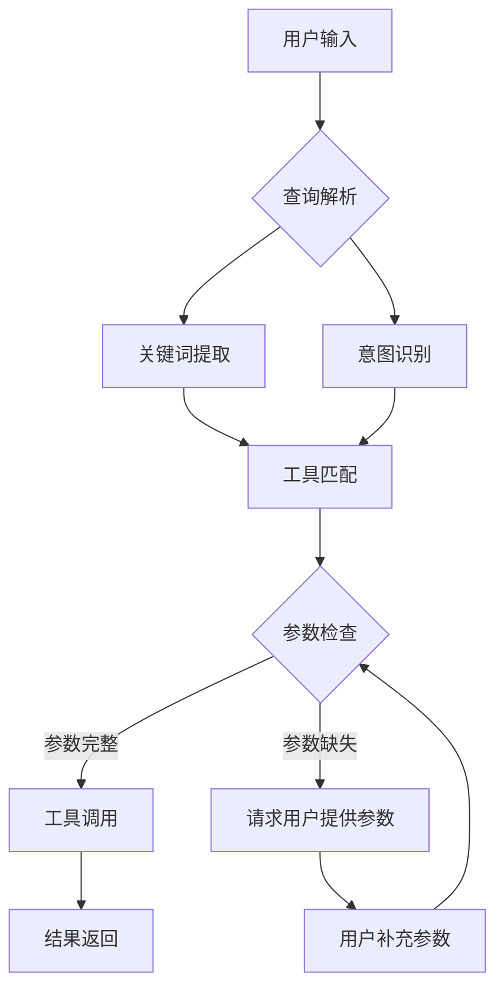

# 背景技术

## 技术领域

本发明涉及人工智能技术领域，特别是自然语言处理和大语言模型应用领域，具体涉及一种基于智能分层推理的多参数工具自适应调用系统，用于提高大语言模型调用复杂工具的准确性和效率。

## 背景技术

### 现有技术方案1
传统的工具调用方法主要依赖于预定义的模板和固定的参数结构。在这种方法中，开发者需要为每个工具创建详细的调用模板，包括参数名称、类型、约束条件等。当大语言模型需要调用工具时，它会严格按照预定义的模板生成调用语句，缺乏对上下文和用户意图的深入理解。例如，在处理数据分析任务时，系统可能需要调用统计工具、可视化工具和报告生成工具等多个工具，传统方法要求用户明确指定每个工具的所有参数，或者开发者预先定义所有可能的参数组合。这种方法虽然简单直接，但在面对复杂多变的用户需求时，表现出明显的局限性，特别是在参数数量多、参数之间存在复杂依赖关系的情况下，系统难以准确推断参数值。

### 现有技术方案2
近年来，一些基于规则和简单推理的工具调用系统被提出。这些系统通过建立参数之间的关联规则和简单的推理逻辑，实现了一定程度的参数自动填充。例如，系统可以根据用户查询中的关键词匹配到相应的工具，并基于预设规则推断部分参数值。一些先进的系统还引入了简单的上下文记忆机制，能够记住用户之前提供的参数信息，并在后续调用中复用。然而，这些方法仍然存在明显的局限性：首先，规则库难以覆盖所有可能的场景，导致系统在面对新颖或复杂的查询时表现不佳；其次，简单的推理逻辑无法处理参数之间的复杂依赖关系；最后，这些方法通常缺乏对用户深层意图的理解，难以实现真正的自适应调用。

### 技术痛点分析
现有技术方案在处理多参数工具调用时存在以下技术痛点：

1. **参数推断不准确**：传统方法缺乏对上下文和用户意图的深入理解，导致参数推断不准确。特别是在参数之间存在复杂依赖关系或隐含语义关联的情况下，现有方法难以做出合理的推断。

2. **上下文理解不足**：现有系统通常只关注当前查询，而忽略了对话历史和任务背景信息，导致参数推断缺乏连贯性和一致性。

3. **工具调用效率低下**：由于需要用户明确指定参数或开发者预定义大量模板，现有方法在处理复杂任务时往往需要多次交互，降低了工具调用的效率。

4. **适应性差**：现有方法难以适应不同领域、不同用户的个性化需求，缺乏灵活性和可扩展性。

5. **推理能力有限**：简单的规则和模板无法处理复杂的推理任务，特别是在需要多步推理或跨领域知识的情况下，现有方法表现不佳。

### 改进需求
针对上述技术痛点，亟需一种能够实现智能参数推断、深度上下文理解和高效工具调用的系统。具体而言，改进需求包括：

1. **引入智能分层推理机制**：通过分层推理，系统可以从浅层语义理解到深层意图分析，逐步细化参数推断过程，提高推断准确性。

2. **增强上下文感知能力**：系统需要能够全面理解对话历史、任务背景和用户偏好，实现参数推断的连贯性和一致性。

3. **提高工具调用效率**：通过智能参数推断，减少用户交互次数，实现一次性准确调用，提高系统响应速度。

4. **增强系统适应性**：系统需要能够适应不同领域、不同用户的个性化需求，具备良好的可扩展性和灵活性。

5. **强化推理能力**：引入更强大的推理机制，使系统能够处理复杂的多步推理任务和跨领域知识应用。



传统工具调用的参数匹配算法通常基于关键词相似度和规则匹配，其核心公式如下：

```
工具匹配度 = α * 关键词相似度 + β * 规则匹配度 + γ * 历史使用频率
```

其中，α、β、γ为权重系数，且α + β + γ = 1。关键词相似度通过计算用户查询与工具描述之间的余弦相似度得到；规则匹配度基于预定义的规则计算；历史使用频率反映工具的历史使用情况。

对于参数推断，现有技术通常采用基于条件概率的方法：

```
P(param=value|context) = P(context|param=value) * P(param=value) / P(context)
```

其中，P(param=value|context)表示在给定上下文条件下参数取特定值的概率；P(context|param=value)表示在参数取特定值条件下出现当前上下文的概率；P(param=value)表示参数取特定值的先验概率；P(context)表示当前上下文出现的概率。
