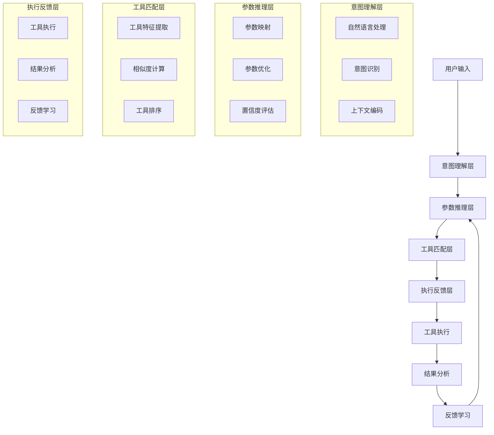

# 发明内容/技术方案-总述

## 发明内容

### 技术方案概述
基于智能分层推理的多参数工具自适应调用系统是一种创新的技术方案，旨在解决大语言模型在调用复杂工具时参数配置不准确、效率低下的问题。该系统通过构建多层次的推理机制，结合上下文理解和意图识别，能够自动推断和优化工具调用参数，显著提高工具调用的准确性和效率。系统主要包括意图理解层、参数推理层、工具匹配层和执行反馈层，形成完整的工具自适应调用闭环。

### 核心创新点
本发明的核心创新点在于：
1. 智能分层推理机制：构建了多层次推理架构，从表层语义理解到深层参数推理，形成递进式参数推断过程，突破了传统工具调用中参数配置的局限性。
2. 上下文感知的参数推断：通过引入上下文编码和意图识别技术，系统能够准确捕捉用户需求与工具参数之间的复杂映射关系，实现参数的智能推断。
3. 动态工具匹配与优化：设计了基于相似度计算和工具特征提取的动态匹配算法，能够根据任务需求自动选择最优工具组合，并实时调整参数配置。
4. 自适应学习机制：通过执行反馈和参数优化，系统能够持续学习用户偏好和工具使用模式，不断优化参数推断的准确性。

### 技术优势
相比现有技术，本发明具有以下显著优势：
1. 参数配置智能化：传统工具调用需要用户手动配置复杂参数，而本发明通过智能推理自动生成最优参数配置，降低了使用门槛，提高了工具调用的准确性。
2. 调用效率提升：通过分层推理和动态匹配，系统能够快速确定工具调用方案，减少了参数调整的迭代次数，显著提高了工具调用的效率。
3. 上下文理解能力：系统能够深入理解用户意图和上下文信息，实现更精准的参数推断，解决了传统方法中上下文信息利用不足的问题。
4. 自适应学习能力：系统通过持续学习和反馈优化，能够适应用户偏好变化和工具更新，保持长期的高效调用能力。
5. 可扩展性强：系统架构设计具有良好的可扩展性，能够方便地集成新的工具和参数推理模型，适应不断变化的工具生态。

### 系统架构
本系统采用分层架构设计，主要包括以下四个层次：

1. 意图理解层：负责解析用户输入，提取关键信息，识别用户意图和任务需求。该层包含自然语言处理模块、意图识别模块和上下文编码模块。
2. 参数推理层：基于意图理解结果，通过多层推理机制推断工具调用所需参数。该层包含参数映射模块、参数优化模块和置信度评估模块。
3. 工具匹配层：根据推断的参数和任务需求，从工具库中选择最合适的工具组合。该层包含工具特征提取模块、相似度计算模块和工具排序模块。
4. 执行反馈层：执行工具调用，收集执行结果，并用于系统优化。该层包含工具执行模块、结果分析模块和反馈学习模块。

这些层次之间通过标准接口进行通信，形成完整的工具自适应调用闭环。



### 关键技术
本系统的关键技术包括：

1. 多层参数推理算法：
   系统采用递归神经网络(RNN)结合注意力机制的多层参数推理算法，能够从用户输入中逐步提取和优化参数信息。其数学表达式如下：

   $P_{param} = \text{Softmax}(W_h \cdot \text{tanh}(W_x \cdot X + W_p \cdot P_{prev} + b))$

   其中，$P_{param}$表示当前层推断的参数，$X$表示输入序列，$P_{prev}$表示前一层推断的参数，$W_h$、$W_x$、$W_p$为权重矩阵，$b$为偏置项。

2. 上下文感知的意图识别：
   系统采用基于Transformer的上下文编码模型，结合双向注意力机制，实现对用户意图的准确识别。其核心计算公式为：

   $I_{intent} = \text{MultiHead}(Q, K, V) = \text{Concat}(\text{head}_1, ..., \text{head}_h)W^O$

   其中，$Q$、$K$、$V$分别代表查询、键和值向量，$\text{head}_i$表示第i个注意力头的输出，$W^O$是输出权重矩阵。

3. 工具相似度计算：
   系统设计了基于多维度特征的工具相似度计算方法，综合考虑工具功能、参数特征和历史使用数据。其计算公式为：

   $S_{tool} = \alpha \cdot S_{func} + \beta \cdot S_{param} + \gamma \cdot S_{hist}$

   其中，$S_{tool}$表示工具综合相似度，$S_{func}$、$S_{param}$、$S_{hist}$分别表示功能相似度、参数相似度和历史使用相似度，$\alpha$、$\beta$、$\gamma$为权重系数。

### 主流程
系统的主要工作流程如下：

1. 用户输入处理：接收并解析用户输入，提取关键信息。
2. 意图识别：基于上下文信息识别用户真实意图和任务需求。
3. 参数推断：通过多层推理机制推断工具调用所需参数。
4. 工具匹配：根据推断的参数和任务需求，从工具库中选择最合适的工具。
5. 参数优化：对推断的参数进行优化，确保工具调用的准确性。
6. 工具执行：调用选定的工具并执行任务。
7. 结果分析：分析执行结果，评估工具调用效果。
8. 反馈学习：基于执行结果和用户反馈，优化参数推断模型。

```python
def main_process():
    # 1. 用户输入处理
    user_input = receive_user_input()
    processed_input = preprocess_input(user_input)
    
    # 2. 意图识别
    context = encode_context(processed_input)
    intent = recognize_intent(context)
    
    # 3. 参数推断
    initial_params = infer_initial_parameters(intent)
    optimized_params = optimize_parameters(initial_params, context)
    confidence = evaluate_confidence(optimized_params)
    
    # 4. 工具匹配
    candidate_tools = retrieve_candidate_tools(intent)
    tool_scores = calculate_tool_scores(candidate_tools, optimized_params)
    selected_tools = rank_and_select_tools(tool_scores)
    
    # 5. 参数优化
    final_params = fine_tune_parameters(selected_tools, optimized_params)
    
    # 6. 工具执行
    execution_results = execute_tools(selected_tools, final_params)
    
    # 7. 结果分析
    result_quality = analyze_results(execution_results)
    
    # 8. 反馈学习
    update_models(intent, optimized_params, selected_tools, result_quality)
    
    return execution_results
```
