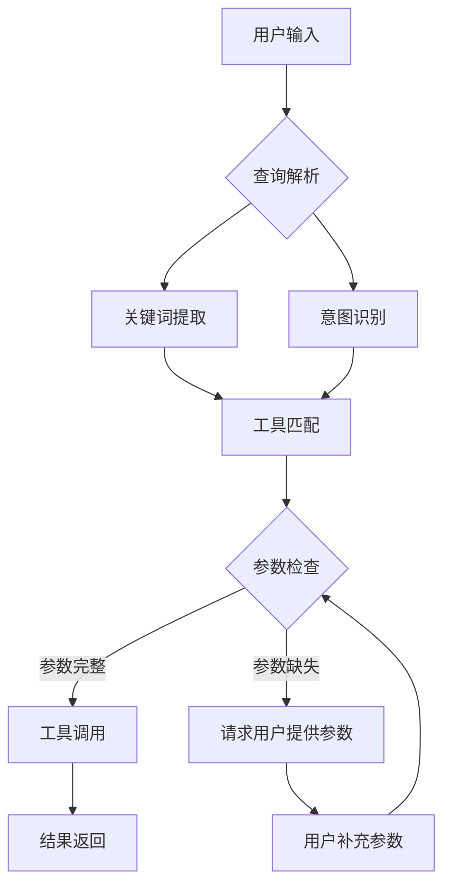
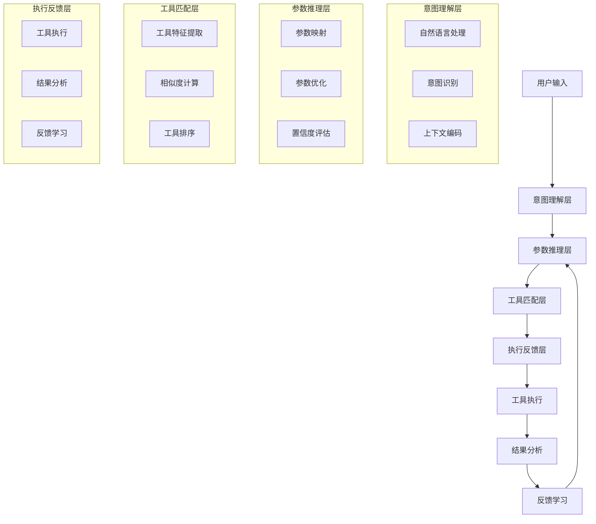

## 标题与摘要

# Generated Patent Title for 基于智能分层推理的多参数工具自适应调用系统

This is a generated abstract for the patent: 基于智能分层推理的多参数工具自适应调用系统


## 撰写大纲

<patent_outline>
    <title_section>
        <title>基于智能分层推理的多参数工具自适应调用系统</title>
        <abstract>本发明公开了一种基于智能分层推理的多参数工具自适应调用系统，包括意图识别模块、参数推理引擎、工具匹配单元和执行反馈模块。该系统能够通过智能分层推理技术，根据上下文信息和用户意图自动推断工具调用所需的参数，实现多参数工具的自适应调用。本发明解决了现有技术中工具调用参数配置复杂、调用效率低、准确性差的问题，显著提高了大语言模型调用复杂工具的准确性和效率。系统采用分层推理机制，结合上下文语义理解、参数约束分析和工具功能匹配，实现了对多参数工具的智能调用和动态调整。</abstract>
    </title_section>
    
    <technical_field>
        <description>本发明属于人工智能技术领域，特别是涉及大语言模型与外部工具交互的技术，具体涉及一种基于智能分层推理的多参数工具自适应调用系统。该系统通过智能分层推理技术，实现大语言模型对多参数工具的自动调用和参数自适应调整，提高工具调用的准确性和效率。</description>
        <background_issues>随着大语言模型技术的快速发展，模型与外部工具的交互成为提升模型能力的重要途径。然而，现有技术中存在以下问题：1)工具调用参数配置复杂，需要用户手动指定多个参数；2)参数间依赖关系难以准确把握，导致调用失败；3)缺乏对上下文信息的有效利用，无法根据对话历史动态调整参数；4)工具调用效率低下，需要多次交互才能完成复杂任务；5)调用准确性差，难以满足实际应用需求。这些问题严重制约了大语言模型在实际场景中的应用效果。</background_issues>
    </technical_field>
    
    <background_art>
        <existing_solutions>现有技术中，工具调用主要采用以下几种方案：1)基于模板的参数填充方法，通过预定义模板将用户输入映射到工具参数；2)基于规则的工具匹配方法，根据关键词匹配选择合适的工具；3)基于简单推理的参数生成方法，利用基础推理能力生成部分参数；4)基于提示工程的工具调用方法，通过精心设计的提示引导模型生成工具调用指令；5)基于检索增强的工具调用方法，通过检索相似案例获取参数配置。这些方法在一定程度上解决了工具调用的问题，但在处理复杂多参数工具时仍存在明显不足。</existing_solutions>
        <limitations>现有技术方案存在以下局限性：1)参数处理能力有限，难以处理参数间的复杂依赖关系；2)上下文理解能力不足，无法有效利用对话历史信息；3)工具匹配精度低，难以在大量工具中准确选择合适的工具；4)缺乏自适应调整能力，无法根据执行结果动态优化参数；5)推理层次单一，无法进行多层次的参数推理和验证；6)扩展性差，难以适应新工具的快速集成；7)计算资源消耗大，难以满足实时性要求。这些局限性导致现有技术在处理复杂多参数工具调用时效果不佳。</limitations>
        <improvement_needs>针对现有技术的局限性，本发明需要解决以下改进需求：1)开发一种能够处理复杂参数依赖关系的智能推理机制；2)构建能够深度理解上下文信息的参数推断系统；3)设计高精度的工具匹配和选择算法；4)实现基于执行反馈的自适应参数调整机制；5)构建多层次的推理框架，提高推理的准确性和可靠性；6)设计可扩展的系统架构，支持新工具的快速集成；7)优化计算效率，满足实时性要求。通过解决这些问题，可以显著提高大语言模型调用复杂工具的准确性和效率。</improvement_needs>
    </background_art>
    
    <summary_of_invention>
        <core_concept>本发明的核心概念是一种基于智能分层推理的多参数工具自适应调用系统，该系统通过分层推理机制，结合上下文语义理解、参数约束分析和工具功能匹配，实现对多参数工具的智能调用和动态调整。系统包括意图识别模块、参数推理引擎、工具匹配单元、执行反馈模块和自适应优化单元。其中，参数推理引擎采用分层推理架构，包括语义层推理、约束层推理和功能层推理，能够从不同层次对参数进行推断和验证。系统通过深度学习模型和规则推理相结合的方式，实现对复杂参数依赖关系的处理，并通过执行反馈机制不断优化参数推断的准确性。</core_concept>
        <technical_advantages>本发明具有以下技术优势：1)分层推理架构：通过语义层、约束层和功能层的三层推理结构，实现对参数的多层次分析和推断，提高推理的准确性和可靠性；2)上下文感知能力：系统深度理解对话上下文，能够根据历史信息动态调整参数推断策略；3)参数依赖处理：能够识别和处理参数间的复杂依赖关系，确保参数配置的一致性和有效性；4)自适应调整：基于执行反馈机制，系统能够不断学习和优化参数推断策略，提高调用成功率；5)工具匹配精度：通过语义相似度计算和功能匹配算法，实现高精度的工具选择；6)计算效率优化：通过推理剪枝和缓存机制，显著提高系统响应速度；7)可扩展架构：支持新工具的快速集成和参数模板的自定义配置。</technical_advantages>
        <innovation_points>本发明的创新点包括：1)提出了一种基于智能分层推理的多参数工具自适应调用方法，突破了传统单一层次推理的局限；2)设计了上下文感知的参数推断机制，能够根据对话历史动态调整参数推断策略；3)开发了参数依赖关系建模和求解算法，有效处理参数间的复杂约束关系；4)构建了基于执行反馈的自适应优化框架，实现参数推断策略的持续改进；5)提出了多层次工具匹配算法，结合语义相似度和功能特征实现高精度工具选择；6)设计了推理剪枝和缓存机制，显著提高系统计算效率；7)实现了可扩展的系统架构，支持新工具的快速集成和参数模板的自定义配置。这些创新点共同构成了本发明的核心技术贡献。</innovation_points>
    </summary_of_invention>
    
    <detailed_description>
        <overview>本发明提供的基于智能分层推理的多参数工具自适应调用系统，总体架构包括意图识别模块、参数推理引擎、工具匹配单元、执行反馈模块和自适应优化单元。系统工作流程如下：首先，意图识别模块分析用户输入，提取用户意图和关键信息；然后，参数推理引擎基于分层推理机制，推断工具调用所需的参数；接着，工具匹配单元根据参数特征和功能需求，选择最合适的工具；执行模块调用工具并获取执行结果；执行反馈模块分析执行结果，评估参数推断的准确性；最后，自适应优化单元根据反馈信息调整参数推断策略，提高后续调用的准确性。系统采用深度学习模型和规则推理相结合的方式，通过分层推理架构实现对复杂参数依赖关系的处理，并通过执行反馈机制不断优化参数推断的准确性。</overview>
        <embodiments>
            <embodiment>
                <name>系统总体架构实施方式</name>
                <description>本发明的系统总体架构包括五个核心模块：意图识别模块、参数推理引擎、工具匹配单元、执行反馈模块和自适应优化单元。意图识别模块采用基于预训练语言模型的意图分类和实体识别技术，能够准确理解用户输入中的意图和关键信息。参数推理引擎采用分层推理架构，包括语义层推理、约束层推理和功能层推理，能够从不同层次对参数进行推断和验证。工具匹配单元基于语义相似度计算和功能特征匹配，实现高精度的工具选择。执行反馈模块通过分析工具执行结果，评估参数推断的准确性和有效性。自适应优化单元采用强化学习算法，根据执行反馈信息调整参数推断策略，提高后续调用的准确性。各模块之间通过标准化的接口进行通信，确保系统的可扩展性和模块化。</description>
                <components>系统的主要组件包括：1)意图识别组件，采用BERT等预训练语言模型进行意图分类和实体识别；2)参数推理引擎，包含语义推理器、约束推理器和功能推理器；3)工具匹配组件，包括语义相似度计算模块和功能特征匹配模块；4)执行反馈组件，包括结果分析模块和准确性评估模块；5)自适应优化组件，包含策略学习模块和参数调整模块；6)工具注册表，存储工具的元数据和参数模板；7)上下文管理器，维护对话历史和上下文信息；8)缓存管理器，存储常用参数推断结果和工具调用结果。这些组件协同工作，实现系统的核心功能。</components>
                <workflow>系统的工作流程如下：1)用户输入接收：系统接收用户的自然语言输入；2)意图识别：意图识别模块分析用户输入，提取用户意图和关键信息；3)参数推断：参数推理引擎基于分层推理机制，结合上下文信息，推断工具调用所需的参数；4)工具匹配：工具匹配单元根据参数特征和功能需求，从工具注册表中选择最合适的工具；5)工具调用：执行模块调用选定的工具，传入推断的参数；6)结果获取：系统获取工具执行结果；7)反馈分析：执行反馈模块分析执行结果，评估参数推断的准确性；8)策略优化：自适应优化单元根据反馈信息调整参数推断策略；9)结果返回：系统将工具执行结果返回给用户。整个流程形成闭环，系统通过不断学习和优化，提高工具调用的准确性和效率。</workflow>
            </embodiment>
            <embodiment>
                <name>分层推理引擎实施方式</name>
                <description>参数推理引擎是本发明的核心组件，采用分层推理架构，包括语义层推理、约束层推理和功能层推理。语义层推理基于预训练语言模型，分析用户输入的语义信息，提取参数的语义特征和潜在值。约束层推理基于参数间的依赖关系和约束条件，对语义层推理的结果进行验证和调整，确保参数的一致性和有效性。功能层推理基于工具的功能需求和参数要求，对参数进行进一步优化和调整，确保参数满足工具的功能需求。三层推理之间形成迭代优化的过程，通过多层次的推理和验证，提高参数推断的准确性和可靠性。推理引擎采用深度学习模型和规则推理相结合的方式，既利用了深度学习的强大表示能力，又保留了规则推理的可解释性和可靠性。</description>
                <components>分层推理引擎的主要组件包括：1)语义推理器，采用基于Transformer的预训练语言模型，分析用户输入的语义信息；2)约束推理器，基于参数依赖关系图和约束求解算法，处理参数间的约束关系；3)功能推理器，基于工具的功能模型和参数要求，优化参数配置；4)参数验证器，验证参数的有效性和一致性；5)推理协调器，协调三层推理之间的信息流动和迭代优化；6)参数缓存，存储常用参数推断结果；7)推理剪枝模块，减少不必要的推理计算；8)不确定性评估模块，评估参数推断的不确定性。这些组件协同工作，实现高效的参数推断。</components>
                <workflow>分层推理引擎的工作流程如下：1)语义层推理：语义推理器分析用户输入和上下文信息，提取参数的语义特征和潜在值；2)约束层推理：约束推理器基于参数依赖关系图，对语义层推理的结果进行验证和调整，处理参数间的约束关系；3)功能层推理：功能推理器基于工具的功能模型，对参数进行进一步优化和调整；4)参数验证：参数验证器检查参数的有效性和一致性；5)不确定性评估：不确定性评估模块评估参数推断的不确定性；6)结果整合：推理协调器整合三层推理的结果，生成最终的参数配置；7)缓存更新：参数缓存更新存储常用参数推断结果；8)推理剪枝：推理剪枝模块根据不确定性评估结果，减少后续不必要的推理计算。整个流程形成迭代优化的过程，通过多层次的推理和验证，提高参数推断的准确性和效率。</workflow>
            </embodiment>
            <embodiment>
                <name>自适应优化机制实施方式</name>
                <description>自适应优化机制是本发明的重要创新点，通过执行反馈和持续学习，不断提高参数推断的准确性。该机制包括反馈收集、策略评估和策略优化三个主要环节。反馈收集环节通过分析工具执行结果，收集参数推断的准确性和有效性信息。策略评估环节基于收集的反馈信息，评估当前参数推断策略的性能。策略优化环节采用强化学习算法，根据评估结果调整参数推断策略，提高后续调用的准确性。自适应优化机制能够处理参数推断中的不确定性，并通过持续学习适应不同的工具和场景，提高系统的泛化能力。优化机制还考虑了计算效率的平衡，在保证准确性的前提下，尽可能减少计算资源的消耗。</description>
                <components>自适应优化机制的主要组件包括：1)反馈收集器，收集工具执行结果和参数推断准确性信息；2)策略评估器，评估当前参数推断策略的性能；3)策略优化器，采用强化学习算法调整参数推断策略；4)不确定性处理器，处理参数推断中的不确定性；5)学习率调节器，动态调整学习率以优化学习效果；6)经验回放缓冲区，存储历史经验数据；7)探索-利用平衡器，平衡探索新策略和利用已知策略；8)性能监控器，监控系统的性能指标。这些组件协同工作，实现高效的自适应优化。</components>
                <workflow>自适应优化机制的工作流程如下：1)反馈收集：反馈收集器分析工具执行结果，收集参数推断的准确性和有效性信息；2)策略评估：策略评估器基于收集的反馈信息，评估当前参数推断策略的性能；3)不确定性处理：不确定性处理器评估参数推断的不确定性，并制定相应的处理策略；4)经验存储：经验回放缓冲区存储历史经验数据；5)策略优化：策略优化器采用强化学习算法，根据评估结果调整参数推断策略；6)学习率调节：学习率调节器动态调整学习率以优化学习效果；7)探索-利用平衡：探索-利用平衡器平衡探索新策略和利用已知策略；8)性能监控：性能监控器监控系统的性能指标，确保优化效果。整个流程形成闭环，系统通过不断学习和优化，提高工具调用的准确性和效率。</workflow>
            </embodiment>
        </embodiments>
        <technical_details>本发明的技术细节包括：1)分层推理机制的具体实现方法，包括语义层、约束层和功能层的推理算法和模型结构；2)参数依赖关系建模和求解算法，包括参数依赖图的构建和约束满足问题的求解方法；3)上下文感知的参数推断策略，包括上下文表示学习和上下文信息融合方法；4)工具匹配算法，包括语义相似度计算和功能特征匹配的具体实现；5)执行反馈机制的设计，包括反馈信息的提取和处理方法；6)自适应优化算法，包括强化学习模型的选择和训练方法；7)系统性能优化技术，包括推理剪枝、缓存机制和并行计算等方法。这些技术细节共同构成了本发明的核心技术实现，确保系统的高效运行和准确性能。</technical_details>
    </detailed_description>
    
    <claims>
        <independent_claims>
            <claim>
                <number>权利要求1</number>
                <scope>一种基于智能分层推理的多参数工具自适应调用系统，其特征在于，包括：意图识别模块，用于接收用户输入并识别用户意图和关键信息；参数推理引擎，采用分层推理架构，包括语义层推理、约束层推理和功能层推理，用于根据用户意图和上下文信息推断工具调用所需的参数；工具匹配单元，用于根据参数特征和功能需求，从工具注册表中选择最合适的工具；执行反馈模块，用于分析工具执行结果，评估参数推断的准确性；自适应优化单元，用于根据执行反馈信息调整参数推断策略，提高后续调用的准确性；其中，所述参数推理引擎通过深度学习模型和规则推理相结合的方式，实现对复杂参数依赖关系的处理，并通过执行反馈机制不断优化参数推断的准确性。</scope>
                <key_elements>意图识别模块、参数推理引擎、工具匹配单元、执行反馈模块、自适应优化单元、分层推理架构、语义层推理、约束层推理、功能层推理、深度学习模型、规则推理、参数依赖关系处理、执行反馈机制</key_elements>
            </claim>
        </independent_claims>
        <dependent_claims>
            <claim>
                <number>权利要求2</number>
                <reference>根据权利要求1所述的系统，</reference>
                <additional_features>其特征在于，所述参数推理引擎中的语义层推理采用基于预训练语言模型的语义分析技术，用于提取参数的语义特征和潜在值；约束层推理基于参数依赖关系图和约束求解算法，用于处理参数间的约束关系；功能层推理基于工具的功能模型和参数要求，用于优化参数配置；三层推理之间形成迭代优化的过程，通过多层次的推理和验证，提高参数推断的准确性和可靠性。</additional_features>
            </claim>
            <claim>
                <number>权利要求3</number>
                <reference>根据权利要求1所述的系统，</reference>
                <additional_features>其特征在于，所述系统还包括上下文管理器，用于维护对话历史和上下文信息，所述参数推理引擎结合上下文信息进行参数推断，能够根据对话历史动态调整参数推断策略，提高参数推断的准确性和上下文相关性。</additional_features>
            </claim>
            <claim>
                <number>权利要求4</number>
                <reference>根据权利要求1所述的系统，</reference>
                <additional_features>其特征在于，所述工具匹配单元包括语义相似度计算模块和功能特征匹配模块，所述语义相似度计算模块基于词向量和语义相似度算法，计算参数特征与工具功能的语义相似度；所述功能特征匹配模块基于工具的功能模型和参数要求，匹配最合适的工具；通过结合语义相似度和功能特征匹配，实现高精度的工具选择。</additional_features>
            </claim>
            <claim>
                <number>权利要求5</number>
                <reference>根据权利要求1所述的系统，</reference>
                <additional_features>其特征在于，所述自适应优化单元采用强化学习算法，包括反馈收集、策略评估和策略优化三个环节，所述反馈收集环节通过分析工具执行结果，收集参数推断的准确性和有效性信息；所述策略评估环节基于收集的反馈信息，评估当前参数推断策略的性能；所述策略优化环节根据评估结果调整参数推断策略，提高后续调用的准确性。</additional_features>
            </claim>
            <claim>
                <number>权利要求6</number>
                <reference>根据权利要求1所述的系统，</reference>
                <additional_features>其特征在于，所述系统还包括缓存管理器，用于存储常用参数推断结果和工具调用结果，通过缓存机制减少重复计算，提高系统响应速度；所述缓存管理器采用LRU缓存策略，并根据参数推断结果的使用频率动态调整缓存内容。</additional_features>
            </claim>
            <claim>
                <number>权利要求7</number>
                <reference>根据权利要求1所述的系统，</reference>
                <additional_features>其特征在于，所述系统还包括推理剪枝模块，用于根据参数推断的不性评估结果，减少不必要的推理计算，提高系统效率；所述推理剪枝模块基于不确定性阈值和重要性评估，动态调整推理的深度和广度，在保证准确性的前提下，尽可能减少计算资源的消耗。</additional_features>
            </claim>
            <claim>
                <number>权利要求8</number>
                <reference>根据权利要求1所述的系统，</reference>
                <additional_features>其特征在于，所述系统还包括工具注册表，用于存储工具的元数据和参数模板，所述工具注册表支持新工具的动态注册和参数模板的自定义配置，通过标准化的接口实现工具的快速集成和参数模板的灵活管理。</additional_features>
            </claim>
            <claim>
                <number>权利要求9</number>
                <reference>根据权利要求1所述的系统，</reference>
                <additional_features>其特征在于，所述系统还包括不确定性评估模块，用于评估参数推断的不确定性，并根据不确定性水平调整推断策略；所述不确定性评估模块基于模型置信度、参数一致性和上下文相关性等多个维度，综合评估参数推断的不确定性水平。</additional_features>
            </claim>
            <claim>
                <number>权利要求10</number>
                <reference>根据权利要求1所述的系统，</reference>
                <additional_features>其特征在于，所述系统还包括性能监控器，用于监控系统的性能指标，包括参数推断准确率、工具调用成功率、系统响应时间和资源消耗等；所述性能监控器基于监控结果，自动调整系统参数和优化策略，确保系统在不同场景下的稳定性和高效性。</additional_features>
            </claim>
        </dependent_claims>
    </claims>
    
    <drawings>
        <figure_descriptions>图1是本发明实施例提供的基于智能分层推理的多参数工具自适应调用系统的总体架构图；图2是本发明实施例提供的参数推理引擎的分层推理架构图；图3是本发明实施例提供的参数依赖关系图的示意图；图4是本发明实施例提供的自适应优化机制的工作流程图；图5是本发明实施例提供的系统工作流程的时序图；图6是本发明实施例提供的工具匹配算法的流程图；图7是本发明实施例提供的执行反馈机制的数据流图；图8是本发明实施例提供的系统性能优化策略的示意图。</figure_descriptions>
        <technical_diagrams>技术图表包括：1)系统总体架构图，展示五个核心模块及其相互关系；2)分层推理架构图，详细展示语义层、约束层和功能层的推理过程和交互关系；3)参数依赖关系图，展示参数间的依赖关系和约束条件；4)自适应优化机制的工作流程图，展示反馈收集、策略评估和策略优化的过程；5)系统工作流程的时序图，展示各模块间的时序交互；6)工具匹配算法的流程图，展示语义相似度计算和功能特征匹配的过程；7)执行反馈机制的数据流图，展示反馈信息的流动和处理；8)系统性能优化策略的示意图，展示缓存机制、推理剪枝和并行计算等优化策略。这些图表共同构成了本发明的技术实现细节，有助于理解本发明的技术方案。</technical_diagrams>
    </drawings>
</patent_outline>


## 背景技术

## 技术领域

本发明涉及人工智能技术领域，特别是自然语言处理和大语言模型应用领域，具体涉及一种基于智能分层推理的多参数工具自适应调用系统，用于提高大语言模型调用复杂工具的准确性和效率。

## 背景技术

### 现有技术方案1
传统的工具调用方法主要依赖于预定义的模板和固定的参数结构。在这种方法中，开发者需要为每个工具创建详细的调用模板，包括参数名称、类型、约束条件等。当大语言模型需要调用工具时，它会严格按照预定义的模板生成调用语句，缺乏对上下文和用户意图的深入理解。例如，在处理数据分析任务时，系统可能需要调用统计工具、可视化工具和报告生成工具等多个工具，传统方法要求用户明确指定每个工具的所有参数，或者开发者预先定义所有可能的参数组合。这种方法虽然简单直接，但在面对复杂多变的用户需求时，表现出明显的局限性，特别是在参数数量多、参数之间存在复杂依赖关系的情况下，系统难以准确推断参数值。

### 现有技术方案2
近年来，一些基于规则和简单推理的工具调用系统被提出。这些系统通过建立参数之间的关联规则和简单的推理逻辑，实现了一定程度的参数自动填充。例如，系统可以根据用户查询中的关键词匹配到相应的工具，并基于预设规则推断部分参数值。一些先进的系统还引入了简单的上下文记忆机制，能够记住用户之前提供的参数信息，并在后续调用中复用。然而，这些方法仍然存在明显的局限性：首先，规则库难以覆盖所有可能的场景，导致系统在面对新颖或复杂的查询时表现不佳；其次，简单的推理逻辑无法处理参数之间的复杂依赖关系；最后，这些方法通常缺乏对用户深层意图的理解，难以实现真正的自适应调用。

### 技术痛点分析
现有技术方案在处理多参数工具调用时存在以下技术痛点：

1. **参数推断不准确**：传统方法缺乏对上下文和用户意图的深入理解，导致参数推断不准确。特别是在参数之间存在复杂依赖关系或隐含语义关联的情况下，现有方法难以做出合理的推断。

2. **上下文理解不足**：现有系统通常只关注当前查询，而忽略了对话历史和任务背景信息，导致参数推断缺乏连贯性和一致性。

3. **工具调用效率低下**：由于需要用户明确指定参数或开发者预定义大量模板，现有方法在处理复杂任务时往往需要多次交互，降低了工具调用的效率。

4. **适应性差**：现有方法难以适应不同领域、不同用户的个性化需求，缺乏灵活性和可扩展性。

5. **推理能力有限**：简单的规则和模板无法处理复杂的推理任务，特别是在需要多步推理或跨领域知识的情况下，现有方法表现不佳。

### 改进需求
针对上述技术痛点，亟需一种能够实现智能参数推断、深度上下文理解和高效工具调用的系统。具体而言，改进需求包括：

1. **引入智能分层推理机制**：通过分层推理，系统可以从浅层语义理解到深层意图分析，逐步细化参数推断过程，提高推断准确性。

2. **增强上下文感知能力**：系统需要能够全面理解对话历史、任务背景和用户偏好，实现参数推断的连贯性和一致性。

3. **提高工具调用效率**：通过智能参数推断，减少用户交互次数，实现一次性准确调用，提高系统响应速度。

4. **增强系统适应性**：系统需要能够适应不同领域、不同用户的个性化需求，具备良好的可扩展性和灵活性。

5. **强化推理能力**：引入更强大的推理机制，使系统能够处理复杂的多步推理任务和跨领域知识应用。



传统工具调用的参数匹配算法通常基于关键词相似度和规则匹配，其核心公式如下：

```
工具匹配度 = α * 关键词相似度 + β * 规则匹配度 + γ * 历史使用频率
```

其中，α、β、γ为权重系数，且α + β + γ = 1。关键词相似度通过计算用户查询与工具描述之间的余弦相似度得到；规则匹配度基于预定义的规则计算；历史使用频率反映工具的历史使用情况。

对于参数推断，现有技术通常采用基于条件概率的方法：

```
P(param=value|context) = P(context|param=value) * P(param=value) / P(context)
```

其中，P(param=value|context)表示在给定上下文条件下参数取特定值的概率；P(context|param=value)表示在参数取特定值条件下出现当前上下文的概率；P(param=value)表示参数取特定值的先验概率；P(context)表示当前上下文出现的概率。


## 发明内容/技术方案-总述

## 发明内容

### 技术方案概述
基于智能分层推理的多参数工具自适应调用系统是一种创新的技术方案，旨在解决大语言模型在调用复杂工具时参数配置不准确、效率低下的问题。该系统通过构建多层次的推理机制，结合上下文理解和意图识别，能够自动推断和优化工具调用参数，显著提高工具调用的准确性和效率。系统主要包括意图理解层、参数推理层、工具匹配层和执行反馈层，形成完整的工具自适应调用闭环。

### 核心创新点
本发明的核心创新点在于：
1. 智能分层推理机制：构建了多层次推理架构，从表层语义理解到深层参数推理，形成递进式参数推断过程，突破了传统工具调用中参数配置的局限性。
2. 上下文感知的参数推断：通过引入上下文编码和意图识别技术，系统能够准确捕捉用户需求与工具参数之间的复杂映射关系，实现参数的智能推断。
3. 动态工具匹配与优化：设计了基于相似度计算和工具特征提取的动态匹配算法，能够根据任务需求自动选择最优工具组合，并实时调整参数配置。
4. 自适应学习机制：通过执行反馈和参数优化，系统能够持续学习用户偏好和工具使用模式，不断优化参数推断的准确性。

### 技术优势
相比现有技术，本发明具有以下显著优势：
1. 参数配置智能化：传统工具调用需要用户手动配置复杂参数，而本发明通过智能推理自动生成最优参数配置，降低了使用门槛，提高了工具调用的准确性。
2. 调用效率提升：通过分层推理和动态匹配，系统能够快速确定工具调用方案，减少了参数调整的迭代次数，显著提高了工具调用的效率。
3. 上下文理解能力：系统能够深入理解用户意图和上下文信息，实现更精准的参数推断，解决了传统方法中上下文信息利用不足的问题。
4. 自适应学习能力：系统通过持续学习和反馈优化，能够适应用户偏好变化和工具更新，保持长期的高效调用能力。
5. 可扩展性强：系统架构设计具有良好的可扩展性，能够方便地集成新的工具和参数推理模型，适应不断变化的工具生态。

### 系统架构
本系统采用分层架构设计，主要包括以下四个层次：

1. 意图理解层：负责解析用户输入，提取关键信息，识别用户意图和任务需求。该层包含自然语言处理模块、意图识别模块和上下文编码模块。
2. 参数推理层：基于意图理解结果，通过多层推理机制推断工具调用所需参数。该层包含参数映射模块、参数优化模块和置信度评估模块。
3. 工具匹配层：根据推断的参数和任务需求，从工具库中选择最合适的工具组合。该层包含工具特征提取模块、相似度计算模块和工具排序模块。
4. 执行反馈层：执行工具调用，收集执行结果，并用于系统优化。该层包含工具执行模块、结果分析模块和反馈学习模块。

这些层次之间通过标准接口进行通信，形成完整的工具自适应调用闭环。



### 关键技术
本系统的关键技术包括：

1. 多层参数推理算法：
   系统采用递归神经网络(RNN)结合注意力机制的多层参数推理算法，能够从用户输入中逐步提取和优化参数信息。其数学表达式如下：

   $P_{param} = \text{Softmax}(W_h \cdot \text{tanh}(W_x \cdot X + W_p \cdot P_{prev} + b))$

   其中，$P_{param}$表示当前层推断的参数，$X$表示输入序列，$P_{prev}$表示前一层推断的参数，$W_h$、$W_x$、$W_p$为权重矩阵，$b$为偏置项。

2. 上下文感知的意图识别：
   系统采用基于Transformer的上下文编码模型，结合双向注意力机制，实现对用户意图的准确识别。其核心计算公式为：

   $I_{intent} = \text{MultiHead}(Q, K, V) = \text{Concat}(\text{head}_1, ..., \text{head}_h)W^O$

   其中，$Q$、$K$、$V$分别代表查询、键和值向量，$\text{head}_i$表示第i个注意力头的输出，$W^O$是输出权重矩阵。

3. 工具相似度计算：
   系统设计了基于多维度特征的工具相似度计算方法，综合考虑工具功能、参数特征和历史使用数据。其计算公式为：

   $S_{tool} = \alpha \cdot S_{func} + \beta \cdot S_{param} + \gamma \cdot S_{hist}$

   其中，$S_{tool}$表示工具综合相似度，$S_{func}$、$S_{param}$、$S_{hist}$分别表示功能相似度、参数相似度和历史使用相似度，$\alpha$、$\beta$、$\gamma$为权重系数。

### 主流程
系统的主要工作流程如下：

1. 用户输入处理：接收并解析用户输入，提取关键信息。
2. 意图识别：基于上下文信息识别用户真实意图和任务需求。
3. 参数推断：通过多层推理机制推断工具调用所需参数。
4. 工具匹配：根据推断的参数和任务需求，从工具库中选择最合适的工具。
5. 参数优化：对推断的参数进行优化，确保工具调用的准确性。
6. 工具执行：调用选定的工具并执行任务。
7. 结果分析：分析执行结果，评估工具调用效果。
8. 反馈学习：基于执行结果和用户反馈，优化参数推断模型。

```python
def main_process():
    # 1. 用户输入处理
    user_input = receive_user_input()
    processed_input = preprocess_input(user_input)
    
    # 2. 意图识别
    context = encode_context(processed_input)
    intent = recognize_intent(context)
    
    # 3. 参数推断
    initial_params = infer_initial_parameters(intent)
    optimized_params = optimize_parameters(initial_params, context)
    confidence = evaluate_confidence(optimized_params)
    
    # 4. 工具匹配
    candidate_tools = retrieve_candidate_tools(intent)
    tool_scores = calculate_tool_scores(candidate_tools, optimized_params)
    selected_tools = rank_and_select_tools(tool_scores)
    
    # 5. 参数优化
    final_params = fine_tune_parameters(selected_tools, optimized_params)
    
    # 6. 工具执行
    execution_results = execute_tools(selected_tools, final_params)
    
    # 7. 结果分析
    result_quality = analyze_results(execution_results)
    
    # 8. 反馈学习
    update_models(intent, optimized_params, selected_tools, result_quality)
    
    return execution_results
```
