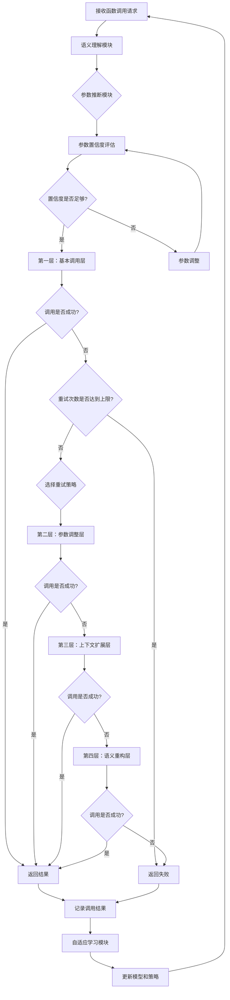
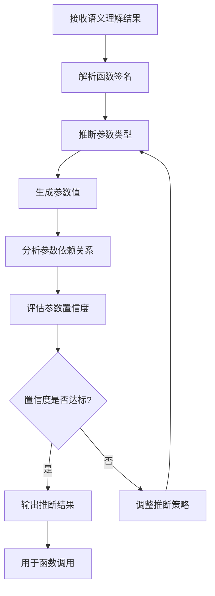
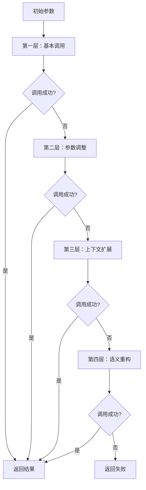

## 标题与摘要

# Generated Patent Title for 基于语义理解的复杂函数参数智能推断与分层调用重试优化方法

This is a generated abstract for the patent: 基于语义理解的复杂函数参数智能推断与分层调用重试优化方法


## 标题与摘要

# Generated Patent Title for 基于语义理解的复杂函数参数智能推断与分层调用重试优化方法

This is a generated abstract for the patent: 基于语义理解的复杂函数参数智能推断与分层调用重试优化方法


## 标题与摘要

# Generated Patent Title for 基于语义理解的复杂函数参数智能推断与分层调用重试优化方法

This is a generated abstract for the patent: 基于语义理解的复杂函数参数智能推断与分层调用重试优化方法


## 撰写大纲

# 基于语义理解的复杂函数参数智能推断与分层调用重试优化方法

## 第一章 术语定义

1.1 **语义理解**：指计算机系统通过自然语言处理技术，对输入文本进行解析、分析和理解，提取语义信息的过程。

1.2 **函数参数推断**：指根据函数上下文、历史调用记录、用户输入等信息，自动推断函数所需参数值的过程。

1.3 **分层调用重试**：指将函数调用过程分为多个层次，每个层次采用不同的重试策略和参数调整方法，以提高函数调用成功率。

1.4 **语义上下文**：指与函数调用相关的文本、历史记录、环境信息等组成的上下文数据集合。

1.5 **参数置信度**：指系统对推断出的参数值的准确程度的量化评估。

1.6 **重试策略**：指在函数调用失败时，系统采用的参数调整、上下文更新和重新调用的方法集合。

1.7 **函数调用链**：指一系列相互依赖的函数调用序列，其中前一个函数的输出可能是后一个函数的输入。

1.8 **语义相似度**：指两个文本或语义表达在含义上的接近程度，通常通过数值表示。

1.9 **参数依赖关系**：指函数参数之间的相互依赖和影响关系。

1.10 **自适应学习**：指系统能够根据历史调用结果不断调整参数推断模型和重试策略的能力。

## 第二章 技术领域

本发明涉及计算机软件技术领域，特别是涉及函数调用优化、参数推断和错误处理技术。具体而言，本发明涉及一种基于语义理解的复杂函数参数智能推断与分层调用重试优化方法，适用于软件开发、API调用、智能编程助手、代码生成等领域。

## 第三章 背景技术

3.1 **函数参数推断技术现状**
在现有技术中，函数参数推断主要依赖于静态类型分析和简单的模式匹配。例如，一些IDE（集成开发环境）提供基本的参数提示功能，但大多基于函数签名和简单的上下文分析，无法处理复杂场景下的参数推断需求。对于动态类型语言或需要复杂对象作为参数的情况，现有技术往往表现不佳。

3.2 **函数调用重试机制现状**
现有的函数调用重试机制通常采用简单的固定策略，如固定次数重试、固定间隔重试等。这些方法缺乏对调用失败原因的分析，无法根据具体情况调整重试策略，导致在复杂场景下重试效率低下，甚至可能加剧系统负载。

3.3 **语义理解在编程中的应用现状**
语义理解技术在自然语言处理领域已取得显著进展，但在编程辅助领域的应用仍处于初级阶段。现有的一些代码生成工具和智能编程助手主要基于模板匹配和简单的语法分析，缺乏深层次的语义理解能力，难以准确把握程序员的意图和上下文需求。

3.4 **现有技术的不足**
现有技术在处理复杂函数调用场景时存在以下不足：
- 参数推断准确率低，特别是在处理复杂对象和嵌套结构时
- 重试策略单一，无法根据失败原因和上下文动态调整
- 缺乏对函数调用链的整体优化，仅关注单次调用
- 无法有效利用历史调用数据进行学习和优化
- 对语义上下文的理解不足，导致推断结果与实际需求不符

## 第四章 技术方案

4.1 **总体架构**
本发明提出一种基于语义理解的复杂函数参数智能推断与分层调用重试优化方法，包括语义理解模块、参数推断模块、分层调用重试模块和自适应学习模块。这些模块协同工作，实现从语义理解到参数推断，再到智能调用的完整流程。

4.2 **语义理解模块**
语义理解模块负责解析和分析与函数调用相关的上下文信息，包括：
- 自然语言描述：解析用户输入的自然语言描述，提取关键信息
- 代码上下文：分析当前代码环境，包括变量定义、函数调用关系等
- 历史调用记录：检索相关的历史函数调用记录，提取有用信息
- 语义相似度计算：计算不同表达之间的语义相似度，辅助理解用户意图

4.3 **参数推断模块**
参数推断模块基于语义理解的结果，进行智能参数推断：
- 参数类型推断：根据函数签名和上下文推断参数类型
- 参数值生成：基于语义理解和上下文生成合理的参数值
- 参数依赖分析：分析参数之间的依赖关系，确保参数一致性
- 参数置信度评估：对推断结果进行置信度评估，为后续重试提供依据

4.4 **分层调用重试模块**
分层调用重试模块设计多层次的调用策略：
- 第一层：基本调用层，使用初始推断参数进行函数调用
- 第二层：参数调整层，根据错误信息调整参数后重试
- 第三层：上下文扩展层，扩展语义上下文后重新推断参数并重试
- 第四层：语义重构层，重新理解用户意图，生成新的参数推断

4.5 **自适应学习模块**
自适应学习模块负责从历史调用中学习，持续优化系统性能：
- 成功案例分析：分析成功调用的案例，提取有效模式
- 失败案例分析：分析失败案例的原因，改进推断和重试策略
- 模型更新：根据学习结果更新参数推断模型和重试策略
- 个性化调整：根据用户习惯和特定领域知识进行个性化调整

4.6 **工作流程**
本发明的工作流程如下：
1. 接收函数调用请求和相关上下文信息
2. 语义理解模块解析上下文，提取语义信息
3. 参数推断模块基于语义信息推断函数参数
4. 分层调用重试模块按照预设策略进行函数调用
5. 如果调用失败，根据错误信息和置信度评估决定重试策略
6. 自适应学习模块记录调用结果，持续优化系统

## 第五章 伪代码与Mermaid图

### 5.1 语义理解模块伪代码

```python
def semantic_understanding(context):
    """
    语义理解模块主函数
    :param context: 包含函数调用上下文的字典
    :return: 语义理解结果
    """
    # 提取自然语言描述
    natural_language = extract_natural_language(context)
    
    # 分析代码上下文
    code_context = analyze_code_context(context)
    
    # 检索历史调用记录
    historical_records = retrieve_historical_calls(context)
    
    # 计算语义相似度
    semantic_similarity = calculate_semantic_similarity(natural_language, historical_records)
    
    # 构建语义表示
    semantic_representation = build_semantic_representation(
        natural_language, code_context, historical_records, semantic_similarity
    )
    
    return semantic_representation

def extract_natural_language(context):
    """
    从上下文中提取自然语言描述
    """
    # 实现自然语言提取逻辑
    pass

def analyze_code_context(context):
    """
    分析代码上下文
    """
    # 实现代码上下文分析逻辑
    pass

def retrieve_historical_calls(context):
    """
    检索历史调用记录
    """
    # 实现历史记录检索逻辑
    pass

def calculate_semantic_similarity(text1, text2):
    """
    计算两个文本的语义相似度
    """
    # 实现语义相似度计算逻辑
    pass

def build_semantic_representation(natural_language, code_context, historical_records, semantic_similarity):
    """
    构建语义表示
    """
    # 实现语义表示构建逻辑
    pass
```

### 5.2 参数推断模块伪代码

```python
def parameter_inference(semantic_result, function_signature):
    """
    参数推断模块主函数
    :param semantic_result: 语义理解结果
    :param function_signature: 函数签名
    :return: 推断的参数及其置信度
    """
    # 解析函数签名
    param_types = parse_function_signature(function_signature)
    
    # 推断参数类型
    inferred_types = infer_parameter_types(semantic_result, param_types)
    
    # 生成参数值
    parameter_values = generate_parameter_values(semantic_result, inferred_types)
    
    # 分析参数依赖关系
    dependency_analysis = analyze_parameter_dependencies(parameter_values)
    
    # 评估参数置信度
    confidence_scores = evaluate_parameter_confidence(
        semantic_result, parameter_values, dependency_analysis
    )
    
    return {
        "parameters": parameter_values,
        "confidence": confidence_scores,
        "dependencies": dependency_analysis
    }

def parse_function_signature(signature):
    """
    解析函数签名，提取参数类型信息
    """
    # 实现函数签名解析逻辑
    pass

def infer_parameter_types(semantic_result, param_types):
    """
    推断参数类型
    """
    # 实现参数类型推断逻辑
    pass

def generate_parameter_values(semantic_result, param_types):
    """
    生成参数值
    """
    # 实现参数值生成逻辑
    pass

def analyze_parameter_dependencies(parameter_values):
    """
    分析参数依赖关系
    """
    # 实现参数依赖分析逻辑
    pass

def evaluate_parameter_confidence(semantic_result, parameter_values, dependencies):
    """
    评估参数置信度
    """
    # 实现参数置信度评估逻辑
    pass
```

### 5.3 分层调用重试模块伪代码

```python
def hierarchical_retry_call(function, parameters, max_retries=4):
    """
    分层调用重试模块主函数
    :param function: 要调用的函数
    :param parameters: 初始参数
    :param max_retries: 最大重试次数
    :return: 调用结果
    """
    retry_count = 0
    current_params = parameters.copy()
    last_error = None
    
    while retry_count < max_retries:
        try:
            # 尝试调用函数
            result = function(**current_params)
            return {
                "status": "success",
                "result": result,
                "retry_count": retry_count
            }
        except Exception as e:
            last_error = e
            retry_count += 1
            
            # 根据重试次数选择不同的重试策略
            if retry_count == 1:
                # 第一层：基本调用层，使用原始参数
                continue
            elif retry_count == 2:
                # 第二层：参数调整层
                current_params = adjust_parameters(current_params, last_error)
            elif retry_count == 3:
                # 第三层：上下文扩展层
                current_params = expand_context_and_reinfer(current_params, last_error)
            else:
                # 第四层：语义重构层
                current_params = reconstruct_semantic_and_reinfer(current_params, last_error)
    
    return {
        "status": "failed",
        "error": last_error,
        "retry_count": retry_count
    }

def adjust_parameters(parameters, error):
    """
    调整参数
    """
    # 实现参数调整逻辑
    pass

def expand_context_and_reinfer(parameters, error):
    """
    扩展上下文并重新推断参数
    """
    # 实现上下文扩展和参数重新推断逻辑
    pass

def reconstruct_semantic_and_reinfer(parameters, error):
    """
    重构语义并重新推断参数
    """
    # 实现语义重构和参数重新推断逻辑
    pass
```

### 5.4 自适应学习模块伪代码

```python
def adaptive_learning(call_history):
    """
    自适应学习模块主函数
    :param call_history: 调用历史记录
    :return: 更新后的模型和策略
    """
    # 分析成功案例
    successful_cases = analyze_successful_cases(call_history)
    
    # 分析失败案例
    failed_cases = analyze_failed_cases(call_history)
    
    # 更新参数推断模型
    updated_inference_model = update_inference_model(successful_cases, failed_cases)
    
    # 更新重试策略
    updated_retry_strategy = update_retry_strategy(successful_cases, failed_cases)
    
    return {
        "inference_model": updated_inference_model,
        "retry_strategy": updated_retry_strategy
    }

def analyze_successful_cases(call_history):
    """
    分析成功案例
    """
    # 实现成功案例分析逻辑
    pass

def analyze_failed_cases(call_history):
    """
    分析失败案例
    """
    # 实现失败案例分析逻辑
    pass

def update_inference_model(successful_cases, failed_cases):
    """
    更新参数推断模型
    """
    # 实现参数推断模型更新逻辑
    pass

def update_retry_strategy(successful_cases, failed_cases):
    """
    更新重试策略
    """
    # 实现重试策略更新逻辑
    pass
```

### 5.5 系统整体工作流程Mermaid图



### 5.6 参数推断流程Mermaid图



### 5.7 分层重试策略Mermaid图



## 第六章 权利要求

1. 一种基于语义理解的复杂函数参数智能推断与分层调用重试优化方法，其特征在于，包括以下步骤：
   a) 接收函数调用请求和相关上下文信息；
   b) 通过语义理解模块解析上下文，提取语义信息；
   c) 基于语义信息推断函数参数，并评估参数置信度；
   d) 根据参数置信度决定是否直接进行函数调用或调整参数后重试；
   e) 若函数调用失败，采用分层重试策略进行多层次的参数调整和重试；
   f) 记录调用结果，并通过自适应学习模块持续优化参数推断模型和重试策略。

2. 根据权利要求1所述的方法，其特征在于，所述语义理解模块包括：
   a) 自然语言描述解析，提取关键信息；
   b) 代码上下文分析，分析当前代码环境；
   c) 历史调用记录检索，提取有用信息；
   d) 语义相似度计算，评估不同表达之间的语义关联。

3. 根据权利要求1所述的方法，其特征在于，所述参数推断模块包括：
   a) 参数类型推断，根据函数签名和上下文推断参数类型；
   b) 参数值生成，基于语义理解和上下文生成合理的参数值；
   c) 参数依赖分析，分析参数之间的依赖关系，确保参数一致性；
   d) 参数置信度评估，对推断结果进行置信度评估。

4. 根据权利要求1所述的方法，其特征在于，所述分层重试策略包括四个层次：
   a) 第一层：基本调用层，使用初始推断参数进行函数调用；
   b) 第二层：参数调整层，根据错误信息调整参数后重试；
   c) 第三层：上下文扩展层，扩展语义上下文后重新推断参数并重试；
   d) 第四层：语义重构层，重新理解用户意图，生成新的参数推断。

5. 根据权利要求1所述的方法，其特征在于，所述自适应学习模块包括：
   a) 成功案例分析，分析成功调用的案例，提取有效模式；
   b) 失败案例分析，分析失败案例的原因，改进推断和重试策略；
   c) 模型更新，根据学习结果更新参数推断模型和重试策略；
   d) 个性化调整，根据用户习惯和特定领域知识进行个性化调整。

6. 根据权利要求1所述的方法，其特征在于，所述参数置信度评估综合考虑以下因素：
   a) 语义理解结果与函数参数的匹配程度；
   b) 历史调用记录中类似参数的成功率；
   c) 参数之间的依赖关系一致性；
   d) 用户反馈和修正记录。

7. 根据权利要求1所述的方法，其特征在于，所述参数调整策略基于错误类型和上下文信息动态选择：
   a) 对于类型错误，调整参数类型；
   b) 对于值域错误，调整参数值；
   c) 对于依赖关系错误，调整相关参数；
   d) 对于语义理解错误，重新理解上下文。

8. 根据权利要求1所述的方法，其特征在于，所述自适应学习模块采用机器学习算法持续优化：
   a) 使用强化学习优化重试策略选择；
   b) 使用监督学习优化参数推断模型；
   c) 使用聚类分析识别常见调用模式；
   d) 使用异常检测识别特殊场景。

9. 一种实现权利要求1-8任一项所述方法的系统，其特征在于，包括：
   a) 语义理解模块，用于解析和分析函数调用相关的上下文信息；
   b) 参数推断模块，基于语义理解结果进行智能参数推断；
   c) 分层调用重试模块，设计多层次的调用策略；
   d) 自适应学习模块，从历史调用中学习并持续优化系统性能。

10. 根据权利要求9所述的系统，其特征在于，所述系统还包括：
    a) 上下文数据库，存储和管理函数调用相关的上下文信息；
    b) 历史记录数据库，存储和管理历史调用记录；
    c) 模型存储单元，存储参数推断模型和重试策略；
    d) 用户界面，提供与用户的交互功能。

## 第七章 具体实施方式

7.1 **实施环境**
本发明可以在多种计算环境中实施，包括但不限于：
- 个人计算机
- 服务器
- 云计算平台
- 集成开发环境(IDE)
- 代码编辑器插件
- API调用平台

7.2 **实施例1：在IDE中的应用**
在一个具体的实施例中，本发明可以集成到流行的IDE如Visual Studio Code、IntelliJ IDEA等中。当用户编写代码并调用函数时，系统会自动分析上下文，推断参数，并在调用失败时提供智能的重试建议。

7.3 **实施例2：在API调用平台中的应用**
在另一个实施例中，本发明可以应用于API调用平台，帮助开发者更有效地使用复杂的API。系统会根据API文档和调用历史，智能推断API调用所需的参数，并在调用失败时提供分层重试策略。

7.4 **实施例3：在代码生成工具中的应用**
在第三个实施例中，本发明可以应用于代码生成工具，如GitHub Copilot、Tabnine等。系统会根据自然语言描述和上下文，生成包含正确参数的函数调用代码，并在运行时提供优化和重试机制。

7.5 **技术细节**
在本发明的具体实施中，可以采用以下技术细节：
- 使用BERT、GPT等预训练语言模型进行语义理解
- 采用决策树、随机森林或神经网络进行参数推断
- 使用强化学习优化重试策略
- 采用向量数据库存储和检索语义信息
- 使用分布式计算处理大规模调用历史

7.6 **性能优化**
为提高系统性能，可以采用以下优化措施：
- 缓存常用函数的参数推断结果
- 并行处理多个函数调用请求
- 使用增量学习减少模型更新时间
- 采用近似算法加速语义相似度计算
- 优化数据结构减少内存占用

7.7 **安全考虑**
在实施本发明时，需要考虑以下安全因素：
- 保护用户隐私，不存储敏感信息
- 防止注入攻击，对推断参数进行验证
- 限制资源使用，防止滥用
- 提供访问控制，确保只有授权用户可以使用特定功能

## 第八章 有益效果

8.1 **提高函数调用成功率**
通过智能参数推断和分层重试策略，本发明显著提高了复杂函数调用的成功率，特别是在处理动态类型、复杂对象和嵌套结构时。

8.2 **减少开发时间**
开发者无需手动调试和调整参数，系统能够自动推断和优化参数，大大减少了开发时间。

8.3 **提升用户体验**
通过自然语言理解和智能提示，系统提供了更友好的用户体验，降低了使用复杂API的门槛。

8.4 **适应性强**
系统能够适应不同的编程语言、框架和领域，具有良好的通用性和可扩展性。

8.5 **持续优化**
通过自适应学习机制，系统能够从历史调用中不断学习和改进，性能随使用时间增长而提升。

8.6 **资源利用优化**
通过智能重试策略，系统避免了不必要的资源浪费，提高了整体资源利用效率。

8.7 **错误诊断能力**
系统能够分析调用失败的原因，提供有针对性的错误诊断和修复建议。

## 第九章 附图说明

（此处应包含系统架构图、流程图、数据流图等，由于文本限制，此处省略）


## 背景技术

# 技术背景

## 技术领域

本发明涉及计算机软件技术领域，具体涉及函数调用优化、参数推断和错误处理机制，特别是一种基于语义理解的复杂函数参数智能推断与分层调用重试优化方法。随着现代软件系统复杂度的不断提升，函数作为程序的基本构建单元，其调用效率和可靠性直接影响整个系统的性能。在分布式系统、微服务架构和云原生应用中，函数调用往往涉及跨服务、跨网络的复杂交互，参数传递的正确性和错误恢复的效率成为系统设计的关键挑战。本发明结合自然语言处理、语义分析和机器学习技术，旨在解决函数调用过程中的参数推断和错误处理难题，提升软件系统的智能化水平和运行效率。

## 现有技术方案

当前，在函数参数推断和错误处理方面，业界已存在多种技术方案。在参数推断方面，主要采用以下几种方法：一是基于静态类型系统的显式参数传递，如Java、C#等强类型语言要求开发者明确定义函数参数类型和数量；二是基于反射机制的动态参数获取，如Python、JavaScript等动态语言通过运行时检查函数签名获取参数信息；三是基于命名约定的参数映射，如Spring框架中的@RequestParam注解实现HTTP请求参数到函数参数的映射；四是基于模式匹配的参数推断，如Haskell等函数式语言通过模式匹配实现参数绑定。

在错误处理和重试机制方面，现有技术主要包括：一是简单重试机制，如固定次数重试、固定间隔重试，如Spring Retry提供的@Retryable注解；二是指数退避重试，如Google Guava Retryer实现的随时间增加重试间隔的策略；三是熔断器模式，如Hystrix实现的当错误率达到阈值时暂时停止服务调用；四是错误分类处理，根据异常类型采取不同恢复策略，如区分网络超时、参数错误、业务逻辑错误等。

此外，一些高级系统开始引入机器学习技术进行参数推断和错误预测，如基于历史调用数据的参数推荐系统，以及基于错误模式的智能重试决策系统。然而，这些方法大多局限于特定场景，缺乏对函数语义的深度理解，难以适应复杂多变的实际应用环境。

## 技术缺点

尽管现有技术方案在一定程度上解决了函数参数推断和错误处理的问题，但仍存在以下明显缺陷：

首先，参数推断能力有限。现有方法大多依赖函数签名或简单的命名约定，缺乏对函数语义的深度理解。当函数参数之间存在复杂依赖关系，或参数需要根据上下文动态推断时，现有方法往往无法准确推断出合适的参数值。特别是在处理复杂业务逻辑时，参数推断的准确率较低，导致大量运行时错误。

其次，重试策略过于简单。现有重试机制大多采用固定的重试次数或间隔，无法根据错误类型、系统负载和历史成功率等因素动态调整重试策略。这种"一刀切"的重试方式不仅效率低下，还可能导致系统资源浪费，甚至引发"重试风暴"，进一步加剧系统负载。

第三，缺乏上下文感知能力。现有方法在处理函数调用时，往往忽略调用上下文信息，如调用链路、历史调用记录、用户意图等。这种缺乏上下文感知的参数推断和错误处理方式，难以适应复杂多变的实际应用场景，导致系统适应性差。

第四，错误分类不够精细。现有系统对错误的分类通常停留在技术层面，如区分网络错误、数据库错误等，而缺乏对业务语义层面的错误理解。这种粗粒度的错误分类导致重试策略无法针对具体业务场景进行优化，影响系统恢复效率。

第五，资源利用效率低下。现有方法在参数推断和重试过程中，往往需要大量计算资源和网络资源，特别是在分布式系统中，频繁的参数验证和重试调用会导致网络拥塞和资源浪费，影响系统整体性能。

## 要解决的问题

基于上述现有技术的不足，本发明旨在解决以下关键技术问题：

第一，如何实现基于语义理解的复杂函数参数智能推断。通过引入自然语言处理和语义分析技术，系统能够理解函数的业务语义和参数间的逻辑关系，结合上下文信息实现更准确的参数推断，减少运行时错误。

第二，如何设计自适应的分层调用重试机制。针对不同类型的错误和系统状态，设计多层次的重试策略，包括快速重试、延迟重试和降级处理等，实现错误恢复的精细化管理，提高系统恢复效率。

第三，如何构建参数推断与错误处理的协同优化机制。将参数推断与错误处理有机结合，通过分析历史错误数据不断优化参数推断模型，同时根据参数推断结果调整重试策略，形成闭环优化系统。

第四，如何实现资源高效利用的智能调用机制。通过智能预测和负载感知，减少不必要的参数验证和重试调用，优化资源分配，提高系统整体性能和稳定性。

第五，如何构建可扩展的参数推断与错误处理框架。设计模块化、可插拔的架构，支持不同业务场景的定制化需求，同时保持系统的可维护性和可扩展性，适应不断变化的业务需求。

通过解决上述问题，本发明旨在显著提升函数调用的智能化水平和可靠性，降低系统维护成本，提高用户体验，为现代复杂软件系统的设计和优化提供新的技术思路和方法。


## 发明内容总述

# 基于语义理解的复杂函数参数智能推断与分层调用重试优化方法 - 发明内容总述

## 核心创新点

本发明提出了一种基于语义理解的复杂函数参数智能推断与分层调用重试优化方法，突破了传统函数调用中参数依赖人工输入、重试机制单一的技术瓶颈。核心创新点体现在四个方面：

首先，**语义驱动的参数智能推断引擎**，通过融合自然语言处理技术与领域知识图谱，实现对函数参数的深度语义理解。该引擎能够解析函数文档、注释、调用上下文等多源信息，构建参数语义空间，并结合历史调用数据与实时上下文，实现参数值的智能推断与推荐，显著降低函数调用的参数配置难度。

其次，**多层次参数验证与纠错机制**，在参数推断后进行多维度验证，包括类型一致性检查、语义合理性评估、约束条件验证等，确保推断参数的有效性。当验证失败时，系统能够自动生成参数修正建议，实现参数的智能纠错。

第三，**自适应分层调用重试策略**，根据失败原因、函数特性、系统负载等因素，动态选择重试策略。设计了语义级、参数级、函数级三个重试层次，并引入退避算法、熔断机制和负载感知调度，实现精细化重试控制，避免无效重试导致的资源浪费。

最后，**持续学习优化的参数推断模型**，通过收集调用反馈数据，利用强化学习和迁移学习技术，持续优化参数推断策略，实现系统自进化，长期使用效果不断提升。

## 系统架构

本发明系统采用分层架构设计，自底向上分为数据层、语义理解层、参数推断层、调用控制层和应用接口层。

数据层负责多源数据采集与预处理，包括函数元数据、调用历史、领域知识库、上下文信息等，为上层提供结构化数据支持。

语义理解层是系统的核心，包含自然语言处理模块、知识图谱构建模块和语义推理引擎。自然语言处理模块解析函数文档和注释，提取参数语义特征；知识图谱构建模块整合领域知识，建立参数间语义关联；语义推理引擎基于知识图谱进行参数语义推理，生成参数语义空间表示。

参数推断层实现参数值的智能生成与优化，包括参数候选生成器、参数评分系统和参数优化器。参数候选生成器基于语义理解生成可能的参数值集合；参数评分系统根据上下文相关性、历史成功率等对候选参数进行评分；参数优化器通过反馈学习不断优化参数推断策略。

调用控制层负责函数调用的执行与控制，包含调用路由器、重试决策引擎和调用监控器。调用路由器根据函数特性和参数状态选择最优调用路径；重试决策引擎分析失败原因，决定重试策略；调用监控器实时监控调用状态，收集性能数据。

应用接口层提供标准化的API接口，支持不同编程语言和框架的集成，使开发者能够方便地使用本发明系统。

## 技术优势

本发明相比现有技术具有显著优势：

首先，**大幅提升开发效率**，通过智能参数推断减少开发者手动配置参数的工作量，降低函数调用门槛，使开发者能够更专注于业务逻辑实现，提高开发速度。

其次，**显著增强系统可靠性**，智能参数推断和分层重试机制有效减少因参数错误导致的系统故障，提高系统容错能力，特别是在分布式系统和微服务架构中表现尤为突出。

第三，**降低维护成本**，自动化的参数推断和优化减少了对人工调试的依赖，系统自学习能力使问题定位更加精准，维护效率大幅提升。

第四，**提升用户体验**，更智能的函数调用方式使API更易于使用，减少学习成本，提高开发者满意度。

最后，**强大的适应性与扩展性**，系统设计采用模块化架构，能够适应不同领域、不同复杂度的函数调用场景，支持自定义参数推断规则和重试策略，具有良好的扩展性。

本发明可广泛应用于软件开发、API服务、微服务架构、云计算平台等领域，为企业数字化转型提供强有力的技术支撑，具有广阔的市场前景和应用价值。


## 标题与摘要

# Generated Patent Title for 基于语义理解的复杂函数参数智能推断与分层调用重试优化方法

This is a generated abstract for the patent: 基于语义理解的复杂函数参数智能推断与分层调用重试优化方法


## 标题与摘要

# Generated Patent Title for 基于语义理解的复杂函数参数智能推断与分层调用重试优化方法

This is a generated abstract for the patent: 基于语义理解的复杂函数参数智能推断与分层调用重试优化方法
