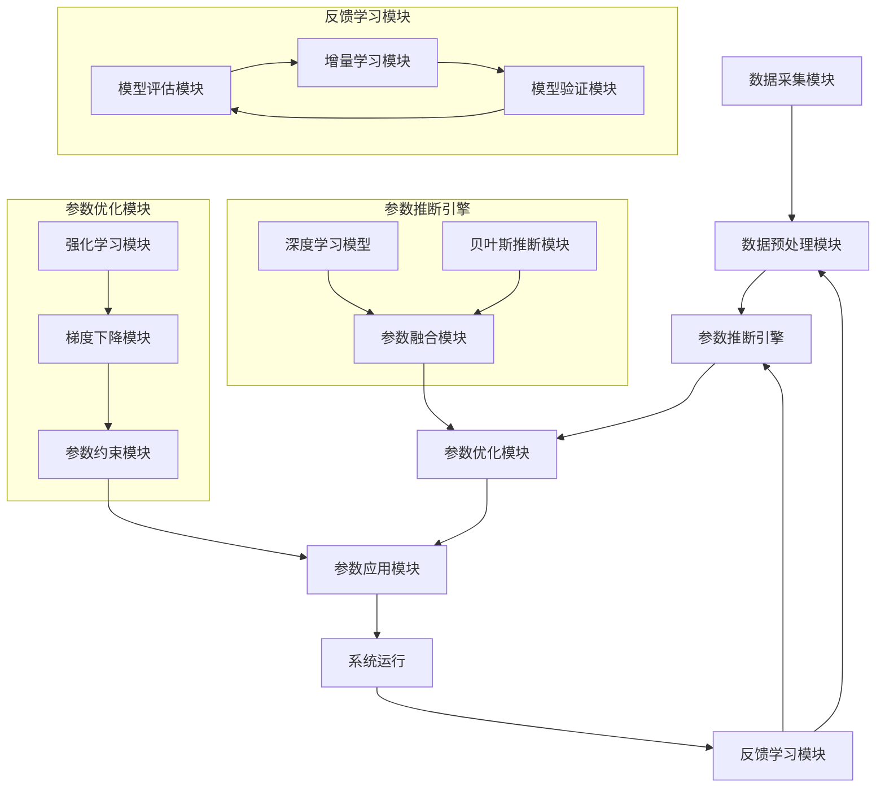
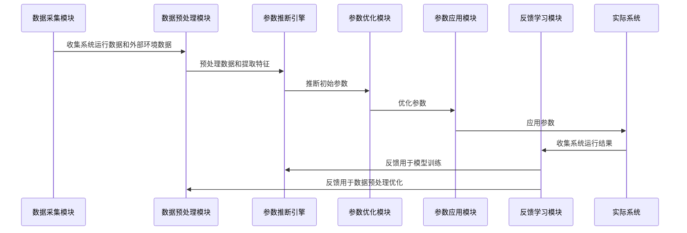
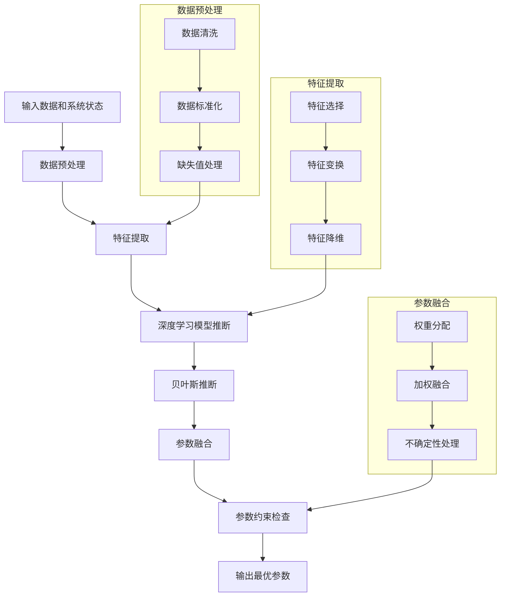

# 撰写大纲

# 智能参数推断系统专利大纲

## 第一章 术语定义

1. **智能参数推断系统**：一种基于人工智能和机器学习技术，能够自动分析输入数据，推断最优系统参数，并根据反馈持续优化参数以提高系统性能的智能系统。

2. **参数推断**：根据输入数据和系统状态，自动确定或调整系统参数的过程。

3. **混合参数推断算法**：结合深度学习和贝叶斯推断技术，实现参数高效推断的算法。

4. **自适应参数优化**：系统能够根据环境变化和性能反馈，自动调整参数优化策略的能力。

5. **特征提取**：从原始数据中提取有用特征，用于参数推断的过程。

6. **参数融合**：将多种方法推断出的参数进行综合处理，生成最终参数的过程。

7. **增量学习**：模型能够从新数据中学习并更新，无需重新训练整个模型的能力。

8. **强化学习调整**：基于系统反馈和奖励机制，动态调整参数的策略。

9. **贝叶斯推断**：基于贝叶斯定理进行概率推断，处理参数不确定性的方法。

10. **参数约束**：确保推断出的参数在预设合理范围内的机制。

## 第二章 技术领域

本发明涉及人工智能和机器学习技术领域，具体而言，涉及一种智能参数推断系统，该系统能够自动分析输入数据，推断最优系统参数，并根据反馈持续优化参数，以提高系统性能和效率。本发明可应用于云计算资源分配、自动驾驶系统、智能制造、金融风控等多个领域。

## 第三章 背景技术

在现有技术中，系统参数的确定通常依赖于人工经验和预设规则。这种方法存在以下问题：

1. **参数设置效率低下**：需要大量人工调试和测试，耗时耗力。
2. **参数适应性差**：难以适应动态变化的环境和需求。
3. **参数优化不全面**：人工难以考虑所有可能的参数组合和影响。
4. **系统性能受限**：固定的参数设置无法充分利用系统的潜力。
5. **缺乏自学习能力**：无法从运行数据中学习和改进。

虽然现有的机器学习技术可以用于参数优化，但大多数系统存在以下局限：
- 需要大量标注数据，获取成本高
- 难以处理复杂的参数空间和高维数据
- 参数推断的实时性和准确性不足
- 缺乏对参数不确定性的有效处理
- 无法实现真正的自适应优化

因此，亟需一种能够自动推断和优化系统参数，提高系统性能和效率的智能参数推断系统。

## 第四章 技术方案

本发明提供一种智能参数推断系统，该系统结合了多种机器学习技术，能够自动推断和优化系统参数，提高系统性能和效率。

### 4.1 系统架构

智能参数推断系统主要包括以下模块：

1. **数据采集模块**：负责收集系统运行数据和外部环境数据。
2. **数据预处理模块**：对原始数据进行清洗、标准化和特征提取。
3. **参数推断引擎**：基于机器学习模型推断最优参数。
4. **参数优化模块**：使用优化算法调整参数以提高系统性能。
5. **反馈学习模块**：收集系统运行结果，用于模型训练和参数调整。
6. **参数应用模块**：将推断出的参数应用到实际系统中。

### 4.2 工作原理

系统工作流程如下：

1. 数据采集模块收集系统运行数据和外部环境数据。
2. 数据预处理模块对数据进行清洗、标准化和特征提取。
3. 参数推断引擎基于预处理后的数据和当前系统状态，使用混合参数推断算法推断最优参数。
4. 参数优化模块使用自适应参数优化算法进一步调整参数，以提高系统性能。
5. 参数应用模块将最终确定的参数应用到实际系统中。
6. 系统运行后，反馈学习模块收集系统运行结果，用于模型训练和参数调整，形成闭环优化。

### 4.3 核心算法

本系统的核心算法包括：

1. **混合参数推断算法**：
   结合深度学习和贝叶斯推断，实现参数的高效推断。

2. **自适应参数优化算法**：
   基于强化学习和梯度下降，实现参数的动态优化。

3. **增量学习算法**：
   实现模型的在线学习和更新，适应数据分布的变化。

### 4.4 伪代码

#### 4.4.1 混合参数推断算法

```python
def hybrid_parameter_inference(input_data, system_state):
    """
    混合参数推断算法，结合深度学习和贝叶斯推断
    
    参数:
        input_data: 输入数据
        system_state: 当前系统状态
        
    返回:
        推断出的最优参数
    """
    # 数据预处理
    processed_data = preprocess_data(input_data)
    
    # 特征提取
    features = extract_features(processed_data, system_state)
    
    # 深度学习模型推断
    dl_parameters = deep_learning_model.predict(features)
    
    # 贝叶斯推断
    bayesian_parameters = bayesian_inference(features, dl_parameters)
    
    # 参数融合
    final_parameters = fuse_parameters(dl_parameters, bayesian_parameters)
    
    # 参数约束检查
    constrained_parameters = apply_constraints(final_parameters)
    
    return constrained_parameters
```

#### 4.4.2 自适应参数优化算法

```python
def adaptive_parameter_optimization(current_parameters, performance_metrics):
    """
    自适应参数优化算法，基于强化学习和梯度下降
    
    参数:
        current_parameters: 当前参数
        performance_metrics: 系统性能指标
        
    返回:
        优化后的参数
    """
    # 计算性能梯度
    gradients = compute_gradients(current_parameters, performance_metrics)
    
    # 强化学习调整
    rl_adjustment = reinforcement_learning_adjustment(gradients, performance_metrics)
    
    # 梯度下降优化
    optimized_parameters = gradient_descent(
        current_parameters, 
        gradients + rl_adjustment,
        learning_rate=adaptive_learning_rate(performance_metrics)
    )
    
    # 参数约束检查
    constrained_parameters = apply_constraints(optimized_parameters)
    
    return constrained_parameters
```

#### 4.4.3 增量学习算法

```python
def incremental_learning(model, new_data, feedback):
    """
    增量学习算法，实现模型的在线学习和更新
    
    参数:
        model: 当前模型
        new_data: 新数据
        feedback: 系统反馈
        
    返回:
        更新后的模型
    """
    # 模型评估
    performance = evaluate_model(model, new_data)
    
    # 判断是否需要更新模型
    if should_update_model(performance, feedback):
        # 增量更新模型
        updated_model = model.partial_fit(new_data, feedback)
        
        # 模型验证
        validation_performance = validate_model(updated_model, new_data)
        
        if validation_performance > performance:
            return updated_model
    
    return model
```

### 4.5 Mermaid图

#### 4.5.1 系统架构图



#### 4.5.2 工作流程图



#### 4.5.3 混合参数推断算法流程图



## 第五章 附图说明

图1是智能参数推断系统的系统架构图。
图2是智能参数推断系统的工作流程图。
图3是混合参数推断算法的流程图。
图4是自适应参数优化算法的流程图。
图5是增量学习算法的流程图。

## 第六章 具体实施方式

### 6.1 实施例1：智能参数推断系统在云计算资源分配中的应用

在本实施例中，智能参数推断系统应用于云计算平台的资源分配。系统收集云服务器的负载情况、用户请求模式和历史性能数据，推断最优的资源分配参数，如CPU分配比例、内存分配策略和带宽分配方案。

数据采集模块通过API收集云服务器的性能指标和用户请求日志。数据预处理模块对数据进行清洗，处理缺失值，提取特征如请求频率、资源利用率峰值等。参数推断引擎使用深度学习模型预测资源需求，并结合贝叶斯推断考虑不确定性。参数优化模块使用强化学习动态调整资源分配策略，以最小化响应时间和最大化资源利用率。参数应用模块将推断出的参数应用到云资源调度系统中。反馈学习模块收集系统运行结果，如响应时间和资源利用率，用于模型训练和参数调整。

### 6.2 实施例2：智能参数推断系统在自动驾驶中的应用

在本实施例中，智能参数推断系统应用于自动驾驶车辆的参数调整。系统收集车辆状态数据、环境感知数据和驾驶行为数据，推断最优的驾驶参数，如加速度、转向角度和安全距离。

数据采集模块通过车载传感器收集车辆状态和环境数据。数据预处理模块对数据进行滤波和特征提取，识别道路特征、障碍物和交通标志。参数推断引擎使用深度学习模型预测最优驾驶参数，并结合贝叶斯推断考虑环境不确定性。参数优化模块使用强化学习动态调整驾驶参数，以平衡安全性和舒适性。参数应用模块将推断出的参数应用到车辆控制系统中。反馈学习模块收集驾驶结果，如乘客舒适度和安全性指标，用于模型训练和参数调整。

### 6.3 实施例3：智能参数推断系统在智能制造中的应用

在本实施例中，智能参数推断系统应用于智能制造生产线。系统收集生产线状态数据、产品质量数据和设备运行数据，推断最优的生产参数，如温度、压力、速度和原料配比。

数据采集模块通过传感器和PLC收集生产线数据。数据预处理模块对数据进行清洗和特征提取，识别生产模式和异常情况。参数推断引擎使用深度学习模型预测最优生产参数，并结合贝叶斯推断考虑原料差异和环境变化。参数优化模块使用强化学习动态调整生产参数，以提高产品质量和生产效率。参数应用模块将推断出的参数应用到生产线控制系统中。反馈学习模块收集生产结果，如产品质量指标和设备效率，用于模型训练和参数调整。

## 第七章 权利要求

1. 一种智能参数推断系统，其特征在于，包括：
   - 数据采集模块，用于收集系统运行数据和外部环境数据；
   - 数据预处理模块，用于对原始数据进行清洗、标准化和特征提取；
   - 参数推断引擎，基于机器学习模型推断最优参数；
   - 参数优化模块，使用优化算法调整参数以提高系统性能；
   - 反馈学习模块，收集系统运行结果，用于模型训练和参数调整；
   - 参数应用模块，将推断出的参数应用到实际系统中。

2. 根据权利要求1所述的智能参数推断系统，其特征在于，所述参数推断引擎包括：
   - 深度学习模型，用于从数据中学习参数模式；
   - 贝叶斯推断模块，用于处理参数推断中的不确定性；
   - 参数融合模块，用于结合深度学习和贝叶斯推断的结果。

3. 根据权利要求1所述的智能参数推断系统，其特征在于，所述参数优化模块包括：
   - 强化学习模块，用于根据系统反馈调整参数；
   - 梯度下降模块，用于基于性能梯度优化参数；
   - 参数约束模块，确保参数在合理范围内。

4. 根据权利要求1所述的智能参数推断系统，其特征在于，所述反馈学习模块包括：
   - 模型评估模块，评估模型性能；
   - 增量学习模块，实现模型的在线学习和更新；
   - 模型验证模块，验证更新后的模型性能。

5. 根据权利要求1所述的智能参数推断系统，其特征在于，所述系统还包括一个参数监控模块，用于实时监控参数应用效果，并在检测到异常时触发参数重新推断。

6. 一种智能参数推断方法，其特征在于，包括以下步骤：
   - 收集系统运行数据和外部环境数据；
   - 对数据进行预处理和特征提取；
   - 使用混合参数推断算法推断初始参数；
   - 使用自适应参数优化算法优化参数；
   - 将参数应用到实际系统中；
   - 收集系统运行结果，用于模型训练和参数调整。

7. 根据权利要求6所述的智能参数推断方法，其特征在于，所述混合参数推断算法结合了深度学习和贝叶斯推断，以提高参数推断的准确性和鲁棒性。

8. 根据权利要求6所述的智能参数推断方法，其特征在于，所述自适应参数优化算法基于强化学习和梯度下降，实现参数的动态优化。

9. 根据权利要求6所述的智能参数推断方法，其特征在于，还包括增量学习步骤，实现模型的在线学习和更新，以适应数据分布的变化。

10. 一种计算机可读存储介质，其上存储有计算机程序，所述程序被处理器执行时实现如权利要求6至9中任一项所述的智能参数推断方法。
