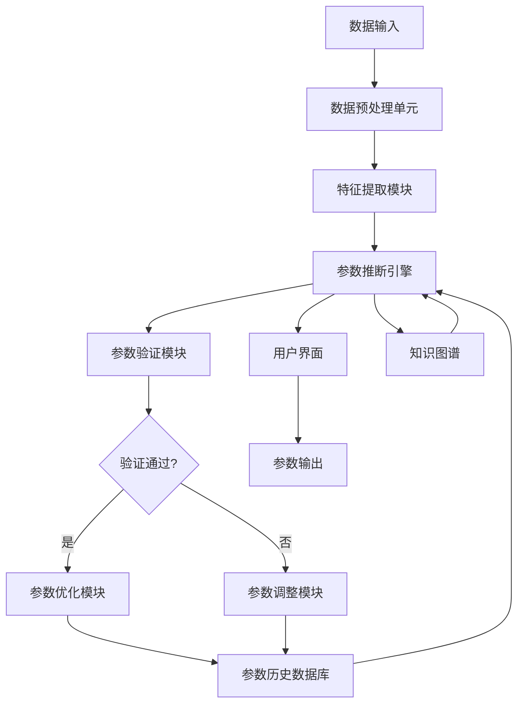
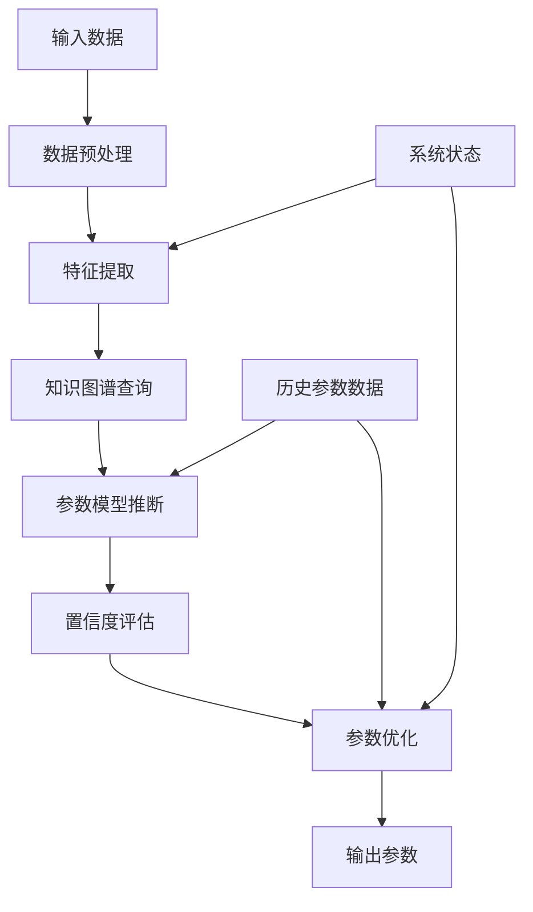
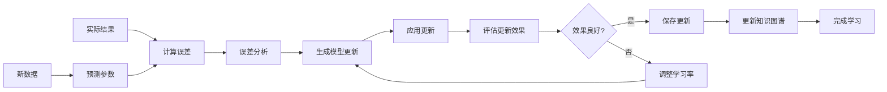
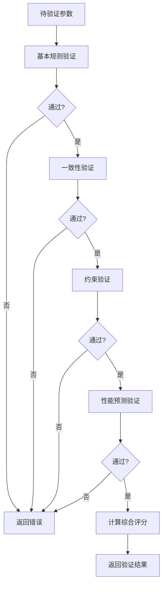
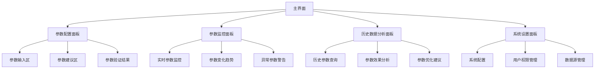

# 撰写大纲

# 智能参数推断系统专利大纲

## 第一章 术语定义

1. **智能参数推断系统**：一种能够自动分析系统状态、环境条件和历史数据，智能推断并优化系统参数的计算机系统。

2. **参数推断引擎**：系统的核心组件，负责基于输入数据执行参数推断算法。

3. **特征提取模块**：从原始数据中提取与参数推断相关的特征信息的组件。

4. **参数优化算法**：用于调整和优化推断参数的数学算法和计算方法。

5. **自适应学习机制**：系统根据反馈自动调整推断模型和参数的方法。

6. **参数验证模块**：验证推断参数的有效性、一致性和合理性的组件。

7. **多源数据融合**：整合来自不同数据源的信息以增强参数推断准确性的技术。

8. **参数置信度评估**：对推断参数的可靠性进行量化评估的方法。

9. **知识图谱**：存储参数间关系、约束条件和领域知识的结构化数据库。

10. **参数历史数据库**：存储历史参数设置及其效果的数据库。

## 第二章 技术领域

本发明涉及数据处理和人工智能技术领域，特别涉及一种能够自动推断和优化系统参数的智能参数推断系统。具体而言，本发明涉及机器学习、数据挖掘、参数优化和自适应系统等技术。

## 第三章 背景技术

1. **传统参数设置方法的局限性**：
   - 传统系统参数设置通常依赖人工经验，效率低下且容易出错
   - 参数调整过程繁琐，需要大量试错和专业知识
   - 难以适应动态变化的环境和系统状态

2. **现有参数优化技术的不足**：
   - 现有参数优化算法往往针对特定场景设计，通用性差
   - 缺乏对多源异构数据的有效融合能力
   - 参数优化过程缺乏实时性和自适应能力

3. **人工参数调整的效率和准确性问题**：
   - 人工调整参数耗时耗力，无法满足大规模系统需求
   - 人工调整难以考虑参数间的复杂关联关系
   - 不同操作人员的经验差异导致参数设置不一致

4. **现有智能系统在参数自适应方面的缺陷**：
   - 多数智能系统缺乏对参数动态调整的能力
   - 参数调整过程缺乏有效的验证机制
   - 难以从历史参数数据中学习并改进推断能力

## 第四章 技术方案

1. **系统总体架构**：
   - 数据输入层：接收多源异构数据
   - 数据预处理层：数据清洗、标准化和转换
   - 特征提取层：提取与参数推断相关的特征
   - 参数推断层：核心推断引擎执行参数推断
   - 参数验证层：验证推断参数的有效性
   - 参数优化层：优化和调整参数值
   - 输出展示层：向用户展示参数结果和建议

2. **核心组件及其功能**：
   - 参数推断引擎：基于机器学习模型执行参数推断
   - 特征提取模块：从原始数据中提取有效特征
   - 参数验证模块：验证参数的合理性和一致性
   - 自适应学习模块：根据反馈调整模型参数
   - 知识图谱：存储参数间关系和领域知识
   - 用户界面：提供参数配置、监控和分析功能

3. **参数推断的基本流程**：
   - 接收输入数据并预处理
   - 提取相关特征
   - 基于特征和历史数据推断参数
   - 验证推断结果
   - 优化参数值
   - 输出最终参数

4. **自适应学习机制**：
   - 收集参数使用效果反馈
   - 分析推断误差和偏差
   - 更新模型参数和知识图谱
   - 持续优化推断算法

5. **多源数据融合方法**：
   - 异构数据标准化
   - 数据权重分配
   - 决策级融合
   - 不确定性量化

6. **参数验证和优化策略**：
   - 基于规则的验证
   - 基于模型的验证
   - 约束满足优化
   - 多目标优化算法

## 第五章 具体实施方式

### 5.1 系统架构实现

**系统架构Mermaid图:**


**系统初始化伪代码:**
```
function initializeSystem():
    // 初始化系统组件
    dataPreprocessor = new DataPreprocessor()
    featureExtractor = new FeatureExtractor()
    inferenceEngine = new ParameterInferenceEngine()
    validator = new ParameterValidator()
    optimizer = new ParameterOptimizer()
    knowledgeGraph = new KnowledgeGraph()
    parameterDB = new ParameterDatabase()
    ui = new UserInterface()
    
    // 加载历史参数数据
    parameterDB.loadHistoricalData()
    
    // 初始化知识图谱
    knowledgeGraph.initialize()
    
    return {
        dataPreprocessor: dataPreprocessor,
        featureExtractor: featureExtractor,
        inferenceEngine: inferenceEngine,
        validator: validator,
        optimizer: optimizer,
        knowledgeGraph: knowledgeGraph,
        parameterDB: parameterDB,
        ui: ui
    }
```

### 5.2 参数推断算法实现

**参数推断算法伪代码:**
```
function inferParameters(inputData, systemState):
    // 1. 数据预处理
    processedData = dataPreprocessor.process(inputData)
    
    // 2. 特征提取
    features = featureExtractor.extract(processedData, systemState)
    
    // 3. 从知识图谱获取相关参数信息
    relatedParams = knowledgeGraph.queryRelatedParameters(features)
    
    // 4. 基于历史数据训练的模型进行初步推断
    initialParams = inferenceEngine.infer(features, relatedParams)
    
    // 5. 参数置信度评估
    confidenceScores = inferenceEngine.evaluateConfidence(initialParams, features)
    
    // 6. 参数优化
    optimizedParams = optimizer.optimize(initialParams, confidenceScores, systemState)
    
    return {
        parameters: optimizedParams,
        confidence: confidenceScores,
        features: features
    }
```

**参数推断流程Mermaid图:**


### 5.3 自适应学习机制实现

**自适应学习算法伪代码:**
```
function adaptiveLearning(newData, actualResults, predictedParams):
    // 1. 计算预测误差
    errors = calculateErrors(actualResults, predictedParams)
    
    // 2. 误差分析
    errorAnalysis = analyzeErrors(errors, newData)
    
    // 3. 更新模型参数
    modelUpdates = generateModelUpdates(errorAnalysis)
    
    // 4. 应用更新到模型
    updatedModel = applyModelUpdates(modelUpdates)
    
    // 5. 评估更新效果
    updateEffectiveness = evaluateUpdateEffectiveness(updatedModel, newData)
    
    // 6. 如果效果良好，保存更新
    if updateEffectiveness > threshold:
        saveModelUpdates(updatedModel)
        updateKnowledgeGraph(newData, updatedModel)
    
    return {
        updatedModel: updatedModel,
        effectiveness: updateEffectiveness,
        insights: errorAnalysis
    }
```

**自适应学习机制流程Mermaid图:**


### 5.4 参数验证模块实现

**参数验证算法伪代码:**
```
function validateParameters(params, context):
    // 1. 基本规则验证
    basicValidation = validateBasicRules(params)
    if not basicValidation.valid:
        return {
            valid: false,
            errors: basicValidation.errors,
            suggestions: basicValidation.suggestions
        }
    
    // 2. 一致性验证
    consistencyValidation = validateConsistency(params, context)
    if not consistencyValidation.valid:
        return {
            valid: false,
            errors: consistencyValidation.errors,
            suggestions: consistencyValidation.suggestions
        }
    
    // 3. 约束验证
    constraintValidation = validateConstraints(params, context)
    if not constraintValidation.valid:
        return {
            valid: false,
            errors: constraintValidation.errors,
            suggestions: constraintValidation.suggestions
        }
    
    // 4. 性能预测验证
    performanceValidation = validatePerformance(params, context)
    if not performanceValidation.valid:
        return {
            valid: false,
            errors: performanceValidation.errors,
            suggestions: performanceValidation.suggestions
        }
    
    // 5. 综合评估
    overallScore = calculateOverallScore([
        basicValidation.score,
        consistencyValidation.score,
        constraintValidation.score,
        performanceValidation.score
    ])
    
    return {
        valid: true,
        score: overallScore,
        warnings: performanceValidation.warnings,
        recommendations: performanceValidation.recommendations
    }
```

**参数验证流程Mermaid图:**


### 5.5 用户界面实现

**用户界面设计Mermaid图:**


**用户交互流程伪代码:**
```
function handleUserInteraction(userAction):
    switch userAction.type:
        case 'parameter_input':
            // 处理用户输入参数
            inputParams = parseUserInput(userAction.data)
            validationResult = validateParameters(inputParams, currentContext)
            return {
                type: 'parameter_validation',
                data: validationResult
            }
            
        case 'system_monitoring':
            // 处理系统监控请求
            systemState = collectSystemState()
            currentParams = getCurrentParameters()
            performanceMetrics = collectPerformanceMetrics()
            return {
                type: 'monitoring_data',
                data: {
                    systemState: systemState,
                    parameters: currentParams,
                    metrics: performanceMetrics
                }
            }
            
        case 'historical_analysis':
            // 处理历史数据分析请求
            query = parseHistoricalQuery(userAction.data)
            historicalData = queryHistoricalData(query)
            analysisResults = analyzeHistoricalData(historicalData)
            return {
                type: 'analysis_results',
                data: analysisResults
            }
            
        case 'system_configuration':
            // 处理系统配置请求
            config = parseConfiguration(userAction.data)
            validation = validateConfiguration(config)
            if validation.valid:
                applyConfiguration(config)
                return {
                    type: 'configuration_success',
                    data: config
                }
            else:
                return {
                    type: 'configuration_error',
                    data: validation.errors
                }
                
    default:
        return {
            type: 'unknown_action',
            message: '未知的用户操作类型'
        }
```

## 第六章 附图说明

1. **图1**：智能参数推断系统总体架构图，展示系统各组件及其关系。
2. **图2**：参数推断流程图，详细说明参数推断的各个步骤。
3. **图3**：自适应学习机制流程图，展示系统如何从反馈中学习。
4. **图4**：参数验证流程图，说明参数验证的各个阶段。
5. **图5**：用户界面示意图，展示系统的主要功能模块。
6. **图6**：多源数据融合示意图，展示不同数据源如何整合。
7. **图7**：知识图谱结构示意图，展示参数间的关系网络。

## 第七章 权利要求

1. 一种智能参数推断系统，其特征在于，包括：
   - 数据预处理单元，用于接收并处理输入数据；
   - 特征提取模块，用于从处理后的数据中提取相关特征；
   - 参数推断引擎，基于提取的特征和历史数据推断系统参数；
   - 参数验证模块，验证推断参数的有效性和合理性；
   - 参数优化模块，优化和调整参数值；
   - 知识图谱，存储参数间关系和领域知识；
   - 参数历史数据库，存储历史参数设置及其效果；
   - 自适应学习机制，根据反馈调整推断模型。

2. 根据权利要求1所述的系统，其特征在于，所述参数推断引擎包括：
   - 机器学习模型，用于基于特征推断参数；
   - 置信度评估模块，评估推断参数的可靠性；
   - 多源数据融合模块，整合不同来源的数据以增强推断准确性。

3. 一种智能参数推断方法，其特征在于，包括以下步骤：
   - 接收并预处理输入数据；
   - 从预处理后的数据中提取相关特征；
   - 基于提取的特征和历史数据推断系统参数；
   - 验证推断参数的有效性和合理性；
   - 优化和调整参数值；
   - 输出最终参数；
   - 根据参数使用效果反馈调整推断模型。

4. 根据权利要求3所述的方法，其特征在于，所述验证推断参数的步骤包括：
   - 基于基本规则验证参数的合法性；
   - 验证参数间的一致性；
   - 检查参数是否满足预设约束条件；
   - 预测参数对系统性能的影响。

5. 一种计算机可读存储介质，其上存储有计算机程序，其特征在于，所述程序被处理器执行时实现如权利要求3-4中任一项所述的智能参数推断方法。

6. 根据权利要求5所述的存储介质，其特征在于，所述程序还包括：
   - 初始化系统组件的代码；
   - 加载历史参数数据和知识图谱的代码；
   - 处理用户交互的代码；
   - 显示参数结果和建议的代码。
